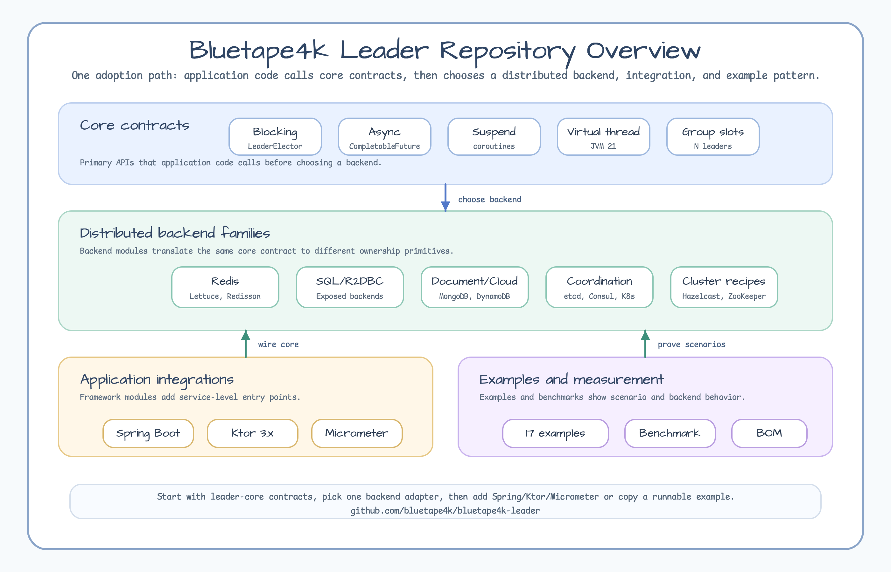
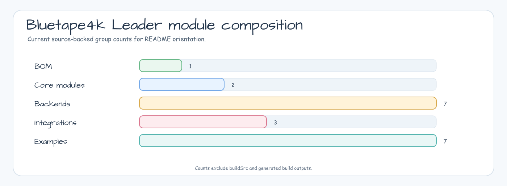
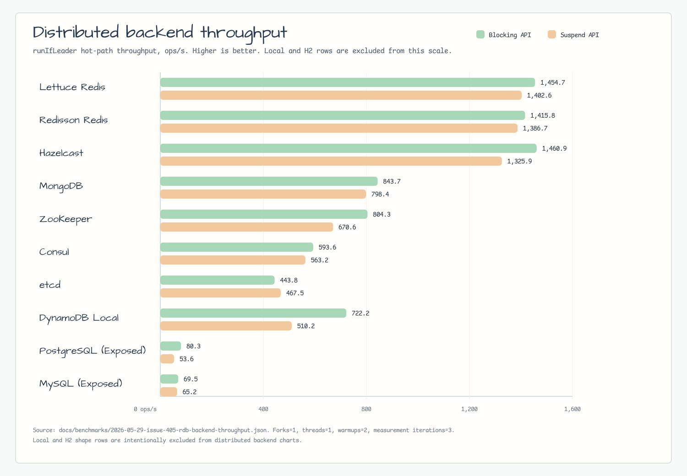
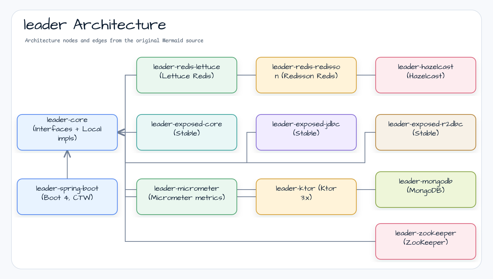
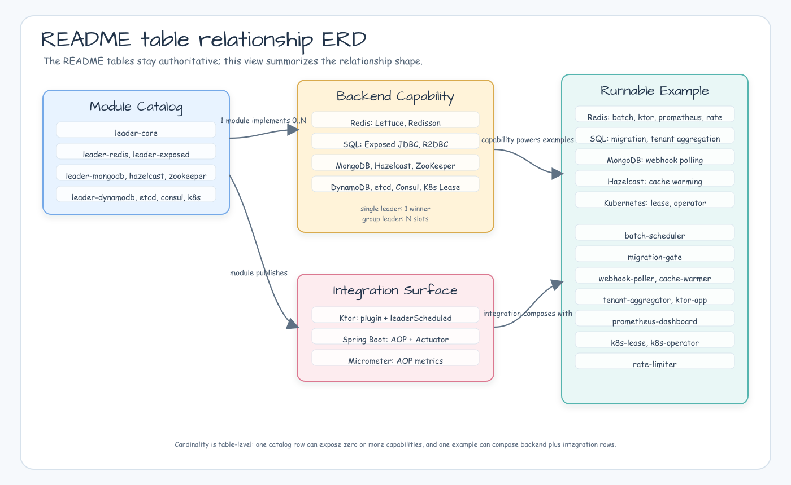
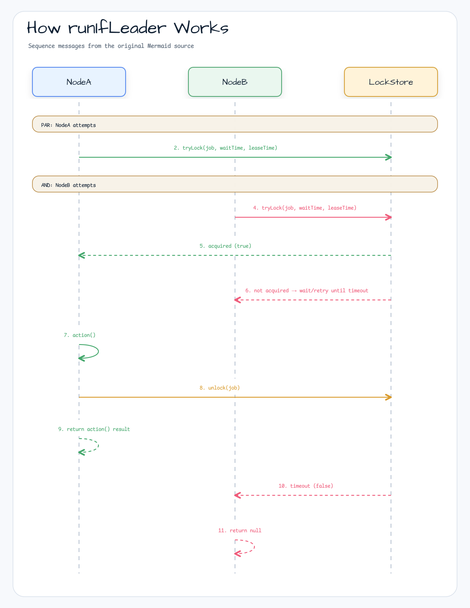
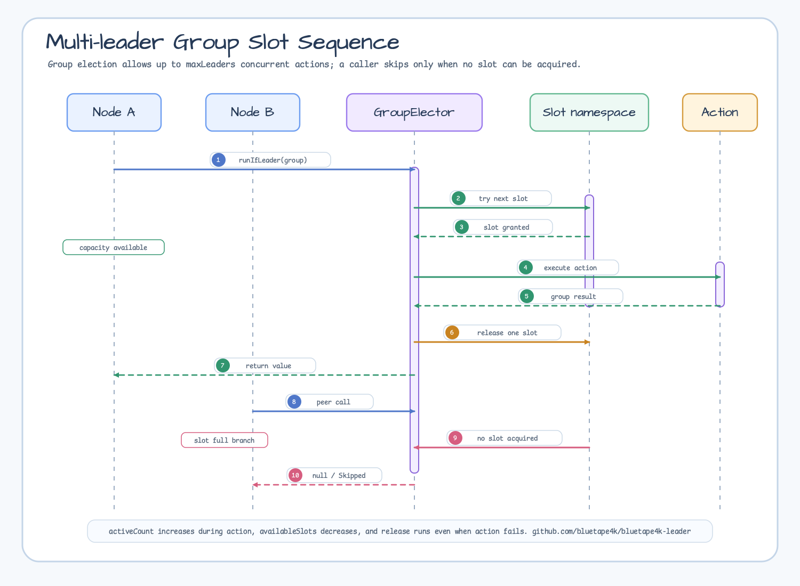

# bluetape4k-leader

[English](README.md) | 한국어

[](https://github.com/bluetape4k/bluetape4k-leader/actions/workflows/ci.yml)
[](https://kotlinlang.org)
[](https://openjdk.org)
[](LICENSE)

현재 안정 버전: `0.3.1`


Kotlin/JVM 기반 **분산 리더 선출(Distributed Leader Election)** 독립 라이브러리입니다.  
블로킹, 비동기, 코루틴, 가상 스레드 API를 지원하며 Redis, Exposed, MongoDB, DynamoDB, etcd, Kubernetes, Hazelcast, ZooKeeper 백엔드를 제공합니다.
Spring Boot 4 자동 구성과 Ktor 3.x 통합을 1급으로 지원합니다.

---

## 주요 특징

- **Null 반환 API** — 리더로 선출되지 않으면 `null`을 반환합니다 (경쟁 상황에서 예외를 던지지 않음)
- **다양한 실행 모델** — 블로킹, `CompletableFuture`, 가상 스레드, 코루틴 지원
- **복수 리더(그룹) 지원** — `LeaderGroupElector`으로 분산 세마포어 기반 N개 동시 리더 허용
- **전략적 선출(Strategic Election)** — 플러그형 후보 레지스트리 + 선출 전략(FIFO, Scored, Weighted); 분산 락 불필요
- **자립형 Redis 테스트 인프라** — Testcontainers 직접 사용, 외부 테스트 유틸 의존 없음
- **ShedLock 호환 skip 동작** — 락 획득 실패 시 작업을 조용히 건너뜀

<!-- README_VISUAL_OVERVIEW:START -->
## Overview Diagram



## Module Composition Chart


<!-- README_VISUAL_OVERVIEW:END -->

## 벤치마크

non-published [`benchmark`](./benchmark) 모듈은 leader election backend를
같은 기준으로 비교하는 `kotlinx-benchmark` suite를 제공합니다. JVM runner는
JMH이며, 결과는 같은 장비에서 전/후 비교를 하기 위한 기준선입니다. 릴리스급
성능 보증으로 해석하면 안 됩니다.



| 비교 | 핵심 신호 |
|---|---|
| Blocking 분산 환경 backend | 2026-05-29 실행에서는 Hazelcast, Lettuce, Redisson이 상위권에서 비슷합니다. |
| Suspend 분산 환경 backend | Lettuce, Redisson, Hazelcast가 선두 그룹이고, RDB 행은 이 단일 컨테이너 실행에서 훨씬 느렸습니다. |
| Local 및 H2 행 | in-process 또는 local SQL/R2DBC overhead를 측정하므로 분산 backend 비용 차트를 왜곡하지 않도록 분산 환경 차트에서 제외했습니다. |

전체 표, latency chart, 실행 명령, 주의사항은
[`benchmark` README](./benchmark/README.ko.md)와
[`2026-05-29 원본 benchmark JSON`](./docs/benchmarks/2026-05-29-issue-405-rdb-backend-throughput.json)에
있습니다.

## 아키텍처



## 모듈 목록

| 모듈 | 상태 | 설명 |
|------|------|------|
| `leader-core` | 안정 | 인터페이스 + 로컬 인메모리 구현체 |
| `leader-redis-lettuce` | 안정 | Lettuce 기반 Redis 백엔드 |
| `leader-redis-redisson` | 안정 | Redisson 기반 Redis 백엔드 |
| `leader-hazelcast` | 안정 | Hazelcast 백엔드 (IMap 기반, CP Subsystem 불필요) |
| `leader-exposed-core` | 안정 | Exposed 공통 스키마 (JDBC/R2DBC 드라이버 미포함) |
| `leader-exposed-jdbc` | 안정 | Exposed JDBC 백엔드 (H2, PostgreSQL, MySQL) |
| `leader-exposed-r2dbc` | 안정 | Exposed R2DBC 백엔드 (코루틴 네이티브, H2/PostgreSQL/MySQL) |
| `leader-mongodb` | 안정 | MongoDB 백엔드 (`findOneAndUpdate` + TTL 인덱스) |
| `leader-dynamodb` | 프리뷰 | AWS DynamoDB 백엔드 (conditional write + logical TTL) |
| `leader-etcd` | 프리뷰 | etcd v3 백엔드 (jetcd Lock service + lease, 단일/그룹 리더) |
| `leader-consul` | 프리뷰 | Consul Session + KV 백엔드 (단일/group 리더, Spring Boot auto-config) |
| `leader-k8s` | 프리뷰 | Kubernetes Lease 백엔드 (`coordination.k8s.io/v1`) |
| `leader-micrometer` | 안정 | Micrometer 메트릭 연동 (`MicrometerLeaderAopMetricsRecorder`) |
| `leader-spring-boot` | 안정 | Spring Boot 4 자동 구성 + AOP (AspectJ CTW, Freefair 포스트 컴파일 위빙) |
| `leader-zookeeper` | 안정 | ZooKeeper/Curator 백엔드 (`InterProcessMutex` / `InterProcessSemaphoreV2`) |
| `leader-ktor` | 안정 | Ktor 3.x 통합 — `LeaderElectionPlugin` + `leaderScheduled()` |

## 예제 (Examples)

`examples/` 디렉토리의 실행 가능한 예제 모듈은 모든 지원 백엔드의 운영 시나리오를 보여줍니다. 예제 모듈은 publishing 대상이 아닙니다 (`path.startsWith(":examples:")` 가 publish/sign/NMCP 에서 제외됨). 자체 서비스에 복사하여 사용하세요.

아래 ERD-style 뷰는 모듈 목록, backend capability, integration surface, runnable example의 관계를 요약합니다. 정확한 backend 및 scenario 문구는 이어지는 표를 authoritative reference로 유지합니다.



| 예제 | 백엔드 | 시나리오 |
|------|--------|---------|
| [`examples/batch-scheduler`](./examples/batch-scheduler) | Lettuce Redis | 주기 batch 작업 (예: 야간 정산) — N 인스턴스 단일 실행 보장 |
| [`examples/migration-gate`](./examples/migration-gate) | Exposed JDBC (PostgreSQL/H2) | 부팅 시 schema migration 게이트 — 정확히 1 인스턴스만 실행 |
| [`examples/webhook-poller`](./examples/webhook-poller) | MongoDB | 외부 webhook 폴링 — 리더만 폴링 + dispatch |
| [`examples/cache-warmer`](./examples/cache-warmer) | Hazelcast | 파티션별 독립 leader-election — 파티션당 정확히 1 인스턴스 워밍 |
| [`examples/tenant-aggregator`](./examples/tenant-aggregator) | Exposed R2DBC | 코루틴 네이티브 멀티 테넌트 집계 — 테넌트별 독립 리더 |
| [`examples/ktor-app`](./examples/ktor-app) | Ktor 3.x + Lettuce Redis | `LeaderElectionPlugin` + `Application.leaderScheduled()` 사용 Ktor 앱 |
| [`examples/prometheus-dashboard`](./examples/prometheus-dashboard) | Spring Boot + Lettuce Redis | leader AOP 메트릭 Prometheus/Grafana dashboard |
| [`examples/etcd-reconciler`](./examples/etcd-reconciler) | etcd v3 | 한 control-plane 노드만 desired state를 적용하는 reconciler |
| [`examples/consul-maintenance`](./examples/consul-maintenance) | Consul | 한 service instance만 maintenance/drain 작업을 수행하는 workflow |
| [`examples/dynamodb-export`](./examples/dynamodb-export) | DynamoDB Local / AWS DynamoDB | scheduled export 또는 billing job에서 리더만 export record를 기록 |
| [`examples/zookeeper-scheduler`](./examples/zookeeper-scheduler) | ZooKeeper / Curator | legacy scheduled job에서 한 node만 실행하고 경쟁 node는 skip |
| [`examples/k8s-lease`](./examples/k8s-lease) | Kubernetes Lease | K3s 대상 저수준 Lease 획득/해제/재획득 workflow |
| [`examples/k8s-operator`](./examples/k8s-operator) | Kubernetes Lease + Spring Boot | 3-replica operator 중 한 pod만 reconcile loop 실행 |
| [`examples/rate-limiter`](./examples/rate-limiter) | Lettuce Redis + Bucket4j | leader가 외부 API probe를 dispatch하고 shared rate limit 적용 |
| [`examples/strategic-election`](./examples/strategic-election) | Local strategic election | health, capacity, success-rate, idle-time 가중 점수로 maintenance node 선택 |
| [`examples/virtual-thread-runner`](./examples/virtual-thread-runner) | Local virtual-thread election | Java virtual thread 기반 고동시성 leader-only maintenance runner |
| [`examples/redisson-watchdog`](./examples/redisson-watchdog) | Redisson Redis | bluetape4k lease auto-extension으로 보호되는 장시간 leader-only job |

`./gradlew :examples:<name>:run` 으로 실행 (Testcontainers 기반 데모는 Docker 필요).

## 빠른 시작

### Gradle 의존성 추가

BOM을 import하면 모든 `bluetape4k-leader-*` 모듈 버전을 한 곳에서 관리할 수 있습니다:

```kotlin
val leaderVersion = "0.3.1"

implementation(platform("io.github.bluetape4k.leader:bluetape4k-leader-bom:$leaderVersion"))
implementation("io.github.bluetape4k.leader:bluetape4k-leader-redis-redisson")
```

BOM을 사용하지 않는 경우 각 모듈 의존성에 `0.3.1`를 명시하세요:

```kotlin
// Redis (Redisson 또는 Lettuce)
implementation("io.github.bluetape4k.leader:bluetape4k-leader-redis-redisson:0.3.1")
// 또는
implementation("io.github.bluetape4k.leader:bluetape4k-leader-redis-lettuce:0.3.1")

// JDBC (H2 / PostgreSQL / MySQL, Exposed 기반)
implementation("io.github.bluetape4k.leader:bluetape4k-leader-exposed-jdbc:0.3.1")

// R2DBC 코루틴 네이티브 (H2 / PostgreSQL / MySQL, Exposed 기반)
implementation("io.github.bluetape4k.leader:bluetape4k-leader-exposed-r2dbc:0.3.1")

// ZooKeeper / Apache Curator
implementation("io.github.bluetape4k.leader:bluetape4k-leader-zookeeper:0.3.1")

// etcd v3 / jetcd
implementation("io.github.bluetape4k.leader:bluetape4k-leader-etcd:0.3.1")

// Consul Session + KV
implementation("io.github.bluetape4k.leader:bluetape4k-leader-consul:0.3.1")

// AWS DynamoDB
implementation("io.github.bluetape4k.leader:bluetape4k-leader-dynamodb:0.3.1")

// Ktor 3.x 통합 (LeaderElectionPlugin + leaderScheduled())
implementation("io.github.bluetape4k.leader:bluetape4k-leader-ktor:0.3.1")
```

### Exposed JDBC 방식 (H2 / PostgreSQL / MySQL)

```kotlin
import com.zaxxer.hikari.HikariConfig
import com.zaxxer.hikari.HikariDataSource
import io.bluetape4k.leader.exposed.jdbc.ExposedJdbcLeaderElector

val dataSource = HikariDataSource(HikariConfig().apply {
    jdbcUrl = "jdbc:postgresql://localhost:5432/mydb"
    username = "user"
    password = "pass"
})

val election = ExposedJdbcLeaderElector(dataSource)

val result = election.runIfLeader("daily-report-job") {
    generateReport()  // 리더로 선출된 노드에서만 실행
}
// result: 리더이면 generateReport() 결과, 그 외 노드는 null
```

복수 리더 그룹 (JDBC):

```kotlin
import io.bluetape4k.leader.exposed.jdbc.ExposedJdbcLeaderGroupElector
import io.bluetape4k.leader.core.LeaderGroupElectionOptions

val options = LeaderGroupElectionOptions(maxLeaders = 3)
val groupElection = ExposedJdbcLeaderGroupElector(dataSource, options)

val result = groupElection.runIfLeader("parallel-batch") {
    processNextChunk()
}
```

### 블로킹 방식 (단일 리더 — Redis)

```kotlin
val config = Config().apply { useSingleServer().setAddress("redis://localhost:6379") }
val client = Redisson.create(config)

val election = RedissonLeaderElector(client)

val result = election.runIfLeader("daily-report-job") {
    generateReport()  // 리더로 선출된 노드에서만 실행
}
// result: 리더이면 generateReport() 결과, 그 외 노드는 null
```

### 코루틴 방식 (suspend)

```kotlin
val election = RedissonSuspendLeaderElector(client)

val result = election.runIfLeader("nightly-cleanup") {
    cleanupExpiredSessions()
}
```

### 복수 리더 그룹 (세마포어)

```kotlin
val options = LeaderGroupElectionOptions(maxLeaders = 3)
val election = RedissonLeaderGroupElector(client, options)

// 최대 3개 노드가 동시에 이 작업을 실행 가능
val result = election.runIfLeader("parallel-batch") {
    processNextChunk()
}
```

### 옵션 커스터마이징

```kotlin
val options = LeaderElectionOptions(
    waitTime = 3.seconds,   // 락 획득 최대 대기 시간
    leaseTime = 30.seconds, // 락 보유(임대) 최대 시간
    nodeId = "worker-a",    // 상태 스냅샷에 노출할 노드 식별자
    minLeaseTime = 0.seconds, // lockAtLeastFor 방식의 최소 lease 보존 시간
    autoExtend = true // action 실행 중 단일 리더 lease를 갱신
)
val election = RedissonLeaderElector(client, options)
```

`minLeaseTime`은 ShedLock `lockAtLeastFor` 대응 옵션입니다. 로컬 elector는 release 전 대기하고, 지원되는 분산 backend는 남은 최소 lease를 storage TTL에 위임하므로 caller는 즉시 반환됩니다.

`autoExtend`는 단일 리더 선출에서 opt-in으로 동작합니다. Local, Lettuce, MongoDB, Redisson은 action 실행 중 lease를 유지하며, Redisson은 명시적 `leaseTime`으로 락을 획득하므로 공통 bluetape4k `LeaderLeaseAutoExtender` 경로를 사용합니다. `@LeaderGroupElection`은 아직 auto-extension을 지원하지 않습니다.

### 상태 스냅샷

```kotlin
val single = election.state("daily-report-job")
if (single.isOccupied) {
    println("leader=${single.leader?.leaderId}")
}

val group = groupElection.state("parallel-batch")
println("active=${group.activeCount}/${group.maxLeaders}")
println("available=${group.availableSlots}")
println("leaders=${group.leaders.map { it.leaderId }}")
```

상태 API는 진단과 메트릭을 위한 best-effort 스냅샷입니다. 이 값으로 작업 실행 여부를 직접 판단하지 말고, 항상 `runIfLeader`를 사용해 backend가 원자적으로 락을 획득하게 해야 합니다.

### 테넌트 네임스페이스

SaaS 테넌트마다 같은 논리 작업을 독립된 락으로 실행해야 한다면 backend 설정을 바꾸지 않고 `forTenant()`를 사용할 수 있습니다:

```kotlin
import io.bluetape4k.leader.forTenant

val tenantElection = election.forTenant("acme")
tenantElection.runIfLeader("daily-report-job") {
    generateTenantReport("acme")
}
// backend lockName: tenant:acme:daily-report-job

val tenantGroup = groupElection.forTenant("acme")
tenantGroup.runIfLeader("aggregation") {
    aggregateTenant("acme")
}
```

`forTenant()`는 blocking, coroutine, group, virtual-thread elector에서 사용할 수 있습니다. 네임스페이스 구분자 `:`는 예약되어 있으므로 tenant id, custom prefix, tenant-local lock name에는 `:`를 넣을 수 없습니다. 기존 caller-facing lock name이 `batch:daily`처럼 `:`를 포함한다면 tenant scope를 추가하기 전에 이름을 바꾸세요. 생성된 backend lock name은 공통 lock name 제한인 255자를 계속 만족해야 합니다.

Tenant-scoped 상태 스냅샷은 `tenant:acme:daily-report-job` 같은 전체 backend lock name을 반환합니다. 같은 tenant-scoped elector의 `runIfLeader()`에 `state().lockName`을 다시 전달하지 말고, `daily-report-job` 같은 원래 caller-facing lock name을 계속 사용하세요.

### 마이그레이션 노트

- Kotlin API option은 `kotlin.time.Duration`을 사용합니다. `java.time.Duration.ofSeconds(...)` 대신 `5.seconds`, `60.seconds`, `1.minutes`를 사용하세요.
- Spring Boot YAML은 계속 Spring duration binding을 사용합니다 (`5s`, `60s`, `PT1M`).
- Spring bean 이름은 `LeaderElector` 용어를 사용합니다. `redissonLeaderElectionFactory`, `lettuceSuspendLeaderElectorFactory` 같은 이름을 우선 사용하세요.

### 로컬 방식 (인메모리, Redis 불필요)

```kotlin
// 단일 인스턴스 또는 테스트 환경에서 유용
val election = LocalLeaderElector()
val result = election.runIfLeader("job") { "done" }
```

### Ktor management route

`leader-ktor`는 plugin option을 켰을 때 JVM-local management route를 노출할 수 있습니다:

```kotlin
fun Application.module() {
    install(LeaderElectionPlugin) {
        leaderElection = redissonElector
        managementRouteEnabled = true
        managementLockNames("batch-job", "migration-gate")
    }
}
```

```http
GET /management/leaderElection
```

이 route는 기본적으로 비활성화되어 있으며 Ktor 애플리케이션의 main routing pipeline에 설치됩니다. 신뢰된 management boundary 밖으로 노출하기 전에 authentication plugin, network policy, 또는 내부 전용 port로 보호하세요.

```json
{
  "locks": [
    {
      "name": "batch-job",
      "status": "Empty",
      "leaderId": null,
      "leaseExpiry": null
    }
  ]
}
```

## `runIfLeader` 동작 원리

여러 노드가 동시에 `runIfLeader`를 호출하면 하나만 락을 획득하고 action을 실행하며, 나머지는 `null`을 반환합니다.



### 복수 리더 그룹: 슬롯 기반 세마포어



## API 개요

### 핵심 인터페이스

| 인터페이스 | 반환 타입 | 설명 |
|-----------|----------|------|
| `LeaderElector` | `T?` | 블로킹 단일 리더 |
| `AsyncLeaderElector` | `CompletableFuture<T?>` | 비동기 단일 리더 |
| `VirtualThreadLeaderElector` | `T?` | 가상 스레드 단일 리더 |
| `SuspendLeaderElector` | `T?` | 코루틴 suspend 단일 리더 |
| `LeaderGroupElector` | `T?` | 블로킹 복수 리더 (세마포어) |
| `SuspendLeaderGroupElector` | `T?` | 코루틴 복수 리더 (세마포어) |
| `StrategicLeaderElector` | `T?` | 블로킹 전략적 선출 (후보 레지스트리) |
| `StrategicSuspendLeaderElector` | `T?` | 코루틴 전략적 선출 (후보 레지스트리) |

`runIfLeader(lockName, action)` — 선출 성공 시 `action()` 결과, 실패 시 `null` 반환.

### 선출/미선출 구분: `LeaderRunResult`

`runIfLeader()`는 (a) 락 미획득과 (b) `action()`이 정상적으로 `null`을 반환하는 두 경우 모두 `null`을 돌려줍니다. 두 경우를 명확히 구분해야 할 때(예: metrics 기록, 조건부 후처리) `runIfLeaderResult`를 사용하세요(`LeaderElector` 및 `LeaderGroupElector` 모두 동일 메서드명으로 제공).

```kotlin
when (val r = election.runIfLeaderResult("daily-job") { compute() }) {
    is LeaderRunResult.Elected -> println("선출됨, 결과=${r.value}")
    is LeaderRunResult.Skipped -> println("미선출 — 락 획득 실패")
    is LeaderRunResult.ActionFailed -> println("작업 실패: ${r.cause.message}")
}
```

`LeaderRunResult`는 세 변형을 가진 sealed interface입니다.

- `Elected<T>(value: T?)`: 락/슬롯을 획득했고 `action`이 완료됨. `value`는 `null`일 수 있습니다.
- `Skipped`: 락/슬롯을 획득하지 못했고 `action`은 실행되지 않음.
- `ActionFailed(cause)`: 락/슬롯을 획득하고 `action`이 시작됐지만 작업 실행 중 실패함.

동기 elector는 `runIfLeaderResult`, 코루틴 elector는 `runIfLeaderResultSuspend`, `CompletableFuture`/가상 스레드 elector는 `runAsyncIfLeaderResult`를 제공합니다. `CancellationException`은 `ActionFailed`로 감싸지 않습니다. 동기/코루틴 API는 재전파하고, async/가상 스레드 API는 예외 완료됩니다(`join()`에서는 cancellation을 감싼 `CompletionException`을 기대하세요. `isCancelled()` 보장은 아닙니다). 동기 API는 `InterruptedException`도 interrupt flag를 복원한 뒤 재전파합니다.

### 옵션 클래스

```kotlin
// 단일 리더 옵션
LeaderElectionOptions(
    waitTime: Duration = 5.seconds,   // 락 획득 대기 시간
    leaseTime: Duration = 60.seconds  // 락 보유 시간
)

// 복수 리더 옵션
LeaderGroupElectionOptions(
    maxLeaders: Int = 2,              // 최대 동시 리더 수
    waitTime: Duration = 5.seconds,
    leaseTime: Duration = 60.seconds
)
```

## 전략적 선출 (Strategic Election)

전략적 선출은 분산 락 획득 경쟁을 **후보 레지스트리 + 플러그형 전략**으로 대체합니다. 각 노드는 스스로를 후보로 등록하고, `runIfLeader` 호출마다 전체 후보를 로드하여 전략이 결정론적으로 승자를 선출합니다. 락을 보유하지 않으며, 승자 노드만 action을 실행합니다.

### CandidateInfo

```kotlin
CandidateInfo(
    nodeId: String,                      // 노드 고유 식별자
    registeredAt: Instant,               // 등록 시각 (FIFO 기준)
    lastCompletionTime: Instant? = null, // 유휴 시간 스코어링 기준
    successCount: Long = 0L,             // 성공 시 자동 증가
    failureCount: Long = 0L,             // 실패 시 자동 증가
    metadata: Map<String, String> = emptyMap(),
)
```

### 내장 전략

| 전략 | 설명 |
|------|------|
| `FifoElectionStrategy` | `registeredAt` 가장 이른 노드 승리; 동률은 `nodeId` 사전순 |
| `RandomElectionStrategy` | 매 라운드 무작위 선출 |
| `ScoredElectionStrategy(scorer)` | 최고 점수 후보 승리 |

### 내장 스코어러

| 스코어러 | 설명 |
|---------|------|
| `SuccessRateScorer` | `successCount / (successCount + failureCount)` |
| `IdleTimeScorer` | 유휴 시간이 길수록 높은 점수 (부하 분산) |
| `RecentSuccessScorer` | 최신 성공에 가중치를 둔 성공률 |
| `WeightedScorer(vararg pairs)` | 여러 스코어러의 선형 결합 |

### 예제 — FIFO (Lettuce)

```kotlin
val election = LettuceStrategicLeaderElector(connection, nodeId = "node-1")

// 이 노드를 후보로 등록
election.registerCandidate("batch-job", CandidateInfo("node-1"), ttl = 5.minutes)

// 선출 후 실행
val result = election.runIfLeader("batch-job", FifoElectionStrategy) {
    processBatch()
}
// result: 승자 노드에서 processBatch() 결과, 나머지는 null
```

### 예제 — 성공률 기반 스코어링 (코루틴, Redisson)

```kotlin
val election = RedissonStrategicSuspendLeaderElector(redissonClient, nodeId = "node-1")
election.registerCandidate("ml-job", CandidateInfo("node-1"), ttl = 10.minutes)

val strategy = ScoredElectionStrategy(SuccessRateScorer)
val result = election.runIfLeader("ml-job", strategy) {
    runInference()
}
```

### 예제 — 가중 복합 스코어러

```kotlin
val scorer = WeightedScorer(
    SuccessRateScorer to 0.7,
    IdleTimeScorer    to 0.3,
)
val result = election.runIfLeader("job", ScoredElectionStrategy(scorer)) { doWork() }
```

### 전략적 선출 vs 락 기반 선출

| 항목 | 락 기반 | 전략적 |
|------|---------|--------|
| 승자 선정 | 락 획득 선착순 | 결정론적 전략 |
| 후보 이력 | 없음 | `successCount`, `failureCount`, `idleDuration` |
| 후보별 TTL | 없음 (락 레벨) | 있음 (노드별 만료) |
| 커스텀 스코어러 | 없음 | 가능 (`CandidateScorer`) |
| 네트워크 RTT | 1회 (tryLock) | 2회 (list + elect) |

## Spring Boot AOP

`leader-spring-boot`는 AspectJ CTW(Freefair post-compile weaving) 기반의 `@LeaderElection` / `@LeaderGroupElection` 어노테이션을 제공합니다.

```kotlin
@Service
class ReportService {
    @LeaderElection(name = "daily-report-job")
    fun generateReport(): String { /* 리더 노드에서만 실행 */ }

    // Fail-open: 락을 획득하지 못해도 본문 실행
    @LeaderElection(name = "nightly-cleanup", failureMode = LeaderAspectFailureMode.FAIL_OPEN_RUN)
    fun cleanup(): String { /* 항상 실행, 분산 락은 베스트에포트 */ }

    @LeaderElection(name = "event-stream", autoExtend = true)
    fun streamEvents(): Flux<Event> = eventRepository.stream()

    @LeaderElection(name = "bounded-flow", streamBounded = true)
    fun boundedFlow(): Flow<Event> = eventRepository.findRecent()
}
```

Stream 반환 규칙:

- `@LeaderElection`은 `T?`, `suspend T?`, `Mono<T>`, `Flux<T>`, Kotlin `Flow<T>`를 지원합니다.
- 길거나 무한에 가까운 stream에는 `autoExtend = true`를 사용하세요.
- lease window 안에 끝나는 것이 확실한 stream에만 `streamBounded = true`를 사용하세요.
- 안전하지 않은 `Flux` / `Flow` 시그니처는 validator와 subscription/collection 시점에 빠르게 실패합니다.
- `@LeaderGroupElection`은 `T?`, `suspend T?`, `Mono<T>`를 지원합니다.
- `@LeaderGroupElection` `Flux<T>` / `Flow<T>` stream은 0.3.1 범위 밖입니다. slot별 group lease extension 의미가 정의되지 않았으므로 startup validation과 subscription/collection 시점에 다시 거부됩니다.

### `failureMode`

락을 **획득하지 못했을 때** (경쟁 또는 백엔드 오류) 동작을 제어합니다:

| 값 | 동작 |
|----|------|
| `RETHROW` (기본값) | 백엔드 오류를 `LeaderElectionException`으로 감싸 throw |
| `SKIP` | `null` 반환 — 본문 미실행 |
| `FAIL_OPEN_RUN` | 락 없이 본문을 실행하여 결과 반환 |

`FAIL_OPEN_RUN`은 스킵보다 실행이 안전한 경우(예: 멱등성이 보장된 태스크)에 적합합니다. 메트릭에 `SkipReason.FAIL_OPEN_FORCED`가 기록되어 락 없이 실행된 횟수를 대시보드에서 별도 추적할 수 있습니다.

### 전역 기본값 (properties)

```yaml
bluetape4k:
  leader:
    aop:
      failure-mode: FAIL_OPEN_RUN   # RETHROW | SKIP | FAIL_OPEN_RUN
```

### Leader Election Actuator 엔드포인트

`leader-spring-boot`는 JVM-local lock status 진단용 `leaderElection` Actuator endpoint를 opt-in 방식으로 등록합니다:

```yaml
bluetape4k:
  leader:
    observability:
      lock-names:
        - batch-job
        - migration-gate

management:
  endpoint:
    leaderElection:
      enabled: true
  endpoints:
    web:
      exposure:
        include: health,leaderElection
```

```http
GET /actuator/leaderElection
```

```json
{
  "locks": [
    {
      "name": "batch-job",
      "status": "Occupied",
      "leaderId": "node-1",
      "leaseExpiry": "2026-05-16T00:00:00Z"
    }
  ]
}
```

`LeaderElectionEventPublisher`가 framework-neutral observability 표면입니다. Kotlin 사용자는 hot `events`
`Flow`를 collect할 수 있고, framework adapter와 Java 사용자는 `onEvent`, `onElected`, `onRevoked`,
`onSkipped` callback consumer를 등록한 뒤 shutdown 시 반환 handle을 닫을 수 있습니다. Spring Boot
Actuator, Ktor management route, Micrometer, logging, tracing, custom dashboard는 framework별 event
contract를 새로 만들지 말고 이 core event stream을 adapter로 사용해야 합니다.

`bluetape4k.leader.observability.lock-names`는 첫 runtime event가 관측되기 전에 JVM-local status registry를 seed합니다. Listener-aware elector는 lifecycle event를 관측하면서 이름을 추가할 수도 있습니다. fallback `LeaderElectionEventPublisher`는 publisher 전용이며 `LeaderElector` candidate가 되지 않으므로 기존 elector injection은 안정적으로 유지됩니다.

---

## Management 엔드포인트

Spring Boot 애플리케이션은 Actuator를 통해 best-effort 리더 상태 엔드포인트를 노출할 수 있습니다.
리더 관측용 bean과 엔드포인트를 명시적으로 활성화하세요:

```yaml
bluetape4k:
  leader:
    observability:
      enabled: true
      lock-names:
        - batch-job
        - migration-gate

management:
  endpoint:
    leaderElection:
      enabled: true
  endpoints:
    web:
      exposure:
        include: leaderElection
```

HTTP 경로는 `GET /actuator/leaderElection`입니다. Lock 이름은 JVM-local
`LeaderElectionStatusRegistry`에서 가져옵니다. 정적 이름은
`bluetape4k.leader.observability.lock-names`로 설정하거나, Spring AOP 관측 이벤트가 실행 시점에
leader-election 메서드 이름을 등록하게 둘 수 있습니다. 이 엔드포인트는 백엔드 lock을 열거하지 않습니다.

Ktor 애플리케이션은 `leaderElectionManagementRoute()`로 같은 상태 응답을 노출할 수 있습니다:

```kotlin
install(LeaderElectionPlugin) {
    leaderElection = redissonElector
    managementRouteEnabled = true
    managementLockNames("batch-job", "migration-gate")
}

leaderElectionManagementRoute()
```

Ktor route의 기본 경로는 `GET /management/leaderElection`이며 애플리케이션의 main routing pipeline에
설치됩니다. 신뢰된 management boundary 밖으로 노출하기 전에 인증, network policy, 또는 별도 internal
port로 보호하세요.

---

## Micrometer 메트릭

Spring Boot AOP(`@LeaderElection`)를 사용할 때 `leader-micrometer`를 추가하면 Prometheus/Datadog 메트릭이 자동으로 노출됩니다.

### 의존성 추가

```kotlin
implementation("io.github.bluetape4k.leader:bluetape4k-leader-spring-boot:0.3.1")
implementation("io.github.bluetape4k.leader:bluetape4k-leader-micrometer:0.3.1")
```

`MeterRegistry` 빈이 존재하면 `MicrometerLeaderAopMetricsRecorder`가 자동 등록됩니다. 비활성화:

```yaml
bluetape4k:
  leader:
    aop:
      metrics:
        enabled: false
```

### 메터 카탈로그

| 메터 이름 | 타입 | 설명 |
|-----------|------|------|
| `leader.aop.attempts` | Counter | `lock.name`별 락 획득 시도 횟수 |
| `leader.aop.acquired` | Counter | 리더 선출 성공 횟수 |
| `leader.aop.acquire.duration` | Timer | 락 획득 시도부터 성공까지 걸린 시간 |
| `leader.aop.lock.not.acquired` | Counter | 실행 건너뜀 횟수; `reason` 태그로 사유 구분 (`CONTENTION` / `BACKEND_ERROR`) |
| `leader.aop.execution.duration` | Timer | 리더 작업 실행 시간 |
| `leader.aop.task.failed` | Counter | 작업 본문 예외 발생 횟수; `exception` 태그로 예외 클래스명 구분 |
| `leader.aop.active` | Gauge | 현재 실행 중인 리더 작업 수 (JVM 로컬) |
| `shedlock.leader.acquired` | Counter | 데코레이터 기반 리더 작업 성공 횟수 |
| `shedlock.leader.not_acquired` | Counter | 데코레이터 기반 실행 건너뜀 횟수 |
| `shedlock.leader.duration` | Timer | 데코레이터 기반 리더 작업 실행 시간 |
| `shedlock.leader.active` | Gauge | 데코레이터 기반 현재 실행 중인 리더 작업 수 (JVM 로컬) |

모든 메터는 `lock.name` 태그를 공유합니다. Micrometer의 `NamingConvention`이 백엔드별로 이름을 변환합니다 (Prometheus: `leader_aop_attempts_total` 등).

> **멀티 인스턴스 주의:** `leader.aop.active`는 JVM 로컬 값입니다. Prometheus에서 클러스터 전체 리더 수를 보려면 `sum` 대신 `max by (lock_name) (leader_aop_active)`를 사용하세요.

### 데코레이터 메트릭

Spring AOP가 아니라 leader elector를 직접 호출하는 경우 데코레이터 래퍼를 사용합니다:

```kotlin
val election = InstrumentedLeaderElector(delegate, registry)
val result = election.runIfLeader("daily-report-job") {
    generateReport()
}

val groupElection = InstrumentedLeaderGroupElector(groupDelegate, registry)
groupElection.runIfLeader("batch-shard") {
    processShard()
}

val suspendElection = InstrumentedSuspendLeaderElector(suspendDelegate, registry)
suspendElection.runIfLeader("sync-job") {
    syncData()
}
```

`lockName = "static-job"`를 전달하면 고정 `lock.name` 태그를 사용하고, 생략하면 호출별 lock 이름을 사용합니다.

### 메터 사전 등록 (선택)

앱 기동 시 정적 lock 이름을 미리 등록하면 첫 실행 전에도 dashboard에 0이 표시됩니다:

```kotlin
@Component
class MetricsPreRegistrar(private val recorder: MicrometerLeaderAopMetricsRecorder) : SmartInitializingSingleton {
    override fun afterSingletonsInstantiated() {
        recorder.registerMetricsFor("daily-report-job", "nightly-cleanup")
    }
}
```

### Health Indicator

`spring-boot-actuator`가 classpath에 있으면 `leaderMetricsHealthIndicator` 빈이 자동 등록됩니다:

```
GET /actuator/health/leaderMetricsHealthIndicator
{
  "status": "UP",
  "details": {
    "active": 0,
    "trackedLocks": 2
  }
}
```

### 커스텀 Recorder

자체 `LeaderAopMetricsRecorder` 빈을 등록하면 기본 Micrometer 구현체를 대체합니다:

```kotlin
@Bean
fun myRecorder(): LeaderAopMetricsRecorder = MyCustomRecorder()
```

---

## ShedLock과의 비교

| 기능 | bluetape4k-leader | ShedLock |
|------|-------------------|----------|
| 경쟁 시 skip 동작 | `null` 반환 | 어노테이션 기반 skip |
| 코루틴 지원 | 네이티브 지원 | 미지원 |
| 가상 스레드 지원 | 지원 | 미지원 |
| 복수 리더 그룹 | `LeaderGroupElector` | 미지원 |
| Redis (Lettuce) | 지원 | 지원 |
| Redis (Redisson) | 지원 | 지원 |
| Spring 연동 | 지원 (Boot 4 + AspectJ CTW) | 지원 (핵심 기능) |
| JDBC/SQL | 지원 (Exposed JDBC) | 지원 |
| MongoDB | 지원 | 지원 |
| etcd | 지원 | 미지원 |
| Consul | 프리뷰 단일/group blocking/async/coroutine + Spring Boot | 미지원 |
| DynamoDB | 프리뷰 단일/group blocking/async/coroutine + 가상 스레드 + Spring Boot | 미지원 |
| Hazelcast | 지원 | 지원 |
| ZooKeeper | 지원 | 미지원 |

## 요구사항

- JVM 21+
- Kotlin 2.3+

## 라이선스

MIT License — [LICENSE](LICENSE) 참조.
