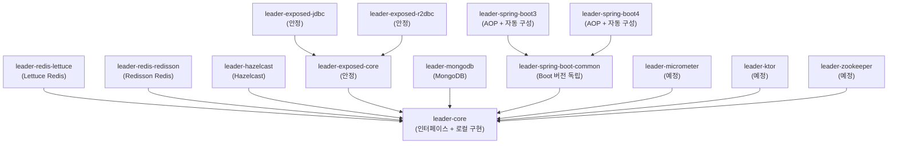
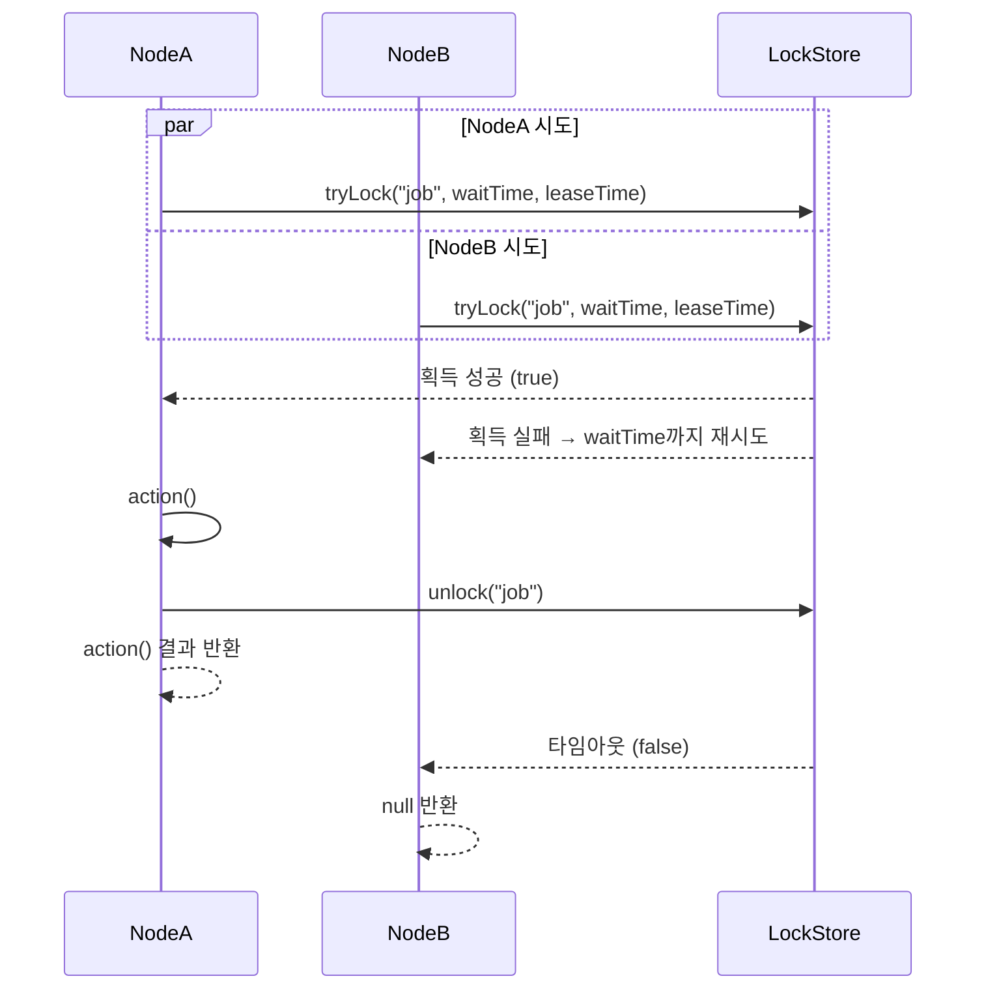
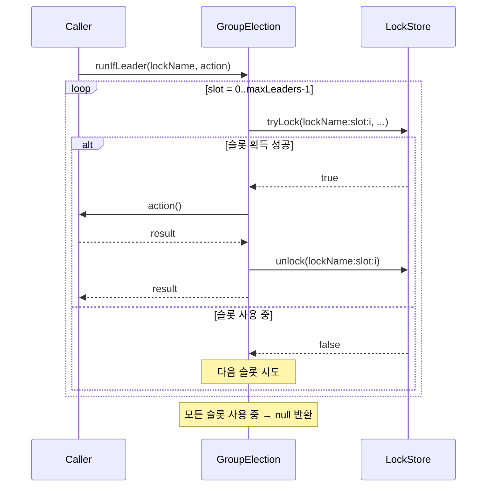

# bluetape4k-leader

[English](README.md)

Kotlin/JVM 기반 **분산 리더 선출(Distributed Leader Election)** 독립 라이브러리입니다.  
블로킹, 비동기, 코루틴, 가상 스레드 API를 지원하며, Redis(Lettuce, Redisson) 백엔드를 제공합니다. 추가 백엔드는 개발 중입니다.

[](LICENSE)
[](https://kotlinlang.org/)
[](https://openjdk.org/)

---

## 주요 특징

- **Null 반환 API** — 리더로 선출되지 않으면 `null`을 반환합니다 (경쟁 상황에서 예외를 던지지 않음)
- **다양한 실행 모델** — 블로킹, `CompletableFuture`, 가상 스레드, 코루틴 지원
- **복수 리더(그룹) 지원** — `LeaderGroupElection`으로 분산 세마포어 기반 N개 동시 리더 허용
- **전략적 선출(Strategic Election)** — 플러그형 후보 레지스트리 + 선출 전략(FIFO, Scored, Weighted); 분산 락 불필요
- **자립형 Redis 테스트 인프라** — Testcontainers 직접 사용, 외부 테스트 유틸 의존 없음
- **ShedLock 호환 skip 동작** — 락 획득 실패 시 작업을 조용히 건너뜀

## 아키텍처



## 모듈 목록

| 모듈 | 상태 | 설명 |
|------|------|------|
| `leader-core` | 안정 | 인터페이스 + 로컬 인메모리 구현체 |
| `leader-redis-lettuce` | 안정 | Lettuce 기반 Redis 백엔드 |
| `leader-redis-redisson` | 안정 | Redisson 기반 Redis 백엔드 |
| `leader-hazelcast` | 안정 | Hazelcast 백엔드 (IMap 기반, CP Subsystem 불필요) |
| `leader-exposed-core` | 안정 | Exposed 공통 스키마 (JDBC/R2DBC 드라이버 미포함) |
| `leader-exposed-jdbc` | 안정 | Exposed JDBC 백엔드 (H2, PostgreSQL, MySQL) |
| `leader-exposed-r2dbc` | 안정 | Exposed R2DBC 백엔드 (코루틴 네이티브, H2/PostgreSQL/MySQL) |
| `leader-mongodb` | 안정 | MongoDB 백엔드 (`findOneAndUpdate` + TTL 인덱스) |
| `leader-micrometer` | 예정 | Micrometer 메트릭 연동 |
| `leader-spring-boot-common` | 안정 | `@LeaderElection` / `@LeaderGroupElection` AOP 어노테이션 + Boot 버전 독립 인프라 |
| `leader-spring-boot3` | 안정 | Spring Boot 3 자동 구성 + AOP (Spring 프록시) |
| `leader-spring-boot4` | 안정 | Spring Boot 4 자동 구성 + AOP (AspectJ 포스트 컴파일 위빙) |
| `leader-ktor` | 예정 | Ktor Plugin DSL + `leaderScheduled()` 스케줄링 헬퍼 |
| `leader-zookeeper` | 예정 | ZooKeeper/Curator 백엔드 (`InterProcessMutex` / `InterProcessSemaphoreV2`) |

## 빠른 시작

### Gradle 의존성 추가

```kotlin
// Redis (Redisson 또는 Lettuce)
implementation("io.github.bluetape4k.leader:leader-redis-redisson:0.1.0-SNAPSHOT")
// 또는
implementation("io.github.bluetape4k.leader:leader-redis-lettuce:0.1.0-SNAPSHOT")

// JDBC (H2 / PostgreSQL / MySQL, Exposed 기반)
implementation("io.github.bluetape4k.leader:leader-exposed-jdbc:0.1.0-SNAPSHOT")

// R2DBC 코루틴 네이티브 (H2 / PostgreSQL / MySQL, Exposed 기반)
implementation("io.github.bluetape4k.leader:leader-exposed-r2dbc:0.1.0-SNAPSHOT")
```

### Exposed JDBC 방식 (H2 / PostgreSQL / MySQL)

```kotlin
import com.zaxxer.hikari.HikariConfig
import com.zaxxer.hikari.HikariDataSource
import io.bluetape4k.leader.exposed.jdbc.ExposedJdbcLeaderElection

val dataSource = HikariDataSource(HikariConfig().apply {
    jdbcUrl = "jdbc:postgresql://localhost:5432/mydb"
    username = "user"
    password = "pass"
})

val election = ExposedJdbcLeaderElection(dataSource)

val result = election.runIfLeader("daily-report-job") {
    generateReport()  // 리더로 선출된 노드에서만 실행
}
// result: 리더이면 generateReport() 결과, 그 외 노드는 null
```

복수 리더 그룹 (JDBC):

```kotlin
import io.bluetape4k.leader.exposed.jdbc.ExposedJdbcLeaderGroupElection
import io.bluetape4k.leader.core.LeaderGroupElectionOptions

val options = LeaderGroupElectionOptions(maxLeaders = 3)
val groupElection = ExposedJdbcLeaderGroupElection(dataSource, options)

val result = groupElection.runIfLeader("parallel-batch") {
    processNextChunk()
}
```

### 블로킹 방식 (단일 리더 — Redis)

```kotlin
val config = Config().apply { useSingleServer().setAddress("redis://localhost:6379") }
val client = Redisson.create(config)

val election = RedissonLeaderElection(client)

val result = election.runIfLeader("daily-report-job") {
    generateReport()  // 리더로 선출된 노드에서만 실행
}
// result: 리더이면 generateReport() 결과, 그 외 노드는 null
```

### 코루틴 방식 (suspend)

```kotlin
val election = RedissonSuspendLeaderElection(client)

val result = election.runIfLeader("nightly-cleanup") {
    cleanupExpiredSessions()
}
```

### 복수 리더 그룹 (세마포어)

```kotlin
val options = LeaderGroupElectionOptions(maxLeaders = 3)
val election = RedissonLeaderGroupElection(client, options)

// 최대 3개 노드가 동시에 이 작업을 실행 가능
val result = election.runIfLeader("parallel-batch") {
    processNextChunk()
}
```

### 옵션 커스터마이징

```kotlin
val options = LeaderElectionOptions(
    waitTime = Duration.ofSeconds(3),   // 락 획득 최대 대기 시간
    leaseTime = Duration.ofSeconds(30)  // 락 보유(임대) 최대 시간
)
val election = RedissonLeaderElection(client, options)
```

### 로컬 방식 (인메모리, Redis 불필요)

```kotlin
// 단일 인스턴스 또는 테스트 환경에서 유용
val election = LocalLeaderElection()
val result = election.runIfLeader("job") { "done" }
```

## `runIfLeader` 동작 원리

여러 노드가 동시에 `runIfLeader`를 호출하면 하나만 락을 획득하고 action을 실행하며, 나머지는 `null`을 반환합니다.



### 복수 리더 그룹: 슬롯 기반 세마포어



## API 개요

### 핵심 인터페이스

| 인터페이스 | 반환 타입 | 설명 |
|-----------|----------|------|
| `LeaderElection` | `T?` | 블로킹 단일 리더 |
| `AsyncLeaderElection` | `CompletableFuture<T?>` | 비동기 단일 리더 |
| `VirtualThreadLeaderElection` | `T?` | 가상 스레드 단일 리더 |
| `SuspendLeaderElection` | `T?` | 코루틴 suspend 단일 리더 |
| `LeaderGroupElection` | `T?` | 블로킹 복수 리더 (세마포어) |
| `SuspendLeaderGroupElection` | `T?` | 코루틴 복수 리더 (세마포어) |
| `StrategicLeaderElection` | `T?` | 블로킹 전략적 선출 (후보 레지스트리) |
| `StrategicSuspendLeaderElection` | `T?` | 코루틴 전략적 선출 (후보 레지스트리) |

`runIfLeader(lockName, action)` — 선출 성공 시 `action()` 결과, 실패 시 `null` 반환.

### 옵션 클래스

```kotlin
// 단일 리더 옵션
LeaderElectionOptions(
    waitTime: Duration = 5.seconds,   // 락 획득 대기 시간
    leaseTime: Duration = 60.seconds  // 락 보유 시간
)

// 복수 리더 옵션
LeaderGroupElectionOptions(
    maxLeaders: Int = 2,              // 최대 동시 리더 수
    waitTime: Duration = 5.seconds,
    leaseTime: Duration = 60.seconds
)
```

## 전략적 선출 (Strategic Election)

전략적 선출은 분산 락 획득 경쟁을 **후보 레지스트리 + 플러그형 전략**으로 대체합니다. 각 노드는 스스로를 후보로 등록하고, `runIfLeader` 호출마다 전체 후보를 로드하여 전략이 결정론적으로 승자를 선출합니다. 락을 보유하지 않으며, 승자 노드만 action을 실행합니다.

### CandidateInfo

```kotlin
CandidateInfo(
    nodeId: String,                      // 노드 고유 식별자
    registeredAt: Instant,               // 등록 시각 (FIFO 기준)
    lastCompletionTime: Instant? = null, // 유휴 시간 스코어링 기준
    successCount: Long = 0L,             // 성공 시 자동 증가
    failureCount: Long = 0L,             // 실패 시 자동 증가
    metadata: Map<String, String> = emptyMap(),
)
```

### 내장 전략

| 전략 | 설명 |
|------|------|
| `FifoElectionStrategy` | `registeredAt` 가장 이른 노드 승리; 동률은 `nodeId` 사전순 |
| `RandomElectionStrategy` | 매 라운드 무작위 선출 |
| `ScoredElectionStrategy(scorer)` | 최고 점수 후보 승리 |

### 내장 스코어러

| 스코어러 | 설명 |
|---------|------|
| `SuccessRateScorer` | `successCount / (successCount + failureCount)` |
| `IdleTimeScorer` | 유휴 시간이 길수록 높은 점수 (부하 분산) |
| `RecentSuccessScorer` | 최신 성공에 가중치를 둔 성공률 |
| `WeightedScorer(vararg pairs)` | 여러 스코어러의 선형 결합 |

### 예제 — FIFO (Lettuce)

```kotlin
val election = LettuceStrategicLeaderElection(connection, nodeId = "node-1")

// 이 노드를 후보로 등록
election.registerCandidate("batch-job", CandidateInfo("node-1"), ttl = Duration.ofMinutes(5))

// 선출 후 실행
val result = election.runIfLeader("batch-job", FifoElectionStrategy) {
    processBatch()
}
// result: 승자 노드에서 processBatch() 결과, 나머지는 null
```

### 예제 — 성공률 기반 스코어링 (코루틴, Redisson)

```kotlin
val election = RedissonStrategicSuspendLeaderElection(redissonClient, nodeId = "node-1")
election.registerCandidate("ml-job", CandidateInfo("node-1"), ttl = Duration.ofMinutes(10))

val strategy = ScoredElectionStrategy(SuccessRateScorer)
val result = election.runIfLeader("ml-job", strategy) {
    runInference()
}
```

### 예제 — 가중 복합 스코어러

```kotlin
val scorer = WeightedScorer(
    SuccessRateScorer to 0.7,
    IdleTimeScorer    to 0.3,
)
val result = election.runIfLeader("job", ScoredElectionStrategy(scorer)) { doWork() }
```

### 전략적 선출 vs 락 기반 선출

| 항목 | 락 기반 | 전략적 |
|------|---------|--------|
| 승자 선정 | 락 획득 선착순 | 결정론적 전략 |
| 후보 이력 | 없음 | `successCount`, `failureCount`, `idleDuration` |
| 후보별 TTL | 없음 (락 레벨) | 있음 (노드별 만료) |
| 커스텀 스코어러 | 없음 | 가능 (`CandidateScorer`) |
| 네트워크 RTT | 1회 (tryLock) | 2회 (list + elect) |

## ShedLock과의 비교

| 기능 | bluetape4k-leader | ShedLock |
|------|-------------------|----------|
| 경쟁 시 skip 동작 | `null` 반환 | 어노테이션 기반 skip |
| 코루틴 지원 | 네이티브 지원 | 미지원 |
| 가상 스레드 지원 | 지원 | 미지원 |
| 복수 리더 그룹 | `LeaderGroupElection` | 미지원 |
| Redis (Lettuce) | 지원 | 지원 |
| Redis (Redisson) | 지원 | 지원 |
| Spring 연동 | 예정 | 지원 (핵심 기능) |
| JDBC/SQL | 지원 (Exposed JDBC) | 지원 |
| MongoDB | 예정 | 지원 |
| Hazelcast | 지원 | 지원 |

## 요구사항

- JVM 21+
- Kotlin 2.3+

## 라이선스

Apache License 2.0 — [LICENSE](LICENSE) 참조.
