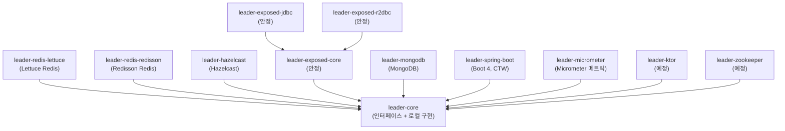
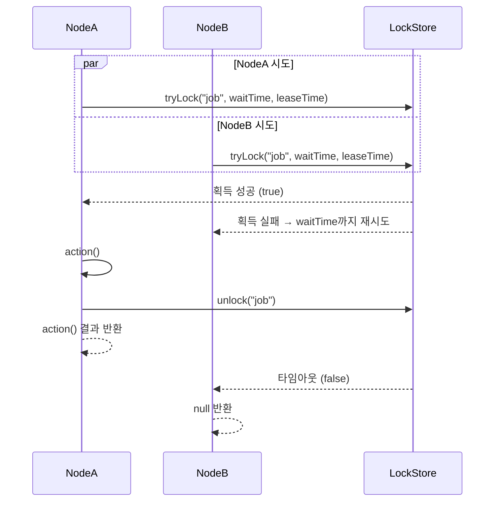
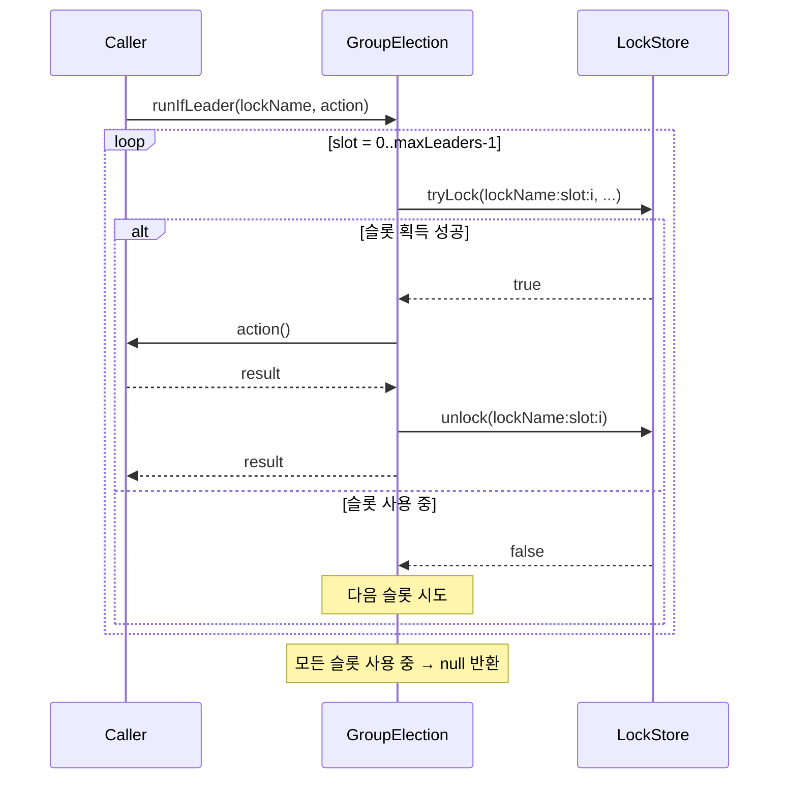

# bluetape4k-leader

[English](README.md)

Kotlin/JVM 기반 **분산 리더 선출(Distributed Leader Election)** 독립 라이브러리입니다.  
블로킹, 비동기, 코루틴, 가상 스레드 API를 지원하며, Redis(Lettuce, Redisson) 백엔드를 제공합니다. 추가 백엔드는 개발 중입니다.

[](LICENSE)
[](https://kotlinlang.org/)
[](https://openjdk.org/)

---

## 주요 특징

- **Null 반환 API** — 리더로 선출되지 않으면 `null`을 반환합니다 (경쟁 상황에서 예외를 던지지 않음)
- **다양한 실행 모델** — 블로킹, `CompletableFuture`, 가상 스레드, 코루틴 지원
- **복수 리더(그룹) 지원** — `LeaderGroupElector`으로 분산 세마포어 기반 N개 동시 리더 허용
- **전략적 선출(Strategic Election)** — 플러그형 후보 레지스트리 + 선출 전략(FIFO, Scored, Weighted); 분산 락 불필요
- **자립형 Redis 테스트 인프라** — Testcontainers 직접 사용, 외부 테스트 유틸 의존 없음
- **ShedLock 호환 skip 동작** — 락 획득 실패 시 작업을 조용히 건너뜀

## 아키텍처



## 모듈 목록

| 모듈 | 상태 | 설명 |
|------|------|------|
| `leader-core` | 안정 | 인터페이스 + 로컬 인메모리 구현체 |
| `leader-redis-lettuce` | 안정 | Lettuce 기반 Redis 백엔드 |
| `leader-redis-redisson` | 안정 | Redisson 기반 Redis 백엔드 |
| `leader-hazelcast` | 안정 | Hazelcast 백엔드 (IMap 기반, CP Subsystem 불필요) |
| `leader-exposed-core` | 안정 | Exposed 공통 스키마 (JDBC/R2DBC 드라이버 미포함) |
| `leader-exposed-jdbc` | 안정 | Exposed JDBC 백엔드 (H2, PostgreSQL, MySQL) |
| `leader-exposed-r2dbc` | 안정 | Exposed R2DBC 백엔드 (코루틴 네이티브, H2/PostgreSQL/MySQL) |
| `leader-mongodb` | 안정 | MongoDB 백엔드 (`findOneAndUpdate` + TTL 인덱스) |
| `leader-micrometer` | 안정 | Micrometer 메트릭 연동 (`MicrometerLeaderAopMetricsRecorder`) |
| `leader-spring-boot` | 안정 | Spring Boot 4 자동 구성 + AOP (AspectJ CTW, Freefair 포스트 컴파일 위빙) |
| `leader-ktor` | 예정 | Ktor Plugin DSL + `leaderScheduled()` 스케줄링 헬퍼 |
| `leader-zookeeper` | 예정 | ZooKeeper/Curator 백엔드 (`InterProcessMutex` / `InterProcessSemaphoreV2`) |

## 빠른 시작

### Gradle 의존성 추가

```kotlin
// Redis (Redisson 또는 Lettuce)
implementation("io.github.bluetape4k.leader:leader-redis-redisson:0.1.0-SNAPSHOT")
// 또는
implementation("io.github.bluetape4k.leader:leader-redis-lettuce:0.1.0-SNAPSHOT")

// JDBC (H2 / PostgreSQL / MySQL, Exposed 기반)
implementation("io.github.bluetape4k.leader:leader-exposed-jdbc:0.1.0-SNAPSHOT")

// R2DBC 코루틴 네이티브 (H2 / PostgreSQL / MySQL, Exposed 기반)
implementation("io.github.bluetape4k.leader:leader-exposed-r2dbc:0.1.0-SNAPSHOT")
```

### Exposed JDBC 방식 (H2 / PostgreSQL / MySQL)

```kotlin
import com.zaxxer.hikari.HikariConfig
import com.zaxxer.hikari.HikariDataSource
import io.bluetape4k.leader.exposed.jdbc.ExposedJdbcLeaderElector

val dataSource = HikariDataSource(HikariConfig().apply {
    jdbcUrl = "jdbc:postgresql://localhost:5432/mydb"
    username = "user"
    password = "pass"
})

val election = ExposedJdbcLeaderElector(dataSource)

val result = election.runIfLeader("daily-report-job") {
    generateReport()  // 리더로 선출된 노드에서만 실행
}
// result: 리더이면 generateReport() 결과, 그 외 노드는 null
```

복수 리더 그룹 (JDBC):

```kotlin
import io.bluetape4k.leader.exposed.jdbc.ExposedJdbcLeaderGroupElector
import io.bluetape4k.leader.core.LeaderGroupElectionOptions

val options = LeaderGroupElectionOptions(maxLeaders = 3)
val groupElection = ExposedJdbcLeaderGroupElector(dataSource, options)

val result = groupElection.runIfLeader("parallel-batch") {
    processNextChunk()
}
```

### 블로킹 방식 (단일 리더 — Redis)

```kotlin
val config = Config().apply { useSingleServer().setAddress("redis://localhost:6379") }
val client = Redisson.create(config)

val election = RedissonLeaderElector(client)

val result = election.runIfLeader("daily-report-job") {
    generateReport()  // 리더로 선출된 노드에서만 실행
}
// result: 리더이면 generateReport() 결과, 그 외 노드는 null
```

### 코루틴 방식 (suspend)

```kotlin
val election = RedissonSuspendLeaderElector(client)

val result = election.runIfLeader("nightly-cleanup") {
    cleanupExpiredSessions()
}
```

### 복수 리더 그룹 (세마포어)

```kotlin
val options = LeaderGroupElectionOptions(maxLeaders = 3)
val election = RedissonLeaderGroupElector(client, options)

// 최대 3개 노드가 동시에 이 작업을 실행 가능
val result = election.runIfLeader("parallel-batch") {
    processNextChunk()
}
```

### 옵션 커스터마이징

```kotlin
val options = LeaderElectionOptions(
    waitTime = Duration.ofSeconds(3),   // 락 획득 최대 대기 시간
    leaseTime = Duration.ofSeconds(30)  // 락 보유(임대) 최대 시간
)
val election = RedissonLeaderElector(client, options)
```

### 로컬 방식 (인메모리, Redis 불필요)

```kotlin
// 단일 인스턴스 또는 테스트 환경에서 유용
val election = LocalLeaderElector()
val result = election.runIfLeader("job") { "done" }
```

## `runIfLeader` 동작 원리

여러 노드가 동시에 `runIfLeader`를 호출하면 하나만 락을 획득하고 action을 실행하며, 나머지는 `null`을 반환합니다.



### 복수 리더 그룹: 슬롯 기반 세마포어



## API 개요

### 핵심 인터페이스

| 인터페이스 | 반환 타입 | 설명 |
|-----------|----------|------|
| `LeaderElector` | `T?` | 블로킹 단일 리더 |
| `AsyncLeaderElector` | `CompletableFuture<T?>` | 비동기 단일 리더 |
| `VirtualThreadLeaderElector` | `T?` | 가상 스레드 단일 리더 |
| `SuspendLeaderElector` | `T?` | 코루틴 suspend 단일 리더 |
| `LeaderGroupElector` | `T?` | 블로킹 복수 리더 (세마포어) |
| `SuspendLeaderGroupElector` | `T?` | 코루틴 복수 리더 (세마포어) |
| `StrategicLeaderElector` | `T?` | 블로킹 전략적 선출 (후보 레지스트리) |
| `StrategicSuspendLeaderElector` | `T?` | 코루틴 전략적 선출 (후보 레지스트리) |

`runIfLeader(lockName, action)` — 선출 성공 시 `action()` 결과, 실패 시 `null` 반환.

### 선출/미선출 구분: `LeaderRunResult`

`runIfLeader()`는 (a) 락 미획득과 (b) `action()`이 정상적으로 `null`을 반환하는 두 경우 모두 `null`을 돌려줍니다. 두 경우를 명확히 구분해야 할 때(예: metrics 기록, 조건부 후처리) `runIfLeaderResult`를 사용하세요(`LeaderElector` 및 `LeaderGroupElector` 모두 동일 메서드명으로 제공).

```kotlin
when (val r = election.runIfLeaderResult("daily-job") { compute() }) {
    is LeaderRunResult.Elected -> println("선출됨, 결과=${r.value}")
    is LeaderRunResult.Skipped -> println("미선출 — 락 획득 실패")
}
```

`LeaderRunResult`는 `Elected<T>(value: T?)`와 `Skipped` 두 변형을 가진 sealed interface입니다. 동기 `LeaderElector` 및 `LeaderGroupElector`에서만 제공되며, 비동기/코루틴 동등 메서드는 향후 릴리즈에서 추가될 예정입니다.

### 옵션 클래스

```kotlin
// 단일 리더 옵션
LeaderElectionOptions(
    waitTime: Duration = 5.seconds,   // 락 획득 대기 시간
    leaseTime: Duration = 60.seconds  // 락 보유 시간
)

// 복수 리더 옵션
LeaderGroupElectionOptions(
    maxLeaders: Int = 2,              // 최대 동시 리더 수
    waitTime: Duration = 5.seconds,
    leaseTime: Duration = 60.seconds
)
```

## 전략적 선출 (Strategic Election)

전략적 선출은 분산 락 획득 경쟁을 **후보 레지스트리 + 플러그형 전략**으로 대체합니다. 각 노드는 스스로를 후보로 등록하고, `runIfLeader` 호출마다 전체 후보를 로드하여 전략이 결정론적으로 승자를 선출합니다. 락을 보유하지 않으며, 승자 노드만 action을 실행합니다.

### CandidateInfo

```kotlin
CandidateInfo(
    nodeId: String,                      // 노드 고유 식별자
    registeredAt: Instant,               // 등록 시각 (FIFO 기준)
    lastCompletionTime: Instant? = null, // 유휴 시간 스코어링 기준
    successCount: Long = 0L,             // 성공 시 자동 증가
    failureCount: Long = 0L,             // 실패 시 자동 증가
    metadata: Map<String, String> = emptyMap(),
)
```

### 내장 전략

| 전략 | 설명 |
|------|------|
| `FifoElectionStrategy` | `registeredAt` 가장 이른 노드 승리; 동률은 `nodeId` 사전순 |
| `RandomElectionStrategy` | 매 라운드 무작위 선출 |
| `ScoredElectionStrategy(scorer)` | 최고 점수 후보 승리 |

### 내장 스코어러

| 스코어러 | 설명 |
|---------|------|
| `SuccessRateScorer` | `successCount / (successCount + failureCount)` |
| `IdleTimeScorer` | 유휴 시간이 길수록 높은 점수 (부하 분산) |
| `RecentSuccessScorer` | 최신 성공에 가중치를 둔 성공률 |
| `WeightedScorer(vararg pairs)` | 여러 스코어러의 선형 결합 |

### 예제 — FIFO (Lettuce)

```kotlin
val election = LettuceStrategicLeaderElector(connection, nodeId = "node-1")

// 이 노드를 후보로 등록
election.registerCandidate("batch-job", CandidateInfo("node-1"), ttl = Duration.ofMinutes(5))

// 선출 후 실행
val result = election.runIfLeader("batch-job", FifoElectionStrategy) {
    processBatch()
}
// result: 승자 노드에서 processBatch() 결과, 나머지는 null
```

### 예제 — 성공률 기반 스코어링 (코루틴, Redisson)

```kotlin
val election = RedissonStrategicSuspendLeaderElector(redissonClient, nodeId = "node-1")
election.registerCandidate("ml-job", CandidateInfo("node-1"), ttl = Duration.ofMinutes(10))

val strategy = ScoredElectionStrategy(SuccessRateScorer)
val result = election.runIfLeader("ml-job", strategy) {
    runInference()
}
```

### 예제 — 가중 복합 스코어러

```kotlin
val scorer = WeightedScorer(
    SuccessRateScorer to 0.7,
    IdleTimeScorer    to 0.3,
)
val result = election.runIfLeader("job", ScoredElectionStrategy(scorer)) { doWork() }
```

### 전략적 선출 vs 락 기반 선출

| 항목 | 락 기반 | 전략적 |
|------|---------|--------|
| 승자 선정 | 락 획득 선착순 | 결정론적 전략 |
| 후보 이력 | 없음 | `successCount`, `failureCount`, `idleDuration` |
| 후보별 TTL | 없음 (락 레벨) | 있음 (노드별 만료) |
| 커스텀 스코어러 | 없음 | 가능 (`CandidateScorer`) |
| 네트워크 RTT | 1회 (tryLock) | 2회 (list + elect) |

## Spring Boot AOP

`leader-spring-boot`는 AspectJ CTW(Freefair post-compile weaving) 기반의 `@LeaderElection` / `@LeaderGroupElection` 어노테이션을 제공합니다.

```kotlin
@Service
class ReportService {
    @LeaderElection(name = "daily-report-job")
    fun generateReport(): String { /* 리더 노드에서만 실행 */ }

    // Fail-open: 락을 획득하지 못해도 본문 실행
    @LeaderElection(name = "nightly-cleanup", failureMode = LeaderAspectFailureMode.FAIL_OPEN_RUN)
    fun cleanup(): String { /* 항상 실행, 분산 락은 베스트에포트 */ }
}
```

### `failureMode`

락을 **획득하지 못했을 때** (경쟁 또는 백엔드 오류) 동작을 제어합니다:

| 값 | 동작 |
|----|------|
| `SKIP` (기본값) | `null` 반환 — 본문 미실행 |
| `RETHROW` | 백엔드 오류를 `LeaderElectionException`으로 감싸 throw |
| `FAIL_OPEN_RUN` | 락 없이 본문을 실행하여 결과 반환 |

`FAIL_OPEN_RUN`은 스킵보다 실행이 안전한 경우(예: 멱등성이 보장된 태스크)에 적합합니다. 메트릭에 `SkipReason.FAIL_OPEN_FORCED`가 기록되어 락 없이 실행된 횟수를 대시보드에서 별도 추적할 수 있습니다.

### 전역 기본값 (properties)

```yaml
bluetape4k:
  leader:
    aop:
      default-failure-mode: FAIL_OPEN_RUN   # SKIP | RETHROW | FAIL_OPEN_RUN
```

---

## Micrometer 메트릭

Spring Boot AOP(`@LeaderElection`)를 사용할 때 `leader-micrometer`를 추가하면 Prometheus/Datadog 메트릭이 자동으로 노출됩니다.

### 의존성 추가

```kotlin
implementation("io.github.bluetape4k.leader:leader-spring-boot:0.1.0-SNAPSHOT")
implementation("io.github.bluetape4k.leader:leader-micrometer:0.1.0-SNAPSHOT")
```

`MeterRegistry` 빈이 존재하면 `MicrometerLeaderAopMetricsRecorder`가 자동 등록됩니다. 비활성화:

```yaml
bluetape4k:
  leader:
    aop:
      metrics:
        enabled: false
```

### 메터 카탈로그

| 메터 이름 | 타입 | 설명 |
|-----------|------|------|
| `leader.aop.attempts` | Counter | `lock.name`별 락 획득 시도 횟수 |
| `leader.aop.acquired` | Counter | 리더 선출 성공 횟수 |
| `leader.aop.lock.not.acquired` | Counter | 실행 건너뜀 횟수; `reason` 태그로 사유 구분 (`CONTENTION` / `BACKEND_ERROR`) |
| `leader.aop.execution.duration` | Timer | 리더 작업 실행 시간 |
| `leader.aop.task.failed` | Counter | 작업 본문 예외 발생 횟수; `exception` 태그로 예외 클래스명 구분 |
| `leader.aop.active` | Gauge | 현재 실행 중인 리더 작업 수 (JVM 로컬) |

모든 메터는 `lock.name` 태그를 공유합니다. Micrometer의 `NamingConvention`이 백엔드별로 이름을 변환합니다 (Prometheus: `leader_aop_attempts_total` 등).

> **멀티 인스턴스 주의:** `leader.aop.active`는 JVM 로컬 값입니다. Prometheus에서 클러스터 전체 리더 수를 보려면 `sum` 대신 `max by (lock_name) (leader_aop_active)`를 사용하세요.

### 메터 사전 등록 (선택)

앱 기동 시 정적 lock 이름을 미리 등록하면 첫 실행 전에도 dashboard에 0이 표시됩니다:

```kotlin
@Component
class MetricsPreRegistrar(private val recorder: MicrometerLeaderAopMetricsRecorder) : SmartInitializingSingleton {
    override fun afterSingletonsInstantiated() {
        recorder.registerMetricsFor("daily-report-job", "nightly-cleanup")
    }
}
```

### Health Indicator

`spring-boot-actuator`가 classpath에 있으면 `leaderMicrometerHealthContributor` 빈이 자동 등록됩니다:

```
GET /actuator/health/leaderMicrometerHealthContributor
{
  "status": "UP",
  "details": {
    "metrics.registered": true,
    "attempts.total": 42.0
  }
}
```

### 커스텀 Recorder

자체 `LeaderAopMetricsRecorder` 빈을 등록하면 기본 Micrometer 구현체를 대체합니다:

```kotlin
@Bean
fun myRecorder(): LeaderAopMetricsRecorder = MyCustomRecorder()
```

---

## ShedLock과의 비교

| 기능 | bluetape4k-leader | ShedLock |
|------|-------------------|----------|
| 경쟁 시 skip 동작 | `null` 반환 | 어노테이션 기반 skip |
| 코루틴 지원 | 네이티브 지원 | 미지원 |
| 가상 스레드 지원 | 지원 | 미지원 |
| 복수 리더 그룹 | `LeaderGroupElector` | 미지원 |
| Redis (Lettuce) | 지원 | 지원 |
| Redis (Redisson) | 지원 | 지원 |
| Spring 연동 | 예정 | 지원 (핵심 기능) |
| JDBC/SQL | 지원 (Exposed JDBC) | 지원 |
| MongoDB | 예정 | 지원 |
| Hazelcast | 지원 | 지원 |

## 요구사항

- JVM 21+
- Kotlin 2.3+

## 라이선스

Apache License 2.0 — [LICENSE](LICENSE) 참조.
