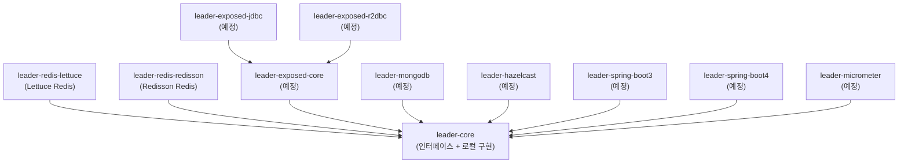

# bluetape4k-leader

[English](README.md)

Kotlin/JVM 기반 **분산 리더 선출(Distributed Leader Election)** 독립 라이브러리입니다.  
블로킹, 비동기, 코루틴, 가상 스레드 API를 지원하며, Redis(Lettuce, Redisson) 백엔드를 제공합니다. 추가 백엔드는 개발 중입니다.

[](LICENSE)
[](https://kotlinlang.org/)
[](https://openjdk.org/)

---

## 주요 특징

- **Null 반환 API** — 리더로 선출되지 않으면 `null`을 반환합니다 (경쟁 상황에서 예외를 던지지 않음)
- **다양한 실행 모델** — 블로킹, `CompletableFuture`, 가상 스레드, 코루틴 지원
- **복수 리더(그룹) 지원** — `LeaderGroupElection`으로 분산 세마포어 기반 N개 동시 리더 허용
- **자립형 Redis 테스트 인프라** — Testcontainers 직접 사용, 외부 테스트 유틸 의존 없음
- **ShedLock 호환 skip 동작** — 락 획득 실패 시 작업을 조용히 건너뜀

## 아키텍처



## 모듈 목록

| 모듈 | 상태 | 설명 |
|------|------|------|
| `leader-core` | 안정 | 인터페이스 + 로컬 인메모리 구현체 |
| `leader-redis-lettuce` | 안정 | Lettuce 기반 Redis 백엔드 |
| `leader-redis-redisson` | 안정 | Redisson 기반 Redis 백엔드 |
| `leader-exposed-core` | 예정 | Exposed 공통 스키마 (JDBC/R2DBC 드라이버 미포함) |
| `leader-exposed-jdbc` | 예정 | Exposed JDBC 백엔드 |
| `leader-exposed-r2dbc` | 예정 | Exposed R2DBC 백엔드 |
| `leader-mongodb` | 예정 | MongoDB 백엔드 |
| `leader-hazelcast` | 예정 | Hazelcast 백엔드 |
| `leader-micrometer` | 예정 | Micrometer 메트릭 연동 |
| `leader-spring-boot3` | 예정 | Spring Boot 3 자동 구성 |
| `leader-spring-boot4` | 예정 | Spring Boot 4 자동 구성 |

## 빠른 시작

### Gradle 의존성 추가

```kotlin
implementation("io.github.bluetape4k.leader:leader-redis-redisson:0.1.0-SNAPSHOT")
// 또는
implementation("io.github.bluetape4k.leader:leader-redis-lettuce:0.1.0-SNAPSHOT")
```

### 블로킹 방식 (단일 리더)

```kotlin
val config = Config().apply { useSingleServer().setAddress("redis://localhost:6379") }
val client = Redisson.create(config)

val election = RedissonLeaderElection(client)

val result = election.runIfLeader("daily-report-job") {
    generateReport()  // 리더로 선출된 노드에서만 실행
}
// result: 리더이면 generateReport() 결과, 그 외 노드는 null
```

### 코루틴 방식 (suspend)

```kotlin
val election = RedissonSuspendLeaderElection(client)

val result = election.runIfLeader("nightly-cleanup") {
    cleanupExpiredSessions()
}
```

### 복수 리더 그룹 (세마포어)

```kotlin
val options = LeaderGroupElectionOptions(maxLeaders = 3)
val election = RedissonLeaderGroupElection(client, options)

// 최대 3개 노드가 동시에 이 작업을 실행 가능
val result = election.runIfLeader("parallel-batch") {
    processNextChunk()
}
```

### 옵션 커스터마이징

```kotlin
val options = LeaderElectionOptions(
    waitTime = Duration.ofSeconds(3),   // 락 획득 최대 대기 시간
    leaseTime = Duration.ofSeconds(30)  // 락 보유(임대) 최대 시간
)
val election = RedissonLeaderElection(client, options)
```

### 로컬 방식 (인메모리, Redis 불필요)

```kotlin
// 단일 인스턴스 또는 테스트 환경에서 유용
val election = LocalLeaderElection()
val result = election.runIfLeader("job") { "done" }
```

## API 개요

### 핵심 인터페이스

| 인터페이스 | 반환 타입 | 설명 |
|-----------|----------|------|
| `LeaderElection` | `T?` | 블로킹 단일 리더 |
| `AsyncLeaderElection` | `CompletableFuture<T?>` | 비동기 단일 리더 |
| `VirtualThreadLeaderElection` | `T?` | 가상 스레드 단일 리더 |
| `SuspendLeaderElection` | `T?` | 코루틴 suspend 단일 리더 |
| `LeaderGroupElection` | `T?` | 블로킹 복수 리더 (세마포어) |
| `SuspendLeaderGroupElection` | `T?` | 코루틴 복수 리더 (세마포어) |

`runIfLeader(lockName, action)` — 선출 성공 시 `action()` 결과, 실패 시 `null` 반환.

### 옵션 클래스

```kotlin
// 단일 리더 옵션
LeaderElectionOptions(
    waitTime: Duration = 5.seconds,   // 락 획득 대기 시간
    leaseTime: Duration = 60.seconds  // 락 보유 시간
)

// 복수 리더 옵션
LeaderGroupElectionOptions(
    maxLeaders: Int = 2,              // 최대 동시 리더 수
    waitTime: Duration = 5.seconds,
    leaseTime: Duration = 60.seconds
)
```

## ShedLock과의 비교

| 기능 | bluetape4k-leader | ShedLock |
|------|-------------------|----------|
| 경쟁 시 skip 동작 | `null` 반환 | 어노테이션 기반 skip |
| 코루틴 지원 | 네이티브 지원 | 미지원 |
| 가상 스레드 지원 | 지원 | 미지원 |
| 복수 리더 그룹 | `LeaderGroupElection` | 미지원 |
| Redis (Lettuce) | 지원 | 지원 |
| Redis (Redisson) | 지원 | 지원 |
| Spring 연동 | 예정 | 지원 (핵심 기능) |
| JDBC/SQL | 예정 | 지원 |
| MongoDB | 예정 | 지원 |
| Hazelcast | 예정 | 지원 |

## 요구사항

- JVM 21+
- Kotlin 2.3+

## 라이선스

Apache License 2.0 — [LICENSE](LICENSE) 참조.
