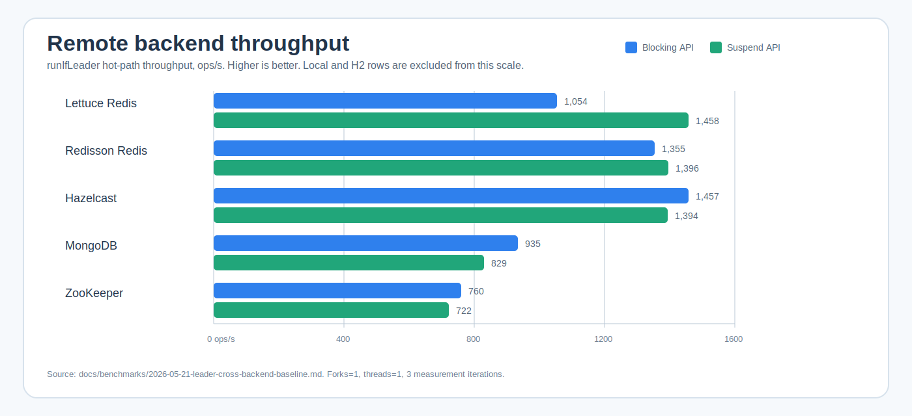

# bluetape4k-leader

[](https://github.com/bluetape4k/bluetape4k-leader/actions/workflows/ci.yml)
[](https://kotlinlang.org)
[](https://openjdk.org)
[](LICENSE)

[한국어](README.ko.md)


A standalone Kotlin/JVM library for **distributed leader election**.  
Provides blocking, async, coroutine, and virtual-thread APIs backed by Redis, Exposed, MongoDB, etcd, Kubernetes, Hazelcast, and ZooKeeper.
Spring Boot 4 auto-configuration and Ktor 3.x integration are first-class.

---

## Features

- **Null-returning API** — `runIfLeader()` returns `null` when not elected (no exceptions thrown on contention)
- **Multiple execution models** — blocking, `CompletableFuture`, virtual threads, coroutines
- **Multi-leader support** — `LeaderGroupElector` allows N concurrent leaders via distributed semaphore
- **Strategic election** — pluggable candidate-registry + election strategy (FIFO, scored, weighted); no distributed lock required
- **Self-contained Redis test infrastructure** — Testcontainers, no external test-util dependencies
- **ShedLock-compatible skip semantics** — action is simply skipped if the lock cannot be acquired

<!-- README_VISUAL_OVERVIEW:START -->
## Overview Diagram


## Module Composition Chart


<!-- README_VISUAL_OVERVIEW:END -->

## Benchmarks

The non-published [`benchmark`](./benchmark) module publishes comparable
`kotlinx-benchmark` suites for leader election backends. The JVM runner is JMH;
results are intended for same-machine before/after comparison, not release-grade
performance claims.



| Comparison | Primary signal |
|---|---|
| Blocking remote backends | Hazelcast, Redisson, and Lettuce are the current throughput leaders in the 2026-05-21 baseline. |
| Suspend remote backends | Lettuce, Redisson, and Hazelcast are tightly grouped; MongoDB suspend latency is noisy and needs repeat runs before tuning. |
| Local and H2 rows | Kept out of the remote chart because they measure in-process or local SQL/R2DBC overhead, not distributed backend cost. |

Full tables, latency chart, run command, and caveats are in the
[`benchmark` README](./benchmark/README.md) and the
[`2026-05-21 baseline report`](./docs/benchmarks/2026-05-21-leader-cross-backend-baseline.md).

## Architecture


## Modules

| Module | Status | Description |
|--------|--------|-------------|
| `leader-core` | Stable | Interfaces + local in-process implementations |
| `leader-redis-lettuce` | Stable | Lettuce-based Redis backend |
| `leader-redis-redisson` | Stable | Redisson-based Redis backend |
| `leader-hazelcast` | Stable | Hazelcast backend (IMap-based, no CP Subsystem) |
| `leader-exposed-core` | Stable | Common Exposed schema (no JDBC/R2DBC driver) |
| `leader-exposed-jdbc` | Stable | Exposed JDBC backend (H2, PostgreSQL, MySQL) |
| `leader-exposed-r2dbc` | Stable | Exposed R2DBC backend (coroutine-native, H2/PostgreSQL/MySQL) |
| `leader-mongodb` | Stable | MongoDB backend (`findOneAndUpdate` + TTL index) |
| `leader-etcd` | Preview | etcd v3 backend (jetcd Lock service + leases, single/group leader) |
| `leader-consul` | Preview | Consul Session + KV backend contract (single-leader runtime slice in progress) |
| `leader-k8s` | Preview | Kubernetes Lease backend (`coordination.k8s.io/v1`) |
| `leader-micrometer` | Stable | Micrometer metrics integration (`MicrometerLeaderAopMetricsRecorder`) |
| `leader-spring-boot` | Stable | Spring Boot 4 auto-configuration + AOP (AspectJ CTW, Freefair post-compile weaving) |
| `leader-zookeeper` | Stable | ZooKeeper/Curator backend (`InterProcessMutex` / `InterProcessSemaphoreV2`) |
| `leader-ktor` | Stable | Ktor 3.x integration — `LeaderElectionPlugin` + `leaderScheduled()` |

## Examples

Runnable example modules under `examples/` demonstrate production scenarios across every supported backend. Examples are **not** publishing artifacts (`path.startsWith(":examples:")` is excluded from publish/sign/NMCP); copy them into your own service to start.

| Example | Backend | Scenario |
|---------|---------|----------|
| [`examples/batch-scheduler`](./examples/batch-scheduler) | Lettuce Redis | Periodic batch job (e.g. nightly settlement) — single execution across N instances |
| [`examples/migration-gate`](./examples/migration-gate) | Exposed JDBC (PostgreSQL/H2) | Boot-time schema migration gate — exactly one instance runs migrations |
| [`examples/webhook-poller`](./examples/webhook-poller) | MongoDB | External webhook polling — only the leader polls and dispatches |
| [`examples/cache-warmer`](./examples/cache-warmer) | Hazelcast | Per-partition leader election — exactly one instance warms each partition |
| [`examples/tenant-aggregator`](./examples/tenant-aggregator) | Exposed R2DBC | Coroutine-native multi-tenant aggregation — independent leader per tenant |
| [`examples/ktor-app`](./examples/ktor-app) | Ktor 3.x + Lettuce Redis | Ktor application using `LeaderElectionPlugin` and `Application.leaderScheduled()` |
| [`examples/prometheus-dashboard`](./examples/prometheus-dashboard) | Spring Boot + Lettuce Redis | Prometheus and Grafana dashboard for leader AOP metrics |
| [`examples/k8s-lease`](./examples/k8s-lease) | Kubernetes Lease | Low-level Lease acquire/release/reacquire workflow against K3s |
| [`examples/k8s-operator`](./examples/k8s-operator) | Kubernetes Lease + Spring Boot | 3-replica operator pattern where one pod runs the reconcile loop |
| [`examples/rate-limiter`](./examples/rate-limiter) | Lettuce Redis + Bucket4j | Leader-dispatched external API probes with shared rate limiting |

Run any example with `./gradlew :examples:<name>:run` (Docker required for Testcontainers-backed demos).

## Quick Start

### Gradle

```kotlin
// Redis (Redisson or Lettuce)
implementation("io.github.bluetape4k.leader:bluetape4k-leader-redis-redisson:0.1.0-SNAPSHOT")
// or
implementation("io.github.bluetape4k.leader:bluetape4k-leader-redis-lettuce:0.1.0-SNAPSHOT")

// JDBC (H2 / PostgreSQL / MySQL via Exposed)
implementation("io.github.bluetape4k.leader:bluetape4k-leader-exposed-jdbc:0.1.0-SNAPSHOT")

// R2DBC coroutine-native (H2 / PostgreSQL / MySQL via Exposed)
implementation("io.github.bluetape4k.leader:bluetape4k-leader-exposed-r2dbc:0.1.0-SNAPSHOT")

// ZooKeeper / Apache Curator
implementation("io.github.bluetape4k.leader:bluetape4k-leader-zookeeper:0.1.0-SNAPSHOT")

// etcd v3 / jetcd
implementation("io.github.bluetape4k.leader:bluetape4k-leader-etcd:0.1.0-SNAPSHOT")

// Consul Session + KV
implementation("io.github.bluetape4k.leader:bluetape4k-leader-consul:0.1.0-SNAPSHOT")

// Ktor 3.x integration (LeaderElectionPlugin + leaderScheduled())
implementation("io.github.bluetape4k.leader:bluetape4k-leader-ktor:0.1.0-SNAPSHOT")
```

### Exposed JDBC (H2 / PostgreSQL / MySQL)

```kotlin
import com.zaxxer.hikari.HikariConfig
import com.zaxxer.hikari.HikariDataSource
import io.bluetape4k.leader.exposed.jdbc.ExposedJdbcLeaderElector

val dataSource = HikariDataSource(HikariConfig().apply {
    jdbcUrl = "jdbc:postgresql://localhost:5432/mydb"
    username = "user"
    password = "pass"
})

val election = ExposedJdbcLeaderElector(dataSource)

val result = election.runIfLeader("daily-report-job") {
    generateReport()
}
// result == generateReport() on the leader, null on other nodes
```

Multi-leader group (JDBC):

```kotlin
import io.bluetape4k.leader.exposed.jdbc.ExposedJdbcLeaderGroupElector
import io.bluetape4k.leader.core.LeaderGroupElectionOptions

val options = LeaderGroupElectionOptions(maxLeaders = 3)
val groupElection = ExposedJdbcLeaderGroupElector(dataSource, options)

val result = groupElection.runIfLeader("parallel-batch") {
    processNextChunk()
}
```

### Blocking (single leader — Redis)

```kotlin
val config = Config().apply { useSingleServer().setAddress("redis://localhost:6379") }
val client = Redisson.create(config)

val election = RedissonLeaderElector(client)

val result = election.runIfLeader("daily-report-job") {
    generateReport()  // runs only on the elected node
}
// result == report on the leader, null on other nodes
```

### Coroutines (suspend)

```kotlin
val election = RedissonSuspendLeaderElector(client)

val result = election.runIfLeader("nightly-cleanup") {
    cleanupExpiredSessions()
}
```

### Multi-leader group (semaphore)

```kotlin
val options = LeaderGroupElectionOptions(maxLeaders = 3)
val election = RedissonLeaderGroupElector(client, options)

// Up to 3 concurrent leaders can run this action simultaneously
val result = election.runIfLeader("parallel-batch") {
    processNextChunk()
}
```

### Custom options

```kotlin
val options = LeaderElectionOptions(
    waitTime = 3.seconds,   // how long to wait for the lock
    leaseTime = 30.seconds, // how long to hold the lock
    nodeId = "worker-a",    // id exposed by state snapshots
    minLeaseTime = 0.seconds, // lockAtLeastFor-style minimum lease retention
    autoExtend = true // renew single-leader leases while the action is running
)
val election = RedissonLeaderElector(client, options)
```

`minLeaseTime` is the `lockAtLeastFor` equivalent. Local electors wait before releasing; supported distributed backends delegate the remaining minimum lease to storage TTL so callers can return immediately.

`autoExtend` is opt-in for single-leader elections. Local, Lettuce, MongoDB, and Redisson keep the lease alive while the action is running; Redisson delegates to its native watchdog. `@LeaderGroupElection` does not support auto-extension yet. Redisson rejects `autoExtend=true` with `minLeaseTime > 0` because watchdog release semantics would be ambiguous.

### State snapshots

```kotlin
val single = election.state("daily-report-job")
if (single.isOccupied) {
    println("leader=${single.leader?.leaderId}")
}

val group = groupElection.state("parallel-batch")
println("active=${group.activeCount}/${group.maxLeaders}")
println("available=${group.availableSlots}")
println("leaders=${group.leaders.map { it.leaderId }}")
```

State APIs return best-effort snapshots for diagnostics and metrics. Do not use a snapshot to decide whether to run work; always use `runIfLeader` so the backend can acquire the lock atomically.

### Tenant namespaces

Use `forTenant()` when the same logical job must be isolated per SaaS tenant without changing backend configuration:

```kotlin
import io.bluetape4k.leader.forTenant

val tenantElection = election.forTenant("acme")
tenantElection.runIfLeader("daily-report-job") {
    generateTenantReport("acme")
}
// backend lockName: tenant:acme:daily-report-job

val tenantGroup = groupElection.forTenant("acme")
tenantGroup.runIfLeader("aggregation") {
    aggregateTenant("acme")
}
```

`forTenant()` is available for blocking, coroutine, group, and virtual-thread electors. The namespace separator `:` is reserved; tenant ids, custom prefixes, and tenant-local lock names must not contain `:`. Rename existing caller-facing lock names such as `batch:daily` before adding a tenant scope. The generated backend lock name must still satisfy the shared lock-name limit of 255 characters.

Tenant-scoped state snapshots return the full backend lock name, for example `tenant:acme:daily-report-job`. Do not pass `state().lockName` back to `runIfLeader()` on the same tenant-scoped elector; keep using the original caller-facing lock name such as `daily-report-job`.

### Migration notes

- Kotlin API options use `kotlin.time.Duration`. Prefer `5.seconds`, `60.seconds`, `1.minutes` over `java.time.Duration.ofSeconds(...)`.
- Spring Boot YAML still uses Spring's duration binding (`5s`, `60s`, `PT1M`).
- Spring bean names use `LeaderElector` terminology. Prefer `redissonLeaderElectionFactory`, `lettuceSuspendLeaderElectorFactory`, and similar names.

### Local (in-process, no Redis)

```kotlin
// Useful for single-instance or testing scenarios
val election = LocalLeaderElector()
val result = election.runIfLeader("job") { "done" }
```

### Ktor management route

`leader-ktor` can expose a JVM-local management route when the plugin option is enabled:

```kotlin
fun Application.module() {
    install(LeaderElectionPlugin) {
        leaderElection = redissonElector
        managementRouteEnabled = true
        managementLockNames("batch-job", "migration-gate")
    }
}
```

```http
GET /management/leaderElection
```

The route is disabled by default and runs on the main Ktor routing pipeline. Protect it with an authentication plugin, network policy, or an internal-only port before exposing it outside a trusted management boundary.

```json
{
  "locks": [
    {
      "name": "batch-job",
      "status": "Empty",
      "leaderId": null,
      "leaseExpiry": null
    }
  ]
}
```

## How `runIfLeader` Works

Multiple nodes call `runIfLeader` concurrently — only one acquires the lock and runs the action; the rest return `null`.


### Multi-leader group: slot-based semaphore


## API Overview

### Core interfaces

| Interface | Returns | Description |
|-----------|---------|-------------|
| `LeaderElector` | `T?` | Blocking single-leader |
| `AsyncLeaderElector` | `CompletableFuture<T?>` | Async single-leader |
| `VirtualThreadLeaderElector` | `T?` | Virtual thread single-leader |
| `SuspendLeaderElector` | `T?` | Coroutine suspend single-leader |
| `LeaderGroupElector` | `T?` | Blocking multi-leader (semaphore) |
| `SuspendLeaderGroupElector` | `T?` | Coroutine multi-leader (semaphore) |
| `StrategicLeaderElector` | `T?` | Blocking strategic election (candidate registry) |
| `StrategicSuspendLeaderElector` | `T?` | Coroutine strategic election (candidate registry) |

`runIfLeader(lockName, action)` — returns `action()` result on success, `null` if not elected.

### Distinguishing elected vs skipped: `LeaderRunResult`

`runIfLeader()` returns `null` for two distinct cases: (a) lock not acquired and (b) `action()` legitimately returning `null`. Use `runIfLeaderResult` (available on both `LeaderElector` and `LeaderGroupElector`) when you need to tell them apart — for example, in metrics or conditional post-processing:

```kotlin
when (val r = election.runIfLeaderResult("daily-job") { compute() }) {
    is LeaderRunResult.Elected -> println("elected, result=${r.value}")
    is LeaderRunResult.Skipped -> println("skipped — lock not acquired")
    is LeaderRunResult.ActionFailed -> println("action failed: ${r.cause.message}")
}
```

`LeaderRunResult` is a sealed interface with three variants:

- `Elected<T>(value: T?)` — lock/slot acquired and `action` completed. `value` may be `null`.
- `Skipped` — lock/slot was not acquired and `action` was not executed.
- `ActionFailed(cause)` — lock/slot was acquired and `action` started, but the action failed.

`runIfLeaderResult` is available for blocking electors, `runIfLeaderResultSuspend` for coroutine electors, and `runAsyncIfLeaderResult` for `CompletableFuture` / virtual-thread electors. `CancellationException` is not wrapped as `ActionFailed`: blocking and suspend APIs rethrow it, while async and virtual-thread APIs complete exceptionally (for `join()`, expect `CompletionException` wrapping the cancellation; `isCancelled()` is not guaranteed). Blocking APIs also rethrow `InterruptedException` after restoring the interrupt flag.

### Options

```kotlin
LeaderElectionOptions(
    waitTime: Duration = 5.seconds,
    leaseTime: Duration = 60.seconds
)

LeaderGroupElectionOptions(
    maxLeaders: Int = 2,
    waitTime: Duration = 5.seconds,
    leaseTime: Duration = 60.seconds
)
```

## Strategic Election

Strategic election replaces the distributed-lock acquisition race with a **candidate registry + pluggable strategy**. Each node registers itself as a candidate; on each `runIfLeader` call, all candidates are loaded and a strategy deterministically selects the winner. No lock is held — only the winning node executes the action.

### CandidateInfo

```kotlin
CandidateInfo(
    nodeId: String,                      // unique node identifier
    registeredAt: Instant,               // registration timestamp (for FIFO)
    lastCompletionTime: Instant? = null, // for idle-time scoring
    successCount: Long = 0L,             // auto-incremented on success
    failureCount: Long = 0L,             // auto-incremented on failure
    metadata: Map<String, String> = emptyMap(),
)
```

### Built-in strategies

| Strategy | Description |
|----------|-------------|
| `FifoElectionStrategy` | Earliest `registeredAt` wins; ties broken by `nodeId` lexicographic order |
| `RandomElectionStrategy` | Random pick each round |
| `ScoredElectionStrategy(scorer)` | Highest-score candidate wins |

### Built-in scorers

| Scorer | Description |
|--------|-------------|
| `SuccessRateScorer` | `successCount / (successCount + failureCount)` |
| `IdleTimeScorer` | Longer idle time → higher score (load balancing) |
| `RecentSuccessScorer` | Recency-weighted success rate |
| `WeightedScorer(vararg pairs)` | Linear combination of multiple scorers |

### Example — FIFO (Lettuce)

```kotlin
val election = LettuceStrategicLeaderElector(connection, nodeId = "node-1")

// register this node
election.registerCandidate("batch-job", CandidateInfo("node-1"), ttl = 5.minutes)

// elect and run
val result = election.runIfLeader("batch-job", FifoElectionStrategy) {
    processBatch()
}
// result: processBatch() on the winning node, null on others
```

### Example — Success-rate scoring (coroutine, Redisson)

```kotlin
val election = RedissonStrategicSuspendLeaderElector(redissonClient, nodeId = "node-1")
election.registerCandidate("ml-job", CandidateInfo("node-1"), ttl = 10.minutes)

val strategy = ScoredElectionStrategy(SuccessRateScorer)
val result = election.runIfLeader("ml-job", strategy) {
    runInference()
}
```

### Example — Weighted composite scorer

```kotlin
val scorer = WeightedScorer(
    SuccessRateScorer to 0.7,
    IdleTimeScorer    to 0.3,
)
val result = election.runIfLeader("job", ScoredElectionStrategy(scorer)) { doWork() }
```

### Strategic election vs lock-based election

| Aspect | Lock-based | Strategic |
|--------|-----------|-----------|
| Winner selection | First to acquire lock | Deterministic strategy |
| Candidate history | None | `successCount`, `failureCount`, `idleDuration` |
| TTL per candidate | No (lock-level TTL) | Yes (per-node expiry) |
| Custom scorer | No | Yes (`CandidateScorer`) |
| Network RTT | 1 (tryLock) | 2 (list + elect) |

## Spring Boot AOP

`leader-spring-boot` provides `@LeaderElection` and `@LeaderGroupElection` annotations backed by AspectJ CTW (Freefair post-compile weaving).

```kotlin
@Service
class ReportService {
    @LeaderElection(name = "daily-report-job")
    fun generateReport(): String { /* runs only on elected node */ }

    // Fail-open: run the body even when lock is not acquired or backend is unavailable
    @LeaderElection(name = "nightly-cleanup", failureMode = LeaderAspectFailureMode.FAIL_OPEN_RUN)
    fun cleanup(): String { /* always runs, lock is best-effort */ }

    @LeaderElection(name = "event-stream", autoExtend = true)
    fun streamEvents(): Flux<Event> = eventRepository.stream()

    @LeaderElection(name = "bounded-flow", streamBounded = true)
    fun boundedFlow(): Flow<Event> = eventRepository.findRecent()
}
```

Stream return rules:

- `@LeaderElection` supports `T?`, `suspend T?`, `Mono<T>`, `Flux<T>`, and Kotlin `Flow<T>`.
- Use `autoExtend = true` for long-running or unbounded streams.
- Use `streamBounded = true` only when the stream is known to finish within the lease window.
- Unsafe `Flux` / `Flow` signatures fail fast in the validator and at subscription/collection time.
- `@LeaderGroupElection` supports `T?`, `suspend T?`, and `Mono<T>`; `Flux` / `Flow` group streams are rejected until group lease extension semantics are defined.

### `failureMode`

Controls what happens when the lock is **not** acquired (contention or backend error):

| Value | Behaviour |
|-------|-----------|
| `RETHROW` (default) | Throw `LeaderElectionException` wrapping the backend error |
| `SKIP` | Return `null` — body is not executed |
| `FAIL_OPEN_RUN` | Run the method body anyway and return its result |

`FAIL_OPEN_RUN` is designed for jobs where skipping is worse than running without the distributed lock guarantee (e.g., best-effort idempotent tasks). Metrics record `SkipReason.FAIL_OPEN_FORCED` so dashboards can track lock-free executions separately.

### Global default via properties

```yaml
bluetape4k:
  leader:
    aop:
      failure-mode: FAIL_OPEN_RUN   # RETHROW | SKIP | FAIL_OPEN_RUN
```

### Leader Election Actuator endpoint

`leader-spring-boot` registers an opt-in `leaderElection` Actuator endpoint for JVM-local lock status diagnostics:

```yaml
bluetape4k:
  leader:
    observability:
      lock-names:
        - batch-job
        - migration-gate

management:
  endpoint:
    leaderElection:
      enabled: true
  endpoints:
    web:
      exposure:
        include: health,leaderElection
```

```http
GET /actuator/leaderElection
```

```json
{
  "locks": [
    {
      "name": "batch-job",
      "status": "Occupied",
      "leaderId": "node-1",
      "leaseExpiry": "2026-05-16T00:00:00Z"
    }
  ]
}
```

`bluetape4k.leader.observability.lock-names` seeds the JVM-local status registry before the first runtime event. Listener-aware electors can also add names as they observe lifecycle events. The fallback `LeaderElectionEventPublisher` is publisher-only and never becomes a `LeaderElector` candidate, so existing elector injection remains stable.

---

## Management Endpoints

Spring Boot applications can expose a best-effort leader status endpoint through Actuator. Enable
leader observability beans and the endpoint explicitly:

```yaml
bluetape4k:
  leader:
    observability:
      enabled: true
      lock-names:
        - batch-job
        - migration-gate

management:
  endpoint:
    leaderElection:
      enabled: true
  endpoints:
    web:
      exposure:
        include: leaderElection
```

The HTTP path is `GET /actuator/leaderElection`. Lock names come from the JVM-local
`LeaderElectionStatusRegistry`: configure static names with
`bluetape4k.leader.observability.lock-names`, or let Spring AOP observations register names as
leader-election methods run. The endpoint does not enumerate backend locks.

Ktor applications can expose the same status shape with `leaderElectionManagementRoute()`:

```kotlin
install(LeaderElectionPlugin) {
    leaderElection = redissonElector
    managementRouteEnabled = true
    managementLockNames("batch-job", "migration-gate")
}

leaderElectionManagementRoute()
```

The Ktor route defaults to `GET /management/leaderElection` and is installed on the application's
main routing pipeline. Protect it with authentication, network policy, or a dedicated internal port
before exposing it outside a trusted management boundary.

---

## Micrometer Metrics

When using Spring Boot AOP (`@LeaderElection`), add `leader-micrometer` to expose Prometheus/Datadog metrics automatically.

### Dependency

```kotlin
implementation("io.github.bluetape4k.leader:bluetape4k-leader-spring-boot:0.1.0-SNAPSHOT")
implementation("io.github.bluetape4k.leader:bluetape4k-leader-micrometer:0.1.0-SNAPSHOT")
```

`MicrometerLeaderAopMetricsRecorder` is auto-registered when a `MeterRegistry` bean is present. Disable with:

```yaml
bluetape4k:
  leader:
    aop:
      metrics:
        enabled: false
```

### Meter Catalog

| Meter name | Type | Description |
|------------|------|-------------|
| `leader.aop.attempts` | Counter | Lock acquisition attempts per `lock.name` |
| `leader.aop.acquired` | Counter | Successful leader elections |
| `leader.aop.lock.not.acquired` | Counter | Skipped executions; tagged with `reason` (`CONTENTION` / `BACKEND_ERROR`) |
| `leader.aop.execution.duration` | Timer | Elapsed time of the leader action |
| `leader.aop.task.failed` | Counter | Action body exceptions; tagged with `exception` class name |
| `leader.aop.active` | Gauge | Currently running leader actions (JVM-local) |
| `shedlock.leader.acquired` | Counter | Decorator-based successful leader executions |
| `shedlock.leader.not_acquired` | Counter | Decorator-based skipped executions |
| `shedlock.leader.duration` | Timer | Decorator-based leader action duration |
| `shedlock.leader.active` | Gauge | Decorator-based currently running leader actions (JVM-local) |

All meters are tagged with `lock.name`. Micrometer's `NamingConvention` converts names per backend (e.g., `leader_aop_attempts_total` for Prometheus).

> **Multi-instance note:** `leader.aop.active` is JVM-local. Use `max by (lock_name) (leader_aop_active)` in Prometheus — not `sum` — to avoid counting each node's gauge separately.

### Decorator metrics

Use the decorator wrappers when you call leader electors directly instead of Spring AOP:

```kotlin
val election = InstrumentedLeaderElector(delegate, registry)
val result = election.runIfLeader("daily-report-job") {
    generateReport()
}

val groupElection = InstrumentedLeaderGroupElector(groupDelegate, registry)
groupElection.runIfLeader("batch-shard") {
    processShard()
}

val suspendElection = InstrumentedSuspendLeaderElector(suspendDelegate, registry)
suspendElection.runIfLeader("sync-job") {
    syncData()
}
```

Pass `lockName = "static-job"` to any wrapper to use a fixed `lock.name` tag; omit it to use the per-call lock name.

### Pre-registration (optional)

Pre-register static lock names at startup so metrics appear in dashboards even before the first execution:

```kotlin
@Component
class MetricsPreRegistrar(private val recorder: MicrometerLeaderAopMetricsRecorder) : SmartInitializingSingleton {
    override fun afterSingletonsInstantiated() {
        recorder.registerMetricsFor("daily-report-job", "nightly-cleanup")
    }
}
```

### Health Indicator

When `spring-boot-actuator` is on the classpath, a `leaderMetricsHealthIndicator` bean is registered automatically:

```
GET /actuator/health/leaderMetricsHealthIndicator
{
  "status": "UP",
  "details": {
    "active": 0,
    "trackedLocks": 2
  }
}
```

### Custom recorder

Provide your own `LeaderAopMetricsRecorder` bean to replace the default Micrometer implementation:

```kotlin
@Bean
fun myRecorder(): LeaderAopMetricsRecorder = MyCustomRecorder()
```

---

## Comparison with ShedLock

| Feature | bluetape4k-leader | ShedLock |
|---------|-------------------|----------|
| Skip on contention | `null` return | annotation-based skip |
| Coroutine support | Native | No |
| Virtual thread support | Yes | No |
| Multi-leader (group) | `LeaderGroupElector` | No |
| Redis (Lettuce) | Yes | Yes |
| Redis (Redisson) | Yes | Yes |
| Spring integration | Yes (Boot 4 + AspectJ CTW) | Yes (core feature) |
| JDBC/SQL | Yes (Exposed JDBC) | Yes |
| MongoDB | Yes | Yes |
| etcd | Yes | No |
| Consul | Preview | No |
| Hazelcast | Yes | Yes |
| ZooKeeper | Yes | No |

## Requirements

- JVM 21+
- Kotlin 2.3+

## License

MIT License — see [LICENSE](LICENSE).
