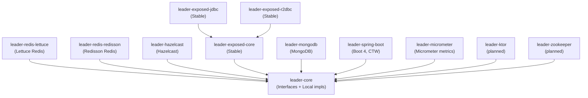
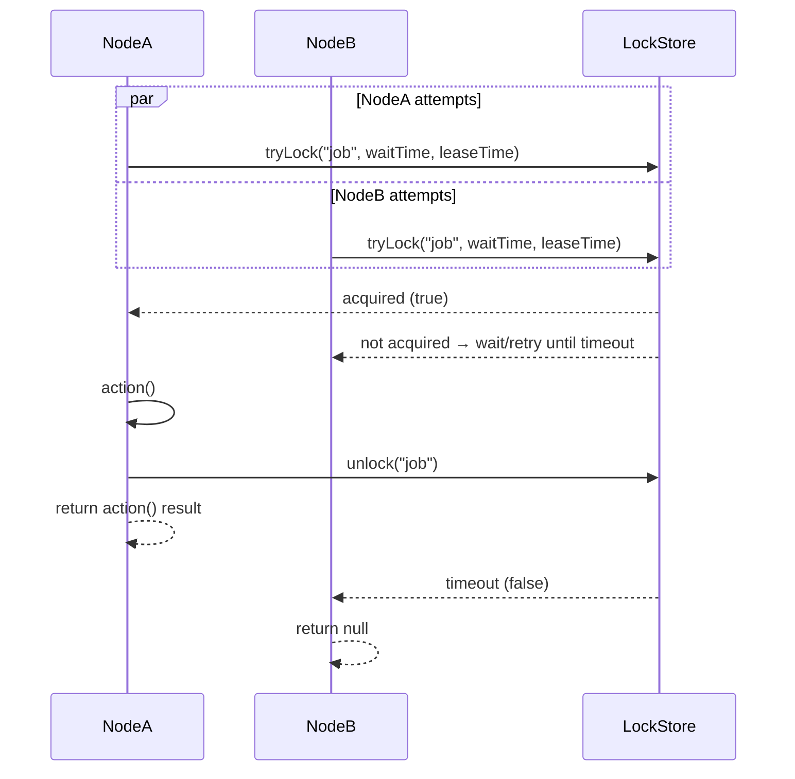
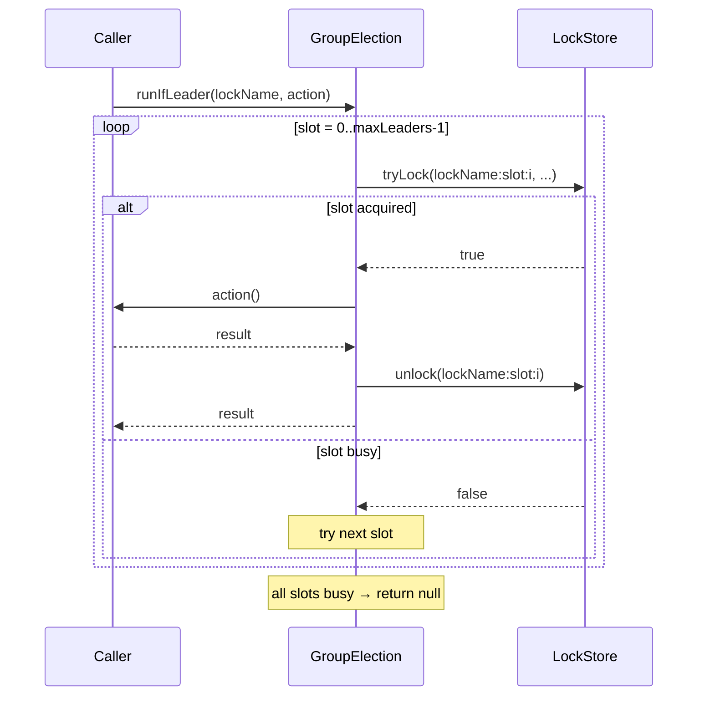

# bluetape4k-leader

[한국어](README.ko.md)

A standalone Kotlin/JVM library for **distributed leader election**.  
Provides blocking, async, coroutine, and virtual-thread APIs backed by Redis (Lettuce, Redisson), with more backends planned.

[](LICENSE)
[](https://kotlinlang.org/)
[](https://openjdk.org/)

---

## Features

- **Null-returning API** — `runIfLeader()` returns `null` when not elected (no exceptions thrown on contention)
- **Multiple execution models** — blocking, `CompletableFuture`, virtual threads, coroutines
- **Multi-leader support** — `LeaderGroupElection` allows N concurrent leaders via distributed semaphore
- **Strategic election** — pluggable candidate-registry + election strategy (FIFO, scored, weighted); no distributed lock required
- **Self-contained Redis test infrastructure** — Testcontainers, no external test-util dependencies
- **ShedLock-compatible skip semantics** — action is simply skipped if the lock cannot be acquired

## Architecture



## Modules

| Module | Status | Description |
|--------|--------|-------------|
| `leader-core` | Stable | Interfaces + local in-process implementations |
| `leader-redis-lettuce` | Stable | Lettuce-based Redis backend |
| `leader-redis-redisson` | Stable | Redisson-based Redis backend |
| `leader-hazelcast` | Stable | Hazelcast backend (IMap-based, no CP Subsystem) |
| `leader-exposed-core` | Stable | Common Exposed schema (no JDBC/R2DBC driver) |
| `leader-exposed-jdbc` | Stable | Exposed JDBC backend (H2, PostgreSQL, MySQL) |
| `leader-exposed-r2dbc` | Stable | Exposed R2DBC backend (coroutine-native, H2/PostgreSQL/MySQL) |
| `leader-mongodb` | Stable | MongoDB backend (`findOneAndUpdate` + TTL index) |
| `leader-micrometer` | Stable | Micrometer metrics integration (`MicrometerLeaderAopMetricsRecorder`) |
| `leader-spring-boot` | Stable | Spring Boot 4 auto-configuration + AOP (AspectJ CTW, Freefair post-compile weaving) |
| `leader-ktor` | Planned | Ktor Plugin DSL + `leaderScheduled()` scheduling helper |
| `leader-zookeeper` | Planned | ZooKeeper/Curator backend (`InterProcessMutex` / `InterProcessSemaphoreV2`) |

## Quick Start

### Gradle

```kotlin
// Redis (Redisson or Lettuce)
implementation("io.github.bluetape4k.leader:leader-redis-redisson:0.1.0-SNAPSHOT")
// or
implementation("io.github.bluetape4k.leader:leader-redis-lettuce:0.1.0-SNAPSHOT")

// JDBC (H2 / PostgreSQL / MySQL via Exposed)
implementation("io.github.bluetape4k.leader:leader-exposed-jdbc:0.1.0-SNAPSHOT")

// R2DBC coroutine-native (H2 / PostgreSQL / MySQL via Exposed)
implementation("io.github.bluetape4k.leader:leader-exposed-r2dbc:0.1.0-SNAPSHOT")
```

### Exposed JDBC (H2 / PostgreSQL / MySQL)

```kotlin
import com.zaxxer.hikari.HikariConfig
import com.zaxxer.hikari.HikariDataSource
import io.bluetape4k.leader.exposed.jdbc.ExposedJdbcLeaderElection

val dataSource = HikariDataSource(HikariConfig().apply {
    jdbcUrl = "jdbc:postgresql://localhost:5432/mydb"
    username = "user"
    password = "pass"
})

val election = ExposedJdbcLeaderElection(dataSource)

val result = election.runIfLeader("daily-report-job") {
    generateReport()
}
// result == generateReport() on the leader, null on other nodes
```

Multi-leader group (JDBC):

```kotlin
import io.bluetape4k.leader.exposed.jdbc.ExposedJdbcLeaderGroupElection
import io.bluetape4k.leader.core.LeaderGroupElectionOptions

val options = LeaderGroupElectionOptions(maxLeaders = 3)
val groupElection = ExposedJdbcLeaderGroupElection(dataSource, options)

val result = groupElection.runIfLeader("parallel-batch") {
    processNextChunk()
}
```

### Blocking (single leader — Redis)

```kotlin
val config = Config().apply { useSingleServer().setAddress("redis://localhost:6379") }
val client = Redisson.create(config)

val election = RedissonLeaderElection(client)

val result = election.runIfLeader("daily-report-job") {
    generateReport()  // runs only on the elected node
}
// result == report on the leader, null on other nodes
```

### Coroutines (suspend)

```kotlin
val election = RedissonSuspendLeaderElection(client)

val result = election.runIfLeader("nightly-cleanup") {
    cleanupExpiredSessions()
}
```

### Multi-leader group (semaphore)

```kotlin
val options = LeaderGroupElectionOptions(maxLeaders = 3)
val election = RedissonLeaderGroupElection(client, options)

// Up to 3 concurrent leaders can run this action simultaneously
val result = election.runIfLeader("parallel-batch") {
    processNextChunk()
}
```

### Custom options

```kotlin
val options = LeaderElectionOptions(
    waitTime = Duration.ofSeconds(3),   // how long to wait for the lock
    leaseTime = Duration.ofSeconds(30)  // how long to hold the lock
)
val election = RedissonLeaderElection(client, options)
```

### Local (in-process, no Redis)

```kotlin
// Useful for single-instance or testing scenarios
val election = LocalLeaderElection()
val result = election.runIfLeader("job") { "done" }
```

## How `runIfLeader` Works

Multiple nodes call `runIfLeader` concurrently — only one acquires the lock and runs the action; the rest return `null`.



### Multi-leader group: slot-based semaphore



## API Overview

### Core interfaces

| Interface | Returns | Description |
|-----------|---------|-------------|
| `LeaderElection` | `T?` | Blocking single-leader |
| `AsyncLeaderElection` | `CompletableFuture<T?>` | Async single-leader |
| `VirtualThreadLeaderElection` | `T?` | Virtual thread single-leader |
| `SuspendLeaderElection` | `T?` | Coroutine suspend single-leader |
| `LeaderGroupElection` | `T?` | Blocking multi-leader (semaphore) |
| `SuspendLeaderGroupElection` | `T?` | Coroutine multi-leader (semaphore) |
| `StrategicLeaderElection` | `T?` | Blocking strategic election (candidate registry) |
| `StrategicSuspendLeaderElection` | `T?` | Coroutine strategic election (candidate registry) |

`runIfLeader(lockName, action)` — returns `action()` result on success, `null` if not elected.

### Distinguishing elected vs skipped: `LeaderRunResult`

`runIfLeader()` returns `null` for two distinct cases: (a) lock not acquired and (b) `action()` legitimately returning `null`. Use `runIfLeaderResult` (available on both `LeaderElector` and `LeaderGroupElector`) when you need to tell them apart — for example, in metrics or conditional post-processing:

```kotlin
when (val r = election.runIfLeaderResult("daily-job") { compute() }) {
    is LeaderRunResult.Elected -> println("elected, result=${r.value}")
    is LeaderRunResult.Skipped -> println("skipped — lock not acquired")
}
```

`LeaderRunResult` is a sealed interface with two variants: `Elected<T>(value: T?)` and `Skipped`. Available on synchronous `LeaderElector` and `LeaderGroupElector` only (async/suspend equivalents planned for a future release).

### Options

```kotlin
LeaderElectionOptions(
    waitTime: Duration = 5.seconds,
    leaseTime: Duration = 60.seconds
)

LeaderGroupElectionOptions(
    maxLeaders: Int = 2,
    waitTime: Duration = 5.seconds,
    leaseTime: Duration = 60.seconds
)
```

## Strategic Election

Strategic election replaces the distributed-lock acquisition race with a **candidate registry + pluggable strategy**. Each node registers itself as a candidate; on each `runIfLeader` call, all candidates are loaded and a strategy deterministically selects the winner. No lock is held — only the winning node executes the action.

### CandidateInfo

```kotlin
CandidateInfo(
    nodeId: String,                      // unique node identifier
    registeredAt: Instant,               // registration timestamp (for FIFO)
    lastCompletionTime: Instant? = null, // for idle-time scoring
    successCount: Long = 0L,             // auto-incremented on success
    failureCount: Long = 0L,             // auto-incremented on failure
    metadata: Map<String, String> = emptyMap(),
)
```

### Built-in strategies

| Strategy | Description |
|----------|-------------|
| `FifoElectionStrategy` | Earliest `registeredAt` wins; ties broken by `nodeId` lexicographic order |
| `RandomElectionStrategy` | Random pick each round |
| `ScoredElectionStrategy(scorer)` | Highest-score candidate wins |

### Built-in scorers

| Scorer | Description |
|--------|-------------|
| `SuccessRateScorer` | `successCount / (successCount + failureCount)` |
| `IdleTimeScorer` | Longer idle time → higher score (load balancing) |
| `RecentSuccessScorer` | Recency-weighted success rate |
| `WeightedScorer(vararg pairs)` | Linear combination of multiple scorers |

### Example — FIFO (Lettuce)

```kotlin
val election = LettuceStrategicLeaderElection(connection, nodeId = "node-1")

// register this node
election.registerCandidate("batch-job", CandidateInfo("node-1"), ttl = Duration.ofMinutes(5))

// elect and run
val result = election.runIfLeader("batch-job", FifoElectionStrategy) {
    processBatch()
}
// result: processBatch() on the winning node, null on others
```

### Example — Success-rate scoring (coroutine, Redisson)

```kotlin
val election = RedissonStrategicSuspendLeaderElection(redissonClient, nodeId = "node-1")
election.registerCandidate("ml-job", CandidateInfo("node-1"), ttl = Duration.ofMinutes(10))

val strategy = ScoredElectionStrategy(SuccessRateScorer)
val result = election.runIfLeader("ml-job", strategy) {
    runInference()
}
```

### Example — Weighted composite scorer

```kotlin
val scorer = WeightedScorer(
    SuccessRateScorer to 0.7,
    IdleTimeScorer    to 0.3,
)
val result = election.runIfLeader("job", ScoredElectionStrategy(scorer)) { doWork() }
```

### Strategic election vs lock-based election

| Aspect | Lock-based | Strategic |
|--------|-----------|-----------|
| Winner selection | First to acquire lock | Deterministic strategy |
| Candidate history | None | `successCount`, `failureCount`, `idleDuration` |
| TTL per candidate | No (lock-level TTL) | Yes (per-node expiry) |
| Custom scorer | No | Yes (`CandidateScorer`) |
| Network RTT | 1 (tryLock) | 2 (list + elect) |

## Spring Boot AOP

`leader-spring-boot` provides `@LeaderElection` and `@LeaderGroupElection` annotations backed by AspectJ CTW (Freefair post-compile weaving).

```kotlin
@Service
class ReportService {
    @LeaderElection(name = "daily-report-job")
    fun generateReport(): String { /* runs only on elected node */ }

    // Fail-open: run the body even when lock is not acquired or backend is unavailable
    @LeaderElection(name = "nightly-cleanup", failureMode = LeaderAspectFailureMode.FAIL_OPEN_RUN)
    fun cleanup(): String { /* always runs, lock is best-effort */ }
}
```

### `failureMode`

Controls what happens when the lock is **not** acquired (contention or backend error):

| Value | Behaviour |
|-------|-----------|
| `SKIP` (default) | Return `null` — body is not executed |
| `RETHROW` | Throw `LeaderElectionException` wrapping the backend error |
| `FAIL_OPEN_RUN` | Run the method body anyway and return its result |

`FAIL_OPEN_RUN` is designed for jobs where skipping is worse than running without the distributed lock guarantee (e.g., best-effort idempotent tasks). Metrics record `SkipReason.FAIL_OPEN_FORCED` so dashboards can track lock-free executions separately.

### Global default via properties

```yaml
bluetape4k:
  leader:
    aop:
      default-failure-mode: FAIL_OPEN_RUN   # SKIP | RETHROW | FAIL_OPEN_RUN
```

---

## Micrometer Metrics

When using Spring Boot AOP (`@LeaderElection`), add `leader-micrometer` to expose Prometheus/Datadog metrics automatically.

### Dependency

```kotlin
implementation("io.github.bluetape4k.leader:leader-spring-boot:0.1.0-SNAPSHOT")
implementation("io.github.bluetape4k.leader:leader-micrometer:0.1.0-SNAPSHOT")
```

`MicrometerLeaderAopMetricsRecorder` is auto-registered when a `MeterRegistry` bean is present. Disable with:

```yaml
bluetape4k:
  leader:
    aop:
      metrics:
        enabled: false
```

### Meter Catalog

| Meter name | Type | Description |
|------------|------|-------------|
| `leader.aop.attempts` | Counter | Lock acquisition attempts per `lock.name` |
| `leader.aop.acquired` | Counter | Successful leader elections |
| `leader.aop.lock.not.acquired` | Counter | Skipped executions; tagged with `reason` (`CONTENTION` / `BACKEND_ERROR`) |
| `leader.aop.execution.duration` | Timer | Elapsed time of the leader action |
| `leader.aop.task.failed` | Counter | Action body exceptions; tagged with `exception` class name |
| `leader.aop.active` | Gauge | Currently running leader actions (JVM-local) |

All meters are tagged with `lock.name`. Micrometer's `NamingConvention` converts names per backend (e.g., `leader_aop_attempts_total` for Prometheus).

> **Multi-instance note:** `leader.aop.active` is JVM-local. Use `max by (lock_name) (leader_aop_active)` in Prometheus — not `sum` — to avoid counting each node's gauge separately.

### Pre-registration (optional)

Pre-register static lock names at startup so metrics appear in dashboards even before the first execution:

```kotlin
@Component
class MetricsPreRegistrar(private val recorder: MicrometerLeaderAopMetricsRecorder) : SmartInitializingSingleton {
    override fun afterSingletonsInstantiated() {
        recorder.registerMetricsFor("daily-report-job", "nightly-cleanup")
    }
}
```

### Health Indicator

When `spring-boot-actuator` is on the classpath, a `leaderMicrometerHealthContributor` bean is registered automatically:

```
GET /actuator/health/leaderMicrometerHealthContributor
{
  "status": "UP",
  "details": {
    "metrics.registered": true,
    "attempts.total": 42.0
  }
}
```

### Custom recorder

Provide your own `LeaderAopMetricsRecorder` bean to replace the default Micrometer implementation:

```kotlin
@Bean
fun myRecorder(): LeaderAopMetricsRecorder = MyCustomRecorder()
```

---

## Comparison with ShedLock

| Feature | bluetape4k-leader | ShedLock |
|---------|-------------------|----------|
| Skip on contention | `null` return | annotation-based skip |
| Coroutine support | Native | No |
| Virtual thread support | Yes | No |
| Multi-leader (group) | `LeaderGroupElection` | No |
| Redis (Lettuce) | Yes | Yes |
| Redis (Redisson) | Yes | Yes |
| Spring integration | Planned | Yes (core feature) |
| JDBC/SQL | Yes (Exposed JDBC) | Yes |
| MongoDB | Planned | Yes |
| Hazelcast | Yes | Yes |

## Requirements

- JVM 21+
- Kotlin 2.3+

## License

Apache License 2.0 — see [LICENSE](LICENSE).
