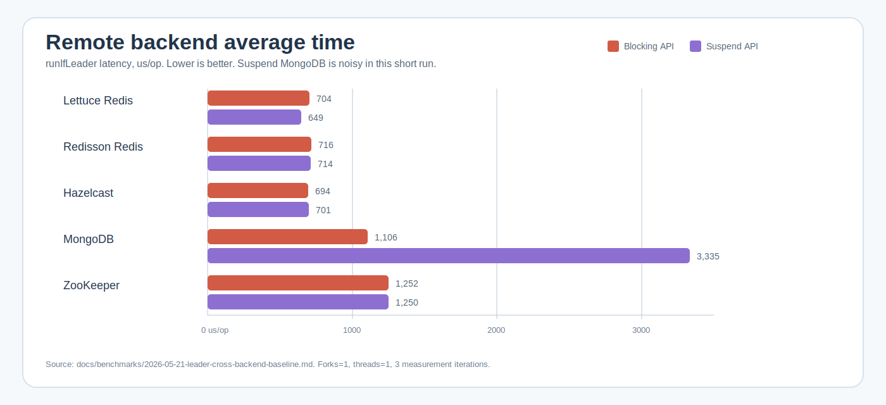

# bluetape4k-leader benchmark

[English](./README.md) | 한국어

이 non-published 모듈은 leader election backend를 같은 기준으로 비교하기
위한 `kotlinx-benchmark` suite를 담고 있습니다. JVM runner는 JMH이며,
benchmark source set은 `benchmark/src/benchmark/kotlin` 아래에 있습니다.

아래 결과는 같은 장비에서 전/후 비교를 하기 위한 기준선입니다. 릴리스급
성능 보증으로 해석하면 안 됩니다.

## Benchmark Command

```bash
./gradlew :benchmark:benchmarkBenchmark :benchmark:benchmarkAverageTimeBenchmark --no-configuration-cache --rerun-tasks
```

2026-05-21 기준선은 fork 1, thread 1, warmup 2회, 1초 measurement 3회로
측정했습니다. 전체 환경과 주의사항은
[`docs/benchmarks/2026-05-21-leader-cross-backend-baseline.md`](../docs/benchmarks/2026-05-21-leader-cross-backend-baseline.md)에
기록되어 있습니다.

## Charts

원격 backend 차트는 분산 backend 간 차이가 보이도록 local 및 H2 행을
제외했습니다.




## Cross-Backend Results

Throughput은 높을수록 좋고, average time은 낮을수록 좋습니다.

### Blocking API

| Backend | Throughput (ops/s) | Average time (us/op) | Notes |
|---|---:|---:|---|
| local | 2,204,166.553 ± 387,424.052 | 0.445 ± 0.052 | In-process 기준선 |
| exposed-jdbc-h2 | 20,138.374 ± 59,295.930 | 49.943 ± 162.508 | Local H2 SQL layer 기준선 |
| hazelcast | 1,457.277 ± 213.303 | 693.926 ± 61.127 | Testcontainers 기반 원격 backend |
| redisson | 1,354.629 ± 2,657.106 | 715.517 ± 217.899 | Testcontainers 기반 Redis backend |
| lettuce | 1,054.204 ± 11,495.384 | 703.769 ± 153.427 | Testcontainers 기반 Redis backend |
| mongo | 934.619 ± 691.550 | 1,105.806 ± 87.387 | Testcontainers 기반 원격 backend |
| zookeeper | 760.439 ± 1,079.874 | 1,252.265 ± 1,393.136 | Testcontainers 기반 원격 backend |

### Suspend API

| Backend | Throughput (ops/s) | Average time (us/op) | Notes |
|---|---:|---:|---|
| local | 793,107.864 ± 193,258.001 | 1.250 ± 0.374 | Coroutine bridge 기준선 |
| exposed-r2dbc-h2 | 6,393.060 ± 18,208.172 | 162.539 ± 440.562 | Local H2 R2DBC layer 기준선 |
| lettuce | 1,458.073 ± 240.569 | 648.530 ± 311.462 | Testcontainers 기반 Redis backend |
| redisson | 1,395.999 ± 248.707 | 713.728 ± 121.088 | Testcontainers 기반 Redis backend |
| hazelcast | 1,393.962 ± 693.802 | 701.224 ± 136.723 | Testcontainers 기반 원격 backend |
| mongo | 829.311 ± 666.735 | 3,334.853 ± 61,304.680 | 노이즈가 큰 행; tuning 전 재측정 필요 |
| zookeeper | 721.758 ± 938.116 | 1,250.279 ± 947.488 | Testcontainers 기반 원격 backend |

## Local Core Rows

| Benchmark | Throughput (ops/s) | Average time (us/op) |
|---|---:|---:|
| `LocalLeader.blockingRunIfLeader` | 2,250,949.108 ± 167,049.822 | 0.451 ± 0.263 |
| `LocalLeader.asyncOnlyRunIfLeader` | 2,230,952.540 ± 248,386.525 | 0.447 ± 0.121 |
| `LocalLeader.completableFutureRunIfLeader` | 2,231,412.162 ± 324,642.886 | 0.445 ± 0.080 |
| `LocalLeader.suspendRunIfLeader` | 838,923.760 ± 388,344.058 | 1.172 ± 0.243 |
| `LocalLeader.virtualThreadRunIfLeader` | 138,705.240 ± 7,476.129 | 7.377 ± 1.244 |
| `HistoryRecorder.blockingNoopAcquireComplete` | 7,356,503.438 ± 2,672,535.544 | 0.129 ± 0.001 |
| `HistoryRecorder.blockingInMemoryAcquireComplete` | 5,828,846.244 ± 233,849.435 | 0.171 ± 0.014 |
| `HistoryRecorder.suspendNoopAcquireComplete` | 5,300,097.780 ± 186,734.921 | 0.164 ± 0.007 |
| `HistoryRecorder.suspendInMemoryAcquireComplete` | 4,784,646.339 ± 1,302,210.407 | 0.206 ± 0.032 |

## Interpretation

- canonical ranking metric은 throughput이며 average time은 보조 latency
  evidence입니다.
- 분산 backend는 분산 backend끼리 비교하세요. Local H2 행을 Redis,
  Hazelcast, ZooKeeper, MongoDB 같은 분산 시스템 backend와 직접 순위 비교하면
  안 됩니다.
- local 행은 network/storage round trip이 없는 framework/API overhead를
  분리해서 보여줍니다.
- benchmark setup은 측정 전 smoke `runIfLeader` check를 수행하므로,
  infrastructure 연결 실패가 잘못된 빠른 경로로 측정되지 않습니다.
- 특히 suspend MongoDB처럼 노이즈가 큰 행은 최적화 판단 전에 반복 측정하세요.

## Benchmark Classes

| Class | Scenario |
|---|---|
| `BackendLeaderElectorBenchmark` | Blocking `runIfLeader`: local, Redis, Exposed JDBC H2, MongoDB, Hazelcast, ZooKeeper |
| `SuspendBackendLeaderElectorBenchmark` | Suspend `runIfLeader`: local, Redis, Exposed R2DBC H2, MongoDB, Hazelcast, ZooKeeper |
| `LocalLeaderElectorBenchmark` | Local blocking, async, completable-future, suspend, virtual-thread elector overhead |
| `HistoryRecorderBenchmark` | No-op 및 in-memory leader history recorder overhead |
