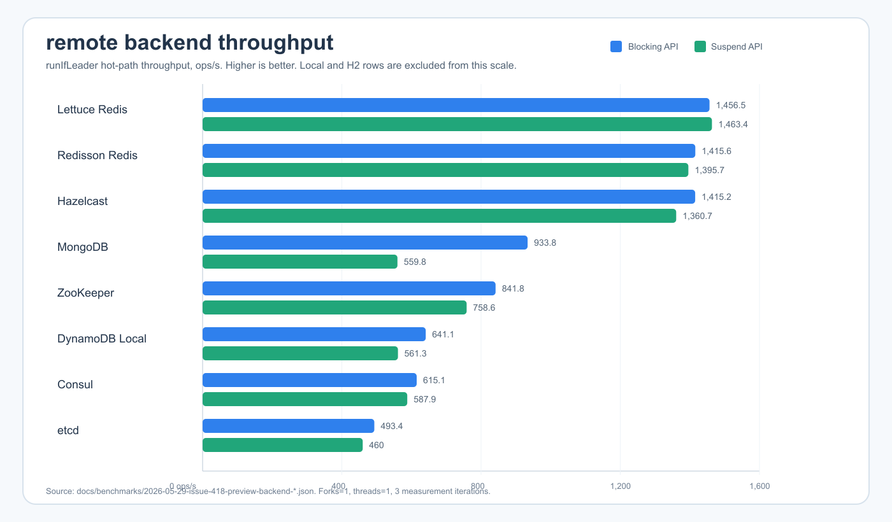
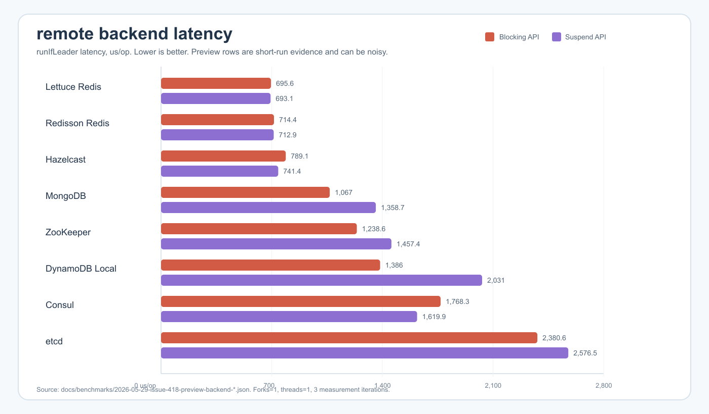

# bluetape4k-leader benchmark

[English](./README.md) | 한국어

이 non-published 모듈은 leader election backend를 같은 기준으로 비교하기
위한 `kotlinx-benchmark` suite를 담고 있습니다. JVM runner는 JMH이며,
benchmark source set은 `benchmark/src/benchmark/kotlin` 아래에 있습니다.

아래 결과는 같은 장비에서 전/후 비교를 하기 위한 기준선입니다. 릴리스급
성능 보증으로 해석하면 안 됩니다.

## Benchmark Command

```bash
./gradlew :benchmark:benchmarkBenchmark :benchmark:benchmarkAverageTimeBenchmark --no-configuration-cache --rerun-tasks
./gradlew :benchmark:kubernetesBenchmarkBenchmark :benchmark:kubernetesBenchmarkAverageTimeBenchmark --no-configuration-cache --rerun-tasks
```

2026-05-21 기준선은 fork 1, thread 1, warmup 2회, 1초 measurement 3회로
측정했습니다. 전체 환경과 주의사항은
[`docs/benchmarks/2026-05-21-leader-cross-backend-baseline.md`](../docs/benchmarks/2026-05-21-leader-cross-backend-baseline.md)에
기록되어 있습니다.

Issue #418은 2026-05-29 같은 장비에서 측정한 preview backend 행을
추가합니다. Kubernetes는 Fabric8 client가 Vert.x 4 / Netty 4.1 runtime을
필요로 하고, 기본 preview target은 etcd를 위해 Vert.x 5를 유지해야 하므로
별도 benchmark target으로 실행합니다. 원본 JSON은 다음 경로에 보존했습니다.

- [`docs/benchmarks/2026-05-29-issue-418-preview-backend-throughput.json`](../docs/benchmarks/2026-05-29-issue-418-preview-backend-throughput.json)
- [`docs/benchmarks/2026-05-29-issue-418-preview-backend-average-time.json`](../docs/benchmarks/2026-05-29-issue-418-preview-backend-average-time.json)
- [`docs/benchmarks/2026-05-29-issue-418-kubernetes-throughput.json`](../docs/benchmarks/2026-05-29-issue-418-kubernetes-throughput.json)
- [`docs/benchmarks/2026-05-29-issue-418-kubernetes-average-time.json`](../docs/benchmarks/2026-05-29-issue-418-kubernetes-average-time.json)

## Charts

원격 backend 차트는 분산 backend 간 차이가 보이도록 local 및 H2 행을
제외했습니다. Kubernetes는 별도 runtime classpath에서 실행하므로 해당 표
옆에 별도 차트를 둡니다.





Issue #329는 같은 benchmark harness로 history recorder 전/후 비교도
기록합니다.


## Latest Self-Improve Result

Issue #329는 benchmark harness를 바꾸지 않고 history recorder sanitizer의
safe fast path를 최적화했습니다. 같은 throughput command에서 local history
행은 다음처럼 개선되었습니다.

| Benchmark | Baseline (ops/s) | After (ops/s) | Delta |
|---|---:|---:|---:|
| `HistoryRecorder.blockingInMemoryAcquireComplete` | 5,601,881.043 | 20,018,125.709 | +257.35% |
| `HistoryRecorder.blockingNoopAcquireComplete` | 7,642,848.188 | 62,740,146.724 | +720.90% |
| `HistoryRecorder.suspendInMemoryAcquireComplete` | 4,843,511.108 | 11,441,889.888 | +136.23% |
| `HistoryRecorder.suspendNoopAcquireComplete` | 5,257,310.052 | 23,153,305.712 | +340.40% |

상세:
[`docs/benchmarks/2026-05-21-issue-329-leader-history-recorder-self-improve.md`](../docs/benchmarks/2026-05-21-issue-329-leader-history-recorder-self-improve.md).

## Cross-Backend Results

Throughput은 높을수록 좋고, average time은 낮을수록 좋습니다.

### Blocking API

| Backend | Throughput (ops/s) | Average time (us/op) | Notes |
|---|---:|---:|---|
| local | 2,229,094.156 ± 340,606.937 | 0.448 ± 0.066 | In-process 기준선 |
| exposed-jdbc-h2 | 20,270.340 ± 76,948.054 | 51.486 ± 184.900 | Local H2 SQL layer 기준선 |
| lettuce | 1,456.452 ± 1,105.248 | 695.602 ± 134.945 | Testcontainers 기반 Redis backend |
| redisson | 1,415.589 ± 158.353 | 714.410 ± 98.256 | Testcontainers 기반 Redis backend |
| hazelcast | 1,415.206 ± 591.033 | 789.086 ± 2,476.835 | Testcontainers 기반 원격 backend |
| mongo | 933.785 ± 111.170 | 1,066.984 ± 362.207 | Testcontainers 기반 원격 backend |
| zookeeper | 841.759 ± 502.488 | 1,238.603 ± 1,081.258 | Testcontainers 기반 원격 backend |
| dynamodb | 641.149 ± 2,605.461 | 1,385.980 ± 2,020.305 | Preview 행; DynamoDB Local |
| consul | 615.061 ± 300.998 | 1,768.272 ± 1,190.899 | Preview 행; Consul container |
| etcd | 493.380 ± 165.546 | 2,380.611 ± 1,676.741 | Preview 행; etcd container |

### Suspend API

| Backend | Throughput (ops/s) | Average time (us/op) | Notes |
|---|---:|---:|---|
| local | 925,514.252 ± 406,872.759 | 1.105 ± 0.263 | Coroutine bridge 기준선 |
| exposed-r2dbc-h2 | 6,315.028 ± 16,768.905 | 169.439 ± 427.033 | Local H2 R2DBC layer 기준선 |
| lettuce | 1,463.431 ± 676.132 | 693.089 ± 169.233 | Testcontainers 기반 Redis backend |
| redisson | 1,395.657 ± 368.895 | 712.892 ± 104.524 | Testcontainers 기반 Redis backend |
| hazelcast | 1,360.655 ± 405.288 | 741.366 ± 398.588 | Testcontainers 기반 원격 backend |
| zookeeper | 758.629 ± 913.401 | 1,457.399 ± 746.002 | Testcontainers 기반 원격 backend |
| consul | 587.939 ± 212.750 | 1,619.926 ± 1,327.587 | Preview 행; Consul container |
| dynamodb | 561.315 ± 1,195.590 | 2,031.045 ± 3,072.218 | Preview 행; DynamoDB Local |
| mongo | 559.779 ± 5,979.628 | 1,358.661 ± 1,636.852 | 노이즈가 큰 행; tuning 전 재측정 필요 |
| etcd | 459.969 ± 381.881 | 2,576.520 ± 8,028.306 | Preview 행; etcd container |

## Kubernetes Results

Kubernetes는 K3s Testcontainers wrapper를 사용하며, Fabric8 runtime이 기본
preview backend classpath를 downgrade하지 않도록 `kubernetesBenchmark`
source set에서 별도로 실행합니다.

| Benchmark | Throughput (ops/s) | Average time (us/op) | Notes |
|---|---:|---:|---|
| `Kubernetes.blockingRunIfLeader` | 171.525 ± 160.477 | 5,835.436 ± 8,251.639 | K3s 기반 Lease lock |
| `Kubernetes.suspendRunIfLeader` | 164.687 ± 57.773 | 6,075.660 ± 4,944.763 | K3s 기반 Lease lock |


## Local Core Rows

이 행들은 기존 2026-05-21 cross-backend 기준선입니다. Issue #329 이후 수치는
위 self-improve 섹션을 기준으로 보세요.

| Benchmark | Throughput (ops/s) | Average time (us/op) |
|---|---:|---:|
| `LocalLeader.blockingRunIfLeader` | 2,250,949.108 ± 167,049.822 | 0.451 ± 0.263 |
| `LocalLeader.asyncOnlyRunIfLeader` | 2,230,952.540 ± 248,386.525 | 0.447 ± 0.121 |
| `LocalLeader.completableFutureRunIfLeader` | 2,231,412.162 ± 324,642.886 | 0.445 ± 0.080 |
| `LocalLeader.suspendRunIfLeader` | 838,923.760 ± 388,344.058 | 1.172 ± 0.243 |
| `LocalLeader.virtualThreadRunIfLeader` | 138,705.240 ± 7,476.129 | 7.377 ± 1.244 |
| `HistoryRecorder.blockingNoopAcquireComplete` | 7,356,503.438 ± 2,672,535.544 | 0.129 ± 0.001 |
| `HistoryRecorder.blockingInMemoryAcquireComplete` | 5,828,846.244 ± 233,849.435 | 0.171 ± 0.014 |
| `HistoryRecorder.suspendNoopAcquireComplete` | 5,300,097.780 ± 186,734.921 | 0.164 ± 0.007 |
| `HistoryRecorder.suspendInMemoryAcquireComplete` | 4,784,646.339 ± 1,302,210.407 | 0.206 ± 0.032 |

## Interpretation

- canonical ranking metric은 throughput이며 average time은 보조 latency
  evidence입니다.
- 분산 backend는 분산 backend끼리 비교하세요. Local H2 행을 Redis,
  Hazelcast, ZooKeeper, MongoDB 같은 분산 시스템 backend와 직접 순위 비교하면
  안 됩니다.
- local 행은 network/storage round trip이 없는 framework/API overhead를
  분리해서 보여줍니다.
- benchmark setup은 측정 전 smoke `runIfLeader` check를 수행하므로,
  infrastructure 연결 실패가 잘못된 빠른 경로로 측정되지 않습니다.
- 특히 DynamoDB, etcd, Kubernetes, suspend MongoDB처럼 노이즈가 큰 행은
  최적화 판단 전에 반복 측정하세요.

## Benchmark Classes

| Class | Scenario |
|---|---|
| `BackendLeaderElectorBenchmark` | Blocking `runIfLeader`: local, Redis, Exposed JDBC H2, MongoDB, Hazelcast, ZooKeeper, Consul, etcd, DynamoDB |
| `SuspendBackendLeaderElectorBenchmark` | Suspend `runIfLeader`: local, Redis, Exposed R2DBC H2, MongoDB, Hazelcast, ZooKeeper, Consul, etcd, DynamoDB |
| `KubernetesBackendLeaderElectorBenchmark` | 별도 Vert.x 4 runtime에서 K3s 기반 Kubernetes Lease lock의 blocking/suspend `runIfLeader` 측정 |
| `LocalLeaderElectorBenchmark` | Local blocking, async, completable-future, suspend, virtual-thread elector overhead |
| `HistoryRecorderBenchmark` | No-op 및 in-memory leader history recorder overhead |
