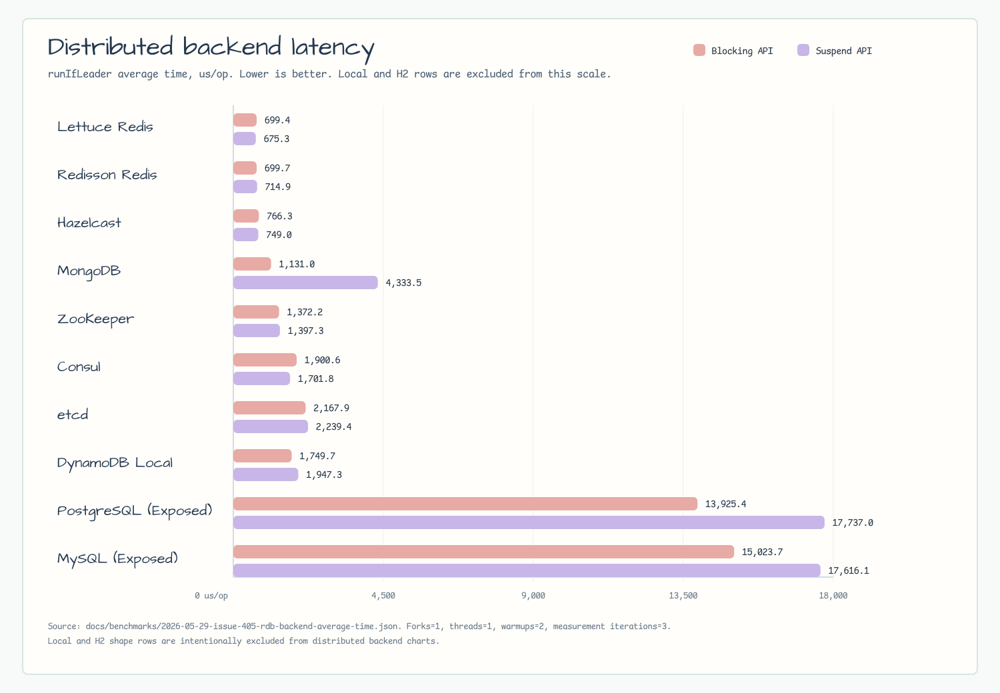
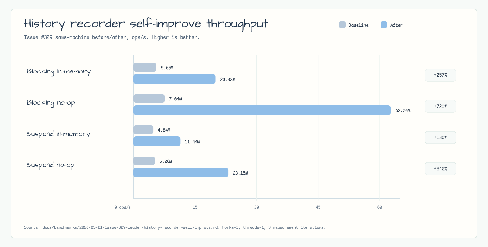
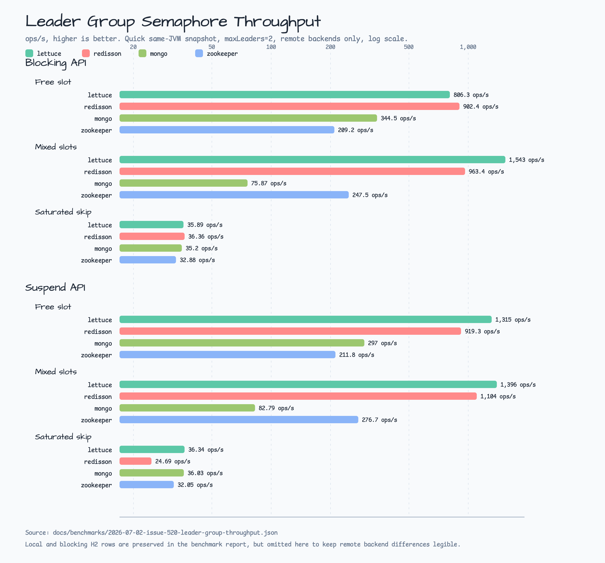
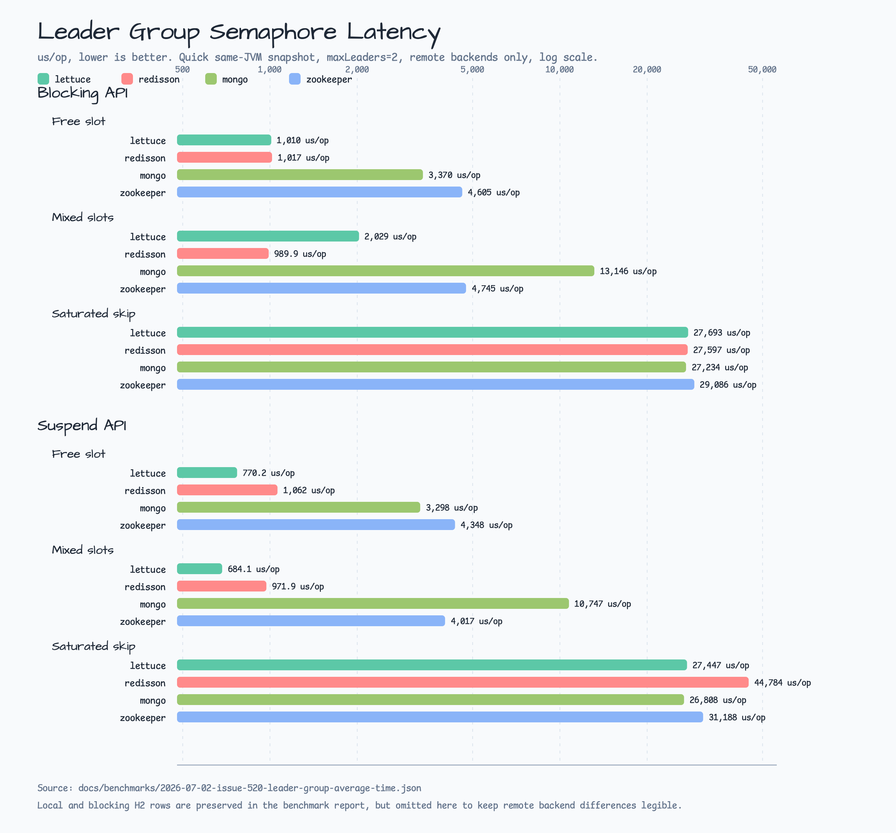
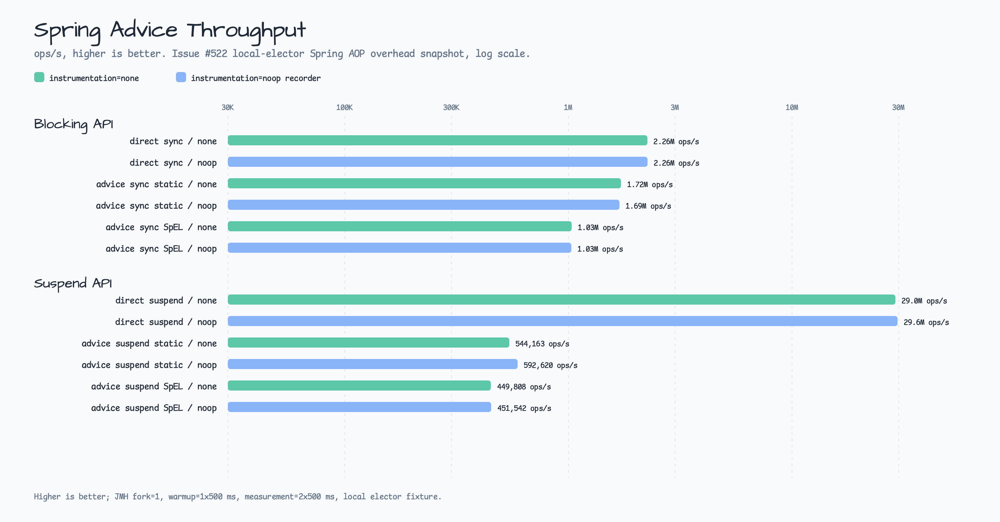
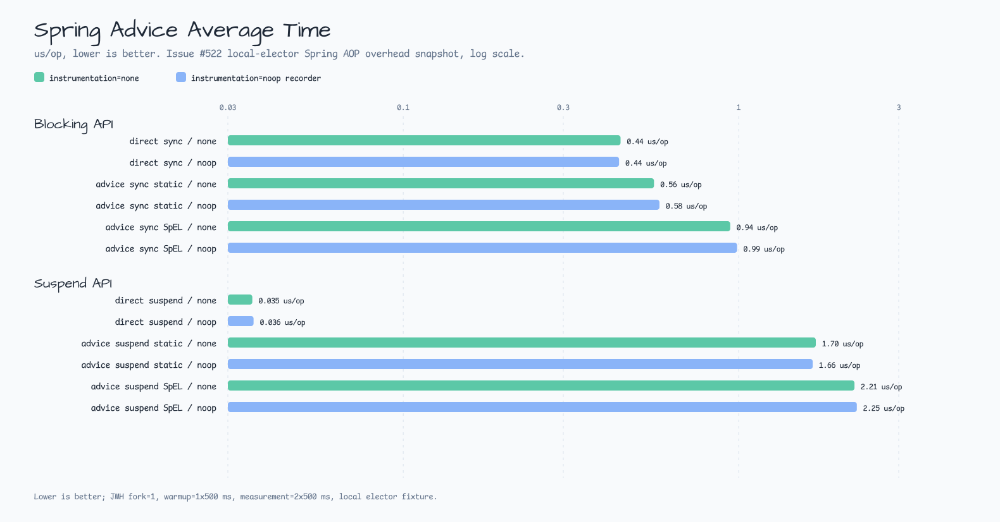
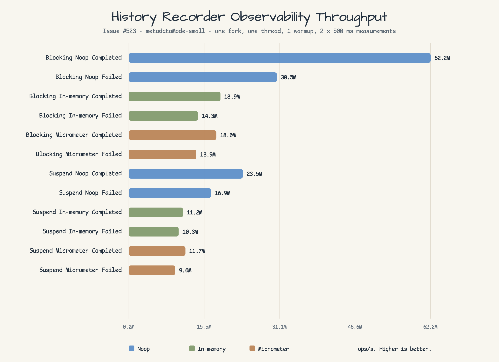
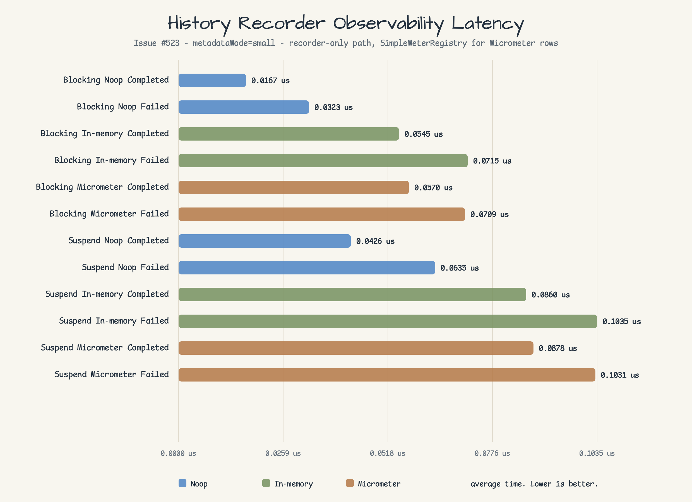
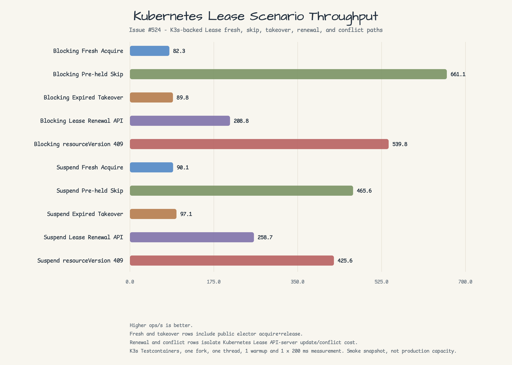
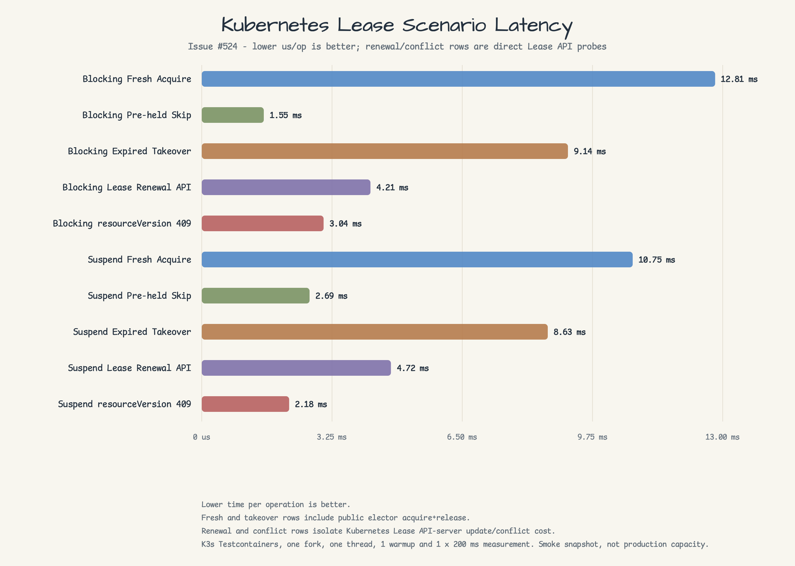

# bluetape4k-leader benchmark

[English](./README.md) | 한국어

이 non-published 모듈은 leader election backend를 같은 기준으로 비교하기
위한 `kotlinx-benchmark` suite를 담고 있습니다. JVM runner는 JMH이며,
benchmark source set은 `benchmark/src/benchmark/kotlin` 아래에 있습니다.

아래 결과는 같은 장비에서 전/후 비교를 하기 위한 기준선입니다. 릴리스급
성능 보증으로 해석하면 안 됩니다.

## Benchmark Command

```bash
./gradlew :benchmark:benchmarkBenchmark :benchmark:benchmarkAverageTimeBenchmark --no-configuration-cache --rerun-tasks
./gradlew :benchmark:kubernetesBenchmarkBenchmark :benchmark:kubernetesBenchmarkAverageTimeBenchmark --no-configuration-cache --rerun-tasks
```

2026-05-21 기준선은 fork 1, thread 1, warmup 2회, 1초 measurement 3회로
측정했습니다. 전체 환경과 주의사항은
[`docs/benchmarks/2026-05-21-leader-cross-backend-baseline.md`](../docs/benchmarks/2026-05-21-leader-cross-backend-baseline.md)에
기록되어 있습니다.

Issue #405는 2026-05-29 같은 장비에서 측정한 PostgreSQL 및 MySQL 행을
추가합니다. Blocking SQL 행은 Exposed JDBC를 사용하고, suspend SQL 행은
Exposed R2DBC를 사용합니다. Kubernetes는 Fabric8 client가 Vert.x 4 /
Netty 4.1 runtime을 필요로 하고, 기본 target은 etcd를 위해 Vert.x 5를
유지해야 하므로 별도 benchmark target으로 실행합니다. 원본 JSON은 다음
경로에 보존했습니다.

- [`docs/benchmarks/2026-05-29-issue-405-rdb-backend-throughput.json`](../docs/benchmarks/2026-05-29-issue-405-rdb-backend-throughput.json)
- [`docs/benchmarks/2026-05-29-issue-405-rdb-backend-average-time.json`](../docs/benchmarks/2026-05-29-issue-405-rdb-backend-average-time.json)
- [`docs/benchmarks/2026-05-29-issue-418-kubernetes-throughput.json`](../docs/benchmarks/2026-05-29-issue-418-kubernetes-throughput.json)
- [`docs/benchmarks/2026-05-29-issue-418-kubernetes-average-time.json`](../docs/benchmarks/2026-05-29-issue-418-kubernetes-average-time.json)

Issue #422는 2026-06-01 같은 장비에서 측정한 Redis lease-extension 전용 행을
추가합니다. 이 행들은 Lettuce와 Redisson의 일반 실행을 shared `autoExtend`
lease extender와 비교합니다. 현재 Redisson elector는 항상 명시적 `leaseTime`을
전달하므로 Redisson native watchdog mode는 측정 대상에 포함하지 않았습니다.
원본 JSON은 다음 경로에 보존했습니다.

- [`docs/benchmarks/2026-06-01-issue-422-redis-lease-extension-throughput.json`](../docs/benchmarks/2026-06-01-issue-422-redis-lease-extension-throughput.json)
- [`docs/benchmarks/2026-06-01-issue-422-redis-lease-extension-average-time.json`](../docs/benchmarks/2026-06-01-issue-422-redis-lease-extension-average-time.json)

Issue #427는 2026-06-05 같은 장비에서 측정한 Local 및 MongoDB `autoExtend`
전용 행을 추가합니다. 이 행들은 Redis benchmark의 quick/renewal-window
구성을 재사용하지만, Redis 자체는 #422 선행 근거로 유지합니다. 원본 JSON과
판단 기록은
[`docs/benchmarks/2026-06-05-issue-427-autoextend-backends.md`](../docs/benchmarks/2026-06-05-issue-427-autoextend-backends.md)에
보존했습니다.

Issue #414는 2026-06-05 같은 장비에서 노이즈가 컸던 suspend MongoDB
`runIfLeader` 행을 Lettuce, Redisson, Hazelcast와 함께 반복 측정했습니다.
기존과 같은 fork 1, thread 1, warmup 2회, measurement 3회 구성을 유지했고,
MongoDB가 더 느리지만 짧은 측정 창에서는 좁은 tuning target으로 삼기에는
여전히 노이즈가 크다는 점을 확인했습니다. 원본 JSON과 판단 기록은
[`docs/benchmarks/2026-06-05-issue-414-mongodb-suspend-repeat.md`](../docs/benchmarks/2026-06-05-issue-414-mongodb-suspend-repeat.md)에
보존했습니다.

Issue #520는 `maxLeaders` 1, 2, 8 기준 group-semaphore benchmark 행을
추가합니다. free-slot, saturated-skip, mixed-slot, active-count, state
snapshot 경로를 함께 측정합니다. README 차트 snapshot은 `maxLeaders=2`와
짧은 same-JVM 측정 창을 사용해 전체 release-grade 실행 없이 grouped backend
형태를 확인하기 위한 자료입니다. 원본 JSON과 전체 결과 표는
[`docs/benchmarks/2026-07-02-issue-520-leader-group-benchmarks.md`](../docs/benchmarks/2026-07-02-issue-520-leader-group-benchmarks.md)에
보존했습니다.

Issue #521은 single-leader elector의 contention 및 skip-path benchmark 행을
추가합니다. 기존 holder가 있을 때의 skip, N개 contender 병렬 경로, mixed
acquire/skip 경로를 blocking 및 suspend API별로 나눠 측정합니다. README
차트 snapshot은 `contenders=8`과 짧은 same-JVM 측정 창을 사용합니다. 원본
JSON, 실행 command, 차트, 전체 결과 표는
[`docs/benchmarks/2026-07-02-issue-521-contention-benchmarks.md`](../docs/benchmarks/2026-07-02-issue-521-contention-benchmarks.md)에
보존했습니다.

Issue #522는 Spring `@LeaderElection` advice overhead 행을 추가합니다. Direct
local elector 호출과 Spring aspect 경로를 비교하고, static lock name과
SpEL-derived lock name을 분리하며, blocking 및 suspend method를 no recorder와
no-op recorder 설정으로 측정합니다. 원본 JSON, 실행 command, 차트, 해석은
[`docs/benchmarks/2026-07-02-issue-522-spring-advice-benchmarks.md`](../docs/benchmarks/2026-07-02-issue-522-spring-advice-benchmarks.md)에
보존했습니다.

Issue #523는 history recorder observability 행을 추가합니다. No-op, in-memory,
Micrometer wrapper recorder를 비교하고, completed와 failed terminal state를
분리하며, `empty`, `small`, `large` metadata mode를 실행합니다. 원본 JSON,
차트, 해석은
[`docs/benchmarks/2026-07-02-issue-523-history-recorder-observability.md`](../docs/benchmarks/2026-07-02-issue-523-history-recorder-observability.md)에
보존했습니다.

## Charts

분산 환경 backend 차트는 infrastructure backend 간 차이가 보이도록 local
및 H2 행을 제외했습니다. Kubernetes는 별도 runtime classpath에서 실행하므로
해당 표 옆에 별도 차트를 둡니다.




Issue #329는 같은 benchmark harness로 history recorder 전/후 비교도
기록합니다.



## Latest Self-Improve Result

Issue #329는 benchmark harness를 바꾸지 않고 history recorder sanitizer의
safe fast path를 최적화했습니다. 같은 throughput command에서 local history
행은 다음처럼 개선되었습니다.

| Benchmark | Baseline (ops/s) | After (ops/s) | Delta |
|---|---:|---:|---:|
| `HistoryRecorder.blockingInMemoryAcquireComplete` | 5,601,881.043 | 20,018,125.709 | +257.35% |
| `HistoryRecorder.blockingNoopAcquireComplete` | 7,642,848.188 | 62,740,146.724 | +720.90% |
| `HistoryRecorder.suspendInMemoryAcquireComplete` | 4,843,511.108 | 11,441,889.888 | +136.23% |
| `HistoryRecorder.suspendNoopAcquireComplete` | 5,257,310.052 | 23,153,305.712 | +340.40% |

상세:
[`docs/benchmarks/2026-05-21-issue-329-leader-history-recorder-self-improve.md`](../docs/benchmarks/2026-05-21-issue-329-leader-history-recorder-self-improve.md).

## Cross-Backend Results

Throughput은 높을수록 좋고, average time은 낮을수록 좋습니다.

## Leader Group Semaphore Results

Throughput은 높을수록 좋고, average time은 낮을수록 좋습니다. 이 행들은
issue #520의 remote-backend `maxLeaders=2` chart snapshot입니다. Local 및
blocking H2 행은 README 표 대신 전체 benchmark report에 보존했습니다.

Issue #520 group-semaphore 차트도 local 및 blocking H2 행을 제외하고 log
scale을 사용합니다. free-slot, mixed-slot, saturated-skip 경로의 규모 차이가
커서 분산 backend 비교가 묻히지 않게 하기 위함입니다.





| API | Scenario | Backend | Throughput (ops/s) | Average time (us/op) |
|---|---|---|---:|---:|
| Blocking | Free slot | lettuce | 806.3 | 1,010 |
| Blocking | Free slot | redisson | 902.4 | 1,017 |
| Blocking | Free slot | mongo | 344.5 | 3,370 |
| Blocking | Free slot | zookeeper | 209.2 | 4,605 |
| Blocking | Mixed slots | lettuce | 1,543 | 2,029 |
| Blocking | Mixed slots | redisson | 963.4 | 989.9 |
| Blocking | Mixed slots | mongo | 75.87 | 13,146 |
| Blocking | Mixed slots | zookeeper | 247.5 | 4,745 |
| Blocking | Saturated skip | lettuce | 35.89 | 27,693 |
| Blocking | Saturated skip | redisson | 36.36 | 27,597 |
| Blocking | Saturated skip | mongo | 35.2 | 27,234 |
| Blocking | Saturated skip | zookeeper | 32.88 | 29,086 |
| Suspend | Free slot | lettuce | 1,315 | 770.2 |
| Suspend | Free slot | redisson | 919.3 | 1,062 |
| Suspend | Free slot | mongo | 297 | 3,298 |
| Suspend | Free slot | zookeeper | 211.8 | 4,348 |
| Suspend | Mixed slots | lettuce | 1,396 | 684.1 |
| Suspend | Mixed slots | redisson | 1,104 | 971.9 |
| Suspend | Mixed slots | mongo | 82.79 | 10,747 |
| Suspend | Mixed slots | zookeeper | 276.7 | 4,017 |
| Suspend | Saturated skip | lettuce | 36.34 | 27,447 |
| Suspend | Saturated skip | redisson | 24.69 | 44,784 |
| Suspend | Saturated skip | mongo | 36.03 | 26,808 |
| Suspend | Saturated skip | zookeeper | 32.05 | 31,188 |

### 해석

이 결과는 warmup 없이 fork 1, 200 ms measurement 1회로 빠르게 측정한
same-JVM `maxLeaders=2` snapshot입니다. Backend의 상대적인 모양과
group-semaphore 경로의 smoke 검증에는 유용하지만, release-grade 순위표로
해석하면 안 됩니다.

Free-slot 행은 group에 여유 slot이 있을 때의 acquire 경로를 측정합니다.
Mixed-slot 행은 `maxLeaders - 1`개 slot을 미리 점유한 상태에서 마지막 남은
slot을 획득하는 경로입니다. Saturated-skip 행은 더 이상 slot이 없을 때
설정된 wait 경로를 측정합니다.

Local 및 blocking H2 행은 전체 report에 보존했지만 README 표와 차트에서는
제외했습니다. 이 행들은 framework 또는 storage 형태의 기준선이라 함께
보여주면 remote backend 간 규모가 눌려 보입니다. Saturated-skip 행은 대략
25 ms wait window당 한 번의 operation으로 모이기 때문에, 이 구간에서는
backend 차이보다 wait 정책이 결과를 지배합니다.

이 짧은 실행에서는 Lettuce와 Redisson이 대부분의 remote free-slot 및
mixed-slot 행에서 앞섭니다. MongoDB는 특히 mixed-slot 행에서 더 느리고
노이즈가 큽니다. ZooKeeper는 비교적 일관적이지만 Redis backend보다
free-slot latency가 큽니다. Log-scale 차트는 훨씬 빠른 free-slot 및
mixed-slot 경로 옆에서도 saturated 행을 읽을 수 있게 하기 위한 선택입니다.

전체 report와 원본 데이터:

- [`docs/benchmarks/2026-07-02-issue-520-leader-group-benchmarks.md`](../docs/benchmarks/2026-07-02-issue-520-leader-group-benchmarks.md)
- [`docs/benchmarks/2026-07-02-issue-520-leader-group-throughput.json`](../docs/benchmarks/2026-07-02-issue-520-leader-group-throughput.json)
- [`docs/benchmarks/2026-07-02-issue-520-leader-group-average-time.json`](../docs/benchmarks/2026-07-02-issue-520-leader-group-average-time.json)

## Leader Contention Results

Throughput은 높을수록 좋고, average time은 낮을수록 좋습니다. 이 행들은
issue #521의 `contenders=8` chart snapshot입니다. Immediate local skip,
remote immediate skip, positive-wait contention 경로의 규모 차이가 커서 두
차트 모두 log scale을 사용합니다.


| API | Scenario | Backend | Throughput (ops/s) | Average time (us/op) |
|---|---|---|---:|---:|
| Blocking | Skip held / wait 0 | local | 18,457,123 | 0.056 |
| Blocking | Skip held / wait 0 | lettuce | 2,307 | 511.16 |
| Blocking | Skip held / wait 0 | redisson | 2,993 | 357.93 |
| Blocking | Skip held / wait 0 | mongo | 1,210 | 844.57 |
| Blocking | Skip held / wait 0 | zookeeper | 323.93 | 2,296 |
| Blocking | Skip held / wait 25 ms | local | 38.47 | 26,109 |
| Blocking | Skip held / wait 25 ms | lettuce | 38.5 | 26,058 |
| Blocking | Skip held / wait 25 ms | redisson | 37.9 | 25,976 |
| Blocking | Skip held / wait 25 ms | mongo | 38.83 | 25,626 |
| Blocking | Skip held / wait 25 ms | zookeeper | 30.38 | 32,747 |
| Blocking | Parallel / wait 0 | lettuce | 362.43 | 2,932 |
| Blocking | Parallel / wait 0 | redisson | 350 | 2,846 |
| Blocking | Parallel / wait 0 | mongo | 158.84 | 6,458 |
| Blocking | Parallel / wait 0 | zookeeper | 41.87 | 17,101 |
| Blocking | Parallel / wait 25 ms | local | 37.08 | 27,066 |
| Blocking | Parallel / wait 25 ms | lettuce | 34.51 | 30,093 |
| Blocking | Parallel / wait 25 ms | redisson | 35.04 | 30,112 |
| Blocking | Parallel / wait 25 ms | mongo | 28.04 | 33,632 |
| Blocking | Parallel / wait 25 ms | zookeeper | 31.08 | 35,607 |
| Blocking | Mixed acquire + skip | local | 37.54 | 26,720 |
| Blocking | Mixed acquire + skip | lettuce | 33.44 | 34,213 |
| Blocking | Mixed acquire + skip | redisson | 34.35 | 31,610 |
| Blocking | Mixed acquire + skip | mongo | 32.81 | 33,646 |
| Blocking | Mixed acquire + skip | zookeeper | 24.67 | 36,621 |
| Suspend | Skip held / wait 0 | lettuce | 2,381 | 612.83 |
| Suspend | Skip held / wait 0 | redisson | 2,557 | 467.89 |
| Suspend | Skip held / wait 0 | mongo | 1,170 | 1,126 |
| Suspend | Skip held / wait 0 | zookeeper | 406.58 | 2,788 |
| Suspend | Skip held / wait 25 ms | local | 38.76 | 26,341 |
| Suspend | Skip held / wait 25 ms | lettuce | 38.45 | 25,710 |
| Suspend | Skip held / wait 25 ms | redisson | 22.11 | 30,111 |
| Suspend | Skip held / wait 25 ms | mongo | 37 | 27,206 |
| Suspend | Skip held / wait 25 ms | zookeeper | 34.69 | 33,887 |
| Suspend | Parallel / wait 25 ms | local | 35.57 | 27,552 |
| Suspend | Parallel / wait 25 ms | lettuce | 32.96 | 29,658 |
| Suspend | Parallel / wait 25 ms | redisson | 29.48 | 37,131 |
| Suspend | Parallel / wait 25 ms | mongo | 28.67 | 33,180 |
| Suspend | Parallel / wait 25 ms | zookeeper | 30.94 | 33,493 |
| Suspend | Mixed acquire + skip | local | 37.63 | 26,499 |
| Suspend | Mixed acquire + skip | lettuce | 32.43 | 30,257 |
| Suspend | Mixed acquire + skip | redisson | 22.62 | 44,968 |
| Suspend | Mixed acquire + skip | mongo | 28.02 | 35,939 |
| Suspend | Mixed acquire + skip | zookeeper | 22.29 | 46,421 |

### 해석

이 결과는 warmup 없이 fork 0, 100 ms measurement 1회로 빠르게 측정한
same-JVM snapshot입니다. Backend의 상대적인 모양과 contention 경로 smoke
검증에는 유용하지만, release-grade 순위표로 해석하면 안 됩니다.

Existing-holder setup은 skip 결과에서 action body가 실행되지 않는지 먼저
검증합니다. 따라서 immediate skip 행은 이미 lock이 잡힌 상태를 감지하고
`LeaderRunResult.Skipped`를 반환하는 비용을 측정합니다. Local blocking 행은
in-process 상태 확인이라 remote backend보다 의도적으로 훨씬 빠릅니다. 이
짧은 실행의 remote immediate skip 행에서는 Redisson과 Lettuce가 앞서고,
MongoDB는 중간, ZooKeeper는 coordination 비용이 가장 크게 나타났습니다.

Positive-wait 행은 대략 25 ms wait window당 한 번의 operation으로 모입니다.
설정된 wait 정책이 측정을 지배하기 때문에 backend 차이는 눌려 보입니다. 이
행들은 backend 순위표라기보다 skip behavior, wait handling, state cleanup을
확인하는 regression smoke check로 보는 편이 맞습니다.

Parallel `waitTime=0` 행은 blocking remote/shared benchmark에만 있습니다.
Local suspend 구현은 `withTimeoutOrNull(0)`를 사용하므로 immediate free
acquire가 의미 있는 contention을 측정하기 전에 timeout될 수 있습니다. 그래서
suspend local baseline은 positive-wait 및 mixed 행만 유지하고, remote suspend
immediate skip은 held-lock scenario로 검증합니다.

전체 report와 원본 데이터:

- [`docs/benchmarks/2026-07-02-issue-521-contention-benchmarks.md`](../docs/benchmarks/2026-07-02-issue-521-contention-benchmarks.md)
- [`docs/benchmarks/2026-07-02-issue-521-contention-remote-throughput.json`](../docs/benchmarks/2026-07-02-issue-521-contention-remote-throughput.json)
- [`docs/benchmarks/2026-07-02-issue-521-contention-remote-average-time.json`](../docs/benchmarks/2026-07-02-issue-521-contention-remote-average-time.json)
- [`docs/benchmarks/2026-07-02-issue-521-contention-local-throughput.json`](../docs/benchmarks/2026-07-02-issue-521-contention-local-throughput.json)
- [`docs/benchmarks/2026-07-02-issue-521-contention-local-average-time.json`](../docs/benchmarks/2026-07-02-issue-521-contention-local-average-time.json)

## Leader Spring Advice Results

Throughput은 높을수록 좋고, average time은 낮을수록 좋습니다. Issue #522의 이
행들은 backend I/O가 Spring advice overhead를 가리지 않도록 local elector를
사용합니다. Direct suspend, direct blocking, static advice, SpEL advice의 규모
차이가 한 자릿수 이상 벌어져 두 차트 모두 log scale을 사용합니다.





| Benchmark | Instrumentation | Throughput (ops/s) | Average time (us/op) |
|---|---:|---:|---:|
| direct sync | none | 2,255,925 | 0.44 |
| direct sync | noop | 2,258,324 | 0.44 |
| advice sync static | none | 1,718,542 | 0.56 |
| advice sync static | noop | 1,691,326 | 0.58 |
| advice sync SpEL | none | 1,034,113 | 0.94 |
| advice sync SpEL | noop | 1,030,415 | 0.99 |
| direct suspend | none | 28,987,468 | 0.035 |
| direct suspend | noop | 29,639,156 | 0.036 |
| advice suspend static | none | 544,163 | 1.70 |
| advice suspend static | noop | 592,620 | 1.66 |
| advice suspend SpEL | none | 449,808 | 2.21 |
| advice suspend SpEL | noop | 451,542 | 2.25 |

### 해석

Blocking static-name advice 경로는 절대값 기준으로 direct local elector 기준선과
가깝습니다. 이 짧은 실행에서는 direct blocking이 0.44 us/op, static advice가
약 0.56 us/op로 측정되었습니다. SpEL 행은 method argument를 기준으로 lock-name
expression을 매번 평가하기 때문에 더 느립니다.

Suspend direct baseline은 local fixture에서 의도적으로 매우 작기 때문에 Spring
advice와의 상대 차이는 크게 보입니다. 더 유용한 신호는 절대 advice 비용입니다.
Static suspend advice는 약 1.7 us/op, SpEL suspend advice는 약 2.2 us/op입니다.
실제 Redis, MongoDB, ZooKeeper, Kubernetes, JDBC lock 주변에서는 보통 backend
coordination 비용이 이 local framework 비용보다 큽니다.

`instrumentation=noop`는 no-op AOP metrics recorder를 설치합니다. 여기서는 전체
형태를 실질적으로 바꾸지 않았고, 작은 차이는 짧은 JMH 실행의 noise 범위로 봐야
합니다. Real Micrometer registry overhead는 별도 benchmark 주제로 남겨, 이
섹션은 advice dispatch와 expression evaluation에 집중합니다.

전체 report와 원본 데이터:

- [`docs/benchmarks/2026-07-02-issue-522-spring-advice-benchmarks.md`](../docs/benchmarks/2026-07-02-issue-522-spring-advice-benchmarks.md)
- [`docs/benchmarks/2026-07-02-issue-522-spring-advice-throughput.json`](../docs/benchmarks/2026-07-02-issue-522-spring-advice-throughput.json)
- [`docs/benchmarks/2026-07-02-issue-522-spring-advice-average-time.json`](../docs/benchmarks/2026-07-02-issue-522-spring-advice-average-time.json)

## Leader History Observability Results

Throughput은 높을수록 좋고, average time은 낮을수록 좋습니다. Issue #523의 이
행들은 recorder-only 행이며 README 표와 차트는 `metadataMode=small` snapshot을
사용합니다. 전체 report와 원본 JSON에는 `empty`, `small`, `large` metadata
mode가 모두 들어 있습니다.





| API | Recorder | Terminal | Metadata | Throughput (ops/s) | Average time (us/op) |
|---|---|---|---|---:|---:|
| Blocking | Noop | Completed | small | 62,153,981 | 0.0167 |
| Blocking | Noop | Failed | small | 30,506,848 | 0.0323 |
| Blocking | In-memory | Completed | small | 18,875,312 | 0.0545 |
| Blocking | In-memory | Failed | small | 14,255,133 | 0.0715 |
| Blocking | Micrometer | Completed | small | 18,031,147 | 0.0570 |
| Blocking | Micrometer | Failed | small | 13,910,688 | 0.0709 |
| Suspend | Noop | Completed | small | 23,477,969 | 0.0426 |
| Suspend | Noop | Failed | small | 16,906,301 | 0.0635 |
| Suspend | In-memory | Completed | small | 11,173,330 | 0.0860 |
| Suspend | In-memory | Failed | small | 10,270,385 | 0.1035 |
| Suspend | Micrometer | Completed | small | 11,671,342 | 0.0878 |
| Suspend | Micrometer | Failed | small | 9,551,932 | 0.1031 |

### 해석

Small metadata 행에서는 Micrometer wrapper가 completed event 기준으로 in-memory
recorder와 가깝게 나타납니다. 이 짧은 실행에서 blocking completed 행은
in-memory 18.9M ops/s, Micrometer 18.0M ops/s였고, suspend completed 행은 각각
11.2M ops/s와 11.7M ops/s였습니다. Suspend 행의 작은 역전은 throughput 장점이
아니라 짧은 실행의 noise로 봐야 합니다.

Failure 행은 `recordFailed`가 exception metadata를 추출하고 sanitize하기 때문에
completed 행보다 느립니다. 더 큰 요인은 metadata 크기입니다. 전체 report에서는
no-op blocking completed 행도 empty metadata 0.0026 us/op에서 large metadata
0.2205 us/op로 증가합니다. Sink I/O가 없어도 recorder sanitizer 비용이 먼저
보이는 것입니다.

이 행들은 Spring advice나 backend lock acquisition overhead를 포함하지 않습니다.
Spring advice dispatch 비용은 issue #522를, skipped 또는 not-elected behavior는
issue #521을 참고하세요. 이 benchmark는 `SimpleMeterRegistry`를 사용하며,
external metric backend, exporter, scrape/push 비용은 이 local snapshot 범위
밖입니다.

전체 report와 원본 데이터:

- [`docs/benchmarks/2026-07-02-issue-523-history-recorder-observability.md`](../docs/benchmarks/2026-07-02-issue-523-history-recorder-observability.md)
- [`docs/benchmarks/2026-07-02-issue-523-history-recorder-throughput.json`](../docs/benchmarks/2026-07-02-issue-523-history-recorder-throughput.json)
- [`docs/benchmarks/2026-07-02-issue-523-history-recorder-average-time.json`](../docs/benchmarks/2026-07-02-issue-523-history-recorder-average-time.json)

## Redis Lease Extension Results

Throughput은 높을수록 좋고, average time은 낮을수록 좋습니다.

일반 `runIfLeader` 행은 60초 lease와 빠른 action으로 일반 실행과
`autoExtend` 활성화 overhead를 비교합니다. `runIfLeaderWithRenewalWindow`
행은 90ms lease와 45ms action dwell을 사용해 auto-extension path가 renewal
window를 갖도록 했습니다. 이 행들은 dwell 시간이 지배적이므로 같은 method
안에서만 비교하세요.

`redisson-auto-extend`는 Redisson native watchdog renewal이 아니라
bluetape4k의 shared `LeaderLeaseAutoExtender`를 사용합니다. 관측 차이는 넓은
JMH error bound 안에 있으므로, 이 수치만으로 production 최적화를 정당화하지
않습니다.

### Blocking Redis API

| Scenario | Mode | Throughput (ops/s) | Average time (us/op) | Notes |
|---|---|---:|---:|---|
| `runIfLeader` | lettuce-normal | 1,454.484 ± 812.222 | 696.879 ± 261.682 | 60s lease, 빠른 action |
| `runIfLeader` | lettuce-auto-extend | 1,432.206 ± 673.228 | 674.570 ± 76.338 | Shared auto extender 활성화 |
| `runIfLeader` | redisson-normal | 1,392.344 ± 156.055 | 721.043 ± 46.545 | 60s lease, 빠른 action |
| `runIfLeader` | redisson-auto-extend | 1,379.041 ± 380.447 | 739.360 ± 42.259 | Shared auto extender, native watchdog 아님 |
| `runIfLeaderWithRenewalWindow` | lettuce-normal | 18.858 ± 2.142 | 52,787.594 ± 13,078.335 | 90ms lease, 45ms action dwell |
| `runIfLeaderWithRenewalWindow` | lettuce-auto-extend | 19.191 ± 3.072 | 52,012.788 ± 14,742.520 | Renewal-window 비교 행 |
| `runIfLeaderWithRenewalWindow` | redisson-normal | 18.540 ± 4.514 | 52,495.646 ± 13,993.629 | 90ms lease, 45ms action dwell |
| `runIfLeaderWithRenewalWindow` | redisson-auto-extend | 19.150 ± 6.465 | 51,782.799 ± 5,184.910 | Shared auto extender, native watchdog 아님 |

### Suspend Redis API

| Scenario | Mode | Throughput (ops/s) | Average time (us/op) | Notes |
|---|---|---:|---:|---|
| `runIfLeader` | lettuce-normal | 1,442.249 ± 772.451 | 668.478 ± 280.073 | 60s lease, 빠른 action |
| `runIfLeader` | lettuce-auto-extend | 1,413.118 ± 434.324 | 693.538 ± 206.127 | Shared auto extender 활성화 |
| `runIfLeader` | redisson-normal | 1,382.143 ± 173.134 | 718.507 ± 233.162 | 60s lease, 빠른 action |
| `runIfLeader` | redisson-auto-extend | 1,363.848 ± 134.125 | 728.479 ± 177.469 | Shared auto extender, native watchdog 아님 |
| `runIfLeaderWithRenewalWindow` | lettuce-normal | 18.757 ± 6.519 | 53,820.084 ± 30,715.585 | 90ms lease, 45ms action dwell |
| `runIfLeaderWithRenewalWindow` | lettuce-auto-extend | 18.876 ± 0.844 | 52,182.685 ± 17,376.505 | Renewal-window 비교 행 |
| `runIfLeaderWithRenewalWindow` | redisson-normal | 18.603 ± 7.860 | 53,558.941 ± 19,665.787 | 90ms lease, 45ms action dwell |
| `runIfLeaderWithRenewalWindow` | redisson-auto-extend | 19.214 ± 8.932 | 51,883.433 ± 6,959.355 | Shared auto extender, native watchdog 아님 |

## Local and MongoDB Auto-Extension Results

Throughput은 높을수록 좋고, average time은 낮을수록 좋습니다.

Issue #427는 #422 Redis 행으로 이미 덮인 부분을 제외하고, README가 지원한다고
문서화한 단일 리더 `autoExtend` backend 중 Local과 MongoDB를 측정합니다.
Group election auto-extension은 아직 지원하지 않으며, 문서화되지 않은 backend
조합은 이번 benchmark 범위 밖에 둡니다.

`runIfLeader` 행은 60초 lease와 빠른 action을 사용합니다.
`runIfLeaderWithRenewalWindow` 행은 90ms lease와 45ms action dwell을
사용하므로 같은 method 안에서만 비교하세요.

### Blocking Local and MongoDB API

| Scenario | Mode | Throughput (ops/s) | Average time (us/op) | Notes |
|---|---|---:|---:|---|
| `runIfLeader` | local-normal | 2,395,400.193 ± 501,076.856 | 0.426 ± 0.219 | 60s lease, 빠른 action |
| `runIfLeader` | local-auto-extend | 805,517.783 ± 1,278,895.802 | 1.237 ± 2.269 | Shared watchdog start/close overhead 확인 |
| `runIfLeader` | mongo-normal | 971.090 ± 544.247 | 5,774.991 ± 28,639.740 | MongoDB Testcontainer |
| `runIfLeader` | mongo-auto-extend | 692.798 ± 749.379 | 2,569.192 ± 33,179.484 | Tuning 근거로 삼기에는 error bound가 큼 |
| `runIfLeaderWithRenewalWindow` | local-normal | 21.511 ± 0.547 | 46,273.157 ± 1,105.062 | 90ms lease, 45ms action dwell |
| `runIfLeaderWithRenewalWindow` | local-auto-extend | 21.577 ± 3.122 | 46,154.705 ± 2,389.850 | Dwell 시간이 지배적 |
| `runIfLeaderWithRenewalWindow` | mongo-normal | 16.198 ± 2.870 | 57,592.652 ± 14,277.831 | 90ms lease, 45ms action dwell |
| `runIfLeaderWithRenewalWindow` | mongo-auto-extend | 16.552 ± 15.388 | 55,941.229 ± 16,045.389 | Error bound가 normal 행과 겹침 |

### Suspend Local and MongoDB API

| Scenario | Mode | Throughput (ops/s) | Average time (us/op) | Notes |
|---|---|---:|---:|---|
| `runIfLeader` | local-normal | 868,702.969 ± 143,615.007 | 1.168 ± 0.429 | Coroutine local 기준선 |
| `runIfLeader` | local-auto-extend | 388,941.209 ± 188,261.017 | 2.549 ± 1.169 | Shared watchdog start/close overhead 확인 |
| `runIfLeader` | mongo-normal | 171.671 ± 496.698 | 6,693.307 ± 15,305.281 | 노이즈가 큰 MongoDB suspend 행 |
| `runIfLeader` | mongo-auto-extend | 240.190 ± 2,241.840 | 5,954.376 ± 37,242.530 | Tuning 근거로 삼기에는 error bound가 큼 |
| `runIfLeaderWithRenewalWindow` | local-normal | 21.496 ± 0.945 | 46,579.372 ± 1,339.338 | 90ms lease, 45ms action dwell |
| `runIfLeaderWithRenewalWindow` | local-auto-extend | 21.502 ± 2.185 | 46,742.978 ± 4,988.328 | Dwell 시간이 지배적 |
| `runIfLeaderWithRenewalWindow` | mongo-normal | 17.352 ± 8.027 | 61,080.897 ± 22,853.647 | 90ms lease, 45ms action dwell |
| `runIfLeaderWithRenewalWindow` | mongo-auto-extend | 17.678 ± 5.739 | 55,882.592 ± 11,014.145 | Error bound가 normal 행과 겹침 |

### Blocking API

| Backend | Throughput (ops/s) | Average time (us/op) | Notes |
|---|---:|---:|---|
| local | 2,247,218.689 ± 258,773.085 | 0.467 ± 0.019 | In-process 기준선 |
| exposed-jdbc-h2 | 20,691.932 ± 63,884.249 | 51.079 ± 160.765 | Local H2 SQL layer 기준선 |
| hazelcast | 1,460.936 ± 659.253 | 766.272 ± 423.114 | Testcontainers 기반 분산 환경 backend |
| lettuce | 1,454.659 ± 443.418 | 699.411 ± 276.093 | Testcontainers 기반 Redis backend |
| redisson | 1,415.840 ± 513.959 | 699.703 ± 164.584 | Testcontainers 기반 Redis backend |
| mongo | 843.726 ± 3,644.524 | 1,131.005 ± 1,301.052 | Testcontainers 기반 분산 환경 backend |
| zookeeper | 804.334 ± 336.239 | 1,372.211 ± 588.106 | Testcontainers 기반 분산 환경 backend |
| dynamodb | 722.171 ± 1,582.978 | 1,749.692 ± 7,978.213 | DynamoDB Local |
| consul | 593.610 ± 246.434 | 1,900.576 ± 1,504.614 | Consul container |
| etcd | 443.838 ± 587.372 | 2,167.925 ± 3,258.402 | etcd container |
| exposed-jdbc-postgresql | 80.310 ± 32.723 | 13,925.403 ± 16,904.463 | PostgreSQL Testcontainer 기반 Exposed JDBC |
| exposed-jdbc-mysql | 69.518 ± 59.759 | 15,023.674 ± 26,615.012 | MySQL Testcontainer 기반 Exposed JDBC |

### Suspend API

| Backend | Throughput (ops/s) | Average time (us/op) | Notes |
|---|---:|---:|---|
| local | 786,325.801 ± 212,414.586 | 1.272 ± 0.306 | Coroutine bridge 기준선 |
| exposed-r2dbc-h2 | 5,998.877 ± 17,975.602 | 166.245 ± 440.023 | Local H2 R2DBC layer 기준선 |
| lettuce | 1,402.576 ± 1,400.853 | 675.318 ± 245.705 | Testcontainers 기반 Redis backend |
| redisson | 1,386.653 ± 715.983 | 714.918 ± 188.197 | Testcontainers 기반 Redis backend |
| hazelcast | 1,325.931 ± 1,368.902 | 748.966 ± 89.468 | Testcontainers 기반 분산 환경 backend |
| mongo | 798.439 ± 1,869.556 | 4,333.477 ± 47,816.200 | 노이즈가 큰 행; tuning 전 재측정 필요 |
| zookeeper | 670.564 ± 873.137 | 1,397.254 ± 1,293.725 | Testcontainers 기반 분산 환경 backend |
| consul | 563.158 ± 1,243.537 | 1,701.845 ± 902.436 | Consul container |
| dynamodb | 510.161 ± 1,882.141 | 1,947.304 ± 5,811.616 | DynamoDB Local |
| etcd | 467.461 ± 300.083 | 2,239.412 ± 2,885.971 | etcd container |
| exposed-r2dbc-postgresql | 53.588 ± 139.427 | 17,736.983 ± 13,072.732 | PostgreSQL Testcontainer 기반 Exposed R2DBC |
| exposed-r2dbc-mysql | 65.204 ± 58.647 | 17,616.078 ± 8,183.403 | MySQL Testcontainer 기반 Exposed R2DBC |

## Kubernetes Results

Kubernetes는 K3s Testcontainers wrapper를 사용하며, Fabric8 runtime이 기본
preview backend classpath를 downgrade하지 않도록 `kubernetesBenchmark`
source set에서 별도로 실행합니다. Issue #524에서는 기존 happy path 옆에
상태가 있는 Lease 시나리오를 추가해 conflict, skip, renewal, takeover
비용을 분리해서 볼 수 있게 했습니다.

| Benchmark | Throughput (ops/s) | Average time (us/op) | Notes |
|---|---:|---:|---|
| `Kubernetes.blockingFreshAcquire` | 82.297 | 12,810.608 | Public blocking elector가 fresh Lease를 create/acquire/release |
| `Kubernetes.blockingPreHeldSkip` | 661.149 | 1,547.237 | Active external holder skip path |
| `Kubernetes.blockingExpiredTakeover` | 89.767 | 9,137.928 | Public elector의 expired holder takeover |
| `Kubernetes.blockingLeaseRenewalUpdate` | 208.781 | 4,209.766 | Same-holder renewal을 위한 직접 Lease API update |
| `Kubernetes.blockingResourceVersionConflict` | 539.753 | 3,039.625 | Stale `resourceVersion` update가 Kubernetes 409를 받는 직접 probe |
| `Kubernetes.suspendFreshAcquire` | 90.055 | 10,753.638 | Fabric8 호출을 `Dispatchers.IO`로 감싼 suspend elector acquire+release |
| `Kubernetes.suspendPreHeldSkip` | 465.583 | 2,690.823 | Suspend active-holder skip path |
| `Kubernetes.suspendExpiredTakeover` | 97.097 | 8,634.000 | Suspend expired-holder takeover |
| `Kubernetes.suspendLeaseRenewalUpdate` | 258.746 | 4,720.792 | Suspend lane에서 실행한 직접 Lease API renewal probe |
| `Kubernetes.suspendResourceVersionConflict` | 425.577 | 2,181.023 | Suspend lane에서 실행한 stale `resourceVersion` conflict probe |





Raw 결과는
[`2026-07-02-issue-524-kubernetes-scenarios-throughput.json`](../docs/benchmarks/2026-07-02-issue-524-kubernetes-scenarios-throughput.json),
[`2026-07-02-issue-524-kubernetes-scenarios-average-time.json`](../docs/benchmarks/2026-07-02-issue-524-kubernetes-scenarios-average-time.json)에
저장했습니다. 상세 보고서는
[`2026-07-02-issue-524-kubernetes-lease-scenarios.md`](../docs/benchmarks/2026-07-02-issue-524-kubernetes-lease-scenarios.md)를
보세요.

해석:

- skip 행이 가장 빠릅니다. Elector가 active holder를 읽고 Lease write 없이
  바로 반환하기 때문입니다.
- fresh acquire와 expired takeover는 public elector의 acquire+release 비용을
  포함합니다. 반대로 renewal/conflict 행은 API-server update/conflict 비용을
  분리한 직접 probe이므로 full user-action path로 순위 비교하면 안 됩니다.
- 이 결과는 짧은 K3s smoke snapshot입니다. 조건은 one fork, one thread,
  one warmup, 200 ms measurement 한 번입니다. 튜닝 판단 전에는 더 긴 창으로
  반복 측정하세요.

## Local Core Rows

이 행들은 기존 2026-05-21 cross-backend 기준선입니다. Issue #329 이후 수치는
위 self-improve 섹션을 기준으로 보세요.

| Benchmark | Throughput (ops/s) | Average time (us/op) |
|---|---:|---:|
| `LocalLeader.blockingRunIfLeader` | 2,250,949.108 ± 167,049.822 | 0.451 ± 0.263 |
| `LocalLeader.asyncOnlyRunIfLeader` | 2,230,952.540 ± 248,386.525 | 0.447 ± 0.121 |
| `LocalLeader.completableFutureRunIfLeader` | 2,231,412.162 ± 324,642.886 | 0.445 ± 0.080 |
| `LocalLeader.suspendRunIfLeader` | 838,923.760 ± 388,344.058 | 1.172 ± 0.243 |
| `LocalLeader.virtualThreadRunIfLeader` | 138,705.240 ± 7,476.129 | 7.377 ± 1.244 |
| `HistoryRecorder.blockingNoopAcquireComplete` | 7,356,503.438 ± 2,672,535.544 | 0.129 ± 0.001 |
| `HistoryRecorder.blockingInMemoryAcquireComplete` | 5,828,846.244 ± 233,849.435 | 0.171 ± 0.014 |
| `HistoryRecorder.suspendNoopAcquireComplete` | 5,300,097.780 ± 186,734.921 | 0.164 ± 0.007 |
| `HistoryRecorder.suspendInMemoryAcquireComplete` | 4,784,646.339 ± 1,302,210.407 | 0.206 ± 0.032 |

## Interpretation

- canonical ranking metric은 throughput이며 average time은 보조 latency
  evidence입니다.
- 분산 backend는 분산 backend끼리 비교하세요. Local H2 행을 Redis,
  Hazelcast, ZooKeeper, MongoDB, PostgreSQL, MySQL 같은 분산 시스템 backend와
  직접 순위 비교하면 안 됩니다.
- JVM 내부 coordination은 H2 leader election 대신 local lock primitive를
  우선 사용하세요. H2는 local SQL/R2DBC shape check로만 남깁니다.
- local 행은 network/storage round trip이 없는 framework/API overhead를
  분리해서 보여줍니다.
- benchmark setup은 측정 전 smoke `runIfLeader` check를 수행하므로,
  infrastructure 연결 실패가 잘못된 빠른 경로로 측정되지 않습니다.
- 특히 DynamoDB, etcd, Kubernetes, suspend MongoDB처럼 노이즈가 큰 행은
  최적화 판단 전에 반복 측정하세요. Issue #414는 짧은 측정 창에서 suspend
  MongoDB가 안정적인 최적화 target이 아니라 여전히 노이즈가 큰 행임을
  확인했습니다.

## Benchmark Classes

| Class | Scenario |
|---|---|
| `BackendLeaderElectorBenchmark` | Blocking `runIfLeader`: local, Redis, Exposed JDBC H2/PostgreSQL/MySQL, MongoDB, Hazelcast, ZooKeeper, Consul, etcd, DynamoDB |
| `SuspendBackendLeaderElectorBenchmark` | Suspend `runIfLeader`: local, Redis, Exposed R2DBC H2/PostgreSQL/MySQL, MongoDB, Hazelcast, ZooKeeper, Consul, etcd, DynamoDB |
| `RedisLeaseExtensionBenchmark` | Blocking Lettuce/Redisson 일반 실행과 shared `autoExtend` lease-extension 행 |
| `SuspendRedisLeaseExtensionBenchmark` | Suspend Lettuce/Redisson 일반 실행과 shared `autoExtend` lease-extension 행 |
| `LeaderGroupElectorBenchmark` | Blocking group-semaphore 행: local, Redis, Exposed JDBC H2, MongoDB, ZooKeeper |
| `SuspendLeaderGroupElectorBenchmark` | Suspend group-semaphore 행: local, Redis, MongoDB, ZooKeeper |
| `BlockingLeaderContentionElectorBenchmark` | Blocking contention 및 skip-path 행: Redis, Exposed JDBC H2, MongoDB, ZooKeeper |
| `SuspendLeaderContentionElectorBenchmark` | Suspend contention 및 skip-path 행: Redis, Exposed R2DBC H2, MongoDB, ZooKeeper |
| `LocalBlockingLeaderContentionElectorBenchmark` | Shared in-process lock state를 사용하는 local blocking contention 기준선 |
| `LocalSuspendLeaderContentionElectorBenchmark` | Shared in-process lock state를 사용하는 local suspend positive-wait contention 기준선 |
| `SpringLeaderAdviceBenchmark` | Local blocking 및 suspend elector 기준선 대비 Spring `@LeaderElection` AOP overhead |
| `AutoExtendBackendLeaderElectorBenchmark` | Blocking Local/MongoDB 일반 실행과 shared `autoExtend` lease-extension 행 |
| `SuspendAutoExtendBackendLeaderElectorBenchmark` | Suspend Local/MongoDB 일반 실행과 shared `autoExtend` lease-extension 행 |
| `KubernetesBackendLeaderElectorBenchmark` | 별도 Vert.x 4 runtime에서 K3s 기반 Kubernetes Lease fresh acquire, active-holder skip, expired takeover, 직접 renewal update, stale `resourceVersion` conflict 행 측정 |
| `LocalLeaderElectorBenchmark` | Local blocking, async, completable-future, suspend, virtual-thread elector overhead |
| `HistoryRecorderBenchmark` | No-op, in-memory, Micrometer leader history recorder overhead |
