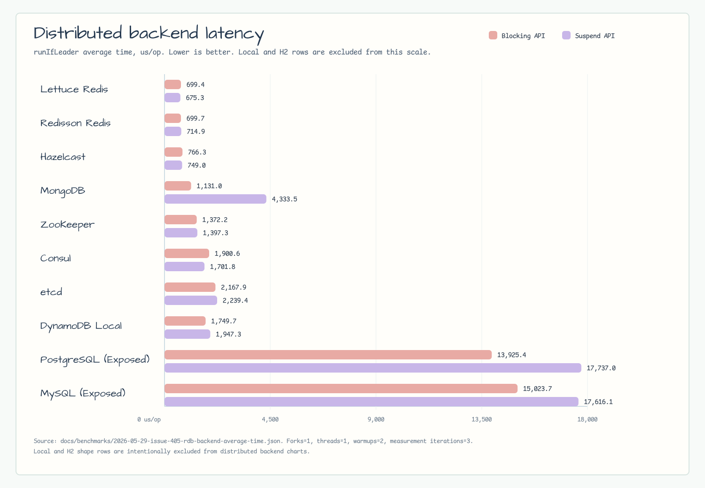
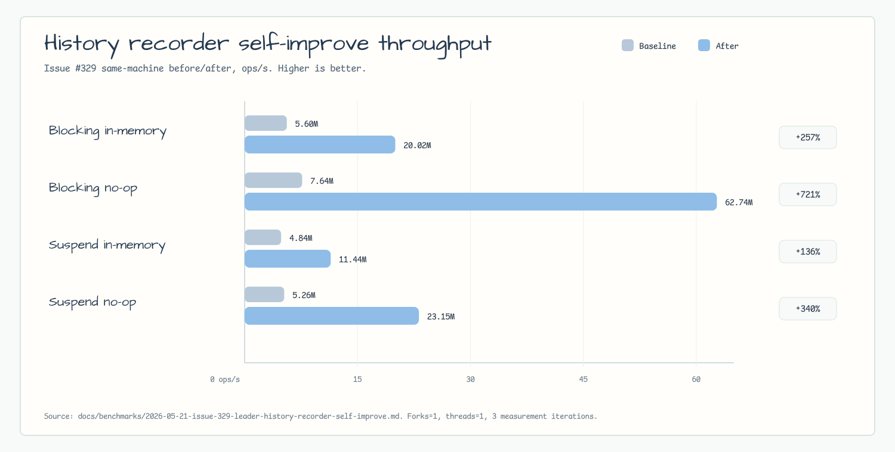
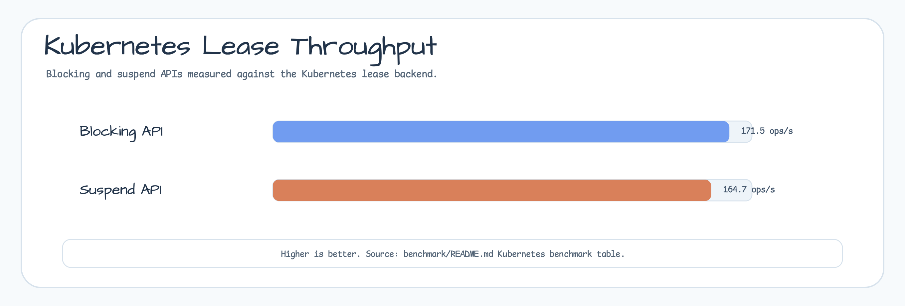
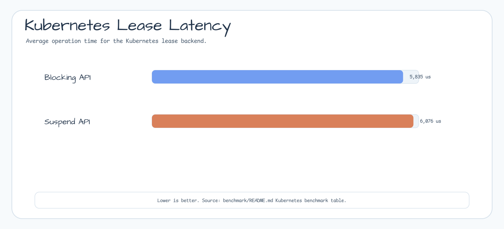

# bluetape4k-leader benchmark

[한국어](./README.ko.md) | English

This non-published module contains comparable `kotlinx-benchmark` suites for
the leader election backends. The JVM runner is JMH, and the benchmark source
set lives under `benchmark/src/benchmark/kotlin`.

Use these results for same-machine before/after comparisons. They are not
release-grade performance claims.

## Benchmark Command

```bash
./gradlew :benchmark:benchmarkBenchmark :benchmark:benchmarkAverageTimeBenchmark --no-configuration-cache --rerun-tasks
./gradlew :benchmark:kubernetesBenchmarkBenchmark :benchmark:kubernetesBenchmarkAverageTimeBenchmark --no-configuration-cache --rerun-tasks
```

The 2026-05-21 baseline was collected with one fork, one thread, two warmup
iterations, and three one-second measurement iterations. Full environment and
caveats are recorded in
[`docs/benchmarks/2026-05-21-leader-cross-backend-baseline.md`](../docs/benchmarks/2026-05-21-leader-cross-backend-baseline.md).

Issue #405 adds PostgreSQL and MySQL rows from a same-machine run on
2026-05-29. Blocking SQL rows use Exposed JDBC. Suspend SQL rows use Exposed
R2DBC. Kubernetes still runs as a separate benchmark target because the Fabric8
client uses Vert.x 4 / Netty 4.1 while the default target keeps Vert.x 5 for
etcd. Raw JSON is stored under:

- [`docs/benchmarks/2026-05-29-issue-405-rdb-backend-throughput.json`](../docs/benchmarks/2026-05-29-issue-405-rdb-backend-throughput.json)
- [`docs/benchmarks/2026-05-29-issue-405-rdb-backend-average-time.json`](../docs/benchmarks/2026-05-29-issue-405-rdb-backend-average-time.json)
- [`docs/benchmarks/2026-05-29-issue-418-kubernetes-throughput.json`](../docs/benchmarks/2026-05-29-issue-418-kubernetes-throughput.json)
- [`docs/benchmarks/2026-05-29-issue-418-kubernetes-average-time.json`](../docs/benchmarks/2026-05-29-issue-418-kubernetes-average-time.json)

Issue #422 adds focused Redis lease-extension rows from a same-machine run on
2026-06-01. These rows compare Lettuce and Redisson normal execution against
the shared `autoExtend` lease extender. Redisson native watchdog mode is not
represented because the current Redisson electors always pass an explicit
`leaseTime`. Raw JSON is stored under:

- [`docs/benchmarks/2026-06-01-issue-422-redis-lease-extension-throughput.json`](../docs/benchmarks/2026-06-01-issue-422-redis-lease-extension-throughput.json)
- [`docs/benchmarks/2026-06-01-issue-422-redis-lease-extension-average-time.json`](../docs/benchmarks/2026-06-01-issue-422-redis-lease-extension-average-time.json)

## Charts

Distributed backend charts exclude the local and H2 rows so infrastructure
backend differences remain visible. Kubernetes has separate charts beside its
table because it runs on a separate runtime classpath.




Issue #329 also records a history-recorder before/after comparison from the
same benchmark harness.



## Latest Self-Improve Result

Issue #329 optimized the history-recorder sanitization fast path without
changing the benchmark harness. The same throughput command improved the local
history rows:

| Benchmark | Baseline (ops/s) | After (ops/s) | Delta |
|---|---:|---:|---:|
| `HistoryRecorder.blockingInMemoryAcquireComplete` | 5,601,881.043 | 20,018,125.709 | +257.35% |
| `HistoryRecorder.blockingNoopAcquireComplete` | 7,642,848.188 | 62,740,146.724 | +720.90% |
| `HistoryRecorder.suspendInMemoryAcquireComplete` | 4,843,511.108 | 11,441,889.888 | +136.23% |
| `HistoryRecorder.suspendNoopAcquireComplete` | 5,257,310.052 | 23,153,305.712 | +340.40% |

Details:
[`docs/benchmarks/2026-05-21-issue-329-leader-history-recorder-self-improve.md`](../docs/benchmarks/2026-05-21-issue-329-leader-history-recorder-self-improve.md).

## Cross-Backend Results

Higher is better for throughput. Lower is better for average time.

## Redis Lease Extension Results

Higher is better for throughput. Lower is better for average time.

The plain `runIfLeader` rows use a 60 second lease and a fast action to compare
normal execution against the overhead of enabling `autoExtend`. The
`runIfLeaderWithRenewalWindow` rows use a 90 ms lease and a 45 ms action dwell
so the auto-extension path has a renewal window; compare those rows only within
the same method because the dwell time dominates.

`redisson-auto-extend` uses bluetape4k's shared `LeaderLeaseAutoExtender`, not
Redisson native watchdog renewal. The measured differences are within broad JMH
error bounds, so these numbers do not justify a production optimization.

### Blocking Redis API

| Scenario | Mode | Throughput (ops/s) | Average time (us/op) | Notes |
|---|---|---:|---:|---|
| `runIfLeader` | lettuce-normal | 1,454.484 ± 812.222 | 696.879 ± 261.682 | 60s lease, fast action |
| `runIfLeader` | lettuce-auto-extend | 1,432.206 ± 673.228 | 674.570 ± 76.338 | Shared auto extender enabled |
| `runIfLeader` | redisson-normal | 1,392.344 ± 156.055 | 721.043 ± 46.545 | 60s lease, fast action |
| `runIfLeader` | redisson-auto-extend | 1,379.041 ± 380.447 | 739.360 ± 42.259 | Shared auto extender, not native watchdog |
| `runIfLeaderWithRenewalWindow` | lettuce-normal | 18.858 ± 2.142 | 52,787.594 ± 13,078.335 | 90ms lease, 45ms action dwell |
| `runIfLeaderWithRenewalWindow` | lettuce-auto-extend | 19.191 ± 3.072 | 52,012.788 ± 14,742.520 | Renewal-window comparison row |
| `runIfLeaderWithRenewalWindow` | redisson-normal | 18.540 ± 4.514 | 52,495.646 ± 13,993.629 | 90ms lease, 45ms action dwell |
| `runIfLeaderWithRenewalWindow` | redisson-auto-extend | 19.150 ± 6.465 | 51,782.799 ± 5,184.910 | Shared auto extender, not native watchdog |

### Suspend Redis API

| Scenario | Mode | Throughput (ops/s) | Average time (us/op) | Notes |
|---|---|---:|---:|---|
| `runIfLeader` | lettuce-normal | 1,442.249 ± 772.451 | 668.478 ± 280.073 | 60s lease, fast action |
| `runIfLeader` | lettuce-auto-extend | 1,413.118 ± 434.324 | 693.538 ± 206.127 | Shared auto extender enabled |
| `runIfLeader` | redisson-normal | 1,382.143 ± 173.134 | 718.507 ± 233.162 | 60s lease, fast action |
| `runIfLeader` | redisson-auto-extend | 1,363.848 ± 134.125 | 728.479 ± 177.469 | Shared auto extender, not native watchdog |
| `runIfLeaderWithRenewalWindow` | lettuce-normal | 18.757 ± 6.519 | 53,820.084 ± 30,715.585 | 90ms lease, 45ms action dwell |
| `runIfLeaderWithRenewalWindow` | lettuce-auto-extend | 18.876 ± 0.844 | 52,182.685 ± 17,376.505 | Renewal-window comparison row |
| `runIfLeaderWithRenewalWindow` | redisson-normal | 18.603 ± 7.860 | 53,558.941 ± 19,665.787 | 90ms lease, 45ms action dwell |
| `runIfLeaderWithRenewalWindow` | redisson-auto-extend | 19.214 ± 8.932 | 51,883.433 ± 6,959.355 | Shared auto extender, not native watchdog |

### Blocking API

| Backend | Throughput (ops/s) | Average time (us/op) | Notes |
|---|---:|---:|---|
| local | 2,247,218.689 ± 258,773.085 | 0.467 ± 0.019 | In-process baseline |
| exposed-jdbc-h2 | 20,691.932 ± 63,884.249 | 51.079 ± 160.765 | Local H2 SQL layer baseline |
| hazelcast | 1,460.936 ± 659.253 | 766.272 ± 423.114 | Testcontainers-backed distributed backend |
| lettuce | 1,454.659 ± 443.418 | 699.411 ± 276.093 | Testcontainers-backed Redis backend |
| redisson | 1,415.840 ± 513.959 | 699.703 ± 164.584 | Testcontainers-backed Redis backend |
| mongo | 843.726 ± 3,644.524 | 1,131.005 ± 1,301.052 | Testcontainers-backed distributed backend |
| zookeeper | 804.334 ± 336.239 | 1,372.211 ± 588.106 | Testcontainers-backed distributed backend |
| dynamodb | 722.171 ± 1,582.978 | 1,749.692 ± 7,978.213 | DynamoDB Local |
| consul | 593.610 ± 246.434 | 1,900.576 ± 1,504.614 | Consul container |
| etcd | 443.838 ± 587.372 | 2,167.925 ± 3,258.402 | etcd container |
| exposed-jdbc-postgresql | 80.310 ± 32.723 | 13,925.403 ± 16,904.463 | Exposed JDBC with PostgreSQL Testcontainer |
| exposed-jdbc-mysql | 69.518 ± 59.759 | 15,023.674 ± 26,615.012 | Exposed JDBC with MySQL Testcontainer |

### Suspend API

| Backend | Throughput (ops/s) | Average time (us/op) | Notes |
|---|---:|---:|---|
| local | 786,325.801 ± 212,414.586 | 1.272 ± 0.306 | Coroutine bridge baseline |
| exposed-r2dbc-h2 | 5,998.877 ± 17,975.602 | 166.245 ± 440.023 | Local H2 R2DBC layer baseline |
| lettuce | 1,402.576 ± 1,400.853 | 675.318 ± 245.705 | Testcontainers-backed Redis backend |
| redisson | 1,386.653 ± 715.983 | 714.918 ± 188.197 | Testcontainers-backed Redis backend |
| hazelcast | 1,325.931 ± 1,368.902 | 748.966 ± 89.468 | Testcontainers-backed distributed backend |
| mongo | 798.439 ± 1,869.556 | 4,333.477 ± 47,816.200 | Noisy row; repeat before tuning |
| zookeeper | 670.564 ± 873.137 | 1,397.254 ± 1,293.725 | Testcontainers-backed distributed backend |
| consul | 563.158 ± 1,243.537 | 1,701.845 ± 902.436 | Consul container |
| dynamodb | 510.161 ± 1,882.141 | 1,947.304 ± 5,811.616 | DynamoDB Local |
| etcd | 467.461 ± 300.083 | 2,239.412 ± 2,885.971 | etcd container |
| exposed-r2dbc-postgresql | 53.588 ± 139.427 | 17,736.983 ± 13,072.732 | Exposed R2DBC with PostgreSQL Testcontainer |
| exposed-r2dbc-mysql | 65.204 ± 58.647 | 17,616.078 ± 8,183.403 | Exposed R2DBC with MySQL Testcontainer |

## Kubernetes Results

Kubernetes uses the K3s Testcontainers wrapper and runs from the
`kubernetesBenchmark` source set so its Fabric8 runtime does not downgrade the
default preview backend classpath.

| Benchmark | Throughput (ops/s) | Average time (us/op) | Notes |
|---|---:|---:|---|
| `Kubernetes.blockingRunIfLeader` | 171.525 ± 160.477 | 5,835.436 ± 8,251.639 | K3s-backed Lease lock |
| `Kubernetes.suspendRunIfLeader` | 164.687 ± 57.773 | 6,075.660 ± 4,944.763 | K3s-backed Lease lock |





## Local Core Rows

These rows remain the original 2026-05-21 cross-backend baseline. Use the
latest self-improve section above for issue #329 after numbers.

| Benchmark | Throughput (ops/s) | Average time (us/op) |
|---|---:|---:|
| `LocalLeader.blockingRunIfLeader` | 2,250,949.108 ± 167,049.822 | 0.451 ± 0.263 |
| `LocalLeader.asyncOnlyRunIfLeader` | 2,230,952.540 ± 248,386.525 | 0.447 ± 0.121 |
| `LocalLeader.completableFutureRunIfLeader` | 2,231,412.162 ± 324,642.886 | 0.445 ± 0.080 |
| `LocalLeader.suspendRunIfLeader` | 838,923.760 ± 388,344.058 | 1.172 ± 0.243 |
| `LocalLeader.virtualThreadRunIfLeader` | 138,705.240 ± 7,476.129 | 7.377 ± 1.244 |
| `HistoryRecorder.blockingNoopAcquireComplete` | 7,356,503.438 ± 2,672,535.544 | 0.129 ± 0.001 |
| `HistoryRecorder.blockingInMemoryAcquireComplete` | 5,828,846.244 ± 233,849.435 | 0.171 ± 0.014 |
| `HistoryRecorder.suspendNoopAcquireComplete` | 5,300,097.780 ± 186,734.921 | 0.164 ± 0.007 |
| `HistoryRecorder.suspendInMemoryAcquireComplete` | 4,784,646.339 ± 1,302,210.407 | 0.206 ± 0.032 |

## Interpretation

- Treat throughput as the canonical ranking metric; average time is auxiliary.
- Compare distributed backends against distributed backends. Do not rank local
  H2 rows against Redis, Hazelcast, ZooKeeper, MongoDB, PostgreSQL, or MySQL as
  distributed systems.
- For JVM-local coordination, prefer local locking primitives instead of H2
  leader election. H2 remains only a local SQL/R2DBC shape check.
- The local rows isolate framework and API overhead before any network or
  storage round trip.
- Benchmark setup performs a smoke `runIfLeader` check before measurement, so a
  failed infrastructure connection does not become a false fast-path row.
- Repeat noisy rows, especially DynamoDB, etcd, Kubernetes, and suspend MongoDB,
  before optimizing against them.

## Benchmark Classes

| Class | Scenario |
|---|---|
| `BackendLeaderElectorBenchmark` | Blocking `runIfLeader` across local, Redis, Exposed JDBC H2/PostgreSQL/MySQL, MongoDB, Hazelcast, ZooKeeper, Consul, etcd, and DynamoDB |
| `SuspendBackendLeaderElectorBenchmark` | Suspend `runIfLeader` across local, Redis, Exposed R2DBC H2/PostgreSQL/MySQL, MongoDB, Hazelcast, ZooKeeper, Consul, etcd, and DynamoDB |
| `RedisLeaseExtensionBenchmark` | Blocking Lettuce and Redisson normal vs shared `autoExtend` lease-extension rows |
| `SuspendRedisLeaseExtensionBenchmark` | Suspend Lettuce and Redisson normal vs shared `autoExtend` lease-extension rows |
| `KubernetesBackendLeaderElectorBenchmark` | Blocking and suspend `runIfLeader` against K3s-backed Kubernetes Lease locks on a separate Vert.x 4 runtime |
| `LocalLeaderElectorBenchmark` | Local blocking, async, completable-future, suspend, and virtual-thread elector overhead |
| `HistoryRecorderBenchmark` | No-op and in-memory leader history recorder overhead |
