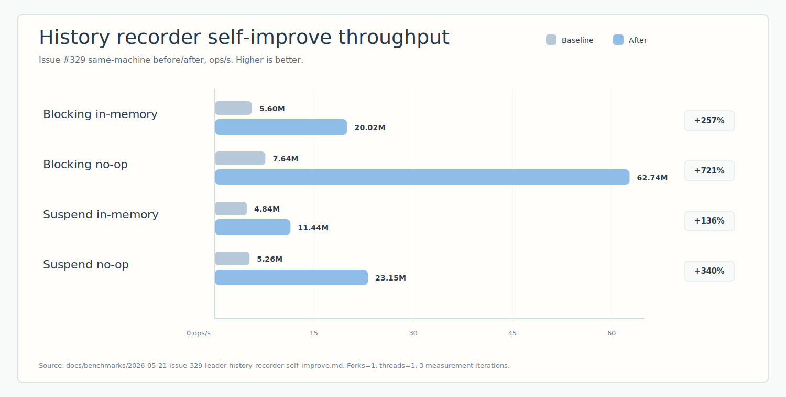

# bluetape4k-leader benchmark

[한국어](./README.ko.md) | English

This non-published module contains comparable `kotlinx-benchmark` suites for
the leader election backends. The JVM runner is JMH, and the benchmark source
set lives under `benchmark/src/benchmark/kotlin`.

Use these results for same-machine before/after comparisons. They are not
release-grade performance claims.

## Benchmark Command

```bash
./gradlew :benchmark:benchmarkBenchmark :benchmark:benchmarkAverageTimeBenchmark --no-configuration-cache --rerun-tasks
./gradlew :benchmark:kubernetesBenchmarkBenchmark :benchmark:kubernetesBenchmarkAverageTimeBenchmark --no-configuration-cache --rerun-tasks
```

The 2026-05-21 baseline was collected with one fork, one thread, two warmup
iterations, and three one-second measurement iterations. Full environment and
caveats are recorded in
[`docs/benchmarks/2026-05-21-leader-cross-backend-baseline.md`](../docs/benchmarks/2026-05-21-leader-cross-backend-baseline.md).

Issue #418 adds preview backend rows from a same-machine run on 2026-05-29.
Kubernetes runs as a separate benchmark target because the Fabric8 client uses
Vert.x 4 / Netty 4.1 while the default preview target keeps Vert.x 5 for etcd.
Raw JSON is stored under:

- [`docs/benchmarks/2026-05-29-issue-418-preview-backend-throughput.json`](../docs/benchmarks/2026-05-29-issue-418-preview-backend-throughput.json)
- [`docs/benchmarks/2026-05-29-issue-418-preview-backend-average-time.json`](../docs/benchmarks/2026-05-29-issue-418-preview-backend-average-time.json)
- [`docs/benchmarks/2026-05-29-issue-418-kubernetes-throughput.json`](../docs/benchmarks/2026-05-29-issue-418-kubernetes-throughput.json)
- [`docs/benchmarks/2026-05-29-issue-418-kubernetes-average-time.json`](../docs/benchmarks/2026-05-29-issue-418-kubernetes-average-time.json)

## Charts

Remote backend charts exclude the local and H2 rows so the distributed backend
differences remain visible.


Issue #329 also records a history-recorder before/after comparison from the
same benchmark harness.



## Latest Self-Improve Result

Issue #329 optimized the history-recorder sanitization fast path without
changing the benchmark harness. The same throughput command improved the local
history rows:

| Benchmark | Baseline (ops/s) | After (ops/s) | Delta |
|---|---:|---:|---:|
| `HistoryRecorder.blockingInMemoryAcquireComplete` | 5,601,881.043 | 20,018,125.709 | +257.35% |
| `HistoryRecorder.blockingNoopAcquireComplete` | 7,642,848.188 | 62,740,146.724 | +720.90% |
| `HistoryRecorder.suspendInMemoryAcquireComplete` | 4,843,511.108 | 11,441,889.888 | +136.23% |
| `HistoryRecorder.suspendNoopAcquireComplete` | 5,257,310.052 | 23,153,305.712 | +340.40% |

Details:
[`docs/benchmarks/2026-05-21-issue-329-leader-history-recorder-self-improve.md`](../docs/benchmarks/2026-05-21-issue-329-leader-history-recorder-self-improve.md).

## Cross-Backend Results

Higher is better for throughput. Lower is better for average time.

### Blocking API

| Backend | Throughput (ops/s) | Average time (us/op) | Notes |
|---|---:|---:|---|
| local | 2,229,094.156 ± 340,606.937 | 0.448 ± 0.066 | In-process baseline |
| exposed-jdbc-h2 | 20,270.340 ± 76,948.054 | 51.486 ± 184.900 | Local H2 SQL layer baseline |
| lettuce | 1,456.452 ± 1,105.248 | 695.602 ± 134.945 | Testcontainers-backed Redis backend |
| redisson | 1,415.589 ± 158.353 | 714.410 ± 98.256 | Testcontainers-backed Redis backend |
| hazelcast | 1,415.206 ± 591.033 | 789.086 ± 2,476.835 | Testcontainers-backed remote backend |
| mongo | 933.785 ± 111.170 | 1,066.984 ± 362.207 | Testcontainers-backed remote backend |
| zookeeper | 841.759 ± 502.488 | 1,238.603 ± 1,081.258 | Testcontainers-backed remote backend |
| dynamodb | 641.149 ± 2,605.461 | 1,385.980 ± 2,020.305 | Preview row; DynamoDB Local |
| consul | 615.061 ± 300.998 | 1,768.272 ± 1,190.899 | Preview row; Consul container |
| etcd | 493.380 ± 165.546 | 2,380.611 ± 1,676.741 | Preview row; etcd container |

### Suspend API

| Backend | Throughput (ops/s) | Average time (us/op) | Notes |
|---|---:|---:|---|
| local | 925,514.252 ± 406,872.759 | 1.105 ± 0.263 | Coroutine bridge baseline |
| exposed-r2dbc-h2 | 6,315.028 ± 16,768.905 | 169.439 ± 427.033 | Local H2 R2DBC layer baseline |
| lettuce | 1,463.431 ± 676.132 | 693.089 ± 169.233 | Testcontainers-backed Redis backend |
| redisson | 1,395.657 ± 368.895 | 712.892 ± 104.524 | Testcontainers-backed Redis backend |
| hazelcast | 1,360.655 ± 405.288 | 741.366 ± 398.588 | Testcontainers-backed remote backend |
| zookeeper | 758.629 ± 913.401 | 1,457.399 ± 746.002 | Testcontainers-backed remote backend |
| consul | 587.939 ± 212.750 | 1,619.926 ± 1,327.587 | Preview row; Consul container |
| dynamodb | 561.315 ± 1,195.590 | 2,031.045 ± 3,072.218 | Preview row; DynamoDB Local |
| mongo | 559.779 ± 5,979.628 | 1,358.661 ± 1,636.852 | Noisy row; repeat before tuning |
| etcd | 459.969 ± 381.881 | 2,576.520 ± 8,028.306 | Preview row; etcd container |

## Kubernetes Results

Kubernetes uses the K3s Testcontainers wrapper and runs from the
`kubernetesBenchmark` source set so its Fabric8 runtime does not downgrade the
default preview backend classpath.

| Benchmark | Throughput (ops/s) | Average time (us/op) | Notes |
|---|---:|---:|---|
| `Kubernetes.blockingRunIfLeader` | 171.525 ± 160.477 | 5,835.436 ± 8,251.639 | K3s-backed Lease lock |
| `Kubernetes.suspendRunIfLeader` | 164.687 ± 57.773 | 6,075.660 ± 4,944.763 | K3s-backed Lease lock |

## Local Core Rows

These rows remain the original 2026-05-21 cross-backend baseline. Use the
latest self-improve section above for issue #329 after numbers.

| Benchmark | Throughput (ops/s) | Average time (us/op) |
|---|---:|---:|
| `LocalLeader.blockingRunIfLeader` | 2,250,949.108 ± 167,049.822 | 0.451 ± 0.263 |
| `LocalLeader.asyncOnlyRunIfLeader` | 2,230,952.540 ± 248,386.525 | 0.447 ± 0.121 |
| `LocalLeader.completableFutureRunIfLeader` | 2,231,412.162 ± 324,642.886 | 0.445 ± 0.080 |
| `LocalLeader.suspendRunIfLeader` | 838,923.760 ± 388,344.058 | 1.172 ± 0.243 |
| `LocalLeader.virtualThreadRunIfLeader` | 138,705.240 ± 7,476.129 | 7.377 ± 1.244 |
| `HistoryRecorder.blockingNoopAcquireComplete` | 7,356,503.438 ± 2,672,535.544 | 0.129 ± 0.001 |
| `HistoryRecorder.blockingInMemoryAcquireComplete` | 5,828,846.244 ± 233,849.435 | 0.171 ± 0.014 |
| `HistoryRecorder.suspendNoopAcquireComplete` | 5,300,097.780 ± 186,734.921 | 0.164 ± 0.007 |
| `HistoryRecorder.suspendInMemoryAcquireComplete` | 4,784,646.339 ± 1,302,210.407 | 0.206 ± 0.032 |

## Interpretation

- Treat throughput as the canonical ranking metric; average time is auxiliary.
- Compare distributed backends against distributed backends. Do not rank local
  H2 rows against Redis, Hazelcast, ZooKeeper, or MongoDB as distributed systems.
- The local rows isolate framework and API overhead before any network or
  storage round trip.
- Benchmark setup performs a smoke `runIfLeader` check before measurement, so a
  failed infrastructure connection does not become a false fast-path row.
- Repeat noisy rows, especially DynamoDB, etcd, Kubernetes, and suspend MongoDB,
  before optimizing against them.

## Benchmark Classes

| Class | Scenario |
|---|---|
| `BackendLeaderElectorBenchmark` | Blocking `runIfLeader` across local, Redis, Exposed JDBC H2, MongoDB, Hazelcast, ZooKeeper, Consul, etcd, and DynamoDB |
| `SuspendBackendLeaderElectorBenchmark` | Suspend `runIfLeader` across local, Redis, Exposed R2DBC H2, MongoDB, Hazelcast, ZooKeeper, Consul, etcd, and DynamoDB |
| `KubernetesBackendLeaderElectorBenchmark` | Blocking and suspend `runIfLeader` against K3s-backed Kubernetes Lease locks on a separate Vert.x 4 runtime |
| `LocalLeaderElectorBenchmark` | Local blocking, async, completable-future, suspend, and virtual-thread elector overhead |
| `HistoryRecorderBenchmark` | No-op and in-memory leader history recorder overhead |
