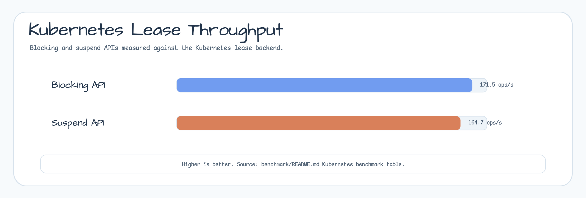
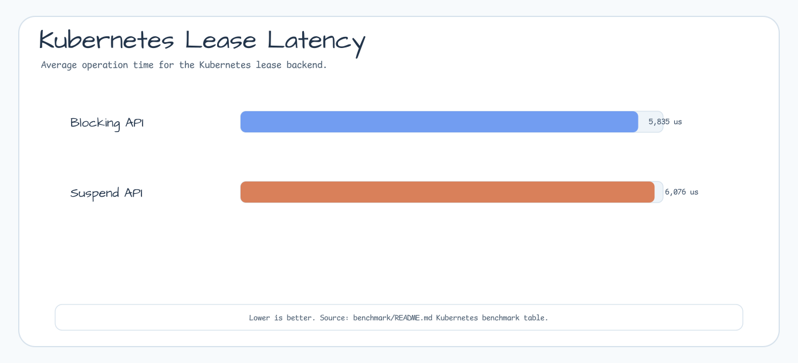

# bluetape4k-leader benchmark

English | [한국어](./README.ko.md)

This non-published module contains comparable `kotlinx-benchmark` suites for
the leader election backends. The JVM runner is JMH, and the benchmark source
set lives under `benchmark/src/benchmark/kotlin`.

Use these results for same-machine before/after comparisons. They are not
release-grade performance claims.

## Benchmark Command

```bash
./gradlew :benchmark:benchmarkBenchmark :benchmark:benchmarkAverageTimeBenchmark --no-configuration-cache --rerun-tasks
./gradlew :benchmark:kubernetesBenchmarkBenchmark :benchmark:kubernetesBenchmarkAverageTimeBenchmark --no-configuration-cache --rerun-tasks
```

The 2026-05-21 baseline was collected with one fork, one thread, two warmup
iterations, and three one-second measurement iterations. Full environment and
caveats are recorded in
[`docs/benchmarks/2026-05-21-leader-cross-backend-baseline.md`](../docs/benchmarks/2026-05-21-leader-cross-backend-baseline.md).

Issue #405 adds PostgreSQL and MySQL rows from a same-machine run on
2026-05-29. Blocking SQL rows use Exposed JDBC. Suspend SQL rows use Exposed
R2DBC. Kubernetes still runs as a separate benchmark target because the Fabric8
client uses Vert.x 4 / Netty 4.1 while the default target keeps Vert.x 5 for
etcd. Raw JSON is stored under:

- [`docs/benchmarks/2026-05-29-issue-405-rdb-backend-throughput.json`](../docs/benchmarks/2026-05-29-issue-405-rdb-backend-throughput.json)
- [`docs/benchmarks/2026-05-29-issue-405-rdb-backend-average-time.json`](../docs/benchmarks/2026-05-29-issue-405-rdb-backend-average-time.json)
- [`docs/benchmarks/2026-05-29-issue-418-kubernetes-throughput.json`](../docs/benchmarks/2026-05-29-issue-418-kubernetes-throughput.json)
- [`docs/benchmarks/2026-05-29-issue-418-kubernetes-average-time.json`](../docs/benchmarks/2026-05-29-issue-418-kubernetes-average-time.json)

Issue #422 adds focused Redis lease-extension rows from a same-machine run on
2026-06-01. These rows compare Lettuce and Redisson normal execution against
the shared `autoExtend` lease extender. Redisson native watchdog mode is not
represented because the current Redisson electors always pass an explicit
`leaseTime`. Raw JSON is stored under:

- [`docs/benchmarks/2026-06-01-issue-422-redis-lease-extension-throughput.json`](../docs/benchmarks/2026-06-01-issue-422-redis-lease-extension-throughput.json)
- [`docs/benchmarks/2026-06-01-issue-422-redis-lease-extension-average-time.json`](../docs/benchmarks/2026-06-01-issue-422-redis-lease-extension-average-time.json)

Issue #427 adds focused Local and MongoDB `autoExtend` rows from a same-machine
run on 2026-06-05. These rows reuse the Redis quick and renewal-window shape,
but keep Redis itself as #422 prior evidence. Raw JSON and the decision record
are stored under
[`docs/benchmarks/2026-06-05-issue-427-autoextend-backends.md`](../docs/benchmarks/2026-06-05-issue-427-autoextend-backends.md).

Issue #414 repeated the noisy suspend MongoDB `runIfLeader` row on 2026-06-05
against Lettuce, Redisson, and Hazelcast. The repeated same-machine run kept the
existing one-fork, one-thread, two-warmup, three-measurement shape and confirmed
that MongoDB stayed slower but too noisy for a narrow tuning target. Raw JSON
and the decision record are stored under
[`docs/benchmarks/2026-06-05-issue-414-mongodb-suspend-repeat.md`](../docs/benchmarks/2026-06-05-issue-414-mongodb-suspend-repeat.md).

Issue #520 adds group-semaphore benchmark rows for `maxLeaders` 1, 2, and 8,
covering free-slot, saturated-skip, mixed-slot, active-count, and state
snapshot paths. The README chart snapshot uses `maxLeaders=2` and a short
same-JVM measurement window so the grouped backend shape is visible without a
full release-grade run. Raw JSON and the full result table are stored under
[`docs/benchmarks/2026-07-02-issue-520-leader-group-benchmarks.md`](../docs/benchmarks/2026-07-02-issue-520-leader-group-benchmarks.md).

Issue #521 adds contention and skip-path benchmark rows for single-leader
electors. The rows split existing-holder skip, N-contender parallel paths, and
mixed acquire/skip paths for blocking and suspend APIs. The README chart
snapshot uses `contenders=8` and a short same-JVM measurement window. Raw JSON,
commands, charts, and the full result table are stored under
[`docs/benchmarks/2026-07-02-issue-521-contention-benchmarks.md`](../docs/benchmarks/2026-07-02-issue-521-contention-benchmarks.md).

Issue #522 adds Spring `@LeaderElection` advice overhead rows. The benchmark
compares direct local elector calls with the Spring aspect path, splits static
lock names from SpEL-derived lock names, and covers both blocking and suspend
methods with no recorder and no-op recorder configurations. Raw JSON, commands,
charts, and interpretation are stored under
[`docs/benchmarks/2026-07-02-issue-522-spring-advice-benchmarks.md`](../docs/benchmarks/2026-07-02-issue-522-spring-advice-benchmarks.md).

Issue #523 adds history recorder observability rows. The benchmark compares
no-op, in-memory, and Micrometer-wrapped recorders, separates completed from
failed terminal states, and runs `empty`, `small`, and `large` metadata modes.
Raw JSON, charts, and interpretation are stored under
[`docs/benchmarks/2026-07-02-issue-523-history-recorder-observability.md`](../docs/benchmarks/2026-07-02-issue-523-history-recorder-observability.md).

## Charts

Distributed backend charts exclude the local and H2 rows so infrastructure
backend differences remain visible. Kubernetes has separate charts beside its
table because it runs on a separate runtime classpath.


Issue #329 also records a history-recorder before/after comparison from the
same benchmark harness.


## Latest Self-Improve Result

Issue #329 optimized the history-recorder sanitization fast path without
changing the benchmark harness. The same throughput command improved the local
history rows:

| Benchmark | Baseline (ops/s) | After (ops/s) | Delta |
|---|---:|---:|---:|
| `HistoryRecorder.blockingInMemoryAcquireComplete` | 5,601,881.043 | 20,018,125.709 | +257.35% |
| `HistoryRecorder.blockingNoopAcquireComplete` | 7,642,848.188 | 62,740,146.724 | +720.90% |
| `HistoryRecorder.suspendInMemoryAcquireComplete` | 4,843,511.108 | 11,441,889.888 | +136.23% |
| `HistoryRecorder.suspendNoopAcquireComplete` | 5,257,310.052 | 23,153,305.712 | +340.40% |

Details:
[`docs/benchmarks/2026-05-21-issue-329-leader-history-recorder-self-improve.md`](../docs/benchmarks/2026-05-21-issue-329-leader-history-recorder-self-improve.md).

## Cross-Backend Results

Higher is better for throughput. Lower is better for average time.

## Leader Group Semaphore Results

Higher is better for throughput. Lower is better for average time. These rows
are the remote-backend `maxLeaders=2` chart snapshot from issue #520. Local and
blocking H2 rows are preserved in the full benchmark report instead of the
README table.

Issue #520 group-semaphore charts also exclude local and blocking H2 rows and
use a log scale because free-slot, mixed-slot, and saturated-skip paths have
very different magnitudes.


| API | Scenario | Backend | Throughput (ops/s) | Average time (us/op) |
|---|---|---|---:|---:|
| Blocking | Free slot | lettuce | 806.3 | 1,010 |
| Blocking | Free slot | redisson | 902.4 | 1,017 |
| Blocking | Free slot | mongo | 344.5 | 3,370 |
| Blocking | Free slot | zookeeper | 209.2 | 4,605 |
| Blocking | Mixed slots | lettuce | 1,543 | 2,029 |
| Blocking | Mixed slots | redisson | 963.4 | 989.9 |
| Blocking | Mixed slots | mongo | 75.87 | 13,146 |
| Blocking | Mixed slots | zookeeper | 247.5 | 4,745 |
| Blocking | Saturated skip | lettuce | 35.89 | 27,693 |
| Blocking | Saturated skip | redisson | 36.36 | 27,597 |
| Blocking | Saturated skip | mongo | 35.2 | 27,234 |
| Blocking | Saturated skip | zookeeper | 32.88 | 29,086 |
| Suspend | Free slot | lettuce | 1,315 | 770.2 |
| Suspend | Free slot | redisson | 919.3 | 1,062 |
| Suspend | Free slot | mongo | 297 | 3,298 |
| Suspend | Free slot | zookeeper | 211.8 | 4,348 |
| Suspend | Mixed slots | lettuce | 1,396 | 684.1 |
| Suspend | Mixed slots | redisson | 1,104 | 971.9 |
| Suspend | Mixed slots | mongo | 82.79 | 10,747 |
| Suspend | Mixed slots | zookeeper | 276.7 | 4,017 |
| Suspend | Saturated skip | lettuce | 36.34 | 27,447 |
| Suspend | Saturated skip | redisson | 24.69 | 44,784 |
| Suspend | Saturated skip | mongo | 36.03 | 26,808 |
| Suspend | Saturated skip | zookeeper | 32.05 | 31,188 |

### Interpretation

This is a quick same-JVM `maxLeaders=2` snapshot with no warmup, one fork, and a
single 200 ms measurement iteration. Use it to compare backend shape and smoke
the group-semaphore paths, not as a release-grade ranking.

Free-slot rows measure acquisition when a group still has capacity. Mixed-slot
rows keep `maxLeaders - 1` slots held and measure the final available slot.
Saturated-skip rows measure the configured wait path when no slots are
available.

Local and blocking H2 rows are preserved in the full report, but they are
omitted from the README table and charts because they are framework or storage
shape baselines that compress the remote-backend scale. Saturated-skip rows
cluster around one operation per roughly 25 ms wait window, so the wait policy
hides most backend differences there.

Lettuce and Redisson lead most remote free-slot and mixed-slot rows in this
short run. MongoDB is slower and noisier, especially in mixed-slot rows.
ZooKeeper stays consistent but has higher free-slot latency than the Redis
backends. The log-scale charts keep saturated rows visible beside the much
faster free-slot and mixed-slot paths.

Full report and raw data:

- [`docs/benchmarks/2026-07-02-issue-520-leader-group-benchmarks.md`](../docs/benchmarks/2026-07-02-issue-520-leader-group-benchmarks.md)
- [`docs/benchmarks/2026-07-02-issue-520-leader-group-throughput.json`](../docs/benchmarks/2026-07-02-issue-520-leader-group-throughput.json)
- [`docs/benchmarks/2026-07-02-issue-520-leader-group-average-time.json`](../docs/benchmarks/2026-07-02-issue-520-leader-group-average-time.json)

## Leader Contention Results

Higher is better for throughput. Lower is better for average time. These rows
are the issue #521 `contenders=8` chart snapshot. The charts use a log scale
because immediate local skip, remote immediate skip, and positive-wait
contention paths differ by several orders of magnitude.


| API | Scenario | Backend | Throughput (ops/s) | Average time (us/op) |
|---|---|---|---:|---:|
| Blocking | Skip held / wait 0 | local | 18,457,123 | 0.056 |
| Blocking | Skip held / wait 0 | lettuce | 2,307 | 511.16 |
| Blocking | Skip held / wait 0 | redisson | 2,993 | 357.93 |
| Blocking | Skip held / wait 0 | mongo | 1,210 | 844.57 |
| Blocking | Skip held / wait 0 | zookeeper | 323.93 | 2,296 |
| Blocking | Skip held / wait 25 ms | local | 38.47 | 26,109 |
| Blocking | Skip held / wait 25 ms | lettuce | 38.5 | 26,058 |
| Blocking | Skip held / wait 25 ms | redisson | 37.9 | 25,976 |
| Blocking | Skip held / wait 25 ms | mongo | 38.83 | 25,626 |
| Blocking | Skip held / wait 25 ms | zookeeper | 30.38 | 32,747 |
| Blocking | Parallel / wait 0 | lettuce | 362.43 | 2,932 |
| Blocking | Parallel / wait 0 | redisson | 350 | 2,846 |
| Blocking | Parallel / wait 0 | mongo | 158.84 | 6,458 |
| Blocking | Parallel / wait 0 | zookeeper | 41.87 | 17,101 |
| Blocking | Parallel / wait 25 ms | local | 37.08 | 27,066 |
| Blocking | Parallel / wait 25 ms | lettuce | 34.51 | 30,093 |
| Blocking | Parallel / wait 25 ms | redisson | 35.04 | 30,112 |
| Blocking | Parallel / wait 25 ms | mongo | 28.04 | 33,632 |
| Blocking | Parallel / wait 25 ms | zookeeper | 31.08 | 35,607 |
| Blocking | Mixed acquire + skip | local | 37.54 | 26,720 |
| Blocking | Mixed acquire + skip | lettuce | 33.44 | 34,213 |
| Blocking | Mixed acquire + skip | redisson | 34.35 | 31,610 |
| Blocking | Mixed acquire + skip | mongo | 32.81 | 33,646 |
| Blocking | Mixed acquire + skip | zookeeper | 24.67 | 36,621 |
| Suspend | Skip held / wait 0 | lettuce | 2,381 | 612.83 |
| Suspend | Skip held / wait 0 | redisson | 2,557 | 467.89 |
| Suspend | Skip held / wait 0 | mongo | 1,170 | 1,126 |
| Suspend | Skip held / wait 0 | zookeeper | 406.58 | 2,788 |
| Suspend | Skip held / wait 25 ms | local | 38.76 | 26,341 |
| Suspend | Skip held / wait 25 ms | lettuce | 38.45 | 25,710 |
| Suspend | Skip held / wait 25 ms | redisson | 22.11 | 30,111 |
| Suspend | Skip held / wait 25 ms | mongo | 37 | 27,206 |
| Suspend | Skip held / wait 25 ms | zookeeper | 34.69 | 33,887 |
| Suspend | Parallel / wait 25 ms | local | 35.57 | 27,552 |
| Suspend | Parallel / wait 25 ms | lettuce | 32.96 | 29,658 |
| Suspend | Parallel / wait 25 ms | redisson | 29.48 | 37,131 |
| Suspend | Parallel / wait 25 ms | mongo | 28.67 | 33,180 |
| Suspend | Parallel / wait 25 ms | zookeeper | 30.94 | 33,493 |
| Suspend | Mixed acquire + skip | local | 37.63 | 26,499 |
| Suspend | Mixed acquire + skip | lettuce | 32.43 | 30,257 |
| Suspend | Mixed acquire + skip | redisson | 22.62 | 44,968 |
| Suspend | Mixed acquire + skip | mongo | 28.02 | 35,939 |
| Suspend | Mixed acquire + skip | zookeeper | 22.29 | 46,421 |

### Interpretation

This is a quick same-JVM snapshot with no warmup, no fork, and one 100 ms
measurement iteration. Use it to compare backend shape and smoke the
contention paths, not as a release-grade ranking.

The existing-holder setup verifies that the action body is not executed on a
skip result. Immediate skip rows therefore measure the cost of detecting a held
lock and returning `LeaderRunResult.Skipped`. The local blocking row is an
in-process state check and is intentionally much faster than remote backends.
Among remote rows in this short run, Redisson and Lettuce lead immediate skip,
MongoDB sits in the middle, and ZooKeeper pays the highest coordination cost.

Positive-wait rows cluster around one operation per roughly 25 ms wait window.
That is expected because the configured wait policy dominates the measurement,
so backend differences are compressed. These rows are primarily regression
smoke checks for skip behavior, wait handling, and state cleanup.

Parallel `waitTime=0` exists only for the blocking remote/shared benchmark.
The local suspend implementation uses `withTimeoutOrNull(0)`, so an immediate
free acquisition can time out before meaningful contention is measured. The
suspend local baseline therefore keeps the positive-wait and mixed rows, while
remote suspend immediate skip remains covered by the held-lock scenario.

Full report and raw data:

- [`docs/benchmarks/2026-07-02-issue-521-contention-benchmarks.md`](../docs/benchmarks/2026-07-02-issue-521-contention-benchmarks.md)
- [`docs/benchmarks/2026-07-02-issue-521-contention-remote-throughput.json`](../docs/benchmarks/2026-07-02-issue-521-contention-remote-throughput.json)
- [`docs/benchmarks/2026-07-02-issue-521-contention-remote-average-time.json`](../docs/benchmarks/2026-07-02-issue-521-contention-remote-average-time.json)
- [`docs/benchmarks/2026-07-02-issue-521-contention-local-throughput.json`](../docs/benchmarks/2026-07-02-issue-521-contention-local-throughput.json)
- [`docs/benchmarks/2026-07-02-issue-521-contention-local-average-time.json`](../docs/benchmarks/2026-07-02-issue-521-contention-local-average-time.json)

## Leader Spring Advice Results

Higher is better for throughput. Lower is better for average time. These issue
#522 rows use local electors so backend I/O does not hide Spring advice
overhead. Both charts use a log scale because direct suspend, direct blocking,
static advice, and SpEL advice differ by more than one order of magnitude.


| Benchmark | Instrumentation | Throughput (ops/s) | Average time (us/op) |
|---|---:|---:|---:|
| direct sync | none | 2,255,925 | 0.44 |
| direct sync | noop | 2,258,324 | 0.44 |
| advice sync static | none | 1,718,542 | 0.56 |
| advice sync static | noop | 1,691,326 | 0.58 |
| advice sync SpEL | none | 1,034,113 | 0.94 |
| advice sync SpEL | noop | 1,030,415 | 0.99 |
| direct suspend | none | 28,987,468 | 0.035 |
| direct suspend | noop | 29,639,156 | 0.036 |
| advice suspend static | none | 544,163 | 1.70 |
| advice suspend static | noop | 592,620 | 1.66 |
| advice suspend SpEL | none | 449,808 | 2.21 |
| advice suspend SpEL | noop | 451,542 | 2.25 |

### Interpretation

The blocking static-name advice path is close to the direct local elector
baseline in absolute terms: this short run measured about 0.56 us/op for static
advice compared with 0.44 us/op for direct blocking execution. The SpEL row is
slower because it evaluates the lock-name expression against method arguments
on every invocation.

The suspend direct baseline is intentionally tiny in this local fixture, so the
relative gap to Spring advice looks large. The absolute advice cost is the more
useful signal: static suspend advice is about 1.7 us/op and SpEL suspend advice
is about 2.2 us/op. Around real Redis, MongoDB, ZooKeeper, Kubernetes, or JDBC
locks, backend coordination will normally dominate those local framework costs.

`instrumentation=noop` installs the no-op AOP metrics recorder. It does not
materially change the shape here; small differences are within the short JMH
run's noise. Real Micrometer registry overhead remains a separate benchmark
concern so this section stays focused on advice dispatch and expression
evaluation.

Full report and raw data:

- [`docs/benchmarks/2026-07-02-issue-522-spring-advice-benchmarks.md`](../docs/benchmarks/2026-07-02-issue-522-spring-advice-benchmarks.md)
- [`docs/benchmarks/2026-07-02-issue-522-spring-advice-throughput.json`](../docs/benchmarks/2026-07-02-issue-522-spring-advice-throughput.json)
- [`docs/benchmarks/2026-07-02-issue-522-spring-advice-average-time.json`](../docs/benchmarks/2026-07-02-issue-522-spring-advice-average-time.json)

## Leader History Observability Results

Higher is better for throughput. Lower is better for average time. These issue
#523 rows are recorder-only rows with `metadataMode=small`; the full report and
raw JSON also include `empty` and `large` metadata modes.


| API | Recorder | Terminal | Metadata | Throughput (ops/s) | Average time (us/op) |
|---|---|---|---|---:|---:|
| Blocking | Noop | Completed | small | 62,153,981 | 0.0167 |
| Blocking | Noop | Failed | small | 30,506,848 | 0.0323 |
| Blocking | In-memory | Completed | small | 18,875,312 | 0.0545 |
| Blocking | In-memory | Failed | small | 14,255,133 | 0.0715 |
| Blocking | Micrometer | Completed | small | 18,031,147 | 0.0570 |
| Blocking | Micrometer | Failed | small | 13,910,688 | 0.0709 |
| Suspend | Noop | Completed | small | 23,477,969 | 0.0426 |
| Suspend | Noop | Failed | small | 16,906,301 | 0.0635 |
| Suspend | In-memory | Completed | small | 11,173,330 | 0.0860 |
| Suspend | In-memory | Failed | small | 10,270,385 | 0.1035 |
| Suspend | Micrometer | Completed | small | 11,671,342 | 0.0878 |
| Suspend | Micrometer | Failed | small | 9,551,932 | 0.1031 |

### Interpretation

The small-metadata rows show that the Micrometer wrapper is close to the
in-memory recorder for completed events. In this short run, blocking completed
rows measured 18.9M ops/s for in-memory and 18.0M ops/s for Micrometer; suspend
completed rows measured 11.2M ops/s and 11.7M ops/s respectively. Treat the
small suspend inversion as noise, not as a throughput advantage.

Failure rows are consistently slower than completed rows because `recordFailed`
extracts and sanitizes exception metadata. Metadata size is the larger driver:
the full report shows the no-op blocking completed row moving from 0.0026 us/op
with empty metadata to 0.2205 us/op with large metadata, even before sink I/O.

These rows do not include Spring advice or backend lock acquisition overhead.
Use issue #522 for Spring advice dispatch cost and issue #521 for skipped or
not-elected behavior. This benchmark uses `SimpleMeterRegistry`; external
metric backends, exporters, and scrape/push costs remain outside this local
snapshot.

Full report and raw data:

- [`docs/benchmarks/2026-07-02-issue-523-history-recorder-observability.md`](../docs/benchmarks/2026-07-02-issue-523-history-recorder-observability.md)
- [`docs/benchmarks/2026-07-02-issue-523-history-recorder-throughput.json`](../docs/benchmarks/2026-07-02-issue-523-history-recorder-throughput.json)
- [`docs/benchmarks/2026-07-02-issue-523-history-recorder-average-time.json`](../docs/benchmarks/2026-07-02-issue-523-history-recorder-average-time.json)

## Redis Lease Extension Results

Higher is better for throughput. Lower is better for average time.

The plain `runIfLeader` rows use a 60 second lease and a fast action to compare
normal execution against the overhead of enabling `autoExtend`. The
`runIfLeaderWithRenewalWindow` rows use a 90 ms lease and a 45 ms action dwell
so the auto-extension path has a renewal window; compare those rows only within
the same method because the dwell time dominates.

`redisson-auto-extend` uses bluetape4k's shared `LeaderLeaseAutoExtender`, not
Redisson native watchdog renewal. The measured differences are within broad JMH
error bounds, so these numbers do not justify a production optimization.

### Blocking Redis API

| Scenario | Mode | Throughput (ops/s) | Average time (us/op) | Notes |
|---|---|---:|---:|---|
| `runIfLeader` | lettuce-normal | 1,454.484 ± 812.222 | 696.879 ± 261.682 | 60s lease, fast action |
| `runIfLeader` | lettuce-auto-extend | 1,432.206 ± 673.228 | 674.570 ± 76.338 | Shared auto extender enabled |
| `runIfLeader` | redisson-normal | 1,392.344 ± 156.055 | 721.043 ± 46.545 | 60s lease, fast action |
| `runIfLeader` | redisson-auto-extend | 1,379.041 ± 380.447 | 739.360 ± 42.259 | Shared auto extender, not native watchdog |
| `runIfLeaderWithRenewalWindow` | lettuce-normal | 18.858 ± 2.142 | 52,787.594 ± 13,078.335 | 90ms lease, 45ms action dwell |
| `runIfLeaderWithRenewalWindow` | lettuce-auto-extend | 19.191 ± 3.072 | 52,012.788 ± 14,742.520 | Renewal-window comparison row |
| `runIfLeaderWithRenewalWindow` | redisson-normal | 18.540 ± 4.514 | 52,495.646 ± 13,993.629 | 90ms lease, 45ms action dwell |
| `runIfLeaderWithRenewalWindow` | redisson-auto-extend | 19.150 ± 6.465 | 51,782.799 ± 5,184.910 | Shared auto extender, not native watchdog |

### Suspend Redis API

| Scenario | Mode | Throughput (ops/s) | Average time (us/op) | Notes |
|---|---|---:|---:|---|
| `runIfLeader` | lettuce-normal | 1,442.249 ± 772.451 | 668.478 ± 280.073 | 60s lease, fast action |
| `runIfLeader` | lettuce-auto-extend | 1,413.118 ± 434.324 | 693.538 ± 206.127 | Shared auto extender enabled |
| `runIfLeader` | redisson-normal | 1,382.143 ± 173.134 | 718.507 ± 233.162 | 60s lease, fast action |
| `runIfLeader` | redisson-auto-extend | 1,363.848 ± 134.125 | 728.479 ± 177.469 | Shared auto extender, not native watchdog |
| `runIfLeaderWithRenewalWindow` | lettuce-normal | 18.757 ± 6.519 | 53,820.084 ± 30,715.585 | 90ms lease, 45ms action dwell |
| `runIfLeaderWithRenewalWindow` | lettuce-auto-extend | 18.876 ± 0.844 | 52,182.685 ± 17,376.505 | Renewal-window comparison row |
| `runIfLeaderWithRenewalWindow` | redisson-normal | 18.603 ± 7.860 | 53,558.941 ± 19,665.787 | 90ms lease, 45ms action dwell |
| `runIfLeaderWithRenewalWindow` | redisson-auto-extend | 19.214 ± 8.932 | 51,883.433 ± 6,959.355 | Shared auto extender, not native watchdog |

## Local and MongoDB Auto-Extension Results

Higher is better for throughput. Lower is better for average time.

Issue #427 covers README-supported single-leader `autoExtend` backends that were
not already covered by the Redis rows in #422. Group election auto-extension is
not supported yet, and undocumented backend combinations stay outside this
benchmark scope.

The `runIfLeader` rows use a 60 second lease and a fast action. The
`runIfLeaderWithRenewalWindow` rows use a 90 ms lease and a 45 ms action dwell,
so compare those rows only within the same method.

### Blocking Local and MongoDB API

| Scenario | Mode | Throughput (ops/s) | Average time (us/op) | Notes |
|---|---|---:|---:|---|
| `runIfLeader` | local-normal | 2,395,400.193 ± 501,076.856 | 0.426 ± 0.219 | 60s lease, fast action |
| `runIfLeader` | local-auto-extend | 805,517.783 ± 1,278,895.802 | 1.237 ± 2.269 | Shared watchdog start/close overhead visible |
| `runIfLeader` | mongo-normal | 971.090 ± 544.247 | 5,774.991 ± 28,639.740 | MongoDB Testcontainer |
| `runIfLeader` | mongo-auto-extend | 692.798 ± 749.379 | 2,569.192 ± 33,179.484 | Error bound too wide for tuning |
| `runIfLeaderWithRenewalWindow` | local-normal | 21.511 ± 0.547 | 46,273.157 ± 1,105.062 | 90ms lease, 45ms action dwell |
| `runIfLeaderWithRenewalWindow` | local-auto-extend | 21.577 ± 3.122 | 46,154.705 ± 2,389.850 | Dwell dominates |
| `runIfLeaderWithRenewalWindow` | mongo-normal | 16.198 ± 2.870 | 57,592.652 ± 14,277.831 | 90ms lease, 45ms action dwell |
| `runIfLeaderWithRenewalWindow` | mongo-auto-extend | 16.552 ± 15.388 | 55,941.229 ± 16,045.389 | Error bound overlaps normal row |

### Suspend Local and MongoDB API

| Scenario | Mode | Throughput (ops/s) | Average time (us/op) | Notes |
|---|---|---:|---:|---|
| `runIfLeader` | local-normal | 868,702.969 ± 143,615.007 | 1.168 ± 0.429 | Coroutine local baseline |
| `runIfLeader` | local-auto-extend | 388,941.209 ± 188,261.017 | 2.549 ± 1.169 | Shared watchdog start/close overhead visible |
| `runIfLeader` | mongo-normal | 171.671 ± 496.698 | 6,693.307 ± 15,305.281 | Noisy MongoDB suspend row |
| `runIfLeader` | mongo-auto-extend | 240.190 ± 2,241.840 | 5,954.376 ± 37,242.530 | Error bound too wide for tuning |
| `runIfLeaderWithRenewalWindow` | local-normal | 21.496 ± 0.945 | 46,579.372 ± 1,339.338 | 90ms lease, 45ms action dwell |
| `runIfLeaderWithRenewalWindow` | local-auto-extend | 21.502 ± 2.185 | 46,742.978 ± 4,988.328 | Dwell dominates |
| `runIfLeaderWithRenewalWindow` | mongo-normal | 17.352 ± 8.027 | 61,080.897 ± 22,853.647 | 90ms lease, 45ms action dwell |
| `runIfLeaderWithRenewalWindow` | mongo-auto-extend | 17.678 ± 5.739 | 55,882.592 ± 11,014.145 | Error bound overlaps normal row |

### Blocking API

| Backend | Throughput (ops/s) | Average time (us/op) | Notes |
|---|---:|---:|---|
| local | 2,247,218.689 ± 258,773.085 | 0.467 ± 0.019 | In-process baseline |
| exposed-jdbc-h2 | 20,691.932 ± 63,884.249 | 51.079 ± 160.765 | Local H2 SQL layer baseline |
| hazelcast | 1,460.936 ± 659.253 | 766.272 ± 423.114 | Testcontainers-backed distributed backend |
| lettuce | 1,454.659 ± 443.418 | 699.411 ± 276.093 | Testcontainers-backed Redis backend |
| redisson | 1,415.840 ± 513.959 | 699.703 ± 164.584 | Testcontainers-backed Redis backend |
| mongo | 843.726 ± 3,644.524 | 1,131.005 ± 1,301.052 | Testcontainers-backed distributed backend |
| zookeeper | 804.334 ± 336.239 | 1,372.211 ± 588.106 | Testcontainers-backed distributed backend |
| dynamodb | 722.171 ± 1,582.978 | 1,749.692 ± 7,978.213 | DynamoDB Local |
| consul | 593.610 ± 246.434 | 1,900.576 ± 1,504.614 | Consul container |
| etcd | 443.838 ± 587.372 | 2,167.925 ± 3,258.402 | etcd container |
| exposed-jdbc-postgresql | 80.310 ± 32.723 | 13,925.403 ± 16,904.463 | Exposed JDBC with PostgreSQL Testcontainer |
| exposed-jdbc-mysql | 69.518 ± 59.759 | 15,023.674 ± 26,615.012 | Exposed JDBC with MySQL Testcontainer |

### Suspend API

| Backend | Throughput (ops/s) | Average time (us/op) | Notes |
|---|---:|---:|---|
| local | 786,325.801 ± 212,414.586 | 1.272 ± 0.306 | Coroutine bridge baseline |
| exposed-r2dbc-h2 | 5,998.877 ± 17,975.602 | 166.245 ± 440.023 | Local H2 R2DBC layer baseline |
| lettuce | 1,402.576 ± 1,400.853 | 675.318 ± 245.705 | Testcontainers-backed Redis backend |
| redisson | 1,386.653 ± 715.983 | 714.918 ± 188.197 | Testcontainers-backed Redis backend |
| hazelcast | 1,325.931 ± 1,368.902 | 748.966 ± 89.468 | Testcontainers-backed distributed backend |
| mongo | 798.439 ± 1,869.556 | 4,333.477 ± 47,816.200 | Noisy row; repeat before tuning |
| zookeeper | 670.564 ± 873.137 | 1,397.254 ± 1,293.725 | Testcontainers-backed distributed backend |
| consul | 563.158 ± 1,243.537 | 1,701.845 ± 902.436 | Consul container |
| dynamodb | 510.161 ± 1,882.141 | 1,947.304 ± 5,811.616 | DynamoDB Local |
| etcd | 467.461 ± 300.083 | 2,239.412 ± 2,885.971 | etcd container |
| exposed-r2dbc-postgresql | 53.588 ± 139.427 | 17,736.983 ± 13,072.732 | Exposed R2DBC with PostgreSQL Testcontainer |
| exposed-r2dbc-mysql | 65.204 ± 58.647 | 17,616.078 ± 8,183.403 | Exposed R2DBC with MySQL Testcontainer |

## Kubernetes Results

Kubernetes uses the K3s Testcontainers wrapper and runs from the
`kubernetesBenchmark` source set so its Fabric8 runtime does not downgrade the
default preview backend classpath.

| Benchmark | Throughput (ops/s) | Average time (us/op) | Notes |
|---|---:|---:|---|
| `Kubernetes.blockingRunIfLeader` | 171.525 ± 160.477 | 5,835.436 ± 8,251.639 | K3s-backed Lease lock |
| `Kubernetes.suspendRunIfLeader` | 164.687 ± 57.773 | 6,075.660 ± 4,944.763 | K3s-backed Lease lock |





## Local Core Rows

These rows remain the original 2026-05-21 cross-backend baseline. Use the
latest self-improve section above for issue #329 after numbers.

| Benchmark | Throughput (ops/s) | Average time (us/op) |
|---|---:|---:|
| `LocalLeader.blockingRunIfLeader` | 2,250,949.108 ± 167,049.822 | 0.451 ± 0.263 |
| `LocalLeader.asyncOnlyRunIfLeader` | 2,230,952.540 ± 248,386.525 | 0.447 ± 0.121 |
| `LocalLeader.completableFutureRunIfLeader` | 2,231,412.162 ± 324,642.886 | 0.445 ± 0.080 |
| `LocalLeader.suspendRunIfLeader` | 838,923.760 ± 388,344.058 | 1.172 ± 0.243 |
| `LocalLeader.virtualThreadRunIfLeader` | 138,705.240 ± 7,476.129 | 7.377 ± 1.244 |
| `HistoryRecorder.blockingNoopAcquireComplete` | 7,356,503.438 ± 2,672,535.544 | 0.129 ± 0.001 |
| `HistoryRecorder.blockingInMemoryAcquireComplete` | 5,828,846.244 ± 233,849.435 | 0.171 ± 0.014 |
| `HistoryRecorder.suspendNoopAcquireComplete` | 5,300,097.780 ± 186,734.921 | 0.164 ± 0.007 |
| `HistoryRecorder.suspendInMemoryAcquireComplete` | 4,784,646.339 ± 1,302,210.407 | 0.206 ± 0.032 |

## Interpretation

- Treat throughput as the canonical ranking metric; average time is auxiliary.
- Compare distributed backends against distributed backends. Do not rank local
  H2 rows against Redis, Hazelcast, ZooKeeper, MongoDB, PostgreSQL, or MySQL as
  distributed systems.
- For JVM-local coordination, prefer local locking primitives instead of H2
  leader election. H2 remains only a local SQL/R2DBC shape check.
- The local rows isolate framework and API overhead before any network or
  storage round trip.
- Benchmark setup performs a smoke `runIfLeader` check before measurement, so a
  failed infrastructure connection does not become a false fast-path row.
- Repeat noisy rows, especially DynamoDB, etcd, Kubernetes, and suspend MongoDB,
  before optimizing against them. Issue #414 confirmed suspend MongoDB remains
  a noisy row rather than a stable optimization target in short-window runs.

## Benchmark Classes

| Class | Scenario |
|---|---|
| `BackendLeaderElectorBenchmark` | Blocking `runIfLeader` across local, Redis, Exposed JDBC H2/PostgreSQL/MySQL, MongoDB, Hazelcast, ZooKeeper, Consul, etcd, and DynamoDB |
| `SuspendBackendLeaderElectorBenchmark` | Suspend `runIfLeader` across local, Redis, Exposed R2DBC H2/PostgreSQL/MySQL, MongoDB, Hazelcast, ZooKeeper, Consul, etcd, and DynamoDB |
| `RedisLeaseExtensionBenchmark` | Blocking Lettuce and Redisson normal vs shared `autoExtend` lease-extension rows |
| `SuspendRedisLeaseExtensionBenchmark` | Suspend Lettuce and Redisson normal vs shared `autoExtend` lease-extension rows |
| `LeaderGroupElectorBenchmark` | Blocking group-semaphore rows across local, Redis, Exposed JDBC H2, MongoDB, and ZooKeeper |
| `SuspendLeaderGroupElectorBenchmark` | Suspend group-semaphore rows across local, Redis, MongoDB, and ZooKeeper |
| `BlockingLeaderContentionElectorBenchmark` | Blocking contention and skip-path rows across Redis, Exposed JDBC H2, MongoDB, and ZooKeeper |
| `SuspendLeaderContentionElectorBenchmark` | Suspend contention and skip-path rows across Redis, Exposed R2DBC H2, MongoDB, and ZooKeeper |
| `LocalBlockingLeaderContentionElectorBenchmark` | Local blocking contention baseline with shared in-process lock state |
| `LocalSuspendLeaderContentionElectorBenchmark` | Local suspend positive-wait contention baseline with shared in-process lock state |
| `SpringLeaderAdviceBenchmark` | Spring `@LeaderElection` AOP overhead against local blocking and suspend elector baselines |
| `AutoExtendBackendLeaderElectorBenchmark` | Blocking Local and MongoDB normal vs shared `autoExtend` lease-extension rows |
| `SuspendAutoExtendBackendLeaderElectorBenchmark` | Suspend Local and MongoDB normal vs shared `autoExtend` lease-extension rows |
| `KubernetesBackendLeaderElectorBenchmark` | Blocking and suspend `runIfLeader` against K3s-backed Kubernetes Lease locks on a separate Vert.x 4 runtime |
| `LocalLeaderElectorBenchmark` | Local blocking, async, completable-future, suspend, and virtual-thread elector overhead |
| `HistoryRecorderBenchmark` | No-op, in-memory, and Micrometer leader history recorder overhead |
