# bluetape4k-leader-bom

한국어 | [English](./README.md)

**bluetape4k-leader** 생태계용 Maven BOM (Bill of Materials). 모든 `io.github.bluetape4k.leader:*`
모듈의 버전을 중앙 관리한다.

## Architecture



BOM은 Gradle `java-platform` 으로 `<dependencyManagement>` constraint 만 게시한다.

## 핵심 기능

- 모든 `bluetape4k-leader` 모듈 버전 중앙 관리
- 분산 리더 선출 스택 (blocking / async / coroutine / virtual-thread) 버전 일관성 보장
- `bluetape4k-dependencies` 가 상위에서 통합

## 관리 모듈

| 모듈 | 설명 |
|------|------|
| `bluetape4k-leader-core` | 리더 선출 코어 API (blocking / async / coroutine / virtual-thread) |
| `bluetape4k-leader-redis-lettuce` | Redis 백엔드 (Lettuce 사용) |
| `bluetape4k-leader-redis-redisson` | Redis 백엔드 (Redisson 사용) |
| `bluetape4k-leader-exposed-core` | Exposed (RDB) 백엔드 코어 |
| `bluetape4k-leader-exposed-jdbc` | Exposed JDBC 백엔드 |
| `bluetape4k-leader-exposed-r2dbc` | Exposed R2DBC 백엔드 |
| `bluetape4k-leader-mongodb` | MongoDB 백엔드 |
| `bluetape4k-leader-hazelcast` | Hazelcast 백엔드 |
| `bluetape4k-leader-zookeeper` | Apache ZooKeeper 백엔드 |
| `bluetape4k-leader-spring-boot` | Spring Boot auto-configuration + AOP (`@LeaderElection`) |
| `bluetape4k-leader-micrometer` | Micrometer 메트릭 instrumentation |
| `bluetape4k-leader-ktor` | Ktor 3.x 통합 — `LeaderElectionPlugin` + `leaderScheduled()` |

## 사용 예제

### Gradle Kotlin DSL

```kotlin
plugins {
    id("io.spring.dependency-management") version "1.1.x"
}

dependencyManagement {
    imports {
        mavenBom("io.github.bluetape4k.leader:bluetape4k-leader-bom:<version>")
    }
}

dependencies {
    implementation("io.github.bluetape4k.leader:bluetape4k-leader-core")
    implementation("io.github.bluetape4k.leader:bluetape4k-leader-redis-lettuce")
    implementation("io.github.bluetape4k.leader:bluetape4k-leader-spring-boot")
}
```

### 순수 Gradle

```kotlin
dependencies {
    implementation(platform("io.github.bluetape4k.leader:bluetape4k-leader-bom:<version>"))
    implementation("io.github.bluetape4k.leader:bluetape4k-leader-core")
}
```

### Maven

```xml
<dependencyManagement>
    <dependencies>
        <dependency>
            <groupId>io.github.bluetape4k.leader</groupId>
            <artifactId>bluetape4k-leader-bom</artifactId>
            <version>${bluetape4k-leader.version}</version>
            <type>pom</type>
            <scope>import</scope>
        </dependency>
    </dependencies>
</dependencyManagement>
```

## 설정 옵션

BOM 자체는 별도 설정이 없다. SNAPSHOT 사용 시 Sonatype Central Snapshots 저장소 추가:

```kotlin
repositories {
    mavenCentral()
    maven {
        name = "central-snapshots"
        url = uri("https://central.sonatype.com/repository/maven-snapshots/")
    }
}
```

## 의존성

이 BOM은 `bluetape4k-dependencies` 에서 자동 통합된다. 여러 bluetape4k 생태계를 함께 사용한다면
`io.github.bluetape4k:bluetape4k-dependencies` import 권장.
