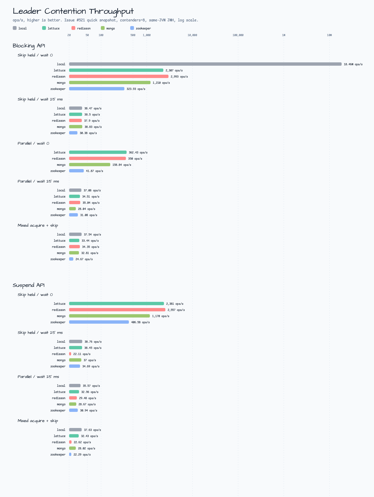
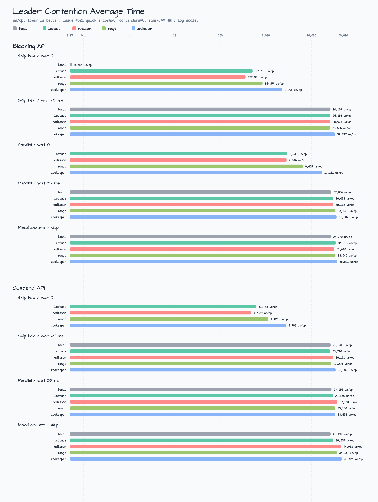

# 이슈 #521 리더 경합 벤치마크

문제 #521에는 단일 리더 선거인에 대한 집중 경합 및 경로 건너뛰기 벤치마크가 추가되었습니다. 벤치마크는 기존 보유자 건너뛰기 경로, 병렬 경쟁자 경로 및
혼합 획득/건너뛰기 경로를 분리하므로 하나의 일반적인 'runIfLeader' 행으로 접히는 대신 선출 결과와 건너뛴 결과가 표시됩니다.

이러한 결과는 동일한 머신의 빠른 스냅샷입니다. 회귀 추적, README 차트 및 백엔드 형태 검사에 유용합니다. 이는 릴리스 등급 성능 주장이 아닙니다.

## 범위

- 원격/공유 백엔드 차단: 벤치마크 소스에서 Lettuce, Redisson, MongoDB, ZooKeeper 및 Exposed JDBC H2.
- 벤치마크 소스에서 원격/공유 백엔드(Lettuce, Redisson, MongoDB, ZooKeeper 및 Exposed R2DBC H2)를 일시
- 중단합니다.
- 로컬 잠금 인스턴스는 동일한 선출기 인스턴스가 공유될 때만 경합하기 때문에 로컬 블로킹 및 로컬 일시 중지 기준선은 로컬 전용 클래스에서 격리됩니다.
- README 차트 데이터는 `contenders=8`, `-f 0`, 준비 작업 없음, 100ms 측정 반복을 사용합니다.
- 노출된 H2 경합 행은 벤치마크 소스에서 구현되지만 README 차트 스냅샷은 원격 백엔드와 로컬 기준 행에 중점을 둡니다.

## 차트

높을수록 처리량이 더 좋습니다. 평균 시간에는 낮을수록 좋습니다. 즉시 로컬 건너뛰기, 원격 즉시 건너뛰기 및 긍정적 대기 경합 경로가 몇 배나 다르기 때문에
두 차트 모두 로그 스케일을 사용합니다.





## 명령

벤치마크 jar가 먼저 컴파일되었습니다.

```bash
./gradlew :benchmark:compileBenchmarkKotlin --no-daemon --no-configuration-cache --console=plain
./gradlew :benchmark:benchmarkBenchmarkJar --no-daemon --no-configuration-cache --console=plain
```

README 스냅샷은 생성된 JMH jar에서 수집되었습니다.

```bash
JAR=benchmark/build/benchmarks/benchmark/jars/benchmark-benchmark-jmh-0.5.0-JMH.jar

java -jar "$JAR" 'io\.bluetape4k\.leader\.benchmark\.(BlockingLeaderContentionElectorBenchmark|SuspendLeaderContentionElectorBenchmark)\..*' \
  -p backend=lettuce,redisson,mongo,zookeeper \
  -p contenders=8 \
  -bm thrpt -tu s -f 0 -wi 0 -i 1 -r 100ms \
  -rf json -rff docs/benchmarks/2026-07-02-issue-521-contention-remote-throughput.json

java -jar "$JAR" 'io\.bluetape4k\.leader\.benchmark\.(BlockingLeaderContentionElectorBenchmark|SuspendLeaderContentionElectorBenchmark)\..*' \
  -p backend=lettuce,redisson,mongo,zookeeper \
  -p contenders=8 \
  -bm avgt -tu us -f 0 -wi 0 -i 1 -r 100ms \
  -rf json -rff docs/benchmarks/2026-07-02-issue-521-contention-remote-average-time.json

java -jar "$JAR" 'io\.bluetape4k\.leader\.benchmark\.Local.*LeaderContentionElectorBenchmark\..*' \
  -p contenders=8 \
  -bm thrpt -tu s -f 0 -wi 0 -i 1 -r 100ms \
  -rf json -rff docs/benchmarks/2026-07-02-issue-521-contention-local-throughput.json

java -jar "$JAR" 'io\.bluetape4k\.leader\.benchmark\.Local.*LeaderContentionElectorBenchmark\..*' \
  -p contenders=8 \
  -bm avgt -tu us -f 0 -wi 0 -i 1 -r 100ms \
  -rf json -rff docs/benchmarks/2026-07-02-issue-521-contention-local-average-time.json
```

Smoke 검증은 또한 `contenders=2`를 사용하여 로컬 전용 벤치마크 클래스와 컨테이너 지원 Lettuce 건너뛰기 경로 하위 집합을 실행했습니다.

## 원본 데이터

- [`2026-07-02-issue-521-contention-remote-throughput.json`](2026-07-02-issue-521-contention-remote-throughput.json)
- [`2026-07-02-issue-521-contention-remote-average-time.json`](2026-07-02-issue-521-contention-remote-average-time.json)
- [`2026-07-02-issue-521-contention-local-throughput.json`](2026-07-02-issue-521-contention-local-throughput.json)
- [`2026-07-02-issue-521-contention-local-average-time.json`](2026-07-02-issue-521-contention-local-average-time.json)

## 결과표

| API | Scenario | Backend | Throughput (ops/s) | Average time (us/op) |
|---|---|---|---:|---:|
| Blocking | Skip held / wait 0 | local | 18,457,123 | 0.056 |
| Blocking | Skip held / wait 0 | lettuce | 2,307 | 511.16 |
| Blocking | Skip held / wait 0 | redisson | 2,993 | 357.93 |
| Blocking | Skip held / wait 0 | mongo | 1,210 | 844.57 |
| Blocking | Skip held / wait 0 | zookeeper | 323.93 | 2,296 |
| Blocking | Skip held / wait 25 ms | local | 38.47 | 26,109 |
| Blocking | Skip held / wait 25 ms | lettuce | 38.5 | 26,058 |
| Blocking | Skip held / wait 25 ms | redisson | 37.9 | 25,976 |
| Blocking | Skip held / wait 25 ms | mongo | 38.83 | 25,626 |
| Blocking | Skip held / wait 25 ms | zookeeper | 30.38 | 32,747 |
| Blocking | Parallel / wait 0 | lettuce | 362.43 | 2,932 |
| Blocking | Parallel / wait 0 | redisson | 350 | 2,846 |
| Blocking | Parallel / wait 0 | mongo | 158.84 | 6,458 |
| Blocking | Parallel / wait 0 | zookeeper | 41.87 | 17,101 |
| Blocking | Parallel / wait 25 ms | local | 37.08 | 27,066 |
| Blocking | Parallel / wait 25 ms | lettuce | 34.51 | 30,093 |
| Blocking | Parallel / wait 25 ms | redisson | 35.04 | 30,112 |
| Blocking | Parallel / wait 25 ms | mongo | 28.04 | 33,632 |
| Blocking | Parallel / wait 25 ms | zookeeper | 31.08 | 35,607 |
| Blocking | Mixed acquire + skip | local | 37.54 | 26,720 |
| Blocking | Mixed acquire + skip | lettuce | 33.44 | 34,213 |
| Blocking | Mixed acquire + skip | redisson | 34.35 | 31,610 |
| Blocking | Mixed acquire + skip | mongo | 32.81 | 33,646 |
| Blocking | Mixed acquire + skip | zookeeper | 24.67 | 36,621 |
| Suspend | Skip held / wait 0 | lettuce | 2,381 | 612.83 |
| Suspend | Skip held / wait 0 | redisson | 2,557 | 467.89 |
| Suspend | Skip held / wait 0 | mongo | 1,170 | 1,126 |
| Suspend | Skip held / wait 0 | zookeeper | 406.58 | 2,788 |
| Suspend | Skip held / wait 25 ms | local | 38.76 | 26,341 |
| Suspend | Skip held / wait 25 ms | lettuce | 38.45 | 25,710 |
| Suspend | Skip held / wait 25 ms | redisson | 22.11 | 30,111 |
| Suspend | Skip held / wait 25 ms | mongo | 37 | 27,206 |
| Suspend | Skip held / wait 25 ms | zookeeper | 34.69 | 33,887 |
| Suspend | Parallel / wait 25 ms | local | 35.57 | 27,552 |
| Suspend | Parallel / wait 25 ms | lettuce | 32.96 | 29,658 |
| Suspend | Parallel / wait 25 ms | redisson | 29.48 | 37,131 |
| Suspend | Parallel / wait 25 ms | mongo | 28.67 | 33,180 |
| Suspend | Parallel / wait 25 ms | zookeeper | 30.94 | 33,493 |
| Suspend | Mixed acquire + skip | local | 37.63 | 26,499 |
| Suspend | Mixed acquire + skip | lettuce | 32.43 | 30,257 |
| Suspend | Mixed acquire + skip | redisson | 22.62 | 44,968 |
| Suspend | Mixed acquire + skip | mongo | 28.02 | 35,939 |
| Suspend | Mixed acquire + skip | zookeeper | 22.29 | 46,421 |

## 해석

기존 홀더 설정은 건너뛰기 결과에서 작업 본문이 실행되지 않는지 확인합니다. 따라서 즉시 건너뛰기 행은 보류된 잠금을 감지하고 숨겨진 작업 경로가 아닌
'LeaderRunResult.Skipped'를 반환하는 백엔드 비용을 측정합니다.

로컬 차단 `waitTime=0` 건너뛰기 행은 진행 중인 잠금 상태 검사이기 때문에 의도적으로 원격 행보다 훨씬 빠릅니다. 원격 즉시 건너뛰기 행은 여전히
​​백엔드에 닿아야 합니다. 이 단기에서는 Redisson과 Lettuce가 원격 즉시 건너뛰기 행을 주도하고 MongoDB가 중간에 위치하며
ZooKeeper가 가장 높은 조정 비용을 지불합니다.

대략 25ms 대기 창당 하나의 작업 주위에 긍정적 대기 행 클러스터가 있습니다. 이는 예상된 결과입니다. 구성된 대기 정책이 측정을 지배하므로 백엔드 차이가
압축됩니다. 이러한 행은 백엔드 순위 행보다 회귀 연기 검사로 더 유용합니다.

병렬 `waitTime=0`은 차단 원격/공유 벤치마크에만 존재합니다. 로컬 일시 중지 구현은 `withTimeoutOrNull(0)`을 사용하므로 의미 있는
경합이 측정되기 전에 즉시 무료 획득이 시간 초과될 수 있습니다. 따라서 일시 중지 로컬 기준은 긍정적 대기 및 혼합 행을 유지하는 반면 원격 일시 중지 즉시
건너뛰기는 잠금 유지 시나리오의 적용을 받습니다.

혼합 획득/건너뛰기 행은 동일한 측정에서 하나의 리더 경로와 건너뛴 여러 경쟁 경로를 유지합니다. 건너뛴 경쟁자가 돌아오기 전에 여전히 기다리기 때문에 지연
시간은 긍정적인 대기 형태에 가깝습니다. 이러한 행은 백엔드가 건너뛴 경쟁자에 대해 실수로 작업을 실행하거나 반복 전반에 걸쳐 유지 상태를 누출하는 회귀를
감지하는 데 유용합니다.
