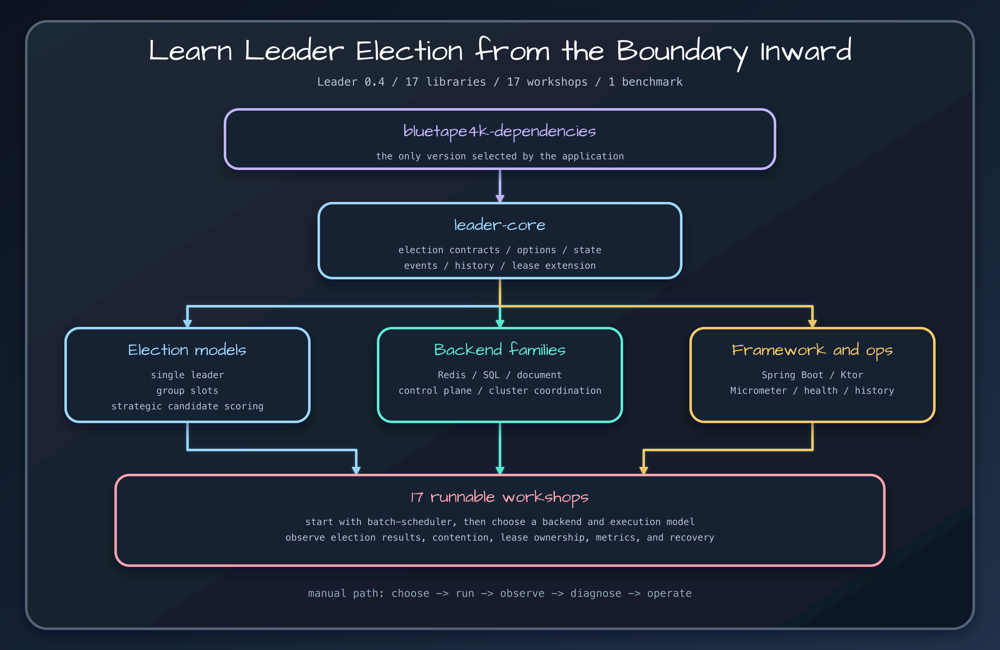

# Repository and learning map

Understand which modules define contracts, implement storage, integrate frameworks, and demonstrate complete scenarios.

## Four layers

`leader-core` owns API semantics and local implementations. Backend modules implement those contracts against Redis, SQL, document stores, coordination systems, or Kubernetes. Framework modules integrate Spring Boot, Ktor, and Micrometer. The 17 `examples/*` projects combine these pieces into runnable operational scenarios.

## Choose by responsibility

Read core before a backend so contention, cancellation, and lease semantics remain stable when infrastructure changes. Read a framework page only after choosing an elector. Use examples to validate startup, shutdown, metrics, and failure behavior; do not add example projects as dependencies because they are excluded from publication.

## Stable and preview

Release 0.4.0 marks core, Redis, Exposed, MongoDB, Hazelcast, ZooKeeper, framework integrations, and Micrometer as stable. DynamoDB, etcd, Consul, and Kubernetes are preview modules. Preview means the operational contract deserves extra integration tests and rollback planning, not that contention semantics change.

## Release sources

- [`settings.gradle.kts`](../../../../settings.gradle.kts)
- [`README.md`](../../../../README.md)
- [`build.gradle.kts`](../../../../build.gradle.kts)

## Continue learning

- [Bluetape4k Leader manual](../index.md)
- [Learning path](../guides/learning-path.md)
- [Choose a backend](../guides/backend-selection.md)
