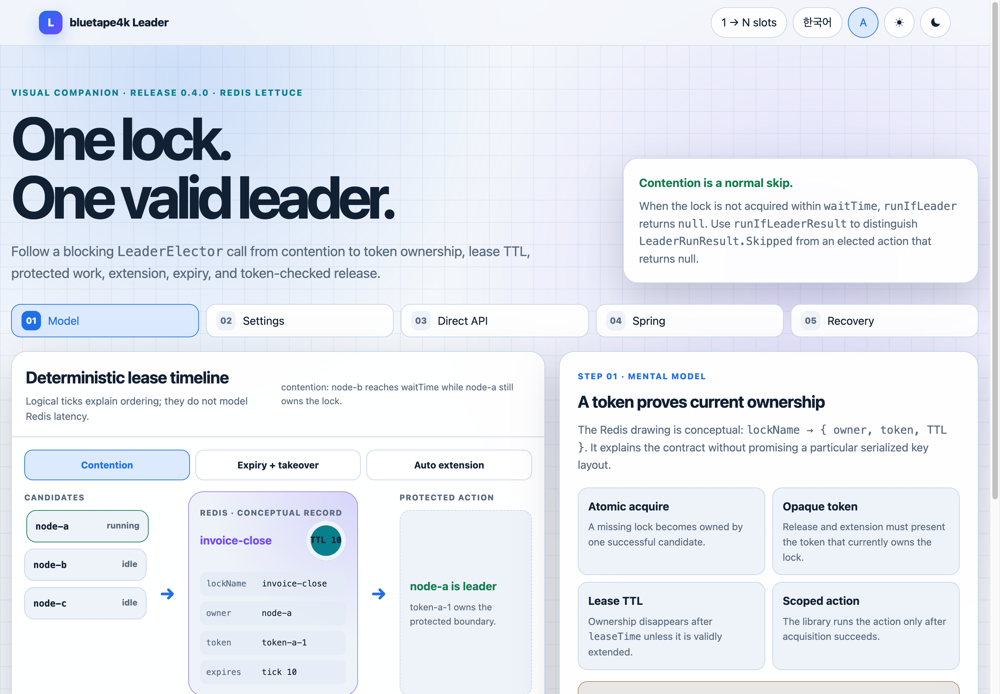
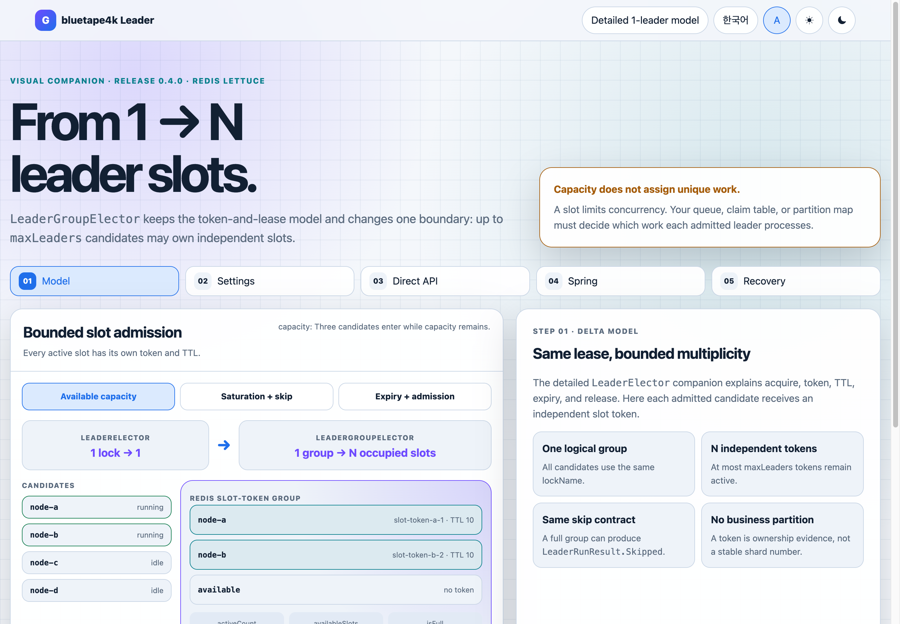

# Spring Boot integration

Auto-configure electors and guard invocations with AspectJ compile-time weaving.

## Interactive visual companions

The detailed [`LeaderElector` walkthrough](/visual-companions/bluetape4k-leader/leader-elector/) connects lock, token, TTL, lease expiry, `autoExtend`, the direct API, and `@LeaderElection`. The [`LeaderGroupElector` delta](/visual-companions/bluetape4k-leader/leader-group-elector/) adds bounded `maxLeaders` slots and the `@LeaderGroupElection` constraints without repeating the single-leader model.

[](/visual-companions/bluetape4k-leader/leader-elector/)

[](/visual-companions/bluetape4k-leader/leader-group-elector/)

## Weaving model

Release 0.5.0 uses Freefair post-compile AspectJ weaving. Do not add `@EnableAspectJAutoProxy`, and Kotlin methods do not need to be `open`. Private methods are not intercepted; startup validation reports invalid declarations. Verify the woven application artifact, not only a plain unit test.

## Annotations

`@LeaderElection` supports nullable synchronous and suspend results plus Mono, Flux, and Flow. Long streams require `autoExtend=true`, or `streamBounded=true` only when completion is guaranteed inside the lease. `@LeaderGroupElection` supports synchronous, suspend, and Mono, but rejects Flux and Flow because per-slot stream extension is undefined.

## Configuration safety

Use valid SpEL such as `"'prefix-' + #param"`. Invalid expressions and impossible group settings fail validation. Auto-configuration orders elector creation, AOP factories, Micrometer, then aspects so instrumentation sees the same execution boundary.

## Readiness and recent acquisition failures

The opt-in `leaderElectionReadiness` contributor reads only the JVM-local lock-name registry. Configure the bounded observation window for backend acquisition failures with:

```yaml
bluetape4k:
  leader:
    observability:
      health:
        enabled: true
        acquisition-failure-window: 5m
```

The default window is `5m`, with a fixed retention capacity of `1024` timestamps. Only AOP `BACKEND_ERROR` skips are counted; `CONTENTION` and `FAIL_OPEN_FORCED` are intentionally excluded. Readiness details expose `recentAcquisitionFailures`, `lastAcquisitionFailureAt`, `acquisitionFailureWindow`, `acquisitionFailureWindowCapacity`, and `acquisitionFailureWindowOverflowed`. An overflowed window makes the count a lower bound. Once all retained failures expire, `lastAcquisitionFailureAt` is `null`.

This recorder is best-effort and aggregate-only. Recent failures do not change the contributor status (`UP`, `OUT_OF_SERVICE`, `DOWN`, or `UNKNOWN`), and the detail never retains lock names or exception messages. Protect Actuator endpoints and keep dynamic lock-name registration bounded because each registered name still causes one backend state read per health evaluation.

## Release sources

- [`leader-spring-boot/README.md`](../../../../leader-spring-boot/README.md)
- [`leader-core/src/main/kotlin/io/bluetape4k/leader/annotation/LeaderElection.kt`](../../../../leader-core/src/main/kotlin/io/bluetape4k/leader/annotation/LeaderElection.kt)
- [`leader-core/src/main/kotlin/io/bluetape4k/leader/annotation/LeaderGroupElection.kt`](../../../../leader-core/src/main/kotlin/io/bluetape4k/leader/annotation/LeaderGroupElection.kt)

## Continue learning

- [Bluetape4k Leader manual](../index.md)
- [Spring Boot or Ktor](../guides/spring-vs-ktor.md)
- [Micrometer integration](micrometer.md)
