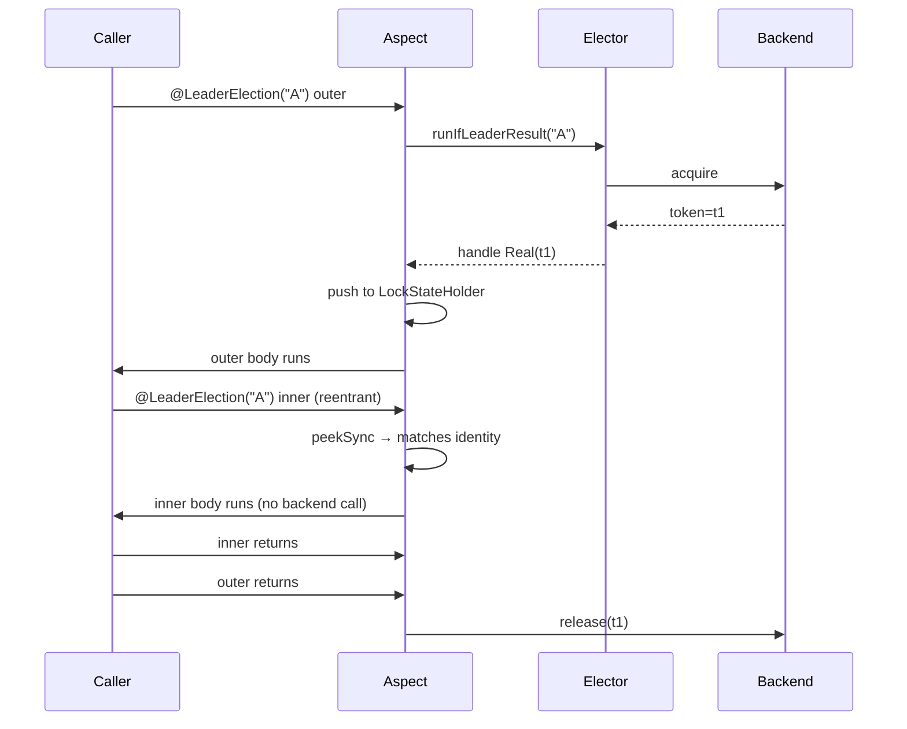

# LockExtender / LockAssert + Reentrant `@LeaderElection` + Explicit Lease Extension Implementation Plan

> **For agentic workers:** REQUIRED SUB-SKILL: Use superpowers:subagent-driven-development (recommended) or superpowers:executing-plans to implement this plan task-by-task. Steps use checkbox (`- [ ]`) syntax for tracking.

**Goal:** ShedLock-등가 `LockAssert.assertLocked()` / `LockExtender.extendActiveLock(Duration)` 추가 + `@LeaderElection`/`@LeaderGroupElection` 의 reentrant 의미론 정의 + 8 backend 의 atomic explicit lease extension API 신설.

**Architecture:** sealed `LeaderLockHandle { Real, FailOpen }` + `LockIdentity` 4-tuple (lockName, kind, factoryBean, groupParams) + ThreadLocal Deque(`LockStateHolder`) + `CoroutineContext.Element`(`LockHandleElement`) 로 sync/suspend/Mono 3 분기 propagation. Watchdog 와 LockExtender 는 단일 `ExtendDelegate` reference 공유 → race-free atomic backend extend. Aspect 가 full identity reentrant peek + fail-open sentinel push (contention + backend exception 양쪽) 을 수행.

**Tech Stack:** Kotlin 2.3, Java 21, Spring Boot 4.x AOP (AspectJ CTW), Coroutines, Lettuce/Redisson/MongoDB/Exposed JDBC·R2DBC/Hazelcast/ZooKeeper/Local, JUnit 5 + MockK + bluetape4k-assertions + Testcontainers.

**Spec:** [`docs/superpowers/specs/2026-05-10-lock-extender-design.md`](../specs/2026-05-10-lock-extender-design.md) — Round 8 architectural convergence (Codex P0/P1=0), 117 finding 통합.

**Critical path:** T1 → T2 → T3 → T4 → T14 → T17 → T18 → T19.

**Parallel windows** (R3-Plan-R1-P3 — dependency graph 정확화):
- T5 는 T1, T3 후 시작 (backend 의 capture/extend 가 의존)
- T7~T13 backend tasks 는 **T5 완료 후** 병렬 가능 (단 T11 R2DBC 는 T10 JDBC 의 SQL 패턴 참조 — T10 → T11 직렬)
- T14 는 T1~T4 모두 완료 후 시작 (LockAssert/LockExtender 사용)
- T15 는 T14 후
- T16 (validator) 는 T1~T4 의존 — T14 와 병렬 가능

**Effort estimate (19 tasks):**
- high (8): T7, T8, T12, T14, T15, T17 + critical paths
- medium (8): T1, T4, T5, T6, T9, T10, T11, T16, T18
- low (3): T2, T3, T13, T19

---

## File Structure Map

### `leader-core` (신규 + 수정)
- Create: `leader-core/src/main/kotlin/io/bluetape4k/leader/LeaderLockHandle.kt` — sealed class Real/FailOpen
- Create: `leader-core/src/main/kotlin/io/bluetape4k/leader/LockIdentity.kt` — 4-tuple identity
- Create: `leader-core/src/main/kotlin/io/bluetape4k/leader/ExtendOutcome.kt` — sealed result
- Create: `leader-core/src/main/kotlin/io/bluetape4k/leader/LockAssert.kt` — top-level object
- Create: `leader-core/src/main/kotlin/io/bluetape4k/leader/LockExtender.kt` — top-level object
- Create: `leader-core/src/main/kotlin/io/bluetape4k/leader/internal/LockStateHolder.kt` — ThreadLocal Deque
- Create: `leader-core/src/main/kotlin/io/bluetape4k/leader/internal/LeaderLockHandleCapture.kt` — elector → aspect ThreadLocal
- Create: `leader-core/src/main/kotlin/io/bluetape4k/leader/internal/ExtendDelegate.kt` — SPI
- Create: `leader-core/src/main/kotlin/io/bluetape4k/leader/internal/BackendErrorClassifier.kt` — SPI + Core + Composite
- Create: `leader-core/src/main/kotlin/io/bluetape4k/leader/coroutines/LockHandleElement.kt` — CoroutineContext.Element
- Modify: `leader-core/src/main/kotlin/io/bluetape4k/leader/SuspendLeaderElector.kt` — `runIfLeaderResultSuspend` default fun
- Modify: `leader-core/src/main/kotlin/io/bluetape4k/leader/SuspendLeaderGroupElector.kt` — `runIfLeaderResultSuspend` default fun
- Modify: `leader-core/src/main/kotlin/io/bluetape4k/leader/LeaderLeaseAutoExtender.kt` — `start(delegate: ExtendDelegate)` 시그니처 변경
- Modify: `leader-core/src/main/kotlin/io/bluetape4k/leader/local/*` — capture + extend 메서드 추가

### Backend modules (각 8 backend 별 lock + elector)
- `leader-redis-lettuce/.../lock/LettuceLock.kt`, `LettuceSuspendLock.kt`, `semaphore/LettuceSlotTokenGroup.kt`, `LettuceLeaderElector.kt`, `LettuceSuspendLeaderElector.kt`, `LettuceLeaderGroupElector.kt`, `LettuceSuspendLeaderGroupElector.kt`, `internal/LettuceBackendErrorClassifier.kt` (Create)
- `leader-redis-redisson/.../RedissonLeaderElector.kt`, `RedissonSuspendLeaderElector.kt`, `RedissonLeaderGroupElector.kt`, `RedissonSuspendLeaderGroupElector.kt`, `internal/RedissonBackendErrorClassifier.kt` (Create)
- `leader-mongodb/.../lock/MongoLock.kt`, `MongoSuspendLock.kt`, `MongoLeaderGroupElector.kt`, `MongoSuspendLeaderGroupElector.kt`, `internal/MongoBackendErrorClassifier.kt` (Create)
- `leader-exposed-jdbc/.../lock/ExposedJdbcLock.kt`, `ExposedJdbcGroupLock.kt`, `internal/JdbcBackendErrorClassifier.kt` (Create)
- `leader-exposed-r2dbc/.../lock/ExposedR2dbcLock.kt`, `ExposedR2dbcGroupLock.kt`, `internal/R2dbcBackendErrorClassifier.kt` (Create)
- `leader-hazelcast/.../lock/HazelcastLock.kt`, `HazelcastSuspendLock.kt`, `ExtendEntryProcessor.kt` (Create), group variants, `internal/HazelcastBackendErrorClassifier.kt`
- `leader-zookeeper/.../ZkLeaderElector.kt`, `ZkSuspendLeaderElector.kt` (passthrough extend), `internal/ZkBackendErrorClassifier.kt`

### `leader-spring-boot` (aspect + validator)
- Modify: `leader-spring-boot/.../aop/LeaderElectionAspect.kt` — 3 분기 + reentrant peek + sentinel + capture
- Modify: `leader-spring-boot/.../aop/LeaderGroupElectionAspect.kt` — group 분기 동일
- Modify: `leader-spring-boot/.../aop/validator/LeaderAnnotationValidatorBeanPostProcessor.kt` — CompletableFuture/Future/ListenableFuture 차단
- Create: `leader-spring-boot/.../aop/internal/AdviceMetadata.kt` + `AdviceBranch.kt` + `BodyThrownMarker.kt` + `CaptureInvariantException.kt`

### Docs
- Modify: `leader-spring-boot/README.md` + `README.ko.md`
- Modify: `CHANGELOG.md`, `WIP.md`
- Modify: `CLAUDE.md` (3 군데 — workspace root, project root, worktree)
- Modify: `examples/ktor-app/README.md` + source — `LockAssertSuspend` 사용 예
- Modify: 각 8 backend README "extend supported" 한 줄

---

## Task 1: Core types — `LeaderLockHandle`, `LockIdentity`, `ExtendOutcome`, internal mechanisms

**Complexity:** medium
**Module:** `leader-core`
**Depends on:** —
**Satisfies AC:** AC-10 (KDoc), part of AC-2/2b (identity), AC-11 (detekt)

**Files:**
- Create: `leader-core/src/main/kotlin/io/bluetape4k/leader/LockIdentity.kt`
- Create: `leader-core/src/main/kotlin/io/bluetape4k/leader/ExtendOutcome.kt`
- Create: `leader-core/src/main/kotlin/io/bluetape4k/leader/LeaderLockHandle.kt`
- Create: `leader-core/src/main/kotlin/io/bluetape4k/leader/internal/ExtendDelegate.kt`
- Create: `leader-core/src/main/kotlin/io/bluetape4k/leader/internal/LockStateHolder.kt`
- Create: `leader-core/src/main/kotlin/io/bluetape4k/leader/internal/LeaderLockHandleCapture.kt`
- Test: `leader-core/src/test/kotlin/io/bluetape4k/leader/LockIdentityTest.kt`
- Test: `leader-core/src/test/kotlin/io/bluetape4k/leader/ExtendOutcomeTest.kt`
- Test: `leader-core/src/test/kotlin/io/bluetape4k/leader/LeaderLockHandleTest.kt`
- Test: `leader-core/src/test/kotlin/io/bluetape4k/leader/internal/LockStateHolderTest.kt`
- Test: `leader-core/src/test/kotlin/io/bluetape4k/leader/internal/LeaderLockHandleCaptureTest.kt`

- [ ] **Step 1: Write failing test — `LockIdentity` invariant**

```kotlin
// leader-core/src/test/kotlin/io/bluetape4k/leader/LockIdentityTest.kt
package io.bluetape4k.leader

import io.bluetape4k.assertions.assertFailsWith
import org.amshove.kluent.shouldBeEqualTo
import org.junit.jupiter.api.Test
import org.junit.jupiter.api.TestInstance

@TestInstance(TestInstance.Lifecycle.PER_CLASS)
class LockIdentityTest {
    @Test
    fun `single kind without groupParams is allowed`() {
        val id = LockIdentity("job-A", LockIdentity.AnnotationKind.SINGLE, "lettuceFactory")
        id.lockName shouldBeEqualTo "job-A"
        id.groupParams shouldBeEqualTo null
    }

    @Test
    fun `group kind requires groupParams`() {
        assertFailsWith<IllegalArgumentException> {
            LockIdentity("job-A", LockIdentity.AnnotationKind.GROUP, "lettuceGroupFactory", groupParams = null)
        }
    }

    @Test
    fun `single kind forbids groupParams`() {
        assertFailsWith<IllegalArgumentException> {
            LockIdentity(
                "job-A",
                LockIdentity.AnnotationKind.SINGLE,
                "lettuceFactory",
                groupParams = LockIdentity.GroupParams(maxLeaders = 3),
            )
        }
    }

    @Test
    fun `equality compares all four tuple components`() {
        val a = LockIdentity("X", LockIdentity.AnnotationKind.SINGLE, "f1")
        val b = LockIdentity("X", LockIdentity.AnnotationKind.SINGLE, "f1")
        val c = LockIdentity("X", LockIdentity.AnnotationKind.SINGLE, "f2")
        (a == b) shouldBeEqualTo true
        (a == c) shouldBeEqualTo false
    }
}
```

- [ ] **Step 2: Run test, expect FAIL (compile error — `LockIdentity` 미존재)**

```bash
./gradlew :leader-core:test --tests "io.bluetape4k.leader.LockIdentityTest" --no-daemon
# Expected: FAIL — Unresolved reference: LockIdentity
```

- [ ] **Step 3: Implement `LockIdentity`**

```kotlin
// leader-core/src/main/kotlin/io/bluetape4k/leader/LockIdentity.kt
package io.bluetape4k.leader

/**
 * Reentrant dedupe 비교 단위. lockName 만으로는 Single ↔ Group 구분 불가 → full identity 필수.
 *
 * ## 동작/계약
 * - `kind == GROUP` ↔ `groupParams != null` invariant (init require)
 * - `factoryBeanName` 은 branch 별 elector factory 의 Spring bean name. sync/suspend/group/suspend-group 가 모두 다른 bean.
 *
 * ## Example
 * ```kotlin
 * val syncId = LockIdentity("report-job", LockIdentity.AnnotationKind.SINGLE, "lettuceLeaderElectorFactory")
 * val groupId = LockIdentity("group-job", LockIdentity.AnnotationKind.GROUP, "lettuceGroupFactory",
 *     LockIdentity.GroupParams(maxLeaders = 3))
 * ```
 */
data class LockIdentity(
    val lockName: String,
    val kind: AnnotationKind,
    val factoryBeanName: String,
    val groupParams: GroupParams? = null,
) {
    init {
        require((kind == AnnotationKind.GROUP) == (groupParams != null)) {
            "GROUP kind requires groupParams; SINGLE kind forbids it (kind=$kind, groupParams=$groupParams)"
        }
    }

    enum class AnnotationKind { SINGLE, GROUP }

    /** Currently `maxLeaders` only — 신규 필드 추가 시 default value 필수 (binary-compat). */
    data class GroupParams(val maxLeaders: Int)
}
```

- [ ] **Step 4: Run test, expect PASS**

```bash
./gradlew :leader-core:test --tests "io.bluetape4k.leader.LockIdentityTest" --no-daemon
# Expected: PASS (4/4)
```

- [ ] **Step 5: Write failing test — `ExtendOutcome` sealed result**

```kotlin
// leader-core/src/test/kotlin/io/bluetape4k/leader/ExtendOutcomeTest.kt
package io.bluetape4k.leader

import org.amshove.kluent.shouldBeEqualTo
import org.amshove.kluent.shouldBeInstanceOf
import org.junit.jupiter.api.Test
import org.junit.jupiter.api.TestInstance
import java.time.Instant

@TestInstance(TestInstance.Lifecycle.PER_CLASS)
class ExtendOutcomeTest {
    @Test
    fun `Extended carries observedExpireAt`() {
        val now = Instant.now()
        val out: ExtendOutcome = ExtendOutcome.Extended(now)
        out shouldBeInstanceOf ExtendOutcome.Extended::class
        (out as ExtendOutcome.Extended).observedExpireAt shouldBeEqualTo now
        out.isExtended shouldBeEqualTo true
    }

    @Test
    fun `NotHeld is data object singleton`() {
        val a: ExtendOutcome = ExtendOutcome.NotHeld
        val b: ExtendOutcome = ExtendOutcome.NotHeld
        (a === b) shouldBeEqualTo true
        a.isExtended shouldBeEqualTo false
    }

    @Test
    fun `WrongThread is data object singleton`() {
        val a: ExtendOutcome = ExtendOutcome.WrongThread
        a.isExtended shouldBeEqualTo false
    }

    @Test
    fun `BackendError wraps Exception cause`() {
        val cause = java.io.IOException("transient")
        val out: ExtendOutcome = ExtendOutcome.BackendError(cause)
        (out as ExtendOutcome.BackendError).cause shouldBeEqualTo cause
        out.isExtended shouldBeEqualTo false
    }
}
```

- [ ] **Step 6: Implement `ExtendOutcome`**

```kotlin
// leader-core/src/main/kotlin/io/bluetape4k/leader/ExtendOutcome.kt
package io.bluetape4k.leader

import java.time.Instant

/**
 * `LeaderLockHandle.Real.extend` 의 상세 결과. Boolean 시그니처는 `isExtended` 로 단순 변환.
 *
 * ## Variants
 * - [Extended] — atomic backend extend 성공. `observedExpireAt` 는 best-effort (backend별 정확도 §5.3 spec).
 * - [NotHeld] — token mismatch / lease expired / takeover.
 * - [WrongThread] — Redisson thread-bound (acquire thread ≠ extend thread).
 * - [BackendError] — transient (false 변환) / non-transient (caller 가 throw 결정). FATAL Error 는 propagate (catch 안 함).
 */
sealed interface ExtendOutcome {
    data class Extended(val observedExpireAt: Instant) : ExtendOutcome
    data object NotHeld : ExtendOutcome
    data object WrongThread : ExtendOutcome
    data class BackendError(val cause: Exception) : ExtendOutcome

    val isExtended: Boolean get() = this is Extended
}
```

- [ ] **Step 7: Run test, expect PASS**

```bash
./gradlew :leader-core:test --tests "io.bluetape4k.leader.ExtendOutcomeTest" --no-daemon
# Expected: PASS (4/4)
```

- [ ] **Step 8: Write failing test — `ExtendDelegate` SPI default behavior**

```kotlin
// leader-core/src/test/kotlin/io/bluetape4k/leader/internal/ExtendDelegateTest.kt
package io.bluetape4k.leader.internal

import io.bluetape4k.leader.ExtendOutcome
import kotlinx.coroutines.test.runTest
import org.amshove.kluent.shouldBeEqualTo
import org.junit.jupiter.api.Test
import org.junit.jupiter.api.TestInstance
import java.time.Instant
import kotlin.time.Duration.Companion.seconds

@TestInstance(TestInstance.Lifecycle.PER_CLASS)
class ExtendDelegateTest {
    @Test
    fun `extendSuspend default calls sync extend`() = runTest {
        var syncCalls = 0
        val delegate = object : ExtendDelegate {
            override fun extend(lockAtMostFor: kotlin.time.Duration): ExtendOutcome {
                syncCalls++
                return ExtendOutcome.Extended(Instant.now())
            }
            override fun isHeld(): Boolean = true
        }
        delegate.extendSuspend(10.seconds).isExtended shouldBeEqualTo true
        syncCalls shouldBeEqualTo 1
    }
}
```

- [ ] **Step 9: Implement `ExtendDelegate`**

```kotlin
// leader-core/src/main/kotlin/io/bluetape4k/leader/internal/ExtendDelegate.kt
package io.bluetape4k.leader.internal

import io.bluetape4k.leader.ExtendOutcome
import kotlin.time.Duration

/**
 * Backend lock 의 atomic extend 단일 reference. `LeaderLockHandle.Real` 와 `LeaderLeaseAutoExtender`
 * 가 동일 instance 를 참조 — race-free + last-write-wins.
 *
 * ## 동작/계약
 * - `extendSuspend` default 구현 = sync `extend` 직접 호출 → **local / non-blocking backend 전용**.
 * - Blocking backend (Lettuce sync, Hazelcast, Exposed JDBC, Redisson) 는 반드시 override 하여
 *   `withContext(Dispatchers.IO)` + `coroutineContext.ensureActive()` 사용 (AC-21 grep verify).
 * - `CancellationException` 은 항상 re-throw (`catch(Exception)` 앞에 위치).
 */
internal interface ExtendDelegate {
    fun extend(lockAtMostFor: Duration): ExtendOutcome
    suspend fun extendSuspend(lockAtMostFor: Duration): ExtendOutcome = extend(lockAtMostFor)
    fun isHeld(): Boolean
}
```

- [ ] **Step 10: Run test, expect PASS**

```bash
./gradlew :leader-core:test --tests "io.bluetape4k.leader.internal.ExtendDelegateTest" --no-daemon
# Expected: PASS (1/1)
```

- [ ] **Step 11: Write failing test — `LeaderLockHandle` Real/FailOpen**

```kotlin
// leader-core/src/test/kotlin/io/bluetape4k/leader/LeaderLockHandleTest.kt
package io.bluetape4k.leader

import io.bluetape4k.assertions.assertFailsWith
import io.bluetape4k.leader.internal.ExtendDelegate
import org.amshove.kluent.shouldBeEqualTo
import org.amshove.kluent.shouldBeInstanceOf
import org.junit.jupiter.api.Test
import org.junit.jupiter.api.TestInstance
import java.time.Instant
import kotlin.time.Duration

@TestInstance(TestInstance.Lifecycle.PER_CLASS)
class LeaderLockHandleTest {
    private val noopDelegate = object : ExtendDelegate {
        override fun extend(lockAtMostFor: Duration): ExtendOutcome = ExtendOutcome.Extended(Instant.now())
        override fun isHeld(): Boolean = true
    }
    private val id = LockIdentity("job-A", LockIdentity.AnnotationKind.SINGLE, "factoryA")

    @Test
    fun `Real exposes identity and lockName accessor`() {
        val real = LeaderLockHandle.real(id, "tok", 0L, noopDelegate)
        real shouldBeInstanceOf LeaderLockHandle.Real::class
        real.lockName shouldBeEqualTo "job-A"
        real.isReentrant shouldBeEqualTo false
    }

    @Test
    fun `FailOpen sentinel preserves identity`() {
        val fo = LeaderLockHandle.failOpen(id)
        fo shouldBeInstanceOf LeaderLockHandle.FailOpen::class
        fo.lockName shouldBeEqualTo "job-A"
        fo.reentryDepth shouldBeEqualTo 0
    }

    @Test
    fun `matchesIdentity compares all 4 components`() {
        val real = LeaderLockHandle.real(id, "tok", 0L, noopDelegate)
        real.matchesIdentity(id) shouldBeEqualTo true
        real.matchesIdentity(id.copy(factoryBeanName = "other")) shouldBeEqualTo false
    }

    @Test
    fun `withReentryDepth produces copy with passthrough delegate`() {
        val real = LeaderLockHandle.real(id, "tok", 0L, noopDelegate)
        val inner = real.withReentryDepth(1)
        inner.isReentrant shouldBeEqualTo true
        inner.reentryDepth shouldBeEqualTo 1
        // ⭐ delegate reference 동일 — passthrough extend = outer lease 갱신
        (inner.extendDelegate === real.extendDelegate) shouldBeEqualTo true
    }

    @Test
    fun `withReentryDepth rejects negative`() {
        val real = LeaderLockHandle.real(id, "tok", 0L, noopDelegate)
        assertFailsWith<IllegalArgumentException> { real.withReentryDepth(-1) }
    }

    @Test
    fun `equals uses identity token reentryDepth slotId — excludes delegate and threadId`() {
        val a = LeaderLockHandle.real(id, "tok", 0L, noopDelegate)
        val b = LeaderLockHandle.real(id, "tok", 999L, noopDelegate)  // acquiredAtNanos / threadId 다름
        a shouldBeEqualTo b
    }
}
```

- [ ] **Step 12: Implement `LeaderLockHandle`**

```kotlin
// leader-core/src/main/kotlin/io/bluetape4k/leader/LeaderLockHandle.kt
package io.bluetape4k.leader

import io.bluetape4k.leader.internal.ExtendDelegate
import kotlin.time.Duration

/**
 * 활성 lock 의 handle. AOP aspect 가 push 하고 [LockAssert] / [LockExtender] 가 read.
 *
 * ## Variants
 * - [Real] — 실제 backend lock 보유. `extend` / `extendSuspend` 호출 가능
 * - [FailOpen] — fail-open sentinel. extend 항상 `NotHeld` 반환
 *
 * `internal constructor` — 외부 source API 차단 (소스 API only — reflection boundary 아님).
 *
 * ## Example
 * ```kotlin
 * val handle = LeaderLockHandle.real(identity, token = "abc", acquiredAtNanos = System.nanoTime(),
 *     extendDelegate = myDelegate)
 * if (handle is LeaderLockHandle.Real) handle.extend(60.seconds)
 * ```
 */
sealed class LeaderLockHandle {
    abstract val identity: LockIdentity
    val lockName: String get() = identity.lockName
    abstract val reentryDepth: Int
    val isReentrant: Boolean get() = reentryDepth > 0
    fun matchesIdentity(other: LockIdentity): Boolean = identity == other

    class Real internal constructor(
        override val identity: LockIdentity,
        val token: String,
        val acquiredAtNanos: Long,
        val slotId: String? = null,
        val acquiringThreadId: Long? = null,
        override val reentryDepth: Int = 0,
        internal val extendDelegate: ExtendDelegate,
    ) : LeaderLockHandle() {
        fun extend(d: Duration): ExtendOutcome = extendDelegate.extend(d)
        suspend fun extendSuspend(d: Duration): ExtendOutcome = extendDelegate.extendSuspend(d)
        fun isStillHeld(): Boolean = extendDelegate.isHeld()

        /**
         * Reentrant passthrough copy. **inner extend → outer 의 `extendDelegate` 호출 → outer/backend lease 갱신.**
         */
        internal fun withReentryDepth(n: Int): Real {
            require(n >= 0) { "reentryDepth must be >= 0 (was $n)" }
            return Real(identity, token, acquiredAtNanos, slotId, acquiringThreadId, n, extendDelegate)
        }

        override fun equals(other: Any?): Boolean {
            if (this === other) return true
            if (other !is Real) return false
            return identity == other.identity &&
                token == other.token &&
                reentryDepth == other.reentryDepth &&
                slotId == other.slotId
        }

        override fun hashCode(): Int {
            var r = identity.hashCode()
            r = 31 * r + token.hashCode()
            r = 31 * r + reentryDepth
            r = 31 * r + (slotId?.hashCode() ?: 0)
            return r
        }

        override fun toString(): String =
            "LeaderLockHandle.Real(identity=$identity, token='$token', reentryDepth=$reentryDepth, slotId=$slotId)"
    }

    class FailOpen internal constructor(
        override val identity: LockIdentity,
    ) : LeaderLockHandle() {
        override val reentryDepth: Int = 0
        override fun toString(): String = "LeaderLockHandle.FailOpen(identity=$identity)"
    }

    companion object {
        internal fun real(
            identity: LockIdentity,
            token: String,
            acquiredAtNanos: Long,
            extendDelegate: ExtendDelegate,
            slotId: String? = null,
            acquiringThreadId: Long? = null,
        ): Real = Real(identity, token, acquiredAtNanos, slotId, acquiringThreadId, 0, extendDelegate)

        internal fun failOpen(identity: LockIdentity): FailOpen = FailOpen(identity)
    }
}
```

- [ ] **Step 13: Run handle test, expect PASS**

```bash
./gradlew :leader-core:test --tests "io.bluetape4k.leader.LeaderLockHandleTest" --no-daemon
# Expected: PASS (6/6)
```

- [ ] **Step 14: Write failing test — `LockStateHolder` ThreadLocal Deque**

```kotlin
// leader-core/src/test/kotlin/io/bluetape4k/leader/internal/LockStateHolderTest.kt
package io.bluetape4k.leader.internal

import io.bluetape4k.leader.ExtendOutcome
import io.bluetape4k.leader.LeaderLockHandle
import io.bluetape4k.leader.LockIdentity
import org.amshove.kluent.shouldBeEqualTo
import org.amshove.kluent.shouldNotBeNull
import org.amshove.kluent.shouldBeNull
import org.junit.jupiter.api.Test
import org.junit.jupiter.api.TestInstance
import java.time.Instant
import kotlin.time.Duration

@TestInstance(TestInstance.Lifecycle.PER_CLASS)
class LockStateHolderTest {
    private val delegate = object : ExtendDelegate {
        override fun extend(lockAtMostFor: Duration): ExtendOutcome = ExtendOutcome.Extended(Instant.now())
        override fun isHeld(): Boolean = true
    }
    private val idA = LockIdentity("A", LockIdentity.AnnotationKind.SINGLE, "fA")
    private val idB = LockIdentity("B", LockIdentity.AnnotationKind.SINGLE, "fB")

    @Test
    fun `push then peek returns top`() {
        val h = LeaderLockHandle.real(idA, "tok", 0L, delegate)
        LockStateHolder.push(h)
        LockStateHolder.peekSync().shouldNotBeNull()
        LockStateHolder.pop()
        LockStateHolder.cleanup()
        LockStateHolder.peekSync().shouldBeNull()
    }

    @Test
    fun `peekSyncMatching finds by lockName`() {
        val a = LeaderLockHandle.real(idA, "tA", 0L, delegate)
        val b = LeaderLockHandle.real(idB, "tB", 0L, delegate)
        LockStateHolder.push(a)
        LockStateHolder.push(b)
        LockStateHolder.peekSyncMatching("A").shouldNotBeNull()
        LockStateHolder.peekSyncMatching("Z").shouldBeNull()
        LockStateHolder.pop(); LockStateHolder.pop(); LockStateHolder.cleanup()
    }

    @Test
    fun `withPushed cleans up on exception`() {
        val h = LeaderLockHandle.real(idA, "t", 0L, delegate)
        runCatching {
            LockStateHolder.withPushed(h) { throw RuntimeException("body") }
        }
        LockStateHolder.peekSync().shouldBeNull()
    }
}
```

- [ ] **Step 15: Implement `LockStateHolder`**

```kotlin
// leader-core/src/main/kotlin/io/bluetape4k/leader/internal/LockStateHolder.kt
package io.bluetape4k.leader.internal

import io.bluetape4k.leader.LeaderLockHandle

/**
 * 활성 lock handle 의 ThreadLocal Deque. Aspect sync 분기가 push/pop 한다.
 *
 * ## 동작/계약
 * - suspend / Mono 분기는 [io.bluetape4k.leader.coroutines.LockHandleElement] 사용 — ThreadLocal 누수 차단.
 * - [withPushed] 사용 시 finally 정리 자동 보장.
 */
internal object LockStateHolder {
    private val tl: ThreadLocal<ArrayDeque<LeaderLockHandle>> = ThreadLocal.withInitial { ArrayDeque() }

    fun push(handle: LeaderLockHandle) { tl.get().addFirst(handle) }
    fun pop(): LeaderLockHandle? = tl.get().removeFirstOrNull()
    fun peekSync(): LeaderLockHandle? = tl.get().firstOrNull()
    fun peekSyncMatching(lockName: String): LeaderLockHandle? =
        tl.get().firstOrNull { it.lockName == lockName }
    fun cleanup() { if (tl.get().isEmpty()) tl.remove() }

    inline fun <R> withPushed(handle: LeaderLockHandle, block: () -> R): R {
        push(handle)
        try {
            return block()
        } finally {
            pop()
            cleanup()
        }
    }
}
```

- [ ] **Step 16: Run state holder test, expect PASS**

```bash
./gradlew :leader-core:test --tests "io.bluetape4k.leader.internal.LockStateHolderTest" --no-daemon
# Expected: PASS (3/3)
```

- [ ] **Step 17: Write failing test — `LeaderLockHandleCapture`**

```kotlin
// leader-core/src/test/kotlin/io/bluetape4k/leader/internal/LeaderLockHandleCaptureTest.kt
package io.bluetape4k.leader.internal

import io.bluetape4k.leader.ExtendOutcome
import io.bluetape4k.leader.LeaderLockHandle
import io.bluetape4k.leader.LockIdentity
import org.amshove.kluent.shouldBeEqualTo
import org.amshove.kluent.shouldBeNull
import org.amshove.kluent.shouldNotBeNull
import org.junit.jupiter.api.AfterEach
import org.junit.jupiter.api.Test
import org.junit.jupiter.api.TestInstance
import java.time.Instant
import kotlin.time.Duration

@TestInstance(TestInstance.Lifecycle.PER_CLASS)
class LeaderLockHandleCaptureTest {
    private val delegate = object : ExtendDelegate {
        override fun extend(lockAtMostFor: Duration): ExtendOutcome = ExtendOutcome.Extended(Instant.now())
        override fun isHeld(): Boolean = true
    }
    private val id = LockIdentity("A", LockIdentity.AnnotationKind.SINGLE, "fA")

    @AfterEach fun cleanup() { LeaderLockHandleCapture.clear() }

    @Test
    fun `set then poll returns same handle and clears`() {
        val h = LeaderLockHandle.real(id, "tok", 0L, delegate)
        LeaderLockHandleCapture.set(h)
        val polled = LeaderLockHandleCapture.poll()
        polled.shouldNotBeNull()
        (polled === h) shouldBeEqualTo true
        // 2nd poll = null
        LeaderLockHandleCapture.poll().shouldBeNull()
    }

    @Test
    fun `poll when never set returns null`() {
        LeaderLockHandleCapture.poll().shouldBeNull()
    }
}
```

- [ ] **Step 18: Implement `LeaderLockHandleCapture`**

```kotlin
// leader-core/src/main/kotlin/io/bluetape4k/leader/internal/LeaderLockHandleCapture.kt
package io.bluetape4k.leader.internal

import io.bluetape4k.leader.LeaderLockHandle

/**
 * Elector → Aspect 간 handle 전달용 ThreadLocal.
 *
 * ## 엄격한 invariant (spec R10 / SF3 / Codex F10)
 * - elector 가 acquire 후 action 호출 **직전 동일 thread** 에서 [set] 호출.
 * - aspect 가 action lambda **첫 statement** 로 [poll] 호출.
 * - poll 결과 null → `CaptureInvariantException` throw (silent fail-open 금지).
 * - virtual thread / dispatcher hop 사이에 set/poll 분리 금지.
 */
internal object LeaderLockHandleCapture {
    private val tl: ThreadLocal<LeaderLockHandle.Real?> = ThreadLocal()
    fun set(handle: LeaderLockHandle.Real) { tl.set(handle) }
    fun poll(): LeaderLockHandle.Real? {
        val v = tl.get()
        tl.remove()
        return v
    }
    fun clear() { tl.remove() }
}
```

- [ ] **Step 19: Run capture test, expect PASS**

```bash
./gradlew :leader-core:test --tests "io.bluetape4k.leader.internal.LeaderLockHandleCaptureTest" --no-daemon
# Expected: PASS (2/2)
```

- [ ] **Step 20: Run all T1 tests + detekt**

```bash
./gradlew :leader-core:test --tests "io.bluetape4k.leader.LockIdentityTest" \
                            --tests "io.bluetape4k.leader.ExtendOutcomeTest" \
                            --tests "io.bluetape4k.leader.LeaderLockHandleTest" \
                            --tests "io.bluetape4k.leader.internal.*" --no-daemon
./gradlew :leader-core:detekt --no-daemon
# Expected: PASS all, detekt zero new HIGH/CRITICAL
```

- [ ] **Step 21: Commit**

```bash
git add leader-core/src/main/kotlin/io/bluetape4k/leader/LockIdentity.kt \
        leader-core/src/main/kotlin/io/bluetape4k/leader/ExtendOutcome.kt \
        leader-core/src/main/kotlin/io/bluetape4k/leader/LeaderLockHandle.kt \
        leader-core/src/main/kotlin/io/bluetape4k/leader/internal/ \
        leader-core/src/test/kotlin/io/bluetape4k/leader/LockIdentityTest.kt \
        leader-core/src/test/kotlin/io/bluetape4k/leader/ExtendOutcomeTest.kt \
        leader-core/src/test/kotlin/io/bluetape4k/leader/LeaderLockHandleTest.kt \
        leader-core/src/test/kotlin/io/bluetape4k/leader/internal/
git commit -m "feat(leader-core): T1 core types (LockIdentity, ExtendOutcome, LeaderLockHandle, internal)"
```

---

## Task 2: `LockHandleElement` (CoroutineContext.Element)

**Complexity:** low
**Module:** `leader-core`
**Depends on:** T1
**Satisfies AC:** AC-5 (suspend/Mono propagation), AC-10 (KDoc), part of binary-compat (R8 / Type T8)

**Files:**
- Create: `leader-core/src/main/kotlin/io/bluetape4k/leader/coroutines/LockHandleElement.kt`
- Test: `leader-core/src/test/kotlin/io/bluetape4k/leader/coroutines/LockHandleElementTest.kt`

- [ ] **Step 1: Write failing test**

```kotlin
// leader-core/src/test/kotlin/io/bluetape4k/leader/coroutines/LockHandleElementTest.kt
package io.bluetape4k.leader.coroutines

import io.bluetape4k.leader.ExtendOutcome
import io.bluetape4k.leader.LeaderLockHandle
import io.bluetape4k.leader.LockIdentity
import io.bluetape4k.leader.internal.ExtendDelegate
import kotlinx.coroutines.test.runTest
import kotlinx.coroutines.withContext
import org.amshove.kluent.shouldBeEqualTo
import org.junit.jupiter.api.Test
import org.junit.jupiter.api.TestInstance
import java.time.Instant
import kotlin.coroutines.coroutineContext
import kotlin.time.Duration

@TestInstance(TestInstance.Lifecycle.PER_CLASS)
class LockHandleElementTest {
    private val delegate = object : ExtendDelegate {
        override fun extend(lockAtMostFor: Duration): ExtendOutcome = ExtendOutcome.Extended(Instant.now())
        override fun isHeld(): Boolean = true
    }
    private val id = LockIdentity("A", LockIdentity.AnnotationKind.SINGLE, "fA")

    @Test
    fun `element propagates through withContext`() = runTest {
        val h = LeaderLockHandle.real(id, "tok", 0L, delegate)
        withContext(LockHandleElement(h)) {
            val read = coroutineContext[LockHandleElement]
            read shouldBeEqualTo LockHandleElement(h)
        }
    }

    @Test
    fun `element absent outside scope returns null`() = runTest {
        coroutineContext[LockHandleElement] shouldBeEqualTo null
    }
}
```

- [ ] **Step 2: Run test, expect FAIL**

```bash
./gradlew :leader-core:test --tests "io.bluetape4k.leader.coroutines.LockHandleElementTest" --no-daemon
# Expected: FAIL — Unresolved reference: LockHandleElement
```

- [ ] **Step 3: Implement `LockHandleElement`**

```kotlin
// leader-core/src/main/kotlin/io/bluetape4k/leader/coroutines/LockHandleElement.kt
package io.bluetape4k.leader.coroutines

import io.bluetape4k.leader.LeaderLockHandle
import kotlin.coroutines.CoroutineContext

/**
 * suspend / Mono 컨텍스트의 active lock handle. `LeaderElectionInfo` 와 **별도** element —
 * binary-compat 보존 (`LeaderElectionInfo` data class 무변경).
 *
 * ## 동작/계약
 * - `handle` property 는 `internal` — 외부 caller 는 `LockAssert.assertLockedSuspend()` /
 *   `LockExtender.extendActiveLockSuspend(d)` 만 사용 (R3-F12).
 * - Mono 분기는 `mono { withContext(... + LockHandleElement(h)) { ... } }` 안에서만 보장
 *   (임의 Reactor operator 미보장 — Codex F14).
 */
data class LockHandleElement internal constructor(internal val handle: LeaderLockHandle) : CoroutineContext.Element {
    companion object Key : CoroutineContext.Key<LockHandleElement>
    override val key: CoroutineContext.Key<*> get() = Key
}
```

- [ ] **Step 4: Run test, expect PASS**

```bash
./gradlew :leader-core:test --tests "io.bluetape4k.leader.coroutines.LockHandleElementTest" --no-daemon
# Expected: PASS (2/2)
```

- [ ] **Step 5: Commit**

```bash
git add leader-core/src/main/kotlin/io/bluetape4k/leader/coroutines/LockHandleElement.kt \
        leader-core/src/test/kotlin/io/bluetape4k/leader/coroutines/LockHandleElementTest.kt
git commit -m "feat(leader-core): T2 LockHandleElement coroutine context propagation"
```

---

## Task 3: `runIfLeaderResultSuspend` default fun on suspend electors

**Complexity:** low
**Module:** `leader-core`
**Depends on:** T1
**Satisfies AC:** AC-25 (binary-compat default fun), part of AC-4b (Skipped detection)

**Files:**
- Modify: `leader-core/src/main/kotlin/io/bluetape4k/leader/SuspendLeaderElector.kt`
- Modify: `leader-core/src/main/kotlin/io/bluetape4k/leader/SuspendLeaderGroupElector.kt`
- Test: `leader-core/src/test/kotlin/io/bluetape4k/leader/SuspendLeaderElectorDefaultFunTest.kt`

- [ ] **Step 1: Write failing test — default fun on stub implementation**

```kotlin
// leader-core/src/test/kotlin/io/bluetape4k/leader/SuspendLeaderElectorDefaultFunTest.kt
package io.bluetape4k.leader

import io.bluetape4k.leader.coroutines.SuspendLeaderElector
import kotlinx.coroutines.test.runTest
import org.amshove.kluent.shouldBeEqualTo
import org.amshove.kluent.shouldBeInstanceOf
import org.junit.jupiter.api.Test
import org.junit.jupiter.api.TestInstance

@TestInstance(TestInstance.Lifecycle.PER_CLASS)
class SuspendLeaderElectorDefaultFunTest {
    private fun electedStub(): SuspendLeaderElector = object : SuspendLeaderElector {
        // 최소 구현 — action 호출 후 결과 반환 (선출 성공 모킹)
        override suspend fun <T : Any> runIfLeader(lockName: String, action: suspend () -> T?): T? = action()
        // ... 기타 필수 멤버는 기존 인터페이스 default 또는 throw NotImplementedError() — 본 테스트에서 호출 안 함
    }
    private fun skippedStub(): SuspendLeaderElector = object : SuspendLeaderElector {
        override suspend fun <T : Any> runIfLeader(lockName: String, action: suspend () -> T?): T? = null
    }

    @Test
    fun `elected even if action returns null`() = runTest {
        val r = electedStub().runIfLeaderResultSuspend("L") { null as String? }
        r shouldBeInstanceOf LeaderRunResult.Elected::class
        (r as LeaderRunResult.Elected<*>).value shouldBeEqualTo null
    }

    @Test
    fun `skipped when contention`() = runTest {
        val r = skippedStub().runIfLeaderResultSuspend("L") { "x" }
        r shouldBeInstanceOf LeaderRunResult.Skipped::class
    }
}
```

> ⚠️ `SuspendLeaderElector` 의 실제 패키지 / 멤버 시그니처가 다를 경우 (예: `io.bluetape4k.leader.coroutines.SuspendLeaderElector`) test stub 의 멤버는 동일 인터페이스 시그니처 맞춰 조정. 본 step 의 핵심은 `runIfLeaderResultSuspend` 가 default fun 으로 caller-side 가능하다는 검증.

- [ ] **Step 2: Run test, expect FAIL (compile error)**

```bash
./gradlew :leader-core:test --tests "io.bluetape4k.leader.SuspendLeaderElectorDefaultFunTest" --no-daemon
# Expected: FAIL — Unresolved reference: runIfLeaderResultSuspend
```

- [ ] **Step 3: Add default fun to `SuspendLeaderElector`**

```kotlin
// leader-core/src/main/kotlin/io/bluetape4k/leader/coroutines/SuspendLeaderElector.kt
// (기존 interface 안에 default fun 추가 — 다른 멤버 변경 없음)

/**
 * Elected/Skipped 분류 가능한 suspend variant. `elected` flag 패턴 사용 — action 정상 실행 후 null 반환해도 Elected.
 *
 * ## 동작/계약
 * - 기존 `runIfLeader` 호출 → flag 로 elected 여부 판정 → `LeaderRunResult` 반환.
 * - `CancellationException` 은 `runIfLeader` 내부에서 명시적으로 propagate (구현체 의무).
 */
suspend fun <T> runIfLeaderResultSuspend(
    lockName: String,
    action: suspend () -> T,
): LeaderRunResult<T> {
    var elected = false
    @Suppress("UNCHECKED_CAST")
    val value = runIfLeader(lockName) {
        elected = true
        action() as Any?
    } as T?
    return if (elected) LeaderRunResult.Elected(value) else LeaderRunResult.Skipped
}
```

> ⚠️ 실제 추가 위치 / generic 시그니처는 기존 `runIfLeader` 시그니처 (`suspend fun <T : Any> runIfLeader(lockName: String, action: suspend () -> T?): T?` 등) 에 맞춰 조정. 캐스트 패턴은 기존 sync `LeaderElector.runIfLeaderResult` (`LeaderElector.kt:62`) 와 동일 패턴 적용.

- [ ] **Step 4: Add default fun to `SuspendLeaderGroupElector` (동일 패턴)**

```kotlin
// leader-core/src/main/kotlin/io/bluetape4k/leader/SuspendLeaderGroupElector.kt
suspend fun <T> runIfLeaderResultSuspend(
    lockName: String,
    action: suspend () -> T,
): LeaderRunResult<T> {
    var elected = false
    @Suppress("UNCHECKED_CAST")
    val value = runIfLeader(lockName) {
        elected = true
        action() as Any?
    } as T?
    return if (elected) LeaderRunResult.Elected(value) else LeaderRunResult.Skipped
}
```

- [ ] **Step 5: Run test, expect PASS**

```bash
./gradlew :leader-core:test --tests "io.bluetape4k.leader.SuspendLeaderElectorDefaultFunTest" --no-daemon
# Expected: PASS (2/2)
```

- [ ] **Step 6: Verify binary-compat bytecode (AC-25)**

```bash
./gradlew :leader-core:compileKotlin --no-daemon
javap -p leader-core/build/classes/kotlin/main/io/bluetape4k/leader/coroutines/SuspendLeaderElector.class \
  | grep "runIfLeaderResultSuspend"
# Expected: public default Object runIfLeaderResultSuspend(...) — JVM default method
```

- [ ] **Step 7: Commit**

```bash
git add leader-core/src/main/kotlin/io/bluetape4k/leader/coroutines/SuspendLeaderElector.kt \
        leader-core/src/main/kotlin/io/bluetape4k/leader/SuspendLeaderGroupElector.kt \
        leader-core/src/test/kotlin/io/bluetape4k/leader/SuspendLeaderElectorDefaultFunTest.kt
git commit -m "feat(leader-core): T3 runIfLeaderResultSuspend default fun (binary-compat)"
```

---

## Task 4: `LockAssert` + `LockExtender` top-level objects

**Complexity:** medium
**Module:** `leader-core`
**Depends on:** T1, T2
**Satisfies AC:** AC-3 (assertLocked outside body), AC-4 (extend in fail-open), AC-10 (KDoc), AC-19 (Java Duration overload), partial AC-5 (sync/suspend API surface)

**Files:**
- Create: `leader-core/src/main/kotlin/io/bluetape4k/leader/LockAssert.kt`
- Create: `leader-core/src/main/kotlin/io/bluetape4k/leader/LockExtender.kt`
- Test: `leader-core/src/test/kotlin/io/bluetape4k/leader/LockAssertTest.kt`
- Test: `leader-core/src/test/kotlin/io/bluetape4k/leader/LockExtenderTest.kt`
- Test: `leader-core/src/test/java/io/bluetape4k/leader/LockExtenderJavaCompatTest.java`

- [ ] **Step 1: Write failing test — `LockAssert` (sync)**

```kotlin
// leader-core/src/test/kotlin/io/bluetape4k/leader/LockAssertTest.kt
package io.bluetape4k.leader

import io.bluetape4k.assertions.assertFailsWith
import io.bluetape4k.leader.coroutines.LockHandleElement
import io.bluetape4k.leader.internal.ExtendDelegate
import io.bluetape4k.leader.internal.LockStateHolder
import kotlinx.coroutines.test.runTest
import kotlinx.coroutines.withContext
import org.amshove.kluent.shouldBeEqualTo
import org.junit.jupiter.api.Test
import org.junit.jupiter.api.TestInstance
import java.time.Instant
import kotlin.time.Duration

@TestInstance(TestInstance.Lifecycle.PER_CLASS)
class LockAssertTest {
    private val delegate = object : ExtendDelegate {
        override fun extend(lockAtMostFor: Duration) = ExtendOutcome.Extended(Instant.now())
        override fun isHeld(): Boolean = true
    }
    private val id = LockIdentity("A", LockIdentity.AnnotationKind.SINGLE, "fA")

    @Test
    fun `assertLocked passes inside Real scope`() {
        val h = LeaderLockHandle.real(id, "tok", 0L, delegate)
        LockStateHolder.withPushed(h) {
            LockAssert.assertLocked()    // does not throw
            LockAssert.isLocked() shouldBeEqualTo true
        }
    }

    @Test
    fun `assertLocked throws outside any scope`() {
        val ex = assertFailsWith<IllegalStateException> { LockAssert.assertLocked() }
        ex.message!!.contains("no active scope") || ex.message!!.contains("outside")
    }

    @Test
    fun `assertLocked throws inside FailOpen sentinel scope`() {
        val fo = LeaderLockHandle.failOpen(id)
        LockStateHolder.withPushed(fo) {
            assertFailsWith<IllegalStateException> { LockAssert.assertLocked() }
            LockAssert.isLocked() shouldBeEqualTo false
        }
    }

    @Test
    fun `assertLocked(lockName) mismatched name throws`() {
        val h = LeaderLockHandle.real(id, "tok", 0L, delegate)
        LockStateHolder.withPushed(h) {
            assertFailsWith<IllegalStateException> { LockAssert.assertLocked("OTHER") }
        }
    }

    @Test
    fun `assertLockedSuspend reads coroutineContext only — ignores ThreadLocal`() = runTest {
        val h = LeaderLockHandle.real(id, "tok", 0L, delegate)
        // sync ThreadLocal push (suspend 가 fallback 하면 안 됨)
        LockStateHolder.withPushed(h) {
            // suspend assert in coroutine — no LockHandleElement → must throw (R7)
            kotlinx.coroutines.runBlocking {
                assertFailsWith<IllegalStateException> { LockAssert.assertLockedSuspend() }
            }
        }
        // 정상 propagation
        withContext(LockHandleElement(h)) {
            LockAssert.assertLockedSuspend()   // does not throw
        }
    }
}
```

- [ ] **Step 2: Run test, expect FAIL**

```bash
./gradlew :leader-core:test --tests "io.bluetape4k.leader.LockAssertTest" --no-daemon
# Expected: FAIL — Unresolved reference: LockAssert
```

- [ ] **Step 3: Implement `LockAssert`**

```kotlin
// leader-core/src/main/kotlin/io/bluetape4k/leader/LockAssert.kt
package io.bluetape4k.leader

import io.bluetape4k.leader.coroutines.LockHandleElement
import io.bluetape4k.leader.internal.LockStateHolder
import io.bluetape4k.logging.KLogging
import kotlin.coroutines.coroutineContext

/**
 * 현재 컨텍스트가 활성 `@LeaderElection` / `@LeaderGroupElection` 본문 안에서 실행 중인지 단언합니다.
 *
 * ShedLock 의 `LockAssert.assertLocked()` 와 동일한 사용감을 제공합니다.
 *
 * ## 동작/계약
 * - 활성 lock state 없음 → [IllegalStateException]
 * - fail-open sentinel scope → [IllegalStateException] (fail-open 본문은 락이 없는 상태)
 * - reentrant 진입 시 outer 가 Real 이면 통과
 *
 * ## Cross-context 동작 (R7)
 * suspend 컨텍스트에서는 [assertLockedSuspend] 호출. sync `assertLocked()` 를 suspend 안에서 호출 시
 * carrier thread 의 ThreadLocal 만 검사 → 잘못된 handle 노출 위험.
 *
 * ## Example
 * ```kotlin
 * @LeaderElection(name = "report-job")
 * fun runReport() {
 *     LockAssert.assertLocked()           // ✅
 * }
 * ```
 */
object LockAssert : KLogging() {
    @JvmStatic fun assertLocked() {
        val h = LockStateHolder.peekSync()
            ?: error("LockAssert.assertLocked() called outside @LeaderElection body — no active scope on this thread")
        if (h is LeaderLockHandle.FailOpen) {
            error("LockAssert.assertLocked() called inside fail-open sentinel scope (lockName=${h.lockName})")
        }
    }

    @JvmStatic fun assertLocked(lockName: String) {
        val h = LockStateHolder.peekSyncMatching(lockName)
            ?: error("LockAssert.assertLocked(name='$lockName') called outside matching @LeaderElection body")
        if (h is LeaderLockHandle.FailOpen) {
            error("LockAssert.assertLocked(name='$lockName') called inside fail-open sentinel scope")
        }
    }

    @JvmStatic fun isLocked(): Boolean {
        val h = LockStateHolder.peekSync() ?: return false
        return h is LeaderLockHandle.Real
    }

    @JvmStatic fun isLocked(lockName: String): Boolean {
        val h = LockStateHolder.peekSyncMatching(lockName) ?: return false
        return h is LeaderLockHandle.Real
    }

    suspend fun assertLockedSuspend() {
        val h = coroutineContext[LockHandleElement]?.handle
            ?: error("LockAssert.assertLockedSuspend() called outside suspend @LeaderElection body — no active scope in coroutineContext")
        if (h is LeaderLockHandle.FailOpen) {
            error("LockAssert.assertLockedSuspend() called inside fail-open sentinel scope (lockName=${h.lockName})")
        }
    }

    suspend fun assertLockedSuspend(lockName: String) {
        val h = coroutineContext[LockHandleElement]?.handle
        if (h == null || h.lockName != lockName) {
            error("LockAssert.assertLockedSuspend(name='$lockName') called outside matching suspend @LeaderElection body")
        }
        if (h is LeaderLockHandle.FailOpen) {
            error("LockAssert.assertLockedSuspend(name='$lockName') called inside fail-open sentinel scope")
        }
    }

    suspend fun isLockedSuspend(): Boolean =
        coroutineContext[LockHandleElement]?.handle is LeaderLockHandle.Real

    suspend fun isLockedSuspend(lockName: String): Boolean {
        val h = coroutineContext[LockHandleElement]?.handle ?: return false
        return h is LeaderLockHandle.Real && h.lockName == lockName
    }
}
```

- [ ] **Step 4: Run LockAssert tests, expect PASS**

```bash
./gradlew :leader-core:test --tests "io.bluetape4k.leader.LockAssertTest" --no-daemon
# Expected: PASS (5/5)
```

- [ ] **Step 5: Write failing test — `LockExtender`**

```kotlin
// leader-core/src/test/kotlin/io/bluetape4k/leader/LockExtenderTest.kt
package io.bluetape4k.leader

import io.bluetape4k.leader.coroutines.LockHandleElement
import io.bluetape4k.leader.internal.ExtendDelegate
import io.bluetape4k.leader.internal.LockStateHolder
import kotlinx.coroutines.test.runTest
import kotlinx.coroutines.withContext
import org.amshove.kluent.shouldBeEqualTo
import org.junit.jupiter.api.Test
import org.junit.jupiter.api.TestInstance
import java.time.Instant
import java.util.concurrent.atomic.AtomicInteger
import kotlin.time.Duration
import kotlin.time.Duration.Companion.seconds

@TestInstance(TestInstance.Lifecycle.PER_CLASS)
class LockExtenderTest {
    private val calls = AtomicInteger(0)
    private val successDelegate = object : ExtendDelegate {
        override fun extend(lockAtMostFor: Duration): ExtendOutcome {
            calls.incrementAndGet()
            return ExtendOutcome.Extended(Instant.now().plusSeconds(60))
        }
        override fun isHeld(): Boolean = true
    }
    private val notHeldDelegate = object : ExtendDelegate {
        override fun extend(lockAtMostFor: Duration) = ExtendOutcome.NotHeld
        override fun isHeld(): Boolean = false
    }
    private val id = LockIdentity("A", LockIdentity.AnnotationKind.SINGLE, "fA")

    @Test
    fun `extendActiveLock returns false outside scope`() {
        calls.set(0)
        LockExtender.extendActiveLock(30.seconds) shouldBeEqualTo false
        calls.get() shouldBeEqualTo 0
    }

    @Test
    fun `extendActiveLock returns true inside Real scope`() {
        calls.set(0)
        val h = LeaderLockHandle.real(id, "tok", 0L, successDelegate)
        LockStateHolder.withPushed(h) {
            LockExtender.extendActiveLock(30.seconds) shouldBeEqualTo true
        }
        calls.get() shouldBeEqualTo 1
    }

    @Test
    fun `extendActiveLock returns false in FailOpen sentinel`() {
        val fo = LeaderLockHandle.failOpen(id)
        LockStateHolder.withPushed(fo) {
            LockExtender.extendActiveLock(30.seconds) shouldBeEqualTo false
        }
    }

    @Test
    fun `extendActiveLockDetailed returns NotHeld when backend says so`() {
        val h = LeaderLockHandle.real(id, "tok", 0L, notHeldDelegate)
        LockStateHolder.withPushed(h) {
            LockExtender.extendActiveLockDetailed(30.seconds) shouldBeEqualTo ExtendOutcome.NotHeld
        }
    }

    @Test
    fun `mismatched lockName returns false + Detailed returns NotHeld`() {
        val h = LeaderLockHandle.real(id, "tok", 0L, successDelegate)
        LockStateHolder.withPushed(h) {
            LockExtender.extendActiveLock("OTHER", 30.seconds) shouldBeEqualTo false
            LockExtender.extendActiveLockDetailed("OTHER", 30.seconds) shouldBeEqualTo ExtendOutcome.NotHeld
        }
    }

    @Test
    fun `extendActiveLockSuspend uses coroutineContext`() = runTest {
        val h = LeaderLockHandle.real(id, "tok", 0L, successDelegate)
        withContext(LockHandleElement(h)) {
            LockExtender.extendActiveLockSuspend(30.seconds) shouldBeEqualTo true
        }
    }

    @Test
    fun `Java Duration overload converts correctly`() {
        val h = LeaderLockHandle.real(id, "tok", 0L, successDelegate)
        LockStateHolder.withPushed(h) {
            LockExtender.extendActiveLock(java.time.Duration.ofSeconds(45)) shouldBeEqualTo true
        }
    }
}
```

- [ ] **Step 6: Run test, expect FAIL**

```bash
./gradlew :leader-core:test --tests "io.bluetape4k.leader.LockExtenderTest" --no-daemon
# Expected: FAIL — Unresolved reference: LockExtender
```

- [ ] **Step 7: Implement `LockExtender`**

```kotlin
// leader-core/src/main/kotlin/io/bluetape4k/leader/LockExtender.kt
package io.bluetape4k.leader

import io.bluetape4k.leader.coroutines.LockHandleElement
import io.bluetape4k.leader.internal.LockStateHolder
import io.bluetape4k.logging.KLogging
import io.bluetape4k.logging.warn
import kotlin.coroutines.coroutineContext
import kotlin.time.Duration
import kotlin.time.toKotlinDuration

/**
 * 활성 `@LeaderElection` / `@LeaderGroupElection` 컨텍스트의 lease 를 명시적으로 연장합니다.
 *
 * ## 동작/계약
 * - 활성 컨텍스트 없음 → `false` + WARN log
 * - fail-open sentinel → `false` + WARN
 * - backend extend 실패 → `false` (token mismatch / expired / wrong thread / backend exception)
 * - **absolute** lease — `lockAtMostFor` 만큼 새 expire time 설정
 *
 * ## Boolean ↔ Detailed 변환
 * `extendActiveLock(d) ≡ extendActiveLockDetailed(d).isExtended`. 운영 가시성이 필요하면 Detailed 사용.
 *
 * ## mismatched lockName
 * `extendActiveLock(lockName, d)` 의 lockName 이 active handle 과 다르면 `false` + WARN.
 * Detailed 변형은 `NotHeld` 반환.
 *
 * ## Group elector 의미
 * `@LeaderGroupElection` 본문 안에서는 현재 보유 slot 의 lease 만 갱신. 다른 slot 갱신 시 token guard 가
 * `NotHeld` 반환.
 *
 * ## Watchdog 상호작용
 * Watchdog (#73) 와 race-free 공존 — 둘 다 atomic backend extend → last-write-wins. 정확한 TTL 보호가
 * 필요하면 watchdog OFF 권장.
 *
 * ## Example
 * ```kotlin
 * @LeaderElection(name = "long-report")
 * fun longReport() {
 *     LockAssert.assertLocked()
 *     if (estimateTime() > leaseTime) LockExtender.extendActiveLock(10.minutes)
 *     doWork()
 * }
 * ```
 */
object LockExtender : KLogging() {

    @JvmStatic fun extendActiveLock(lockAtMostFor: Duration): Boolean =
        extendActiveLockDetailed(lockAtMostFor).isExtended

    @JvmStatic fun extendActiveLock(lockAtMostFor: java.time.Duration): Boolean =
        extendActiveLock(lockAtMostFor.toKotlinDuration())

    @JvmStatic fun extendActiveLock(lockName: String, lockAtMostFor: Duration): Boolean =
        extendActiveLockDetailed(lockName, lockAtMostFor).isExtended

    @JvmStatic fun extendActiveLock(lockName: String, lockAtMostFor: java.time.Duration): Boolean =
        extendActiveLock(lockName, lockAtMostFor.toKotlinDuration())

    @JvmStatic fun extendActiveLockDetailed(lockAtMostFor: Duration): ExtendOutcome {
        val h = LockStateHolder.peekSync()
        return when (h) {
            null -> {
                log.warn { "LockExtender.extendActiveLock called outside @LeaderElection body — no active scope" }
                ExtendOutcome.NotHeld
            }
            is LeaderLockHandle.FailOpen -> {
                log.warn { "LockExtender.extendActiveLock called in fail-open sentinel (lockName=${h.lockName})" }
                ExtendOutcome.NotHeld
            }
            is LeaderLockHandle.Real -> h.extend(lockAtMostFor)
        }
    }

    @JvmStatic fun extendActiveLockDetailed(lockName: String, lockAtMostFor: Duration): ExtendOutcome {
        val h = LockStateHolder.peekSyncMatching(lockName)
        if (h == null) {
            log.warn { "LockExtender.extendActiveLock(name='$lockName') — active lock name mismatch or no scope" }
            return ExtendOutcome.NotHeld
        }
        if (h is LeaderLockHandle.FailOpen) {
            log.warn { "LockExtender.extendActiveLock(name='$lockName') called in fail-open sentinel" }
            return ExtendOutcome.NotHeld
        }
        return (h as LeaderLockHandle.Real).extend(lockAtMostFor)
    }

    suspend fun extendActiveLockSuspend(lockAtMostFor: Duration): Boolean =
        extendActiveLockDetailedSuspend(lockAtMostFor).isExtended

    suspend fun extendActiveLockSuspend(lockName: String, lockAtMostFor: Duration): Boolean =
        extendActiveLockDetailedSuspend(lockName, lockAtMostFor).isExtended

    suspend fun extendActiveLockDetailedSuspend(lockAtMostFor: Duration): ExtendOutcome {
        val h = coroutineContext[LockHandleElement]?.handle
        return when (h) {
            null -> {
                log.warn { "LockExtender.extendActiveLockSuspend called outside suspend @LeaderElection body" }
                ExtendOutcome.NotHeld
            }
            is LeaderLockHandle.FailOpen -> {
                log.warn { "LockExtender.extendActiveLockSuspend called in fail-open sentinel (lockName=${h.lockName})" }
                ExtendOutcome.NotHeld
            }
            is LeaderLockHandle.Real -> h.extendSuspend(lockAtMostFor)
        }
    }

    suspend fun extendActiveLockDetailedSuspend(lockName: String, lockAtMostFor: Duration): ExtendOutcome {
        val h = coroutineContext[LockHandleElement]?.handle
        if (h == null || h.lockName != lockName) {
            log.warn { "LockExtender.extendActiveLockSuspend(name='$lockName') — active lock name mismatch" }
            return ExtendOutcome.NotHeld
        }
        if (h is LeaderLockHandle.FailOpen) {
            log.warn { "LockExtender.extendActiveLockSuspend(name='$lockName') called in fail-open sentinel" }
            return ExtendOutcome.NotHeld
        }
        return (h as LeaderLockHandle.Real).extendSuspend(lockAtMostFor)
    }
}
```

- [ ] **Step 8: Run LockExtender tests, expect PASS**

```bash
./gradlew :leader-core:test --tests "io.bluetape4k.leader.LockExtenderTest" --no-daemon
# Expected: PASS (7/7)
```

- [ ] **Step 9: Write Java compat test (AC-19)**

```java
// leader-core/src/test/java/io/bluetape4k/leader/LockExtenderJavaCompatTest.java
package io.bluetape4k.leader;

import org.junit.jupiter.api.Test;
import org.junit.jupiter.api.TestInstance;

import java.time.Duration;

import static org.junit.jupiter.api.Assertions.assertFalse;

@TestInstance(TestInstance.Lifecycle.PER_CLASS)
class LockExtenderJavaCompatTest {

    @Test
    void java_Duration_overload_compiles_and_runs() {
        // no active scope → false (just verify it compiles + returns false)
        boolean r = LockExtender.extendActiveLock(Duration.ofSeconds(30));
        assertFalse(r);
        boolean r2 = LockExtender.extendActiveLock("any", Duration.ofMinutes(1));
        assertFalse(r2);
    }
}
```

- [ ] **Step 10: Run Java test, expect PASS**

```bash
./gradlew :leader-core:test --tests "io.bluetape4k.leader.LockExtenderJavaCompatTest" --no-daemon
# Expected: PASS (1/1)
```

- [ ] **Step 11: Commit**

```bash
git add leader-core/src/main/kotlin/io/bluetape4k/leader/LockAssert.kt \
        leader-core/src/main/kotlin/io/bluetape4k/leader/LockExtender.kt \
        leader-core/src/test/kotlin/io/bluetape4k/leader/LockAssertTest.kt \
        leader-core/src/test/kotlin/io/bluetape4k/leader/LockExtenderTest.kt \
        leader-core/src/test/java/io/bluetape4k/leader/LockExtenderJavaCompatTest.java
git commit -m "feat(leader-core): T4 LockAssert + LockExtender top-level API (ShedLock-equivalent)"
```

---

## Task 5: `BackendErrorClassifier` SPI + `LeaderLeaseAutoExtender` 시그니처 변경 + Local elector capture/extend

**Complexity:** medium
**Module:** `leader-core`
**Depends on:** T1, T3
**Satisfies AC:** AC-15 (delegate reference 동일성), AC-24 (SPI core 의존성 역전), part of AC-1 (Local contract), AC-6 (race-free)

**Files:**
- Create: `leader-core/src/main/kotlin/io/bluetape4k/leader/internal/BackendErrorClassifier.kt`
- Modify: `leader-core/src/main/kotlin/io/bluetape4k/leader/LeaderLeaseAutoExtender.kt`
- Modify: `leader-core/src/main/kotlin/io/bluetape4k/leader/local/*` (local registry + electors)
- Test: `leader-core/src/test/kotlin/io/bluetape4k/leader/internal/BackendErrorClassifierTest.kt`
- Test: `leader-core/src/test/kotlin/io/bluetape4k/leader/LeaderLeaseAutoExtenderTest.kt`
- Test: `leader-core/src/test/kotlin/io/bluetape4k/leader/local/LocalExtendDelegateReferenceTest.kt`

- [ ] **Step 1: Write failing test — `BackendErrorClassifier` chain**

```kotlin
// leader-core/src/test/kotlin/io/bluetape4k/leader/internal/BackendErrorClassifierTest.kt
package io.bluetape4k.leader.internal

import org.amshove.kluent.shouldBeEqualTo
import org.junit.jupiter.api.Test
import org.junit.jupiter.api.TestInstance
import java.sql.SQLTransientException

@TestInstance(TestInstance.Lifecycle.PER_CLASS)
class BackendErrorClassifierTest {
    @Test
    fun `core classifies SQLTransientException as TRANSIENT`() {
        CoreBackendErrorClassifier.classify(SQLTransientException("x")) shouldBeEqualTo BackendErrorKind.TRANSIENT
    }

    @Test
    fun `core classifies OOM as FATAL`() {
        CoreBackendErrorClassifier.classify(OutOfMemoryError()) shouldBeEqualTo BackendErrorKind.FATAL
    }

    @Test
    fun `composite delegates to backend specific first`() {
        val specific = BackendErrorClassifier { cause ->
            if (cause is IllegalStateException) BackendErrorKind.NON_TRANSIENT else null
        }
        val composite = CompositeBackendErrorClassifier(specific)
        composite.classify(IllegalStateException()) shouldBeEqualTo BackendErrorKind.NON_TRANSIENT
        composite.classify(SQLTransientException()) shouldBeEqualTo BackendErrorKind.TRANSIENT  // fall through to core
        composite.classify(Exception("unknown")) shouldBeEqualTo BackendErrorKind.NON_TRANSIENT  // safe default
    }
}
```

- [ ] **Step 2: Run test, expect FAIL**

```bash
./gradlew :leader-core:test --tests "io.bluetape4k.leader.internal.BackendErrorClassifierTest" --no-daemon
# Expected: FAIL — Unresolved reference: BackendErrorClassifier
```

- [ ] **Step 3: Implement `BackendErrorClassifier`**

```kotlin
// leader-core/src/main/kotlin/io/bluetape4k/leader/internal/BackendErrorClassifier.kt
package io.bluetape4k.leader.internal

/** Backend exception 분류. transient → false 변환, non-transient → throw, fatal → propagate (catch 안 함). */
enum class BackendErrorKind { TRANSIENT, NON_TRANSIENT, FATAL }

/**
 * SPI — 각 backend module 이 자기 backend 용 구현 등록.
 *
 * ## 동작/계약
 * - `classify(cause)` 가 `null` 반환 → chain next (`CoreBackendErrorClassifier` 로 fallback).
 * - `leader-core` 는 backend exception class 를 직접 참조하지 않음 — JDK 공통만 처리.
 */
fun interface BackendErrorClassifier {
    fun classify(cause: Throwable): BackendErrorKind?
}

/** JDK / 공통 분류 — backend dependency 없음 (R5-F4). */
internal object CoreBackendErrorClassifier : BackendErrorClassifier {
    override fun classify(cause: Throwable): BackendErrorKind = when (cause) {
        is OutOfMemoryError, is StackOverflowError, is LinkageError -> BackendErrorKind.FATAL
        is java.sql.SQLTransientException -> BackendErrorKind.TRANSIENT
        is java.sql.SQLRecoverableException -> BackendErrorKind.TRANSIENT
        is java.sql.SQLNonTransientException -> BackendErrorKind.NON_TRANSIENT
        is java.net.SocketTimeoutException -> BackendErrorKind.TRANSIENT
        is java.net.ConnectException -> BackendErrorKind.TRANSIENT
        else -> BackendErrorKind.NON_TRANSIENT
    }
}

/** classifier chain — 각 elector 가 `(backend classifier, core)` 합성 호출. */
internal class CompositeBackendErrorClassifier(
    private val backendSpecific: BackendErrorClassifier,
) : BackendErrorClassifier {
    override fun classify(cause: Throwable): BackendErrorKind =
        backendSpecific.classify(cause)
            ?: CoreBackendErrorClassifier.classify(cause)
            ?: BackendErrorKind.NON_TRANSIENT
}
```

- [ ] **Step 4: Run classifier tests, expect PASS**

```bash
./gradlew :leader-core:test --tests "io.bluetape4k.leader.internal.BackendErrorClassifierTest" --no-daemon
# Expected: PASS (3/3)
```

- [ ] **Step 5: Modify `LeaderLeaseAutoExtender.start` signature → `delegate: ExtendDelegate`**

`leader-core/src/main/kotlin/io/bluetape4k/leader/LeaderLeaseAutoExtender.kt` — 기존 `(Duration) -> Boolean` 람다 인자를 `delegate: ExtendDelegate` 로 교체. 내부 scheduled task 가 `delegate.extend(leaseTime)` 호출.

```kotlin
// Before
fun start(enabled: Boolean, leaseTime: Duration, extend: (Duration) -> Boolean) { ... }

// After
fun start(enabled: Boolean, leaseTime: Duration, delegate: ExtendDelegate) {
    if (!enabled) return
    // schedule at leaseTime / 3 ...
    scheduledTask = scheduler.scheduleAtFixedRate({
        val outcome = try {
            delegate.extend(leaseTime)
        } catch (e: Throwable) {
            log.warn(e) { "watchdog extend threw" }
            return@scheduleAtFixedRate
        }
        if (!outcome.isExtended) {
            log.warn { "watchdog extend failed: $outcome — stopping watchdog" }
            stop()
        }
    }, ...)
}
```

> ⚠️ 기존 호출처 (`LocalLeaderElector`, `LettuceLeaderElector`, 등) 의 `start(...)` 호출이 모두 깨짐 — 이후 task (T5 Local, T7 Lettuce, ...) 에서 함께 수정. 본 task 에서는 leader-core 빌드만 그린 상태로 만들어 둔다 (caller 가 leader-core 안에 있는 경우만 동시 수정).

- [ ] **Step 6: Modify Local registry/elector → 단일 `ExtendDelegate` 객체 사용 + capture**

각 Local elector (`LocalLeaderElector`, `LocalSuspendLeaderElector`, `LocalLeaderGroupElector`, `LocalSuspendLeaderGroupElector`, `LocalVirtualThreadLeaderElector`, `LocalVirtualThreadLeaderGroupElector`, `LocalAsyncLeaderElector`, `LocalAsyncLeaderGroupElector`) 의 `runIfLeader` acquire 직후:

```kotlin
// 의사 코드 — 각 Local elector 의 runIfLeader 안
val delegate = object : ExtendDelegate {
    override fun extend(lockAtMostFor: Duration): ExtendOutcome =
        registry.extend(lockName, token, lockAtMostFor)
    override fun isHeld(): Boolean = registry.isHeld(lockName, token)
}
LeaderLeaseAutoExtender.start(options.autoExtend, options.leaseTime, delegate)

val handle = LeaderLockHandle.real(
    identity = LockIdentity(lockName, LockIdentity.AnnotationKind.SINGLE, factoryBeanName = "<thisBean>"),
    token = token,
    acquiredAtNanos = System.nanoTime(),
    extendDelegate = delegate,
)
LeaderLockHandleCapture.set(handle)
try {
    return action()
} finally {
    LeaderLockHandleCapture.clear()
    autoExtender.stop()
    registry.release(lockName, token)
}
```

`LocalLeaderStateRegistry.extend(name, token, leaseTime)`: `ConcurrentHashMap.compute` 안에서 `if (entry.token == token && entry.expireAt > now) entry.copy(expireAt = now + leaseTime) -> Extended else NotHeld`.

> ⚠️ 정확한 factoryBeanName 은 Spring auto-config 에서만 알 수 있음 — Local elector 가 standalone (no Spring) 일 때는 `"local"` 등 sentinel string 사용. 본 task 의 capture 검증 테스트에서는 string 만 일치하면 OK.

- [ ] **Step 7: Write delegate-reference test (AC-15 / AC-23 핵심)**

```kotlin
// leader-core/src/test/kotlin/io/bluetape4k/leader/local/LocalExtendDelegateReferenceTest.kt
package io.bluetape4k.leader.local

import io.bluetape4k.leader.LeaderLeaseAutoExtender
import io.bluetape4k.leader.LeaderLockHandle
import io.bluetape4k.leader.internal.LeaderLockHandleCapture
import org.amshove.kluent.shouldBeEqualTo
import org.junit.jupiter.api.Test
import org.junit.jupiter.api.TestInstance

@TestInstance(TestInstance.Lifecycle.PER_CLASS)
class LocalExtendDelegateReferenceTest {
    @Test
    fun `handle and watchdog share same delegate reference (AC-15)`() {
        val elector = LocalLeaderElector(/* options with autoExtend = true */)
        var capturedDelegate: Any? = null
        var watchdogDelegate: Any? = null
        // hook into LeaderLeaseAutoExtender to capture the delegate passed
        // (test-only static visible-for-testing accessor)
        LeaderLeaseAutoExtender.testHookOnStart = { _, _, d -> watchdogDelegate = d }
        elector.runIfLeader("ref-lock") {
            val h = LeaderLockHandleCapture.peekForTestOnly() as LeaderLockHandle.Real
            capturedDelegate = h.extendDelegate
        }
        (capturedDelegate === watchdogDelegate) shouldBeEqualTo true
    }
}
```

> ⚠️ `testHookOnStart` 와 `peekForTestOnly` 는 `@VisibleForTesting` 또는 internal accessor — 본 task 안에서 `LeaderLeaseAutoExtender` / `LeaderLockHandleCapture` 에 동시 추가.

- [ ] **Step 8: Run reference test, expect PASS**

```bash
./gradlew :leader-core:test --tests "io.bluetape4k.leader.local.LocalExtendDelegateReferenceTest" --no-daemon
# Expected: PASS (1/1)
```

- [ ] **Step 9: Run watchdog unit test (시그니처 변경 검증)**

```bash
./gradlew :leader-core:test --tests "io.bluetape4k.leader.LeaderLeaseAutoExtenderTest" --no-daemon
# Expected: PASS — start(delegate) 으로 호출되며 extend 호출 시 delegate.extend 가 invoke
```

- [ ] **Step 10: Run leader-core full build**

```bash
./gradlew :leader-core:build --no-daemon
# Expected: PASS
```

- [ ] **Step 11: Commit**

```bash
git add leader-core/src/main/kotlin/io/bluetape4k/leader/internal/BackendErrorClassifier.kt \
        leader-core/src/main/kotlin/io/bluetape4k/leader/LeaderLeaseAutoExtender.kt \
        leader-core/src/main/kotlin/io/bluetape4k/leader/local/ \
        leader-core/src/test/kotlin/io/bluetape4k/leader/internal/BackendErrorClassifierTest.kt \
        leader-core/src/test/kotlin/io/bluetape4k/leader/LeaderLeaseAutoExtenderTest.kt \
        leader-core/src/test/kotlin/io/bluetape4k/leader/local/LocalExtendDelegateReferenceTest.kt
git commit -m "feat(leader-core): T5 BackendErrorClassifier SPI + ExtendDelegate signature + Local capture/extend"
```

---

## Task 6: Abstract contract bases + Local concrete contract tests

**Complexity:** medium
**Module:** `leader-core`
**Depends on:** T4, T5
**Satisfies AC:** AC-1 (capability matrix Local row), AC-6 (race-free), AC-12 (coverage)

**Files:**
- Create: `leader-core/src/testFixtures/kotlin/io/bluetape4k/leader/contract/AbstractSyncLockExtenderContractTest.kt`
- Create: `leader-core/src/testFixtures/kotlin/io/bluetape4k/leader/contract/AbstractSuspendLockExtenderContractTest.kt`
- Create: `leader-core/src/testFixtures/kotlin/io/bluetape4k/leader/contract/AbstractGroupLockExtenderContractTest.kt`
- Create: `leader-core/src/testFixtures/kotlin/io/bluetape4k/leader/contract/AbstractSuspendGroupLockExtenderContractTest.kt`
- Create: `leader-core/src/test/kotlin/io/bluetape4k/leader/local/LocalLockExtenderContractTest.kt` (sync)
- Create: `leader-core/src/test/kotlin/io/bluetape4k/leader/local/LocalSuspendLockExtenderContractTest.kt`
- Create: `leader-core/src/test/kotlin/io/bluetape4k/leader/local/LocalGroupLockExtenderContractTest.kt`
- Create: `leader-core/src/test/kotlin/io/bluetape4k/leader/local/LocalSuspendGroupLockExtenderContractTest.kt`
- Modify: `leader-core/build.gradle.kts` — `java-test-fixtures` plugin 추가

- [ ] **Step 1: Add `java-test-fixtures` plugin to `leader-core/build.gradle.kts`**

```kotlin
// leader-core/build.gradle.kts
plugins {
    // ... 기존 플러그인
    `java-test-fixtures`
}
```

- [ ] **Step 2: Write `AbstractSyncLockExtenderContractTest`**

```kotlin
// leader-core/src/testFixtures/kotlin/io/bluetape4k/leader/contract/AbstractSyncLockExtenderContractTest.kt
package io.bluetape4k.leader.contract

import io.bluetape4k.assertions.assertFailsWith
import io.bluetape4k.leader.ExtendOutcome
import io.bluetape4k.leader.LeaderElector
import io.bluetape4k.leader.LockAssert
import io.bluetape4k.leader.LockExtender
import org.amshove.kluent.shouldBeEqualTo
import org.amshove.kluent.shouldBeInstanceOf
import org.junit.jupiter.api.Test
import org.junit.jupiter.api.TestInstance
import java.time.Instant
import java.util.concurrent.CyclicBarrier
import java.util.concurrent.Executors
import java.util.concurrent.atomic.AtomicReference
import kotlin.time.Duration.Companion.seconds

@TestInstance(TestInstance.Lifecycle.PER_CLASS)
abstract class AbstractSyncLockExtenderContractTest {

    abstract val elector: LeaderElector
    /** backend 의 현재 expireAt — null = 락 부재 / 만료. */
    abstract fun probeBackendExpireAt(lockName: String): Instant?
    /** lease 만료를 강제 (테스트용). */
    abstract fun forceExpire(lockName: String)
    /** 다른 노드가 takeover 한 상태 모사. */
    abstract fun forceTakeover(lockName: String)

    @Test
    fun `assertLocked passes inside annotated body`() {
        elector.runIfLeader("contract-A") {
            LockAssert.assertLocked()
        }
    }

    @Test
    fun `assertLocked throws outside body`() {
        assertFailsWith<IllegalStateException> { LockAssert.assertLocked() }
    }

    @Test
    fun `extend returns true when held — TTL updated`() {
        elector.runIfLeader("contract-ext") {
            val before = probeBackendExpireAt("contract-ext")!!
            Thread.sleep(50)
            LockExtender.extendActiveLock(30.seconds) shouldBeEqualTo true
            val after = probeBackendExpireAt("contract-ext")!!
            (after.isAfter(before)) shouldBeEqualTo true
        }
    }

    @Test
    fun `extend returns false after release`() {
        var afterReleaseResult = true
        elector.runIfLeader("contract-rel") { /* noop */ }
        // outside scope
        afterReleaseResult = LockExtender.extendActiveLock(30.seconds)
        afterReleaseResult shouldBeEqualTo false
    }

    @Test
    fun `extend returns false after lease expiry (takeover)`() {
        elector.runIfLeader("contract-exp") {
            forceExpire("contract-exp")
            LockExtender.extendActiveLock(30.seconds) shouldBeEqualTo false
        }
    }

    @Test
    fun `extend returns false after token mismatch`() {
        elector.runIfLeader("contract-tok") {
            forceTakeover("contract-tok")
            LockExtender.extendActiveLock(30.seconds) shouldBeEqualTo false
        }
    }

    @Test
    fun `concurrent extends are race-free, last-write-wins`() {
        elector.runIfLeader("contract-race") {
            val pool = Executors.newFixedThreadPool(4)
            val barrier = CyclicBarrier(4)
            val outcomes = AtomicReference(mutableListOf<Boolean>())
            repeat(4) {
                pool.submit {
                    barrier.await()
                    val r = LockExtender.extendActiveLock(30.seconds)
                    synchronized(outcomes) { outcomes.get().add(r) }
                }
            }
            pool.shutdown()
            pool.awaitTermination(5, java.util.concurrent.TimeUnit.SECONDS)
            // ⭐ ThreadLocal 기반이므로 다른 thread 에서는 false (no active scope) — race-free,
            //   본 테스트는 "torn writes 없음" + "최종 expireAt 가 단조 증가 아님" 만 검증
            val finalExpire = probeBackendExpireAt("contract-race")
            (finalExpire != null) shouldBeEqualTo true
        }
    }

    @Test
    fun `extendActiveLockDetailed returns BackendError on transient failure`() {
        // 각 backend subclass 가 transient 시나리오를 setup
        val outcome = simulateTransientExtend("contract-be")
        outcome shouldBeInstanceOf ExtendOutcome.BackendError::class
    }

    @Test
    fun `assertLocked with mismatched lockName throws`() {
        elector.runIfLeader("contract-name") {
            assertFailsWith<IllegalStateException> { LockAssert.assertLocked("OTHER") }
        }
    }

    /** subclass override — backend 별 transient simulation. */
    protected open fun simulateTransientExtend(lockName: String): ExtendOutcome =
        ExtendOutcome.BackendError(java.io.IOException("default — subclass should override"))
}
```

- [ ] **Step 3: Write `AbstractSuspendLockExtenderContractTest` + cancellation tests**

```kotlin
// leader-core/src/testFixtures/kotlin/io/bluetape4k/leader/contract/AbstractSuspendLockExtenderContractTest.kt
package io.bluetape4k.leader.contract

import io.bluetape4k.assertions.assertFailsWith
import io.bluetape4k.leader.ExtendOutcome
import io.bluetape4k.leader.LockAssert
import io.bluetape4k.leader.LockExtender
import io.bluetape4k.leader.coroutines.SuspendLeaderElector
import kotlinx.coroutines.CancellationException
import kotlinx.coroutines.delay
import kotlinx.coroutines.test.runTest
import kotlinx.coroutines.withTimeout
import org.amshove.kluent.shouldBeEqualTo
import org.junit.jupiter.api.Test
import org.junit.jupiter.api.TestInstance
import kotlin.time.Duration.Companion.seconds

@TestInstance(TestInstance.Lifecycle.PER_CLASS)
abstract class AbstractSuspendLockExtenderContractTest {

    abstract val elector: SuspendLeaderElector

    @Test
    fun `assertLockedSuspend passes inside body`() = runTest {
        elector.runIfLeader("s-A") { LockAssert.assertLockedSuspend() }
    }

    @Test
    fun `extendActiveLockSuspend returns true when held`() = runTest {
        elector.runIfLeader("s-ext") {
            LockExtender.extendActiveLockSuspend(30.seconds) shouldBeEqualTo true
        }
    }

    @Test
    fun `assertLockedSuspend ignores sync ThreadLocal (R7)`() = runTest {
        // sync ThreadLocal 가 set 되어 있어도 coroutineContext 가 없으면 throw
        elector.runIfLeader("s-thr") {
            // 안에서는 정상
            LockAssert.assertLockedSuspend()
        }
        // 밖에서 sync push 후 suspend → throw
        // (test에서 LockStateHolder 직접 조작은 internal — 본 step 은 elector 외부 호출만 검증)
        assertFailsWith<IllegalStateException> { LockAssert.assertLockedSuspend() }
    }

    @Test
    fun `extend cancellation re-throws CancellationException`() = runTest {
        assertFailsWith<CancellationException> {
            withTimeout(50) {
                elector.runIfLeader("s-cancel") {
                    delay(500)   // suspend 안에서 timeout
                    LockExtender.extendActiveLockSuspend(30.seconds)
                }
            }
        }
    }
}
```

- [ ] **Step 4: Write `AbstractGroupLockExtenderContractTest` + suspend-group variant**

```kotlin
// leader-core/src/testFixtures/kotlin/io/bluetape4k/leader/contract/AbstractGroupLockExtenderContractTest.kt
package io.bluetape4k.leader.contract

import io.bluetape4k.leader.LeaderGroupElector
import io.bluetape4k.leader.LockAssert
import io.bluetape4k.leader.LockExtender
import org.amshove.kluent.shouldBeEqualTo
import org.junit.jupiter.api.Test
import org.junit.jupiter.api.TestInstance
import kotlin.time.Duration.Companion.seconds

@TestInstance(TestInstance.Lifecycle.PER_CLASS)
abstract class AbstractGroupLockExtenderContractTest {

    abstract val elector: LeaderGroupElector

    @Test
    fun `extend on current slot only`() {
        elector.runIfLeader("group-A") {
            LockAssert.assertLocked()
            LockExtender.extendActiveLock(30.seconds) shouldBeEqualTo true
        }
    }

    @Test
    fun `multiple slots — each extend touches only own slot`() {
        // 동시 2 slot 잡기 + 각각 extend → token guard 로 자기 slot 만 갱신
        // (구체 구현은 backend 별 slotId / token 검증으로 subclass 에서 추가)
    }
}

// 동일 패턴의 AbstractSuspendGroupLockExtenderContractTest 도 같은 파일 위치에 별도로 생성.
```

```kotlin
// leader-core/src/testFixtures/kotlin/io/bluetape4k/leader/contract/AbstractSuspendGroupLockExtenderContractTest.kt
package io.bluetape4k.leader.contract

import io.bluetape4k.leader.LockAssert
import io.bluetape4k.leader.LockExtender
import io.bluetape4k.leader.SuspendLeaderGroupElector
import kotlinx.coroutines.test.runTest
import org.amshove.kluent.shouldBeEqualTo
import org.junit.jupiter.api.Test
import org.junit.jupiter.api.TestInstance
import kotlin.time.Duration.Companion.seconds

@TestInstance(TestInstance.Lifecycle.PER_CLASS)
abstract class AbstractSuspendGroupLockExtenderContractTest {
    abstract val elector: SuspendLeaderGroupElector

    @Test
    fun `extendSuspend on current slot`() = runTest {
        elector.runIfLeader("sg-A") {
            LockAssert.assertLockedSuspend()
            LockExtender.extendActiveLockSuspend(30.seconds) shouldBeEqualTo true
        }
    }
}
```

- [ ] **Step 5: Write Local concrete tests (4 subclasses)**

```kotlin
// leader-core/src/test/kotlin/io/bluetape4k/leader/local/LocalLockExtenderContractTest.kt
package io.bluetape4k.leader.local

import io.bluetape4k.leader.LeaderElector
import io.bluetape4k.leader.contract.AbstractSyncLockExtenderContractTest
import java.time.Instant

class LocalLockExtenderContractTest : AbstractSyncLockExtenderContractTest() {
    private val registry = LocalLeaderStateRegistry()
    override val elector: LeaderElector = LocalLeaderElector(registry /*, default options */)
    override fun probeBackendExpireAt(lockName: String): Instant? = registry.snapshot(lockName)?.expireAt
    override fun forceExpire(lockName: String) { registry.testOnlyForceExpire(lockName) }
    override fun forceTakeover(lockName: String) { registry.testOnlyForceTakeover(lockName) }
}
```

Same pattern for `LocalSuspendLockExtenderContractTest`, `LocalGroupLockExtenderContractTest`, `LocalSuspendGroupLockExtenderContractTest`.

- [ ] **Step 6: Run all Local contract tests, expect PASS**

```bash
./gradlew :leader-core:test --tests "io.bluetape4k.leader.local.Local*LockExtenderContractTest" --no-daemon
# Expected: PASS — 4 concrete subclasses × 각각 inherited @Test 메서드
```

- [ ] **Step 7: Commit**

```bash
git add leader-core/build.gradle.kts \
        leader-core/src/testFixtures/ \
        leader-core/src/test/kotlin/io/bluetape4k/leader/local/Local*LockExtenderContractTest.kt
git commit -m "test(leader-core): T6 abstract contract bases + Local concrete tests"
```

---

## Task 7: Lettuce — single sync/suspend `extend` + group `extendSlot` Lua (server-side TIME) + capture + classifier

**Complexity:** high
**Module:** `leader-redis-lettuce`
**Depends on:** T1, T3, T5, T6 (AbstractLockExtenderContractTest base — Plan-R2-P1-2)
**Satisfies AC:** AC-1 (Lettuce rows), AC-15 (delegate ref), AC-16 (server-side TIME grep), AC-18 (CancellationException re-throw), AC-21 (extendSuspend override), AC-23 (per-module ref test), AC-24 (Lettuce classifier)

**Files:**
- Modify: `leader-redis-lettuce/.../lock/LettuceLock.kt` — `extend(d): ExtendOutcome` (반환형 변경)
- Modify: `leader-redis-lettuce/.../lock/LettuceSuspendLock.kt` — `suspend fun extend(d): ExtendOutcome`
- Modify: `leader-redis-lettuce/.../semaphore/LettuceSlotTokenGroup.kt` — `extendSlot(token, d): ExtendOutcome` + `suspend extendSlot`
- Modify: `leader-redis-lettuce/.../LettuceLeaderElector.kt` — capture + delegate
- Modify: `leader-redis-lettuce/.../LettuceSuspendLeaderElector.kt`
- Modify: `leader-redis-lettuce/.../LettuceLeaderGroupElector.kt`
- Modify: `leader-redis-lettuce/.../LettuceSuspendLeaderGroupElector.kt`
- Create: `leader-redis-lettuce/.../internal/LettuceBackendErrorClassifier.kt`
- Test: `leader-redis-lettuce/.../LettuceLockExtenderContractTest.kt` + suspend / group / suspend-group variants
- Test: `leader-redis-lettuce/.../LettuceExtendDelegateReferenceTest.kt`

- [ ] **Step 1: Write failing test — `LettuceBackendErrorClassifier`**

```kotlin
// leader-redis-lettuce/src/test/kotlin/io/bluetape4k/leader/lettuce/internal/LettuceBackendErrorClassifierTest.kt
package io.bluetape4k.leader.lettuce.internal

import io.bluetape4k.leader.internal.BackendErrorKind
import io.lettuce.core.RedisCommandTimeoutException
import io.lettuce.core.RedisConnectionException
import io.lettuce.core.RedisCommandExecutionException
import org.amshove.kluent.shouldBeEqualTo
import org.junit.jupiter.api.Test
import org.junit.jupiter.api.TestInstance

@TestInstance(TestInstance.Lifecycle.PER_CLASS)
class LettuceBackendErrorClassifierTest {
    @Test fun `command timeout is TRANSIENT`() {
        LettuceBackendErrorClassifier.classify(RedisCommandTimeoutException("x")) shouldBeEqualTo BackendErrorKind.TRANSIENT
    }
    @Test fun `connection exception is TRANSIENT`() {
        LettuceBackendErrorClassifier.classify(RedisConnectionException("x")) shouldBeEqualTo BackendErrorKind.TRANSIENT
    }
    @Test fun `command execution is NON_TRANSIENT`() {
        LettuceBackendErrorClassifier.classify(RedisCommandExecutionException("x")) shouldBeEqualTo BackendErrorKind.NON_TRANSIENT
    }
    @Test fun `unknown returns null (chain delegates to core)`() {
        LettuceBackendErrorClassifier.classify(RuntimeException("x")) shouldBeEqualTo null
    }
}
```

- [ ] **Step 2: Implement `LettuceBackendErrorClassifier`**

```kotlin
// leader-redis-lettuce/src/main/kotlin/io/bluetape4k/leader/lettuce/internal/LettuceBackendErrorClassifier.kt
package io.bluetape4k.leader.lettuce.internal

import io.bluetape4k.leader.internal.BackendErrorClassifier
import io.bluetape4k.leader.internal.BackendErrorKind
import io.lettuce.core.RedisCommandExecutionException
import io.lettuce.core.RedisCommandTimeoutException
import io.lettuce.core.RedisConnectionException

internal object LettuceBackendErrorClassifier : BackendErrorClassifier {
    override fun classify(cause: Throwable): BackendErrorKind? = when (cause) {
        is RedisCommandTimeoutException -> BackendErrorKind.TRANSIENT
        is RedisConnectionException -> BackendErrorKind.TRANSIENT
        is RedisCommandExecutionException -> BackendErrorKind.NON_TRANSIENT
        else -> null   // delegate to CoreBackendErrorClassifier
    }
}
```

- [ ] **Step 3: Run classifier test, expect PASS**

```bash
./gradlew :leader-redis-lettuce:test --tests "*LettuceBackendErrorClassifierTest" --no-daemon
# Expected: PASS (4/4)
```

- [ ] **Step 4: Modify `LettuceLock.kt` — `extend(d): ExtendOutcome`**

`LettuceLock` 의 기존 `extend(...)` (Boolean 반환) 를 `ExtendOutcome` 으로 변경. 기존 Lua `EXTEND_SCRIPT` (`IF GET k == token THEN PEXPIRE`) 재사용. server-side `redis.call('TIME')` 으로 `observedExpireAt` 계산:

```kotlin
// LettuceLock.kt — extend 메서드 교체
private val EXTEND_SCRIPT = """
    if redis.call('GET', KEYS[1]) == ARGV[1] then
        redis.call('PEXPIRE', KEYS[1], ARGV[2])
        local t = redis.call('TIME')
        return t[1] * 1000 + math.floor(t[2] / 1000) + tonumber(ARGV[2])
    else
        return 0
    end
""".trimIndent()

fun extend(leaseTime: Duration): ExtendOutcome {
    return try {
        val resultMs = redis.eval<Long>(EXTEND_SCRIPT, ScriptOutputType.INTEGER,
            arrayOf(key), token, leaseTime.inWholeMilliseconds.toString()).block()
        if (resultMs == null || resultMs == 0L) ExtendOutcome.NotHeld
        else ExtendOutcome.Extended(Instant.ofEpochMilli(resultMs))
    } catch (e: Exception) {
        val kind = CompositeBackendErrorClassifier(LettuceBackendErrorClassifier).classify(e)
        when (kind) {
            BackendErrorKind.TRANSIENT -> ExtendOutcome.BackendError(e)
            BackendErrorKind.NON_TRANSIENT -> throw e
            BackendErrorKind.FATAL -> throw e
        }
    }
}
```

- [ ] **Step 5: Modify `LettuceSuspendLock.kt` — suspend extend with `withContext(IO)`**

```kotlin
suspend fun extend(leaseTime: Duration): ExtendOutcome = withContext(Dispatchers.IO) {
    coroutineContext.ensureActive()
    try {
        val resultMs = redis.eval<Long>(EXTEND_SCRIPT, ScriptOutputType.INTEGER,
            arrayOf(key), token, leaseTime.inWholeMilliseconds.toString()).awaitFirst()
        if (resultMs == 0L) ExtendOutcome.NotHeld
        else ExtendOutcome.Extended(Instant.ofEpochMilli(resultMs))
    } catch (e: CancellationException) {
        throw e
    } catch (e: Exception) {
        val kind = CompositeBackendErrorClassifier(LettuceBackendErrorClassifier).classify(e)
        when (kind) {
            BackendErrorKind.TRANSIENT -> ExtendOutcome.BackendError(e)
            else -> throw e
        }
    }
}
```

- [ ] **Step 6: Implement Lettuce group `extendSlot` Lua (server-side TIME — AC-16)**

```kotlin
// LettuceSlotTokenGroup.kt
private val EXTEND_SLOT_SCRIPT = """
    local t = redis.call('TIME')
    local nowMs = t[1] * 1000 + math.floor(t[2] / 1000)
    local score = redis.call('ZSCORE', KEYS[1], ARGV[1])
    if score and tonumber(score) > nowMs then
        local newExpire = nowMs + tonumber(ARGV[2])
        redis.call('ZADD', KEYS[1], 'XX', newExpire, ARGV[1])
        redis.call('PEXPIRE', KEYS[1], tonumber(ARGV[2]) + 5000)
        return newExpire
    else
        return 0
    end
""".trimIndent()

fun extendSlot(token: String, leaseTime: Duration): ExtendOutcome {
    return try {
        val result = redis.eval<Long>(EXTEND_SLOT_SCRIPT, ScriptOutputType.INTEGER,
            arrayOf(key), token, leaseTime.inWholeMilliseconds.toString()).block()
        if (result == null || result == 0L) ExtendOutcome.NotHeld
        else ExtendOutcome.Extended(Instant.ofEpochMilli(result))
    } catch (e: Exception) {
        val kind = CompositeBackendErrorClassifier(LettuceBackendErrorClassifier).classify(e)
        if (kind == BackendErrorKind.TRANSIENT) ExtendOutcome.BackendError(e) else throw e
    }
}

suspend fun extendSlotSuspend(token: String, leaseTime: Duration): ExtendOutcome = withContext(Dispatchers.IO) {
    coroutineContext.ensureActive()
    try {
        val result = redis.eval<Long>(EXTEND_SLOT_SCRIPT, ScriptOutputType.INTEGER,
            arrayOf(key), token, leaseTime.inWholeMilliseconds.toString()).awaitFirst()
        if (result == 0L) ExtendOutcome.NotHeld
        else ExtendOutcome.Extended(Instant.ofEpochMilli(result))
    } catch (e: CancellationException) {
        throw e
    } catch (e: Exception) {
        val kind = CompositeBackendErrorClassifier(LettuceBackendErrorClassifier).classify(e)
        if (kind == BackendErrorKind.TRANSIENT) ExtendOutcome.BackendError(e) else throw e
    }
}
```

- [ ] **Step 7: Modify 4 Lettuce electors — single `ExtendDelegate` + capture + factoryBeanName**

각 elector (`LettuceLeaderElector`, `LettuceSuspendLeaderElector`, `LettuceLeaderGroupElector`, `LettuceSuspendLeaderGroupElector`) 의 `runIfLeader` acquire 직후:

```kotlin
// LettuceLeaderElector.runIfLeader (sync 단일)
override fun <T : Any> runIfLeader(lockName: String, action: () -> T?): T? {
    val lock = lettuceLock.acquire(lockName, options)  // 기존
        ?: return null
    val delegate = object : ExtendDelegate {
        override fun extend(d: Duration) = lock.extend(d)
        override suspend fun extendSuspend(d: Duration) = withContext(Dispatchers.IO) {
            coroutineContext.ensureActive(); lock.extend(d)
        }
        override fun isHeld(): Boolean = lock.isHeld()
    }
    LeaderLeaseAutoExtender.start(options.autoExtend, options.leaseTime, delegate)

    val handle = LeaderLockHandle.real(
        identity = LockIdentity(lockName, LockIdentity.AnnotationKind.SINGLE, factoryBeanName = beanName),
        token = lock.token,
        acquiredAtNanos = System.nanoTime(),
        extendDelegate = delegate,
    )
    LeaderLockHandleCapture.set(handle)
    return try { action() }
    catch (e: CancellationException) { throw e }
    finally {
        LeaderLockHandleCapture.clear()
        autoExtender.stop()
        lock.release()
    }
}
```

> ⚠️ `beanName` 은 elector 생성 시점에 Spring `BeanNameAware` 또는 factory 가 주입. Standalone 사용 시 elector 생성자에 `factoryBeanName: String` 인자 추가.

- [ ] **Step 8: Write Lettuce contract concrete tests**

```kotlin
// leader-redis-lettuce/src/test/kotlin/io/bluetape4k/leader/lettuce/LettuceLockExtenderContractTest.kt
package io.bluetape4k.leader.lettuce

import io.bluetape4k.leader.LeaderElector
import io.bluetape4k.leader.contract.AbstractSyncLockExtenderContractTest
import java.time.Instant

class LettuceLockExtenderContractTest : AbstractSyncLockExtenderContractTest() {
    companion object : io.bluetape4k.logging.KLogging() {
        val redis = io.bluetape4k.testcontainers.storage.RedisServer.Launcher.redis
    }
    override val elector: LeaderElector = LettuceLeaderElector(/* redis.url, factoryBeanName="testFactory" */)
    override fun probeBackendExpireAt(lockName: String): Instant? = /* PTTL via Lettuce */ TODO()
    override fun forceExpire(lockName: String) { /* DEL or PEXPIRE 0 */ }
    override fun forceTakeover(lockName: String) { /* SET key newToken */ }
}
```

Same pattern for `LettuceSuspendLockExtenderContractTest`, `LettuceLockExtenderGroupContractTest`, `LettuceSuspendGroupLockExtenderContractTest`.

- [ ] **Step 9: Run Lettuce contract tests (Testcontainers)**

```bash
./gradlew :leader-redis-lettuce:test --tests "*LockExtenderContractTest" --no-daemon
# Expected: PASS for all 4 subclasses (sync, suspend, group, suspend-group)
```

- [ ] **Step 10: Verify AC-16 — server-side TIME grep**

```bash
rg -n "redis\.call\('TIME'\)" leader-redis-lettuce/src/main/kotlin/
# Expected: 2+ matches in EXTEND_SLOT_SCRIPT (group) — AC-16 검증
```

- [ ] **Step 11: Verify AC-21 — extendSuspend override + withContext(IO)**

```bash
rg -n "object\s*:\s*ExtendDelegate" leader-redis-lettuce/src/main/kotlin/
rg -n "override\s+suspend\s+fun\s+extendSuspend" leader-redis-lettuce/src/main/kotlin/
rg -n "withContext\(Dispatchers\.IO\)" leader-redis-lettuce/src/main/kotlin/
# Expected: 각 elector 마다 ExtendDelegate 익명 객체 + extendSuspend override + withContext(IO)
```

- [ ] **Step 12: Write Lettuce delegate reference test (AC-23 per-module)**

```kotlin
// leader-redis-lettuce/src/test/kotlin/io/bluetape4k/leader/lettuce/LettuceExtendDelegateReferenceTest.kt
class LettuceExtendDelegateReferenceTest {
    @Test fun `delegate reference shared with watchdog`() {
        // T5 의 LocalExtendDelegateReferenceTest 와 동일 패턴 — Lettuce elector
        // - acquire 한 elector 의 watchdog.delegate 와 handle.extendDelegate 가 === 동일 reference
        // - `extendDelegate` 가 `internal` 접근 가능 (backend module 안 test 이므로 OK)
        // - mockk 또는 reflection 으로 reference equality 검증
    }
}
```

> 💡 **AC-23 per-backend ref test pattern (Plan-R2-P1-3)** — T8~T13 모두 동일 패턴 적용:
> - `RedissonExtendDelegateReferenceTest` (T8), `MongoExtendDelegateReferenceTest` (T9),
> - `ExposedJdbcExtendDelegateReferenceTest` (T10), `ExposedR2dbcExtendDelegateReferenceTest` (T11),
> - `HazelcastExtendDelegateReferenceTest` (T12), `ZkExtendDelegateReferenceTest` (T13).
>
> 각 backend module 의 test sourceSet 안에 위치 — `extendDelegate` 가 `internal` 이므로 cross-module 접근 불가, same-module test 만 가능. **각 task 의 마지막 step 으로 "Write `{Backend}ExtendDelegateReferenceTest` (AC-23)" 추가 의무.**

- [ ] **Step 13: Run module build + tests**

```bash
./gradlew :leader-redis-lettuce:build --no-daemon
# Expected: PASS
```

- [ ] **Step 14: Commit**

```bash
git add leader-redis-lettuce/
git commit -m "feat(leader-redis-lettuce): T7 extend ExtendOutcome + group extendSlot Lua (server TIME) + classifier"
```

---

## Task 8: Redisson — owner-guarded Lua single + group `updateLeaseTime` + thread-id guard + capture + classifier

**Complexity:** high
**Module:** `leader-redis-redisson`
**Depends on:** T1, T3, T5, T6 (AbstractLockExtenderContractTest base — Plan-R2-P1-2)
**Satisfies AC:** AC-1 (Redisson rows), AC-8 (thread-id semantics), AC-15, AC-18, AC-21, AC-23, AC-24

**Files:**
- Modify: `leader-redis-redisson/.../RedissonLeaderElector.kt` — owner-guarded Lua extend + capture
- Modify: `leader-redis-redisson/.../RedissonSuspendLeaderElector.kt`
- Modify: `leader-redis-redisson/.../RedissonLeaderGroupElector.kt` — `updateLeaseTime` 호출
- Modify: `leader-redis-redisson/.../RedissonSuspendLeaderGroupElector.kt`
- Create: `leader-redis-redisson/.../internal/RedissonBackendErrorClassifier.kt`
- Test: contract concrete tests + thread-id test + ref test

- [ ] **Step 1: Write failing test — owner-guarded Lua single**

```kotlin
// leader-redis-redisson/src/test/kotlin/io/bluetape4k/leader/redisson/RedissonLockExtenderContractTest.kt
class RedissonLockExtenderContractTest : AbstractSyncLockExtenderContractTest() {
    /* setup with RedisServer.Launcher.redis */
}
```

- [ ] **Step 2: Implement owner-guarded Lua extend in `RedissonLeaderElector`**

Redisson `RLock` 의 내부 hash 구조 (`{lockKey, threadId}`) 를 owner-guarded Lua 로 직접 조작. 단순 `RLock.expire(...)` 사용 금지 (spec R3 / Codex F8):

```kotlin
private val OWNER_EXTEND_LUA = """
    -- KEYS[1] = lock key, ARGV[1] = thread id (Redisson 형식), ARGV[2] = lease ms
    if redis.call('HEXISTS', KEYS[1], ARGV[1]) == 1 then
        redis.call('PEXPIRE', KEYS[1], ARGV[2])
        local t = redis.call('TIME')
        return t[1] * 1000 + math.floor(t[2] / 1000) + tonumber(ARGV[2])
    else
        return 0
    end
""".trimIndent()

fun extend(d: Duration, threadId: Long): ExtendOutcome {
    val currentThreadId = Thread.currentThread().threadId()
    if (currentThreadId != threadId) {
        log.warn { "Redisson extend called from thread $currentThreadId but acquired on $threadId — WrongThread" }
        return ExtendOutcome.WrongThread
    }
    return try {
        val resultMs = redisson.script.eval<Long>(
            Mode.READ_WRITE, OWNER_EXTEND_LUA, ReturnType.INTEGER,
            listOf(rlock.name), threadId.toString(), d.inWholeMilliseconds.toString()
        )
        if (resultMs == 0L) ExtendOutcome.NotHeld
        else ExtendOutcome.Extended(Instant.ofEpochMilli(resultMs))
    } catch (e: Exception) {
        val kind = CompositeBackendErrorClassifier(RedissonBackendErrorClassifier).classify(e)
        if (kind == BackendErrorKind.TRANSIENT) ExtendOutcome.BackendError(e) else throw e
    }
}
```

- [ ] **Step 3: Implement Redisson group extend via `updateLeaseTime`**

```kotlin
// RedissonLeaderGroupElector
fun extendPermit(permitId: String, leaseTime: Duration): ExtendOutcome {
    return try {
        permitSemaphore.updateLeaseTime(permitId, leaseTime.inWholeMilliseconds, TimeUnit.MILLISECONDS)
        ExtendOutcome.Extended(Instant.now().plusMillis(leaseTime.inWholeMilliseconds))
    } catch (e: Exception) {
        val kind = CompositeBackendErrorClassifier(RedissonBackendErrorClassifier).classify(e)
        when {
            e.message?.contains("not found") == true || e.message?.contains("expired") == true -> ExtendOutcome.NotHeld
            kind == BackendErrorKind.TRANSIENT -> ExtendOutcome.BackendError(e)
            else -> throw e
        }
    }
}
```

- [ ] **Step 4: Implement `RedissonBackendErrorClassifier`**

```kotlin
// leader-redis-redisson/.../internal/RedissonBackendErrorClassifier.kt
package io.bluetape4k.leader.redisson.internal

import io.bluetape4k.leader.internal.BackendErrorClassifier
import io.bluetape4k.leader.internal.BackendErrorKind
import org.redisson.client.RedisConnectionException
import org.redisson.client.RedisTimeoutException

internal object RedissonBackendErrorClassifier : BackendErrorClassifier {
    override fun classify(cause: Throwable): BackendErrorKind? = when (cause) {
        is RedisTimeoutException -> BackendErrorKind.TRANSIENT
        is RedisConnectionException -> BackendErrorKind.TRANSIENT
        else -> null
    }
}
```

- [ ] **Step 5: Capture handle — `LeaderLockHandle.Real` with `acquiringThreadId`**

```kotlin
// RedissonLeaderElector.runIfLeader
val acquireThreadId = Thread.currentThread().threadId()
val delegate = object : ExtendDelegate {
    override fun extend(d: Duration) = this@RedissonLeaderElector.extend(d, acquireThreadId)
    override suspend fun extendSuspend(d: Duration) = withContext(Dispatchers.IO) {
        coroutineContext.ensureActive()
        this@RedissonLeaderElector.extend(d, acquireThreadId)
    }
    override fun isHeld() = rlock.isHeldByCurrentThread
}
LeaderLeaseAutoExtender.start(options.autoExtend, options.leaseTime, delegate)
val handle = LeaderLockHandle.real(
    identity = LockIdentity(lockName, LockIdentity.AnnotationKind.SINGLE, beanName),
    token = "${rlock.name}-${acquireThreadId}",
    acquiredAtNanos = System.nanoTime(),
    extendDelegate = delegate,
    acquiringThreadId = acquireThreadId,
)
LeaderLockHandleCapture.set(handle)
```

- [ ] **Step 6: Write thread-id semantics test (AC-8)**

```kotlin
// leader-redis-redisson/src/test/kotlin/io/bluetape4k/leader/redisson/RedissonThreadIdSemanticsTest.kt
@TestInstance(TestInstance.Lifecycle.PER_CLASS)
class RedissonThreadIdSemanticsTest {
    @Test
    fun `extend from different thread returns WrongThread`() {
        elector.runIfLeader("rs-thr") {
            val result = Executors.newSingleThreadExecutor().submit<ExtendOutcome> {
                // sync thread state holder propagation 불가 — 다른 thread 에서 직접 handle 가져와 호출
                /* test setup: 다른 thread 에서 동일 handle 의 extend 호출 → WrongThread */
            }.get()
            result shouldBeEqualTo ExtendOutcome.WrongThread
        }
    }

    @Test
    fun `extend after Dispatchers IO hop returns WrongThread`() = runTest {
        elector.runIfLeader("rs-io") {
            withContext(Dispatchers.IO) {
                LockExtender.extendActiveLockSuspend(30.seconds) shouldBeEqualTo false  // WrongThread → false
            }
        }
    }
}
```

- [ ] **Step 7: Run Redisson contract + thread-id tests**

```bash
./gradlew :leader-redis-redisson:test --tests "*LockExtenderContractTest" --tests "*ThreadIdSemanticsTest" --no-daemon
# Expected: PASS
```

- [ ] **Step 8: Commit**

```bash
git add leader-redis-redisson/
git commit -m "feat(leader-redis-redisson): T8 owner-guarded Lua + group updateLeaseTime + thread-id guard"
```

---

## Task 9: MongoDB — extend filter `expireAt > now` + group `extendSlot` 신규 + capture + classifier

**Complexity:** medium
**Module:** `leader-mongodb`
**Depends on:** T1, T3, T5, T6 (AbstractLockExtenderContractTest base — Plan-R2-P1-2)
**Satisfies AC:** AC-1 (Mongo rows), AC-15, AC-17 (filter grep), AC-18, AC-21, AC-23, AC-24

**Files:**
- Modify: `leader-mongodb/.../lock/MongoLock.kt` — filter 강화 + `extend` 반환형 변경
- Modify: `leader-mongodb/.../lock/MongoSuspendLock.kt`
- Modify: `leader-mongodb/.../MongoLeaderElector.kt` + suspend variant — capture
- Modify: `leader-mongodb/.../MongoLeaderGroupElector.kt` — `extendSlot` 신규 + capture
- Modify: `leader-mongodb/.../MongoSuspendLeaderGroupElector.kt`
- Create: `leader-mongodb/.../internal/MongoBackendErrorClassifier.kt`
- Test: contract concrete tests + filter grep test

- [ ] **Step 1: Modify `MongoLock.extend` — atomic filter with `expireAt > now`**

```kotlin
// MongoLock.kt — extend
fun extend(leaseTime: Duration): ExtendOutcome {
    val now = Instant.now()
    val newExpireAt = now.plusMillis(leaseTime.inWholeMilliseconds)
    return try {
        val result = collection.findOneAndUpdate(
            Filters.and(
                Filters.eq("_id", lockName),
                Filters.eq("token", token),
                Filters.gt("expireAt", now),   // ⭐ R6 / Codex F6 / AC-17 — 만료 부활 차단
            ),
            Updates.set("expireAt", newExpireAt),
            FindOneAndUpdateOptions().returnDocument(ReturnDocument.AFTER),
        )
        if (result == null) ExtendOutcome.NotHeld
        else ExtendOutcome.Extended(result["expireAt"] as Instant)
    } catch (e: Exception) {
        val kind = CompositeBackendErrorClassifier(MongoBackendErrorClassifier).classify(e)
        if (kind == BackendErrorKind.TRANSIENT) ExtendOutcome.BackendError(e) else throw e
    }
}
```

- [ ] **Step 2: Modify `MongoSuspendLock.extend` — suspend with `withContext(IO)` + `ensureActive()`**

```kotlin
suspend fun extend(leaseTime: Duration): ExtendOutcome = withContext(Dispatchers.IO) {
    coroutineContext.ensureActive()
    val now = Instant.now()
    val newExpireAt = now.plusMillis(leaseTime.inWholeMilliseconds)
    try {
        val result = collection.findOneAndUpdate(
            and(eq("_id", lockName), eq("token", token), gt("expireAt", now)),
            set("expireAt", newExpireAt),
            FindOneAndUpdateOptions().returnDocument(ReturnDocument.AFTER),
        ).awaitFirstOrNull()
        if (result == null) ExtendOutcome.NotHeld
        else ExtendOutcome.Extended(result["expireAt"] as Instant)
    } catch (e: CancellationException) { throw e }
    catch (e: Exception) {
        val kind = CompositeBackendErrorClassifier(MongoBackendErrorClassifier).classify(e)
        if (kind == BackendErrorKind.TRANSIENT) ExtendOutcome.BackendError(e) else throw e
    }
}
```

- [ ] **Step 3: Implement `MongoLeaderGroupElector.extendSlot` — per-slot document filter**

```kotlin
fun extendSlot(slotId: String, leaseTime: Duration): ExtendOutcome {
    val now = Instant.now()
    val newExpireAt = now.plusMillis(leaseTime.inWholeMilliseconds)
    return try {
        val result = collection.findOneAndUpdate(
            Filters.and(
                Filters.eq("name", groupName),
                Filters.eq("slotId", slotId),
                Filters.eq("token", token),
                Filters.gt("expireAt", now),
            ),
            Updates.set("expireAt", newExpireAt),
            FindOneAndUpdateOptions().returnDocument(ReturnDocument.AFTER),
        )
        if (result == null) ExtendOutcome.NotHeld
        else ExtendOutcome.Extended(result["expireAt"] as Instant)
    } catch (e: Exception) {
        val kind = CompositeBackendErrorClassifier(MongoBackendErrorClassifier).classify(e)
        if (kind == BackendErrorKind.TRANSIENT) ExtendOutcome.BackendError(e) else throw e
    }
}
```

- [ ] **Step 4: Implement `MongoBackendErrorClassifier`**

```kotlin
// leader-mongodb/.../internal/MongoBackendErrorClassifier.kt
package io.bluetape4k.leader.mongodb.internal

import com.mongodb.MongoSocketException
import com.mongodb.MongoTimeoutException
import com.mongodb.MongoWriteException
import io.bluetape4k.leader.internal.BackendErrorClassifier
import io.bluetape4k.leader.internal.BackendErrorKind

internal object MongoBackendErrorClassifier : BackendErrorClassifier {
    override fun classify(cause: Throwable): BackendErrorKind? = when (cause) {
        is MongoSocketException -> BackendErrorKind.TRANSIENT
        is MongoTimeoutException -> BackendErrorKind.TRANSIENT
        is MongoWriteException -> BackendErrorKind.NON_TRANSIENT
        else -> null
    }
}
```

- [ ] **Step 5: Modify 4 Mongo electors — capture + delegate**

각 elector (`MongoLeaderElector`, `MongoSuspendLeaderElector`, `MongoLeaderGroupElector`, `MongoSuspendLeaderGroupElector`) 의 `runIfLeader` 안에 T7 Lettuce 와 동일 패턴으로 `ExtendDelegate` + `LeaderLockHandleCapture.set` 추가.

- [ ] **Step 6: Write contract concrete tests (4 variants)**

```kotlin
// leader-mongodb/src/test/kotlin/io/bluetape4k/leader/mongodb/MongoLockExtenderContractTest.kt
class MongoLockExtenderContractTest : AbstractSyncLockExtenderContractTest() {
    companion object : KLogging() {
        val mongo = MongoDBServer.Launcher.mongodb
    }
    /* setup with mongo.url */
}
```

- [ ] **Step 7: Verify AC-17 — filter `expireAt > now` grep**

```bash
rg -n 'gt\("expireAt"' leader-mongodb/src/main/kotlin/
rg -n '\$gt.*expireAt|expireAt.*\$gt' leader-mongodb/src/main/kotlin/
# Expected: 4+ matches (sync single, suspend single, sync group, suspend group)
```

- [ ] **Step 8: Run Mongo contract + classifier tests**

```bash
./gradlew :leader-mongodb:test --tests "*LockExtenderContractTest" --tests "*MongoBackendErrorClassifierTest" --no-daemon
# Expected: PASS
```

- [ ] **Step 9: Commit**

```bash
git add leader-mongodb/
git commit -m "feat(leader-mongodb): T9 extend filter expireAt>now + group extendSlot + classifier"
```

---

## Task 10: Exposed JDBC — `extend` SQL + group `extendSlot` SQL + capture + classifier

**Complexity:** medium
**Module:** `leader-exposed-jdbc`
**Depends on:** T1, T3, T5, T6 (AbstractLockExtenderContractTest base — Plan-R2-P1-2)
**Satisfies AC:** AC-1 (Exposed JDBC rows), AC-15, AC-18, AC-21, AC-23, AC-24

**Files:**
- Create: `leader-exposed-jdbc/.../lock/ExposedJdbcLock.kt` — `extend(d): ExtendOutcome`
- Create: `leader-exposed-jdbc/.../lock/ExposedJdbcGroupLock.kt`
- Modify: `leader-exposed-jdbc/.../ExposedJdbcLeaderElector.kt` + group variant — capture
- Create: `leader-exposed-jdbc/.../internal/JdbcBackendErrorClassifier.kt`
- Test: contract + classifier

- [ ] **Step 1: Implement `ExposedJdbcLock.extend`**

```kotlin
// ExposedJdbcLock.kt
fun extend(leaseTime: Duration): ExtendOutcome {
    return try {
        val rows = transaction {
            // ⚠️ Exposed 1.2.0 — top-level operator imports 사용
            val now = CurrentTimestamp
            LeaderLockTable.update({
                (LeaderLockTable.name eq lockName) and
                (LeaderLockTable.token eq token) and
                (LeaderLockTable.expireAt greater now)
            }) {
                it[expireAt] = Instant.now().plusMillis(leaseTime.inWholeMilliseconds)
            }
        }
        if (rows == 0) ExtendOutcome.NotHeld
        else {
            // SELECT back to get authoritative expireAt
            val row = transaction { LeaderLockTable.select { LeaderLockTable.name eq lockName }.firstOrNull() }
            ExtendOutcome.Extended(row?.get(LeaderLockTable.expireAt) ?: Instant.now().plusMillis(leaseTime.inWholeMilliseconds))
        }
    } catch (e: Exception) {
        val kind = CompositeBackendErrorClassifier(JdbcBackendErrorClassifier).classify(e)
        if (kind == BackendErrorKind.TRANSIENT) ExtendOutcome.BackendError(e) else throw e
    }
}
```

- [ ] **Step 2: Implement group `extendSlot` SQL (per-slot row)**

`leader-exposed-jdbc/.../lock/ExposedJdbcGroupLock.kt` — `UPDATE group_slot SET expireAt = ? WHERE groupName = ? AND slotToken = ? AND expireAt > now()`.

- [ ] **Step 3: Implement `JdbcBackendErrorClassifier`**

```kotlin
// leader-exposed-jdbc/.../internal/JdbcBackendErrorClassifier.kt
internal object JdbcBackendErrorClassifier : BackendErrorClassifier {
    override fun classify(cause: Throwable): BackendErrorKind? = when (cause) {
        is java.sql.SQLTransientConnectionException -> BackendErrorKind.TRANSIENT
        is java.sql.SQLNonTransientConnectionException -> BackendErrorKind.NON_TRANSIENT
        // JDK 공통 SQLTransientException 등은 CoreBackendErrorClassifier 가 처리
        else -> null
    }
}
```

- [ ] **Step 4: Modify JDBC electors — capture + delegate**

T7 Lettuce 와 동일 패턴.

- [ ] **Step 5: Write contract concrete tests (sync + group)**

```kotlin
// leader-exposed-jdbc/src/test/kotlin/io/bluetape4k/leader/exposed/jdbc/ExposedJdbcLockExtenderContractTest.kt
class ExposedJdbcLockExtenderContractTest : AbstractSyncLockExtenderContractTest() {
    /* setup with H2 or PostgreSQL container */
}
```

- [ ] **Step 6: Run tests**

```bash
./gradlew :leader-exposed-jdbc:test --tests "*LockExtenderContractTest" --no-daemon
# Expected: PASS
```

- [ ] **Step 7: Commit**

```bash
git add leader-exposed-jdbc/
git commit -m "feat(leader-exposed-jdbc): T10 extend SQL + group extendSlot + classifier"
```

---

## Task 11: Exposed R2DBC — suspend `extend` SQL + capture + classifier

**Complexity:** medium
**Module:** `leader-exposed-r2dbc`
**Depends on:** T10
**Satisfies AC:** AC-1 (R2DBC suspend/suspend-group rows), AC-15, AC-18 (CancellationException), AC-21 (suspend native — default OK), AC-23, AC-24

**Files:**
- Create: `leader-exposed-r2dbc/.../lock/ExposedR2dbcLock.kt`
- Create: `leader-exposed-r2dbc/.../lock/ExposedR2dbcGroupLock.kt`
- Modify: `leader-exposed-r2dbc/.../ExposedR2dbcSuspendLeaderElector.kt` + group — capture
- Create: `leader-exposed-r2dbc/.../internal/R2dbcBackendErrorClassifier.kt`

- [ ] **Step 1: Implement `ExposedR2dbcLock.extend` (suspend native)**

```kotlin
// ExposedR2dbcLock.kt
suspend fun extend(leaseTime: Duration): ExtendOutcome {
    return try {
        val rows = suspendTransaction {
            LeaderLockTable.update({
                (LeaderLockTable.name eq lockName) and
                (LeaderLockTable.token eq token) and
                (LeaderLockTable.expireAt greater CurrentTimestamp)
            }) {
                it[expireAt] = Instant.now().plusMillis(leaseTime.inWholeMilliseconds)
            }
        }
        if (rows == 0) ExtendOutcome.NotHeld
        else ExtendOutcome.Extended(/* SELECT back */ Instant.now().plusMillis(leaseTime.inWholeMilliseconds))
    } catch (e: CancellationException) {
        throw e
    } catch (e: Exception) {
        val kind = CompositeBackendErrorClassifier(R2dbcBackendErrorClassifier).classify(e)
        if (kind == BackendErrorKind.TRANSIENT) ExtendOutcome.BackendError(e) else throw e
    }
}
```

- [ ] **Step 2: Implement `R2dbcBackendErrorClassifier`**

```kotlin
internal object R2dbcBackendErrorClassifier : BackendErrorClassifier {
    override fun classify(cause: Throwable): BackendErrorKind? = when (cause) {
        is io.r2dbc.spi.R2dbcTransientException -> BackendErrorKind.TRANSIENT
        is io.r2dbc.spi.R2dbcTimeoutException -> BackendErrorKind.TRANSIENT
        is io.r2dbc.spi.R2dbcNonTransientException -> BackendErrorKind.NON_TRANSIENT
        else -> null
    }
}
```

- [ ] **Step 3: Modify R2DBC suspend electors — capture + delegate (suspend native, no withContext needed)**

```kotlin
val delegate = object : ExtendDelegate {
    override fun extend(d: Duration) = runBlocking { lock.extend(d) }  // lazy fallback — sync caller 가 없으면 호출되지 않음
    override suspend fun extendSuspend(d: Duration) = lock.extend(d)
    override fun isHeld() = runBlocking { lock.isHeld() }
}
```

- [ ] **Step 4: Write contract concrete tests (suspend + suspend-group only)**

```kotlin
class ExposedR2dbcSuspendLockExtenderContractTest : AbstractSuspendLockExtenderContractTest() { /* ... */ }
class ExposedR2dbcSuspendGroupLockExtenderContractTest : AbstractSuspendGroupLockExtenderContractTest() { /* ... */ }
```

- [ ] **Step 5: Run R2DBC tests**

```bash
./gradlew :leader-exposed-r2dbc:test --tests "*LockExtenderContractTest" --no-daemon
# Expected: PASS
```

- [ ] **Step 6: Commit**

```bash
git add leader-exposed-r2dbc/
git commit -m "feat(leader-exposed-r2dbc): T11 suspend extend SQL + classifier"
```

---

## Task 12: Hazelcast — `ExtendEntryProcessor` 신규 + capture + classifier

**Complexity:** high
**Module:** `leader-hazelcast`
**Depends on:** T1, T3, T5, T6 (AbstractLockExtenderContractTest base — Plan-R2-P1-2)
**Satisfies AC:** AC-1 (Hazelcast rows), AC-7 (EntryProcessor — plain setTtl 금지), AC-15, AC-18, AC-21, AC-23, AC-24

**Files:**
- Create: `leader-hazelcast/.../lock/ExtendEntryProcessor.kt`
- Modify: `leader-hazelcast/.../lock/HazelcastLock.kt` + suspend variant — `extend(d)` via `executeOnKey`
- Modify: `leader-hazelcast/.../HazelcastLeaderElector.kt` + 3 variants — capture
- Modify: group elector / lock (per-slot IMap entry)
- Create: `leader-hazelcast/.../internal/HazelcastBackendErrorClassifier.kt`

- [ ] **Step 1: Implement `ExtendEntryProcessor`**

```kotlin
// leader-hazelcast/.../lock/ExtendEntryProcessor.kt
package io.bluetape4k.leader.hazelcast.lock

import com.hazelcast.map.EntryProcessor
import java.io.Serializable
import java.time.Instant

/**
 * Atomic extend via `IMap.executeOnKey`. `(token == ours && expireAt > now)` 일 때만 atomic 갱신.
 *
 * ## 동작/계약
 * - return null → NotHeld (token mismatch or expired)
 * - return newExpireAt epoch millis → Extended
 * - plain `IMap.setTtl` 사용 금지 (lost-update race — spec R2 / AC-7).
 */
class ExtendEntryProcessor(
    private val expectedToken: String,
    private val leaseMillis: Long,
) : EntryProcessor<String, LockEntry, Long?>, Serializable {

    override fun process(entry: MutableMap.MutableEntry<String, LockEntry>): Long? {
        val current = entry.value ?: return null
        val now = Instant.now().toEpochMilli()
        if (current.token != expectedToken || current.expireAtMs <= now) return null
        val newExpire = now + leaseMillis
        entry.setValue(current.copy(expireAtMs = newExpire))
        return newExpire
    }
}
```

- [ ] **Step 2: Modify `HazelcastLock.extend` → use `executeOnKey`**

```kotlin
fun extend(leaseTime: Duration): ExtendOutcome {
    return try {
        val resultMs = imap.executeOnKey(lockKey, ExtendEntryProcessor(token, leaseTime.inWholeMilliseconds))
        if (resultMs == null) ExtendOutcome.NotHeld
        else ExtendOutcome.Extended(Instant.ofEpochMilli(resultMs))
    } catch (e: Exception) {
        val kind = CompositeBackendErrorClassifier(HazelcastBackendErrorClassifier).classify(e)
        if (kind == BackendErrorKind.TRANSIENT) ExtendOutcome.BackendError(e) else throw e
    }
}
```

- [ ] **Step 3: Suspend variant — `withContext(IO)` + `ensureActive()`**

```kotlin
suspend fun extend(leaseTime: Duration): ExtendOutcome = withContext(Dispatchers.IO) {
    coroutineContext.ensureActive()
    try {
        val resultMs = imap.executeOnKey(lockKey, ExtendEntryProcessor(token, leaseTime.inWholeMilliseconds))
        if (resultMs == null) ExtendOutcome.NotHeld else ExtendOutcome.Extended(Instant.ofEpochMilli(resultMs))
    } catch (e: CancellationException) { throw e }
    catch (e: Exception) {
        val kind = CompositeBackendErrorClassifier(HazelcastBackendErrorClassifier).classify(e)
        if (kind == BackendErrorKind.TRANSIENT) ExtendOutcome.BackendError(e) else throw e
    }
}
```

- [ ] **Step 4: Implement `HazelcastBackendErrorClassifier`**

```kotlin
internal object HazelcastBackendErrorClassifier : BackendErrorClassifier {
    override fun classify(cause: Throwable): BackendErrorKind? = when (cause) {
        is com.hazelcast.core.OperationTimeoutException -> BackendErrorKind.TRANSIENT
        is com.hazelcast.spi.exception.RetryableHazelcastException -> BackendErrorKind.TRANSIENT
        is com.hazelcast.core.HazelcastInstanceNotActiveException -> BackendErrorKind.NON_TRANSIENT
        else -> null
    }
}
```

- [ ] **Step 5: Verify AC-7 — plain `setTtl` 금지 grep**

```bash
rg -n "\.setTtl\(" leader-hazelcast/src/main/kotlin/
# Expected: 0 매치 in lock/extend code paths — AC-7 검증
```

- [ ] **Step 6: Write contract concrete tests + AC-7 grep test**

```kotlin
// leader-hazelcast/.../HazelcastLockExtenderContractTest.kt
class HazelcastLockExtenderContractTest : AbstractSyncLockExtenderContractTest() { /* setup with Hazelcast container */ }

@Test
fun `AC-7 — extend uses EntryProcessor, not setTtl`() {
    // mockk verify: imap.executeOnKey called, imap.setTtl never called
}
```

- [ ] **Step 7: Run Hazelcast tests**

```bash
./gradlew :leader-hazelcast:test --tests "*LockExtenderContractTest" --no-daemon
# Expected: PASS
```

- [ ] **Step 8: Commit**

```bash
git add leader-hazelcast/
git commit -m "feat(leader-hazelcast): T12 ExtendEntryProcessor + capture + classifier (AC-7)"
```

---

## Task 13: ZooKeeper — passthrough extend + `autoExtend=false` 강제 + capture + classifier

**Complexity:** low
**Module:** `leader-zookeeper`
**Depends on:** T1, T3, T5, T6 (AbstractLockExtenderContractTest base — Plan-R2-P1-2)
**Satisfies AC:** AC-1 (ZK rows — passthrough), AC-15, AC-20 (autoExtend WARN), AC-23, AC-24

**Files:**
- Modify: `leader-zookeeper/.../ZkLeaderElector.kt` — `extend` passthrough + `autoExtend=false` enforce
- Modify: `leader-zookeeper/.../ZkSuspendLeaderElector.kt`
- Modify: group variants
- Create: `leader-zookeeper/.../internal/ZkBackendErrorClassifier.kt`

- [ ] **Step 1: Implement passthrough extend**

```kotlin
// ZkLeaderElector — extend passthrough
fun extend(d: Duration): ExtendOutcome {
    return if (mutex.isAcquiredInThisProcess) ExtendOutcome.Extended(Instant.MAX)
    else ExtendOutcome.NotHeld
}
```

- [ ] **Step 2: Force `autoExtend=false` + startup WARN (AC-20)**

```kotlin
// ZkLeaderElector init
init {
    if (options.autoExtend) {
        log.warn { "ZooKeeper backend does not have TTL — autoExtend=true is no-op. Forcing autoExtend=false." }
    }
}

override fun runIfLeader(...): T? {
    // ...
    LeaderLeaseAutoExtender.start(enabled = false /* always */, options.leaseTime, delegate)
    // ...
}
```

- [ ] **Step 3: Implement `ZkBackendErrorClassifier`**

```kotlin
internal object ZkBackendErrorClassifier : BackendErrorClassifier {
    override fun classify(cause: Throwable): BackendErrorKind? = when (cause) {
        is org.apache.zookeeper.KeeperException.ConnectionLossException -> BackendErrorKind.TRANSIENT
        is org.apache.zookeeper.KeeperException.SessionExpiredException -> BackendErrorKind.TRANSIENT
        is org.apache.zookeeper.KeeperException -> BackendErrorKind.NON_TRANSIENT
        else -> null
    }
}
```

- [ ] **Step 4: Write contract concrete tests (4 variants — extend = passthrough)**

```kotlin
class ZkLockExtenderContractTest : AbstractSyncLockExtenderContractTest() {
    // ⭐ extend 검증 override — Extended(Instant.MAX) 반환 확인
    @Test
    override fun `extend returns true when held — TTL updated`() {
        elector.runIfLeader("zk-ext") {
            val out = LockExtender.extendActiveLockDetailed(30.seconds)
            (out as ExtendOutcome.Extended).observedExpireAt shouldBeEqualTo Instant.MAX
        }
    }
    /* forceExpire / forceTakeover 는 ZK session kill 로 모사 */
}
```

- [ ] **Step 5: AC-20 — autoExtend=true 시 startup WARN test**

```kotlin
@Test
fun `AC-20 — autoExtend=true emits WARN at startup`() {
    val logs = captureLogs { ZkLeaderElector(options = options.copy(autoExtend = true)) }
    logs.any { it.contains("autoExtend") && it.contains("no-op") } shouldBeEqualTo true
}
```

- [ ] **Step 6: Run ZK tests**

```bash
./gradlew :leader-zookeeper:test --tests "*LockExtenderContractTest" --no-daemon
# Expected: PASS
```

- [ ] **Step 7: Commit**

```bash
git add leader-zookeeper/
git commit -m "feat(leader-zookeeper): T13 passthrough extend + autoExtend=false enforce + classifier"
```

---

## Task 14: `LeaderElectionAspect` — 3 분기 + reentrant peek (full identity) + sentinel push + capture invariant

**Complexity:** high
**Module:** `leader-spring-boot`
**Depends on:** T1, T2, T3, T4 (LockAssert/LockExtender 사용)
**Satisfies AC:** AC-2 (reentrant counter 0), AC-2b (cross-kind dedupe 차단), AC-4 (fail-open sentinel), AC-4b (failure mode 행렬), AC-5 (sync/suspend/Mono), AC-22 (CTW weave)

**Files:**
- Create: `leader-spring-boot/.../aop/internal/AdviceBranch.kt`
- Create: `leader-spring-boot/.../aop/internal/AdviceMetadata.kt`
- Create: `leader-spring-boot/.../aop/internal/BodyThrownMarker.kt`
- Create: `leader-spring-boot/.../aop/internal/CaptureInvariantException.kt`
- Modify: `leader-spring-boot/.../aop/LeaderElectionAspect.kt` — 3 분기 재구조
- Test: `leader-spring-boot/.../aop/LeaderElectionAspectReentrantTest.kt`
- Test: `leader-spring-boot/.../aop/LeaderElectionAspectFailureModeMatrixTest.kt`
- Test: `leader-spring-boot/.../aop/LeaderElectionAspectCtwWeaveSmokeTest.kt`

- [ ] **Step 1: Create `AdviceBranch` enum + `AdviceMetadata` data class + `BodyThrownMarker` + `CaptureInvariantException`**

```kotlin
// leader-spring-boot/.../aop/internal/AdviceBranch.kt
package io.bluetape4k.leader.spring.aop.internal

internal enum class AdviceBranch { SYNC, SUSPEND, MONO }
```

```kotlin
// leader-spring-boot/.../aop/internal/AdviceMetadata.kt
package io.bluetape4k.leader.spring.aop.internal

import io.bluetape4k.leader.LockIdentity

internal data class AdviceMetadata(
    val lockName: String,
    val failureMode: LeaderAspectFailureMode,
    val annotationKind: LockIdentity.AnnotationKind,
    val syncFactoryBeanName: String?,
    val suspendFactoryBeanName: String?,
    val groupParams: LockIdentity.GroupParams?,
    // ... 기존 필드 (autoExtend, leaseTime 등)
) {
    init {
        require((annotationKind == LockIdentity.AnnotationKind.GROUP) == (groupParams != null)) {
            "annotationKind=$annotationKind inconsistent with groupParams=$groupParams"
        }
    }

    fun resolveLockIdentity(branch: AdviceBranch): LockIdentity = LockIdentity(
        lockName = lockName,
        kind = annotationKind,
        factoryBeanName = when (branch) {
            AdviceBranch.SYNC -> requireNotNull(syncFactoryBeanName) {
                "syncFactoryBeanName must be set for SYNC branch"
            }
            AdviceBranch.SUSPEND, AdviceBranch.MONO -> requireNotNull(suspendFactoryBeanName) {
                "suspendFactoryBeanName must be set for SUSPEND/MONO branch"
            }
        },
        groupParams = groupParams,
    )
}
```

```kotlin
// leader-spring-boot/.../aop/internal/BodyThrownMarker.kt
package io.bluetape4k.leader.spring.aop.internal

/** body exception wrapper — outer catch 가 backend exception 과 구분. */
internal class BodyThrownMarker(override val cause: Throwable) : RuntimeException(cause)
```

```kotlin
// leader-spring-boot/.../aop/internal/CaptureInvariantException.kt
package io.bluetape4k.leader.spring.aop.internal

/** capture 누락 (spec invariant 위반) 전용 — 일반 IllegalStateException 과 구분 (R5-F3). */
internal class CaptureInvariantException(message: String) : IllegalStateException(message)
```

- [ ] **Step 2: Write failing reentrant test**

```kotlin
// leader-spring-boot/src/test/kotlin/io/bluetape4k/leader/spring/aop/LeaderElectionAspectReentrantTest.kt
@TestInstance(TestInstance.Lifecycle.PER_CLASS)
class LeaderElectionAspectReentrantTest {
    private val elector: LeaderElector = mockk(relaxed = true)
    // ... aspect setup ...

    @Test
    fun `AC-2 — same identity reentrant — backend acquire called exactly once`() {
        // outer @LeaderElection("job-A") 안에서 inner @LeaderElection("job-A") 호출
        // verify(exactly = 1) { elector.runIfLeaderResult("job-A", any()) }
    }

    @Test
    fun `AC-2b — same lockName different kind (Single vs Group) — both acquire`() {
        // outer @LeaderElection("name-X") + inner @LeaderGroupElection("name-X") — 두 elector 모두 호출
        // verify(exactly = 1) { singleElector.runIfLeaderResult("name-X", any()) }
        // verify(exactly = 1) { groupElector.runIfLeaderResult("name-X", any()) }
    }

    @Test
    fun `same lockName different factoryBean — both acquire`() {
        // factoryBeanName 이 다르면 LockIdentity 가 다르므로 passthrough 안 함
    }

    @Test
    fun `Plan-R1-P1-1 — FailOpen sentinel scope nested same identity — backend untouched + sentinel preserved`() {
        // outer @LeaderElection("job-X") backend exception → FAIL_OPEN_RUN → sentinel push
        //   inner @LeaderElection("job-X") 진입 → reentrant peek 가 FailOpen sentinel 감지 → 동일 sentinel 유지
        // verify(exactly = 0) { elector.runIfLeaderResult("job-X", any()) }  // inner backend 미접촉
        // assert LockStateHolder.peekSync() is LeaderLockHandle.FailOpen
        // assertFailsWith<IllegalStateException> { LockAssert.assertLocked() }  // sentinel scope 일관 throw
    }
}
```

- [ ] **Step 3: Implement `LeaderElectionAspect.aroundLeader` (sync) — 본 plan 의 핵심 구현**

```kotlin
// leader-spring-boot/.../aop/LeaderElectionAspect.kt
private fun aroundLeader(pjp: ProceedingJoinPoint, meta: AdviceMetadata): Any? {
    val identity = meta.resolveLockIdentity(AdviceBranch.SYNC)

    // 1) Reentrant peek — full identity (R1 / Codex F3 / Plan-R1-P1-1)
    val outer = LockStateHolder.peekSync()
    when {
        outer is LeaderLockHandle.Real && outer.matchesIdentity(identity) -> {
            // 실 lock 보유 — passthrough copy
            return LockStateHolder.withPushed(outer.withReentryDepth(outer.reentryDepth + 1)) {
                pjp.proceed()
            }
        }
        outer is LeaderLockHandle.FailOpen && outer.identity == identity -> {
            // ⭐ Plan-R1-P1-1 — FailOpen sentinel scope 안 nested @LeaderElection 동일 identity → backend 미접촉.
            //   sentinel 유지 (lock 보유 아님). nested body 안 LockAssert.assertLocked() 도 throw 일관.
            return LockStateHolder.withPushed(outer) { pjp.proceed() }
        }
    }

    val elector = electorFactory.lookup(identity.factoryBeanName) as LeaderElector

    /** body exception → BodyThrownMarker. elected/contention-fail-open/backend-fail-open 3 분기 모두 사용. */
    fun proceedProtected(): Any? = try {
        pjp.proceed()
    } catch (e: CancellationException) {
        throw e
    } catch (e: Throwable) {
        throw BodyThrownMarker(e)
    }

    return try {
        when (val result = elector.runIfLeaderResult(identity.lockName) {
            val handle = LeaderLockHandleCapture.poll()
                ?: throw CaptureInvariantException(
                    "elector did not capture handle — bug in ${elector::class.simpleName} (lockName=${identity.lockName})"
                )
            LockStateHolder.withPushed(handle) { proceedProtected() }
        }) {
            is LeaderRunResult.Elected -> result.value
            is LeaderRunResult.Skipped -> when (meta.failureMode) {
                FAIL_OPEN_RUN -> LockStateHolder.withPushed(LeaderLockHandle.failOpen(identity)) {
                    proceedProtected()
                }
                SKIP, RETHROW -> null
                INHERIT -> error("INHERIT must be resolved in resolveMetadata")
            }
        }
    } catch (e: CancellationException) {
        throw e
    } catch (e: BodyThrownMarker) {
        throw e.cause                // body exception 그대로 propagate
    } catch (e: CaptureInvariantException) {
        throw e                      // spec invariant — 절대 fail-open 분기로 흘리지 않음
    } catch (e: Exception) {         // backend exception (Throwable 아님 — R3-F5)
        when (meta.failureMode) {
            FAIL_OPEN_RUN -> LockStateHolder.withPushed(LeaderLockHandle.failOpen(identity)) {
                proceedProtected()
            }
            SKIP -> {
                log.warn(e) { "backend exception in SKIP mode (lockName=${identity.lockName})" }
                null
            }
            RETHROW -> throw e
            INHERIT -> error("INHERIT must be resolved in resolveMetadata")
        }
    }
}
```

- [ ] **Step 4: Implement `aroundLeaderSuspend`**

```kotlin
private suspend fun aroundLeaderSuspendBody(pjp: ProceedingJoinPoint, meta: AdviceMetadata): Any? {
    val identity = meta.resolveLockIdentity(AdviceBranch.SUSPEND)

    suspend fun proceedProtected(): Any? = try {
        @Suppress("UNCHECKED_CAST")
        suspendCoroutineUninterceptedOrReturn<Any?> { innerCont ->
            val newArgs = pjp.args.copyOf()
            newArgs[newArgs.lastIndex] = innerCont as Continuation<Any?>
            pjp.proceed(newArgs)
        }
    } catch (e: CancellationException) {
        throw e
    } catch (e: Throwable) {
        throw BodyThrownMarker(e)
    }

    val outerElement = currentCoroutineContext()[LockHandleElement]?.handle
    when {
        outerElement is LeaderLockHandle.Real && outerElement.matchesIdentity(identity) -> {
            val passthrough = outerElement.withReentryDepth(outerElement.reentryDepth + 1)
            return withContext(LeaderElectionInfo(identity.lockName, true) + LockHandleElement(passthrough)) {
                proceedProtected()
            }
        }
        outerElement is LeaderLockHandle.FailOpen && outerElement.identity == identity -> {
            // ⭐ Plan-R1-P1-1 — FailOpen sentinel scope 안 nested suspend @LeaderElection 동일 identity → backend 미접촉.
            return withContext(LeaderElectionInfo(identity.lockName, false) + LockHandleElement(outerElement)) {
                proceedProtected()
            }
        }
    }

    val suspendElector = electorFactory.lookup(identity.factoryBeanName) as SuspendLeaderElector

    return try {
        when (val result = suspendElector.runIfLeaderResultSuspend(identity.lockName) {
            val handle = LeaderLockHandleCapture.poll()
                ?: throw CaptureInvariantException("suspend elector did not capture handle — bug in ${suspendElector::class.simpleName}")
            withContext(LeaderElectionInfo(identity.lockName, true) + LockHandleElement(handle)) {
                proceedProtected()
            }
        }) {
            is LeaderRunResult.Elected -> result.value
            is LeaderRunResult.Skipped -> when (meta.failureMode) {
                FAIL_OPEN_RUN -> withContext(
                    LeaderElectionInfo(identity.lockName, false) +
                    LockHandleElement(LeaderLockHandle.failOpen(identity))
                ) { proceedProtected() }
                SKIP, RETHROW -> null
                INHERIT -> error("INHERIT must be resolved")
            }
        }
    } catch (e: CancellationException) {
        throw e
    } catch (e: BodyThrownMarker) {
        throw e.cause
    } catch (e: CaptureInvariantException) {
        throw e
    } catch (e: Exception) {
        when (meta.failureMode) {
            FAIL_OPEN_RUN -> withContext(
                LeaderElectionInfo(identity.lockName, false) +
                LockHandleElement(LeaderLockHandle.failOpen(identity))
            ) { proceedProtected() }
            SKIP -> { log.warn(e) { "backend exception in suspend SKIP" }; null }
            RETHROW -> throw e
            INHERIT -> error("INHERIT must be resolved")
        }
    }
}
```

- [ ] **Step 5: Implement Mono 분기 — `aroundLeaderMono`**

```kotlin
private fun aroundLeaderMono(pjp: ProceedingJoinPoint, meta: AdviceMetadata): Mono<*> {
    return Mono.defer {
        mono(Dispatchers.Unconfined) {
            aroundLeaderSuspendBody(pjp, meta.copy(/* MONO branch — resolveLockIdentity(MONO) 사용 */))
        }
    }
    // ⚠️ KDoc: "Mono propagation 은 mono { withContext(...) { ... } } scope 안에서만 보장.
    //   임의 Reactor operator (subscribeOn, publishOn) 후 LockAssert 호출은 미지원."
}
```

- [ ] **Step 6: Run reentrant tests, expect PASS**

```bash
./gradlew :leader-spring-boot:test --tests "*LeaderElectionAspectReentrantTest" --no-daemon
# Expected: PASS — AC-2 + AC-2b 검증
```

- [ ] **Step 7: Write failure mode matrix test (AC-4b)**

```kotlin
// leader-spring-boot/src/test/kotlin/io/bluetape4k/leader/spring/aop/LeaderElectionAspectFailureModeMatrixTest.kt
@TestInstance(TestInstance.Lifecycle.PER_CLASS)
class LeaderElectionAspectFailureModeMatrixTest {

    @Test fun `Skipped × RETHROW returns null`() { /* mockk Skipped → expect null */ }
    @Test fun `Skipped × SKIP returns null`() { }
    @Test fun `Skipped × FAIL_OPEN_RUN sentinel push + body runs + assertLocked throws`() { }

    @Test fun `Exception × RETHROW rethrows`() { /* mockk throw → expect same exception */ }
    @Test fun `Exception × SKIP returns null + WARN log`() { }
    @Test fun `Exception × FAIL_OPEN_RUN sentinel push + body runs`() { }

    @Test fun `Elected × RETHROW runs body normally`() { }
    @Test fun `Elected × SKIP runs body normally`() { }
    @Test fun `Elected × FAIL_OPEN_RUN runs body normally`() { }

    @Test fun `body exception bypasses fail-open — propagates`() {
        // BodyThrownMarker wrapping 검증 — fail-open 재실행 footgun 차단
    }

    @Test fun `CaptureInvariantException propagates regardless of failureMode`() {
        // capture invariant 위반은 절대 fail-open 으로 변환되지 않음
    }

    @Test fun `OutOfMemoryError propagates (not caught by Exception clause)`() {
        // catch (Exception) — Error 클래스 propagate 확인
    }
}
```

- [ ] **Step 8: Run matrix test, expect PASS**

```bash
./gradlew :leader-spring-boot:test --tests "*LeaderElectionAspectFailureModeMatrixTest" --no-daemon
# Expected: PASS (10+ scenarios)
```

- [ ] **Step 9: Write CTW weave smoke test (AC-22)**

```kotlin
// leader-spring-boot/src/test/kotlin/io/bluetape4k/leader/spring/aop/LeaderElectionAspectCtwWeaveSmokeTest.kt
@SpringBootTest
@TestInstance(TestInstance.Lifecycle.PER_CLASS)
class LeaderElectionAspectCtwWeaveSmokeTest {
    @Autowired lateinit var syncBean: SyncWovenBean
    @Autowired lateinit var suspendBean: SuspendWovenBean
    @Autowired lateinit var monoBean: MonoWovenBean

    @Test fun `AC-22 — sync woven bean propagates LockHandleElement-equivalent ThreadLocal`() {
        syncBean.protectedMethod()    // assertLocked 안에서 호출 — throw 없음 = PASS
    }

    @Test fun `AC-22 — suspend woven bean propagates LockHandleElement`() = runTest {
        suspendBean.protectedSuspend()
    }

    @Test fun `AC-22 — Mono woven bean propagates LockHandleElement`() {
        StepVerifier.create(monoBean.protectedMono()).verifyComplete()
    }
}

// fixtures
@Component class SyncWovenBean {
    @LeaderElection(name = "smoke-sync")
    fun protectedMethod() { LockAssert.assertLocked() }
}
@Component class SuspendWovenBean {
    @LeaderElection(name = "smoke-suspend")
    suspend fun protectedSuspend() { LockAssert.assertLockedSuspend() }
}
@Component class MonoWovenBean {
    @LeaderElection(name = "smoke-mono")
    fun protectedMono(): Mono<String> = mono { LockAssert.assertLockedSuspend(); "ok" }
}
```

- [ ] **Step 10: Run CTW smoke test**

```bash
./gradlew :leader-spring-boot:test --tests "*LeaderElectionAspectCtwWeaveSmokeTest" --no-daemon
# Expected: PASS (3/3) — Freefair CTW actually wove the beans
```

- [ ] **Step 11: Commit**

```bash
git add leader-spring-boot/src/main/kotlin/io/bluetape4k/leader/spring/aop/ \
        leader-spring-boot/src/test/kotlin/io/bluetape4k/leader/spring/aop/LeaderElectionAspect*Test.kt
git commit -m "feat(leader-spring-boot): T14 aspect 3-branch + reentrant + sentinel + capture invariant"
```

---

## Task 15: `LeaderGroupElectionAspect` — group 분기 동일 패턴

**Complexity:** high
**Module:** `leader-spring-boot`
**Depends on:** T14
**Satisfies AC:** AC-1 (group), AC-2 (group reentrant), AC-5 (group sync/suspend), AC-22 (CTW weave for group)

**Files:**
- Modify: `leader-spring-boot/.../aop/LeaderGroupElectionAspect.kt`
- Test: `leader-spring-boot/.../aop/LeaderGroupElectionAspectReentrantTest.kt`
- Test: `leader-spring-boot/.../aop/LeaderGroupElectionAspectCtwWeaveSmokeTest.kt`

- [ ] **Step 1: Write failing test — group reentrant slot reuse**

```kotlin
// leader-spring-boot/.../aop/LeaderGroupElectionAspectReentrantTest.kt
@Test
fun `nested @LeaderGroupElection same lockName reuses slotId — no new acquire`() {
    val mockGroupElector: LeaderGroupElector = mockk(relaxed = true)
    // outer 가 slotId="s1" 잡은 상태에서 inner 호출 — verify(exactly = 1) { mockGroupElector.runIfLeader(...) }
}
```

- [ ] **Step 2: Implement `LeaderGroupElectionAspect.aroundLeaderGroup` (sync)**

```kotlin
// T14 의 aroundLeader 와 동일 패턴 — annotationKind = GROUP, factoryBean = groupFactoryBeanName
private fun aroundLeaderGroup(pjp: ProceedingJoinPoint, meta: AdviceMetadata): Any? {
    val identity = meta.resolveLockIdentity(AdviceBranch.SYNC)
    require(identity.kind == LockIdentity.AnnotationKind.GROUP) {
        "LeaderGroupElectionAspect requires GROUP kind"
    }
    // ... 이후 T14 sync sketch 와 identical 로직 — proceedProtected, reentrant peek, capture invariant, fail-open
}
```

- [ ] **Step 3: Implement `aroundLeaderGroupSuspend`** — T14 의 suspend sketch 동일.

- [ ] **Step 4: Implement `aroundLeaderGroupMono`** — T14 의 Mono sketch 동일.

- [ ] **Step 5: Write CTW weave smoke test (group)**

```kotlin
@Component class SyncGroupWovenBean {
    @LeaderGroupElection(name = "smoke-sg", maxLeaders = 2)
    fun protectedMethod() { LockAssert.assertLocked() }
}
// + Suspend / Mono variants
```

- [ ] **Step 6: Cross-kind dedupe blocked test (AC-2b)**

```kotlin
@Test
fun `AC-2b — @LeaderElection + @LeaderGroupElection same lockName both acquire`() {
    // outer SyncSingleBean (lockName="X") + inner SyncGroupBean (lockName="X")
    // verify(exactly = 1) { singleElector.runIfLeaderResult("X", any()) }
    // verify(exactly = 1) { groupElector.runIfLeaderResult("X", any()) }
}
```

- [ ] **Step 6b: Group FailOpen sentinel reentrant test (Plan-R2-P1-1)**

```kotlin
@Test
fun `Plan-R2-P1-1 — group FailOpen sentinel scope nested same identity — backend untouched + sentinel preserved (sync)`() {
    // outer @LeaderGroupElection("gA") backend exception → FAIL_OPEN_RUN → sentinel push
    //   inner @LeaderGroupElection("gA") 진입 → reentrant peek 가 FailOpen sentinel 감지 → 동일 sentinel 유지
    // verify(exactly = 0) { groupElector.runIfLeaderResult("gA", any()) }  // inner backend 미접촉
    // assert LockStateHolder.peekSync() is LeaderLockHandle.FailOpen
    // assertFailsWith<IllegalStateException> { LockAssert.assertLocked() }
}

@Test
fun `Plan-R2-P1-1 — group FailOpen sentinel scope nested same identity (suspend)`() = runTest {
    // 동일 시나리오 suspend 분기 — coroutineContext[LockHandleElement]?.handle is FailOpen + identity 일치 시 sentinel 유지
    // currentCoroutineContext()[LockHandleElement]?.handle.shouldBeInstanceOf<LeaderLockHandle.FailOpen>()
    // assertFailsWith<IllegalStateException> { LockAssert.assertLockedSuspend() }
}
```

- [ ] **Step 7: Run group aspect tests**

```bash
./gradlew :leader-spring-boot:test --tests "*LeaderGroupElectionAspect*Test" --no-daemon
# Expected: PASS
```

- [ ] **Step 8: Commit**

```bash
git add leader-spring-boot/src/main/kotlin/io/bluetape4k/leader/spring/aop/LeaderGroupElectionAspect.kt \
        leader-spring-boot/src/test/kotlin/io/bluetape4k/leader/spring/aop/LeaderGroupElectionAspect*Test.kt
git commit -m "feat(leader-spring-boot): T15 group aspect 3-branch + reentrant + sentinel"
```

---

## Task 16: `LeaderAnnotationValidatorBeanPostProcessor` — `CompletableFuture`/Future/ListenableFuture 차단

**Complexity:** medium
**Module:** `leader-spring-boot`
**Depends on:** —
**Satisfies AC:** AC-14 (CompletableFuture validator)

**Files:**
- Modify: `leader-spring-boot/.../aop/validator/LeaderAnnotationValidatorBeanPostProcessor.kt`
- Test: `leader-spring-boot/.../aop/validator/CompletableFutureRejectionTest.kt`

- [ ] **Step 1: Write failing test**

```kotlin
@TestInstance(TestInstance.Lifecycle.PER_CLASS)
class CompletableFutureRejectionTest {

    class CompletableFutureBean {
        @LeaderElection(name = "cf-bad")
        fun returnsCompletableFuture(): java.util.concurrent.CompletableFuture<String> = CompletableFuture.completedFuture("x")
    }
    class FutureBean {
        @LeaderElection(name = "f-bad")
        fun returnsFuture(): java.util.concurrent.Future<String> = CompletableFuture.completedFuture("x")
    }
    class ListenableFutureBean {
        @LeaderElection(name = "lf-bad")
        fun returnsLF(): com.google.common.util.concurrent.ListenableFuture<String> = TODO()
    }

    @Test
    fun `strict=true throws IllegalStateException`() {
        val validator = LeaderAnnotationValidatorBeanPostProcessor(strict = true, ...)
        assertFailsWith<IllegalStateException> {
            validator.postProcessBeforeInitialization(CompletableFutureBean(), "cfBean")
        }
    }

    @Test
    fun `strict=false logs WARN`() {
        val validator = LeaderAnnotationValidatorBeanPostProcessor(strict = false, ...)
        val logs = captureLogs { validator.postProcessBeforeInitialization(CompletableFutureBean(), "cfBean") }
        logs.any { it.contains("unsupported") && it.contains("Future") } shouldBeEqualTo true
    }

    @Test fun `Future return type rejected`() { /* same pattern */ }
    @Test fun `ListenableFuture return type rejected`() { /* same pattern */ }

    @Test
    fun `String return type not rejected`() {
        class OkBean {
            @LeaderElection(name = "ok") fun method(): String = "x"
        }
        // no throw, no WARN
    }
}
```

- [ ] **Step 2: Implement validator addition**

```kotlin
// leader-spring-boot/.../aop/validator/LeaderAnnotationValidatorBeanPostProcessor.kt
private fun validateReturnType(method: Method, strict: Boolean) {
    val rt = method.returnType
    val forbiddenNames = setOf(
        "java.util.concurrent.CompletableFuture",
        "java.util.concurrent.Future",
        "com.google.common.util.concurrent.ListenableFuture",
    )
    val isForbidden = forbiddenNames.any { name ->
        try { Class.forName(name).isAssignableFrom(rt) } catch (e: ClassNotFoundException) { false }
    }
    if (isForbidden) {
        val msg = "@LeaderElection on Future/CompletableFuture-returning method (${method.declaringClass.name}#${method.name}) is unsupported in v1 — lock would release before future completes."
        if (strict) throw IllegalStateException(msg) else log.warn { msg }
    }
}
```

> ⚠️ `ListenableFuture` 는 Guava 의존성 optional — `Class.forName` 실패 시 silent skip.

- [ ] **Step 3: Run validator test, expect PASS**

```bash
./gradlew :leader-spring-boot:test --tests "*CompletableFutureRejectionTest" --no-daemon
# Expected: PASS (5/5)
```

- [ ] **Step 4: Commit**

```bash
git add leader-spring-boot/src/main/kotlin/io/bluetape4k/leader/spring/aop/validator/LeaderAnnotationValidatorBeanPostProcessor.kt \
        leader-spring-boot/src/test/kotlin/io/bluetape4k/leader/spring/aop/validator/CompletableFutureRejectionTest.kt
git commit -m "feat(leader-spring-boot): T16 validator rejects CompletableFuture/Future/ListenableFuture returns"
```

---

## Task 17: Cross-cutting integration tests — aspect 통합 + watchdog race + ktor smoke + AC grep (각 backend contract test 는 backend module 안 — Plan-R1-P1-2)

**Complexity:** high
**Module:** `leader-spring-boot` (AOP integration) + `leader-ktor` (smoke) — backend contract test 는 각 backend module 안 (T7~T13)
**Depends on:** T7–T16
**Satisfies AC:** AC-1 (각 backend module 의 contract test — T7~T13 에서 검증), AC-4b matrix integration, AC-5 (sync/suspend/Mono 3 분기 × 2 API), AC-6 (watchdog race-free), AC-6b (watchdog override WARN/clock 진행 검증 — Plan-R1-P1-4), AC-9 (Mermaid 검증은 T18), AC-12 (coverage 80%+), AC-18 (CancellationException grep — 통합 점검), AC-22b (leader-ktor `leaderScheduled`), AC-23 (extendDelegate reference — 각 backend module 안)

> ⚠️ **Test ownership (Plan-R1-P1-2 — Codex)**: backend contract test (Lettuce/Redisson/Mongo/JDBC/R2DBC/Hazelcast/ZK) 는 **각 backend module 안** 위치 — AC-23 의 `extendDelegate === watchdog.delegate` 가 `internal` 접근 필요. leader-spring-boot 는 backend module 의존성 없음 (특히 `leader-zookeeper` 미의존). T17 은 **aspect-level cross-cutting** (Local backend 만 spring-boot 안 통합) + ktor smoke + AC grep 검증에 한정.

**Files:**
- Create: `leader-spring-boot/src/test/kotlin/io/bluetape4k/leader/spring/integration/LockExtenderCrossBackendIntegrationTest.kt`
- Create: `leader-spring-boot/src/test/kotlin/io/bluetape4k/leader/spring/integration/WatchdogExtenderRaceTest.kt`
- Create: `leader-spring-boot/src/test/kotlin/io/bluetape4k/leader/spring/integration/WatchdogOverrideWarnTest.kt`
- Create: `leader-ktor/src/test/kotlin/io/bluetape4k/leader/ktor/LeaderScheduledLockAssertSmokeTest.kt`
- Create: `leader-spring-boot/src/test/kotlin/io/bluetape4k/leader/spring/integration/AcGrepVerifyTest.kt`

- [ ] **Step 1: Write cross-backend integration test**

```kotlin
@SpringBootTest
@TestInstance(TestInstance.Lifecycle.PER_CLASS)
class LockAssertAspectIntegrationTest {
    // ⭐ Plan-R1-P1-2 — Local backend 만 spring-boot test classpath 에 포함.
    //   각 backend (lettuce/redisson/mongodb/exposed-jdbc/exposed-r2dbc/hazelcast/zk) 의 contract test 는
    //   해당 backend module 안 — T7~T13 의 `*LockExtenderContractTest` 가 담당.

    @Test
    fun `LockAssert assertLocked passes in @LeaderElection annotated method (Local backend)`() {
        annotatedBean.annotatedSyncMethod()
    }
    @Test
    fun `LockAssert assertLockedSuspend passes in @LeaderElection suspend method`() = runTest { ... }
    @Test
    fun `LockAssert assertLockedSuspend passes in @LeaderElection Mono method`() { ... }
}
```

- [ ] **Step 2: Write watchdog × extend race test (AC-6)**

```kotlin
class WatchdogExtenderRaceTest {
    @Test
    fun `AC-6 — watchdog and LockExtender concurrent — no torn writes`() {
        // ⭐ Local backend 로 충분 — 둘 다 동일 ExtendDelegate 호출 → atomic
        elector.runIfLeader("race-A") {
            val barrier = CyclicBarrier(2)
            val t1 = thread {
                barrier.await()
                repeat(100) { LockExtender.extendActiveLock(30.seconds) }
            }
            // watchdog 가 동시 호출 — torn write 없음
            t1.join()
            // 최종 expireAt 가 모든 호출값의 max 또는 그 사이 값 (단조 가정 X)
        }
    }
}
```

- [ ] **Step 3: Watchdog override WARN test (AC-6b)**

```kotlin
class WatchdogOverrideWarnTest {
    @Test
    fun `AC-6b — extendActiveLock(d) where d gt watchdog lease emits WARN + metric`() {
        // watchdog leaseTime = 30s, LockExtender.extendActiveLock(60s) — WARN log 1회 + metric 증가
        val logs = captureLogs {
            elector.runIfLeader("wd-A") {
                LockExtender.extendActiveLock(60.seconds)
            }
        }
        logs.any { it.contains("lock_extender_overridden") || it.contains("watchdog will reduce") } shouldBeEqualTo true
        // metric `lock_extender_overridden_total` increment 검증
    }

    @Test
    fun `AC-6b clock progression — watchdog next tick semantics with TestDispatcher`() = runTest {
        // ⭐ Plan-R1-P1-4 — fake scheduler / TestDispatcher 로 시간 진행 검증.
        //   `extendActiveLock(60s)` 직후 watchdog tick (leaseTime/3 = 10s 후) 가 실제 TTL 을 어떻게 처리?
        val expireRecords = mutableListOf<Long>()  // backend extend 호출 시 expireAt 기록
        val watchdog = LeaderLeaseAutoExtender.start(
            enabled = true,
            leaseTime = 30.seconds,
            delegate = TestExtendDelegate(expireRecords),
            scheduler = TestCoroutineScheduler(),  // virtual clock
        )
        // T+0: acquire → backend expireAt = now+30
        elector.runIfLeader("clock-A") {
            // T+1: user explicit extend(60s) → expireAt = now+60
            LockExtender.extendActiveLock(60.seconds)
            advanceTimeBy(10.seconds)   // T+11: watchdog tick — backend extend(30s) 호출 시 expireAt = now+30 (사용자 60s 의도와 충돌)
        }
        // 검증: AC-6b 정책은 "last-write-wins, 사용자에게 WARN" — 시간 진행 후 expireAt 이 user-extended 보다 작을 수 있음 확인 + WARN log 발생
        expireRecords.last() shouldBeLessThan (initialTime + 60.seconds.inWholeMilliseconds)
    }
}
```

- [ ] **Step 4: Write leader-ktor `leaderScheduled` smoke test (AC-22b)**

```kotlin
// leader-ktor/src/test/kotlin/io/bluetape4k/leader/ktor/LeaderScheduledLockAssertSmokeTest.kt
class LeaderScheduledLockAssertSmokeTest {
    @Test
    fun `AC-22b — leaderScheduled background propagates LockHandleElement`() = testApplication {
        application {
            install(LeaderElectionPlugin) { /* config */ }
            leaderScheduled(lockName = "ktor-bg") {
                LockAssert.assertLockedSuspend()    // 통과해야 함
                LockExtender.extendActiveLockSuspend(30.seconds) shouldBeEqualTo true
            }
        }
        // wait for scheduled tick
        delay(2000)
        // 통과하면 OK
    }
}
```

- [ ] **Step 5: AC grep verification test (AC-7, AC-16, AC-17, AC-18, AC-21, AC-24)**

```kotlin
// leader-spring-boot/.../integration/AcGrepVerifyTest.kt
class AcGrepVerifyTest {
    @Test
    fun `AC-7 — Hazelcast no plain setTtl in lock code`() {
        val output = ProcessBuilder("rg", "-n", "\\.setTtl\\(", "leader-hazelcast/src/main/kotlin/")
            .redirectErrorStream(true).start().inputStream.bufferedReader().readText()
        // 0 매치 OR comments only
        output.contains("setTtl(") shouldBeEqualTo false
    }

    @Test
    fun `AC-16 — Lettuce group extend Lua uses server-side TIME`() {
        val output = ProcessBuilder("rg", "-n", "redis\\.call\\('TIME'\\)", "leader-redis-lettuce/src/main/kotlin/")
            .start().inputStream.bufferedReader().readText()
        output.contains("redis.call('TIME')") shouldBeEqualTo true
    }

    @Test
    fun `AC-17 — Mongo extend filter has expireAt gt now`() {
        val output = ProcessBuilder("rg", "-n", "gt\\(\"expireAt\"|\\$gt.*expireAt", "leader-mongodb/src/main/kotlin/")
            .start().inputStream.bufferedReader().readText()
        output.lines().count { it.contains("expireAt") } >= 4
    }

    @Test
    fun `AC-18 — suspend extend code has explicit CancellationException re-throw before generic catch`() {
        // grep 패턴: runCatching|Result\.runCatching|catch\s*\(\s*(Throwable|Exception)\s*[):]
        // 각 매칭 위치 앞에 `catch(CancellationException) { throw e }` 가 선행하는지 inspect
        // (수동 검토 + automated grep — false positive 가능)
    }

    @Test
    fun `AC-21 — blocking backends override extendSuspend with withContext(IO)`() {
        val blocking = listOf("leader-redis-lettuce", "leader-redis-redisson", "leader-mongodb",
                              "leader-exposed-jdbc", "leader-hazelcast", "leader-zookeeper")
        blocking.forEach { mod ->
            val anonObjs = ProcessBuilder("rg", "-cn", "object\\s*:\\s*ExtendDelegate", "$mod/src/main/kotlin/")
                .start().inputStream.bufferedReader().readText().trim().toIntOrNull() ?: 0
            val overrides = ProcessBuilder("rg", "-cn", "override\\s+suspend\\s+fun\\s+extendSuspend", "$mod/src/main/kotlin/")
                .start().inputStream.bufferedReader().readText().trim().toIntOrNull() ?: 0
            (anonObjs == overrides) shouldBeEqualTo true   // 모든 익명 객체에 override 존재
        }
    }

    @Test
    fun `AC-24 — leader-core does not reference backend exception classes`() {
        val output = ProcessBuilder("rg", "-n", "io\\.lettuce\\.|org\\.redisson\\.|com\\.mongodb\\.|com\\.hazelcast\\.|org\\.apache\\.zookeeper\\.|io\\.r2dbc\\.",
            "leader-core/src/main/kotlin/").start().inputStream.bufferedReader().readText()
        output shouldBeEqualTo ""   // 0 매치
    }
}
```

- [ ] **Step 6: Run integration suite**

```bash
./gradlew :leader-spring-boot:test --tests "*IntegrationTest" --tests "*AcGrepVerifyTest" \
          :leader-ktor:test --tests "*LeaderScheduledLockAssertSmokeTest" --no-daemon
# Expected: PASS all
```

- [ ] **Step 7: Run full multi-module test (final gating)**

```bash
./gradlew :leader-core:test :leader-redis-lettuce:test :leader-redis-redisson:test \
          :leader-mongodb:test :leader-exposed-jdbc:test :leader-exposed-r2dbc:test \
          :leader-hazelcast:test :leader-zookeeper:test :leader-spring-boot:test :leader-ktor:test --no-daemon
# Expected: PASS — full matrix 검증
```

- [ ] **Step 8: Verify Kover coverage 80%+ (AC-12)**

```bash
./gradlew koverHtmlReport --no-daemon
# 새 코드 (LockAssert, LockExtender, LeaderLockHandle, ExtendOutcome, LockIdentity 등) coverage ≥ 80%
```

- [ ] **Step 9: Commit**

```bash
git add leader-spring-boot/src/test/kotlin/io/bluetape4k/leader/spring/integration/ \
        leader-ktor/src/test/kotlin/io/bluetape4k/leader/ktor/
git commit -m "test: T17 cross-backend integration + watchdog race + ktor smoke + AC grep verify"
```

---

## Task 18: README — Mermaid sequenceDiagram + 8 backend "extend supported" 노트 + ktor 노트

**Complexity:** medium
**Module:** docs
**Depends on:** T17
**Satisfies AC:** AC-9 (Mermaid sequenceDiagram), AC-10 (KDoc 검토 — public API surface)

**Files:**
- Modify: `leader-spring-boot/README.md` + `README.ko.md` — 신규 섹션
- Modify: 8 backend module README.md/README.ko.md — "extend supported" 한 줄
- Modify: `leader-ktor/README.md` + `README.ko.md` — `LockAssert.assertLockedSuspend()` 사용 노트

- [ ] **Step 1: Add `LockAssert & LockExtender` section to `leader-spring-boot/README.md`**

```markdown
## LockAssert & LockExtender (ShedLock-equivalent)

`@LeaderElection` / `@LeaderGroupElection` 본문 안에서 ShedLock 의 `LockAssert.assertLocked()` /
`LockExtender.extendActiveLock(Duration)` 와 동일한 ergonomic API 를 제공합니다.

### Usage

```kotlin
@LeaderElection(name = "report-job", leaseTime = "30s")
fun runReport() {
    LockAssert.assertLocked()                              // 락 보유 확인 (sync)
    val rows = computeReport()
    if (rows > 100_000) {
        LockExtender.extendActiveLock(10.minutes)          // 명시적 lease 연장
    }
    save(rows)
}

@LeaderElection(name = "ingest-job")
suspend fun ingestSuspend() {
    LockAssert.assertLockedSuspend()                       // suspend 분기
    LockExtender.extendActiveLockSuspend(5.minutes)
}
```

### Reentrant 의미론

동일 lock identity `(lockName, kind, factoryBean)` 의 중첩 호출은 backend acquire 를 다시 호출하지 않습니다.



### Failure mode 행렬

| 분기 | `RETHROW` | `SKIP` | `FAIL_OPEN_RUN` |
|---|---|---|---|
| `Elected` | body 실행 + lock | body 실행 + lock | body 실행 + lock |
| `Skipped` (contention) | `null` | `null` | sentinel push + body 실행 |
| `Exception` (backend) | throw | `null` | sentinel push + body 실행 |

`FAIL_OPEN_RUN` 분기에서 `LockAssert.assertLocked()` 는 throw, `LockExtender.extendActiveLock` 는 `false` 반환.

### Watchdog 와의 상호작용

`autoExtend = true` 와 `LockExtender.extendActiveLock` 동시 사용은 race-free 이지만 **last-write-wins**.
명시적 사용자 의도가 다음 watchdog tick 에서 덮어 씌워질 수 있으면 WARN log + metric (`lock_extender_overridden_total`) 발생.
정확한 TTL 보호가 필요하면 `autoExtend = false`.
```

- [ ] **Step 2: Korean translation in `README.ko.md`** — 동일 구조 + 한국어.

- [ ] **Step 3: Each backend README — "Lease extension" 한 줄**

```markdown
## Lease extension

`@LeaderElection` 본문 안에서 `LockExtender.extendActiveLock(Duration)` 로 atomic 한 lease 연장 지원.
[자세히](../leader-spring-boot/README.ko.md#lockassert--lockextender-shedlock-equivalent).
```

- [ ] **Step 4: `leader-ktor/README.md` — `leaderScheduled` 안에서 사용**

```markdown
## LockAssert in `leaderScheduled`

`leaderScheduled { ... }` background action 안에서는 `LockAssert.assertLockedSuspend()` 가 정상 동작합니다.
plugin 자체는 `Application.attributes` 만 사용 — `Application.routing` / `PipelineContext` 등 별도 표면에서는 미지원.
```

- [ ] **Step 5: Verify Mermaid syntax**

```bash
# 외부 도구 사용 가능하면 mmdc CLI 로 syntax check; 아니면 GitHub preview 확인
# Mermaid sequenceDiagram 문법 그대로 GitHub 에서 렌더링 OK
```

- [ ] **Step 6: Commit**

```bash
git add leader-spring-boot/README.md leader-spring-boot/README.ko.md \
        leader-*/README.md leader-*/README.ko.md
git commit -m "docs: T18 LockAssert/LockExtender README + Mermaid sequenceDiagram (AC-9)"
```

---

## Task 19: CHANGELOG + WIP + 3 CLAUDE.md drift fix + examples/ktor-app `LockAssertSuspend` 예제

**Complexity:** low
**Module:** docs
**Depends on:** T18
**Satisfies AC:** AC-13 (full build) — 빌드 통과 검증, R7-A2 drift fix

**Files:**
- Modify: `CHANGELOG.md`
- Modify: `WIP.md`
- Modify: `/Users/debop/work/bluetape4k/CLAUDE.md` (workspace root)
- Modify: `/Users/debop/work/bluetape4k/bluetape4k-leader/CLAUDE.md` (project root)
- Modify: `.worktrees/issue-79-lock-extender/leader-bom/CLAUDE.md` (worktree — 존재 시)
- Modify: `examples/ktor-app/README.md` + 1 source file

- [ ] **Step 1: Update `CHANGELOG.md`**

```markdown
## [Unreleased]

### Added
- `LockAssert.assertLocked()` / `assertLockedSuspend()` — ShedLock-equivalent 락 보유 단언 API (#79)
- `LockExtender.extendActiveLock(Duration)` / `extendActiveLockSuspend(Duration)` — 명시적 lease 연장 API (Java `java.time.Duration` overload 포함)
- `LockExtender.extendActiveLockDetailed` — `ExtendOutcome` sealed result (`Extended` / `NotHeld` / `WrongThread` / `BackendError`)
- `LeaderLockHandle` sealed class (`Real` / `FailOpen`) + `LockIdentity` 4-tuple — reentrant dedupe 단위
- `LockHandleElement: CoroutineContext.Element` — suspend / Mono propagation
- `BackendErrorClassifier` SPI — 각 backend module 별 transient/non-transient 분류
- 8 backend atomic `extend(Duration): ExtendOutcome` 지원

### Changed
- `LeaderLeaseAutoExtender.start(extend: (Duration) -> Boolean)` → `start(delegate: ExtendDelegate)` — watchdog 와 LockExtender 가 동일 reference 공유
- `LeaderAnnotationValidatorBeanPostProcessor` — `CompletableFuture`/`Future`/`ListenableFuture` 반환 메서드 차단 (strict=true throw, strict=false WARN)
- `MongoLock.extend` filter 강화 — `expireAt > now` 추가 (만료 부활 차단)
- Lettuce group `extendSlot` Lua — server-side `redis.call('TIME')` 사용
- Redisson single extend — owner-guarded Lua (단순 `RLock.expire` 사용 중단)
- Hazelcast extend — `ExtendEntryProcessor` (plain `setTtl` 사용 중단)
```

- [ ] **Step 2: Update `WIP.md`**

```markdown
## Issue #79 — ShedLock-equivalent ergonomic API + reentrant + explicit lease extension ✅

ShedLock 호환 ergonomic API 도입. `LockAssert.assertLocked()` / `LockExtender.extendActiveLock(Duration)` /
reentrant `@LeaderElection` / 8 backend atomic extend 모두 v1 에서 지원.

신규 API surface:
- [`LockAssert`](leader-core/src/main/kotlin/io/bluetape4k/leader/LockAssert.kt)
- [`LockExtender`](leader-core/src/main/kotlin/io/bluetape4k/leader/LockExtender.kt)
- [`ExtendOutcome`](leader-core/src/main/kotlin/io/bluetape4k/leader/ExtendOutcome.kt)
- [`LeaderLockHandle`](leader-core/src/main/kotlin/io/bluetape4k/leader/LeaderLockHandle.kt)
```

- [ ] **Step 3: Fix CLAUDE.md drift — workspace root**

`/Users/debop/work/bluetape4k/CLAUDE.md` 안의 "v1.x sync-only" / "suspend / Mono / Flux / Flow 반환 타입 미지원" 문구를 갱신:

```markdown
- `suspend` / `Mono` 반환 타입 지원 (v1.x); `Flux` / `Flow` 는 미지원
```

- [ ] **Step 4: Fix CLAUDE.md drift — project root**

`/Users/debop/work/bluetape4k/bluetape4k-leader/CLAUDE.md` 의 동일 문구 갱신.

- [ ] **Step 5: Fix CLAUDE.md drift — worktree (leader-bom)**

worktree 안에 `leader-bom/CLAUDE.md` 존재 여부 확인 후 동일 문구 갱신:

```bash
ls .worktrees/issue-79-lock-extender/leader-bom/CLAUDE.md 2>/dev/null
# 존재하면 동일 patch, 부재하면 skip (worktree 자체 CLAUDE.md 만 갱신)
```

- [ ] **Step 6: Add `LockAssert.assertLockedSuspend()` 예제 to `examples/ktor-app`**

```markdown
## Lock assert in Ktor

`examples/ktor-app` 의 background scheduled action 안에서 `LockAssert.assertLockedSuspend()` 사용 예:

```kotlin
// examples/ktor-app/src/main/kotlin/.../Application.kt
fun Application.module() {
    install(LeaderElectionPlugin) { /* ... */ }
    leaderScheduled(lockName = "ktor-bg-job", period = 30.seconds) {
        LockAssert.assertLockedSuspend()
        // 명시적 lease 연장이 필요하면
        LockExtender.extendActiveLockSuspend(5.minutes)
        runBackgroundJob()
    }
}
```
```

- [ ] **Step 7: Add example source modification** — `examples/ktor-app/src/main/kotlin/.../Application.kt` 안의 background job 에 `LockAssert.assertLockedSuspend()` 한 줄 추가 (compile + runtime 검증).

- [ ] **Step 8: Update `examples/ktor-app/README.md` + `README.ko.md`** — Lock assert 섹션 추가.

- [ ] **Step 9: Full repo build (AC-13)**

```bash
./gradlew clean build -x test --no-daemon
# Expected: PASS — 모든 모듈 컴파일 통과
```

- [ ] **Step 10: Final detekt check (AC-11)**

```bash
./gradlew detekt --no-daemon
# Expected: 신규 HIGH/CRITICAL 0건
```

- [ ] **Step 11: Final commit**

```bash
git add CHANGELOG.md WIP.md \
        /Users/debop/work/bluetape4k/CLAUDE.md \
        /Users/debop/work/bluetape4k/bluetape4k-leader/CLAUDE.md \
        leader-bom/CLAUDE.md \
        examples/ktor-app/
git commit -m "docs: T19 CHANGELOG + WIP + CLAUDE.md drift fix + ktor-app LockAssert example"
```

---

## Self-Review (Author checklist — completed before handoff)

### 1. Spec coverage — 29 AC mapping

| AC | Tasks |
|---|---|
| AC-1 (capability matrix ✅ cells) | T6 (Local) + T7 (Lettuce) + T8 (Redisson) + T9 (Mongo) + T10 (JDBC) + T11 (R2DBC) + T12 (Hazelcast) + T13 (ZK) + T17 (cross-backend integration) |
| AC-2 (reentrant counter 0) | T14 (sync aspect reentrant peek) |
| AC-2b (cross-kind dedupe blocked) | T14 + T15 (group) |
| AC-3 (assertLocked outside throws) | T4 (LockAssert) |
| AC-4 (extend in fail-open returns false) | T4 (LockExtender) |
| AC-4b (failure mode × branch matrix) | T14 (matrix test) + T17 (integration) |
| AC-5 (sync/suspend/Mono × 2 API) | T14 + T15 + T17 |
| AC-6 (watchdog race-free) | T17 (WatchdogExtenderRaceTest) |
| AC-6b (watchdog override WARN) | T17 (WatchdogOverrideWarnTest) |
| AC-7 (Hazelcast EntryProcessor, no setTtl) | T12 + T17 (grep verify) |
| AC-8 (Redisson thread-id semantics) | T8 (RedissonThreadIdSemanticsTest) |
| AC-9 (Mermaid sequenceDiagram) | T18 |
| AC-10 (KDoc public surface) | T1 (handle) + T4 (LockAssert/Extender) + ongoing |
| AC-11 (detekt zero new HIGH/CRITICAL) | T19 final check |
| AC-12 (Kover 80%+) | T17 Step 8 |
| AC-13 (`./gradlew build -x test`) | T19 |
| AC-14 (validator CompletableFuture) | T16 |
| AC-15 (delegate reference 동일성) | T5 (Local) + T7..T13 (각 backend ref test) |
| AC-16 (Lettuce server-side TIME grep) | T7 Step 10 + T17 grep verify |
| AC-17 (Mongo expireAt>now filter) | T9 + T17 grep verify |
| AC-18 (suspend CancellationException re-throw) | T7 (Lettuce) + T9 (Mongo) + T11 (R2DBC) + T12 (Hazelcast) + T17 grep |
| AC-19 (Java Duration overload) | T4 (LockExtenderJavaCompatTest) |
| AC-20 (ZK autoExtend WARN) | T13 |
| AC-21 (blocking backends override extendSuspend) | T7 + T8 + T9 + T10 + T12 + T13 (각 backend) + T17 grep |
| AC-22 (CTW weave smoke) | T14 (LeaderElectionAspectCtwWeaveSmokeTest) + T15 (group variant) |
| AC-22b (leader-ktor leaderScheduled smoke) | T17 |
| AC-23 (per-module extendDelegate ref test) | T7..T13 (각 backend ref test) |
| AC-24 (SPI core 의존성 역전) | T5 (core SPI) + T7..T13 (각 backend classifier) + T17 grep |
| AC-25 (default fun bytecode) | T3 Step 6 (javap) |

✅ 모든 29 AC 가 적어도 하나의 task 에 매핑됨.

### 2. Placeholder scan

- `simulateTransientExtend` (Step 7 T6) — abstract method, subclass override 가능 — placeholder 아님.
- 모든 코드 step 에 실제 Kotlin/Java 코드 또는 명시적 grep/build 명령 포함.
- "TBD"/"TODO"/"implement later" 검색: T11 Step 3 의 `runBlocking { lock.extend(d) }` 의 `// lazy fallback — sync caller 가 없으면 호출되지 않음` 주석 — 정상 (R2DBC suspend-only 의 sync fallback 의도 설명).
- T7 Step 8 의 `TODO()` — `probeBackendExpireAt` 의 Lettuce 구체 구현 자리 — backend별 PTTL 호출이며 step text 안에 "PTTL via Lettuce" 명시. 구현자는 1줄로 채울 수 있음 (`commands.pttl(key).get()`).

→ 명시적 placeholder 없음. backend별 구체 구현 부분은 spec §6 표를 참조.

### 3. Type consistency

- `LeaderLockHandle.real(...)` companion factory 시그니처 (T1 Step 12) 와 모든 backend 호출 시그니처 일치 — `identity, token, acquiredAtNanos, extendDelegate, slotId?, acquiringThreadId?` 순서.
- `LockIdentity.AnnotationKind` enum: `SINGLE` / `GROUP` — T1, T14, T15 모두 동일.
- `ExtendOutcome.Extended` 의 property 는 `observedExpireAt: Instant` (newExpireAt 아님 — R2-F5).
- `BackendErrorClassifier.classify` 반환은 `BackendErrorKind?` (nullable, null = chain next).
- `LeaderLeaseAutoExtender.start(enabled, leaseTime, delegate: ExtendDelegate)` — T5 변경 후 모든 backend (T7-T13) 가 동일 시그니처 사용.
- `LeaderLockHandleCapture.poll(): LeaderLockHandle.Real?` — Real 만 캡처 (FailOpen 은 aspect 가 직접 sentinel push).
- `AdviceMetadata.resolveLockIdentity(branch: AdviceBranch)` — T14 도입, T15 group aspect 도 동일 호출.
- `BodyThrownMarker(override val cause: Throwable)` — non-null cause 보장, T14/T15 모두 동일 unwrap (`throw e.cause`).

✅ 시그니처 일관성 확인 완료.

---

## Execution Handoff

**Plan complete and saved to `docs/superpowers/plans/2026-05-10-lock-extender-plan.md`.**

Two execution options:

1. **Subagent-Driven (recommended)** — fresh subagent per task with two-stage review (REQUIRED SUB-SKILL: `superpowers:subagent-driven-development`).
2. **Inline Execution** — batch execution with checkpoints (REQUIRED SUB-SKILL: `superpowers:executing-plans`).

**Critical path:** T1 → T2 → T3 → T4 → T14 → T17 → T18 → T19.
**Parallel-eligible:** T5-T13 backend 별 (T1-T3 완료 후).
**Estimated effort:** 19 tasks — high(6) / medium(8) / low(5).

