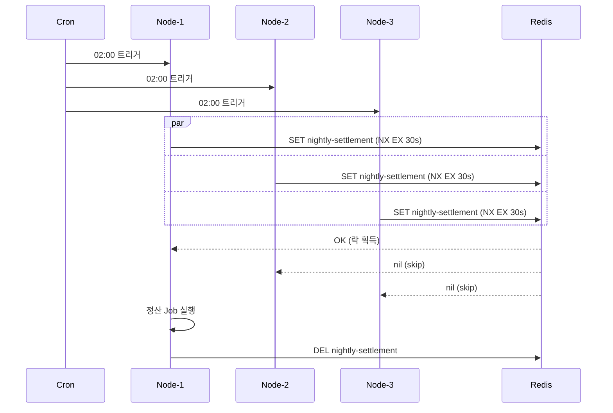

# examples-batch-scheduler

한국어 | [English](./README.md)

Lettuce-Redis 백엔드를 사용한 분산 배치 스케줄러 예제. 야간 정산 등 주기 배치 Job 을 다중 인스턴스 환경에서 단 1개만 실행되도록 보장.

## Architecture



## Core Features

- N 인스턴스 환경에서 주기 배치의 **단일 실행 보장**
- 경쟁 발생 시 자동 skip — 예외 throw 없이 `null` 반환 (ShedLock 호환 동작)
- 정상/실패/예외 모든 경로에서 락 자동 해제
- Lease TTL 로 리더 사망 시에도 락 leak 방지

## Usage Example

```kotlin
val redisConnection: StatefulRedisConnection<String, String> = client.connect(StringCodec.UTF8)

val scheduler = BatchScheduler(
    nodeId = "node-${System.getenv("HOSTNAME")}",
    connection = redisConnection,
    lockName = "nightly-settlement",
    waitTime = 2.seconds,
    leaseTime = 30.seconds,
)

// cron / Spring @Scheduled / Quartz 등에서 호출
val result: Unit? = scheduler.run {
    settlementService.processYesterday()
}

if (result == null) {
    log.info { "다른 인스턴스가 실행 중 — skip" }
}
```

## Demo

```bash
./gradlew :examples:batch-scheduler:run
```

또는 IDE 에서 `BatchSchedulerDemo.main()` 직접 실행. 3 인스턴스 시뮬레이션 후 1개만 Job 실행.

## Configuration Options

| 파라미터 | 기본값 | 설명 |
|---------|-------|------|
| `nodeId` | 필수 | 인스턴스별 고유 식별자 — 로그에 사용 |
| `lockName` | 필수 | 분산 락 키 (같은 Job 의 모든 인스턴스가 동일 값 사용) |
| `waitTime` | `2.seconds` | 락 획득 대기 시간 — 초과 시 즉시 skip |
| `leaseTime` | `30.seconds` | 락 TTL — Job 예상 실행 시간보다 길게 |

## Dependency

```kotlin
dependencies {
    implementation(project(":leader-redis-lettuce"))
    implementation(project(":examples:batch-scheduler"))
}
```

## Testing

```bash
./gradlew :examples:batch-scheduler:test
```

테스트는 Testcontainers Redis singleton 사용 — Docker daemon 필요.
