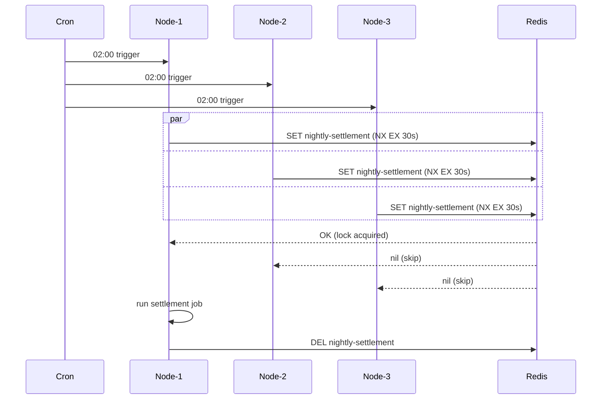

# examples-batch-scheduler

[한국어](./README.ko.md) | English

Distributed batch scheduler example using Lettuce-Redis backend. Demonstrates safe single execution of a periodic batch job (e.g. nightly settlement) across multiple deployed instances.

## Architecture



## Core Features

- Single-execution guarantee for periodic batch jobs across N replicas
- Automatic skip on contention (no exception thrown — `null` return like ShedLock)
- Lock release on success, failure, or exception
- Lease TTL prevents lock leak if leader crashes mid-job

## Usage Example

```kotlin
val redisConnection: StatefulRedisConnection<String, String> = client.connect(StringCodec.UTF8)

val scheduler = BatchScheduler(
    nodeId = "node-${System.getenv("HOSTNAME")}",
    connection = redisConnection,
    lockName = "nightly-settlement",
    waitTime = 2.seconds,
    leaseTime = 30.seconds,
)

// Called by cron / Spring @Scheduled / Quartz
val result: Unit? = scheduler.run {
    settlementService.processYesterday()
}

if (result == null) {
    log.info { "Another instance is processing — skipping" }
}
```

## Demo

```bash
./gradlew :examples:batch-scheduler:run
```

Or directly: run `BatchSchedulerDemo.main()` from your IDE. Spawns 3 simulated instances; only 1 runs the job.

## Configuration Options

| Parameter | Default | Description |
|-----------|---------|-------------|
| `nodeId` | required | Unique identifier per instance — used in logs |
| `lockName` | required | Distributed lock key (same across all instances of the job) |
| `waitTime` | `2.seconds` | Time to wait for the lock before giving up |
| `leaseTime` | `30.seconds` | Lock TTL — prevents leak on crash; should exceed expected job duration |

## Dependency

```kotlin
dependencies {
    implementation(project(":leader-redis-lettuce"))
    implementation(project(":examples:batch-scheduler"))
}
```

## Testing

```bash
./gradlew :examples:batch-scheduler:test
```

Tests use Testcontainers Redis singleton — Docker daemon required.
