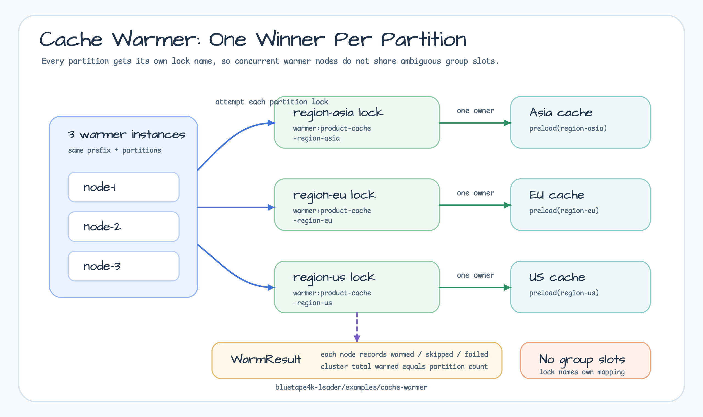
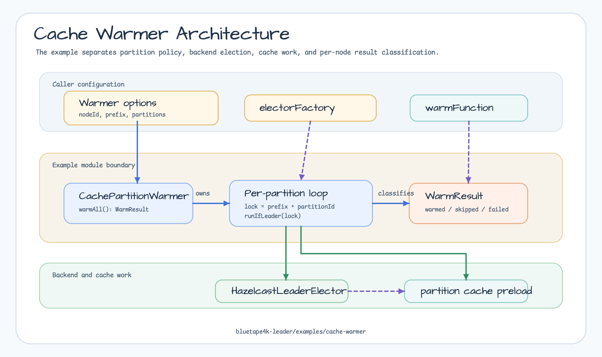
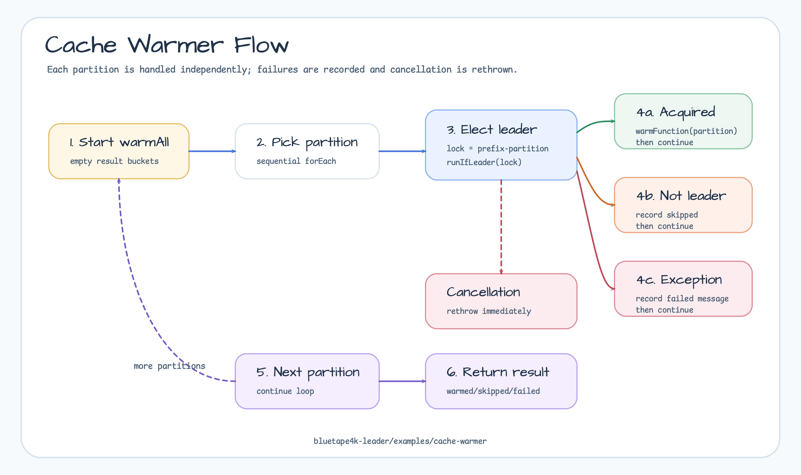
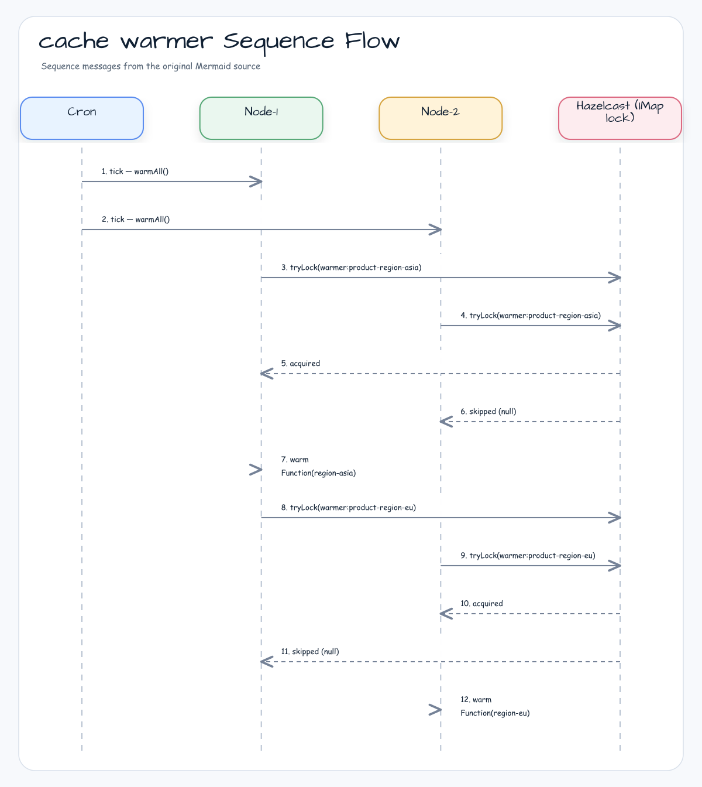

# examples-cache-warmer

[English](README.md) | 한국어

Hazelcast 를 leader-election 백엔드로 사용하는 파티션별 캐시 워머 예제. **파티션별 독립
leader-election** 으로 여러 인스턴스가 동시에 워머를 실행해도 각 파티션은 정확히
1 개 인스턴스만 워밍하도록 보장합니다.

## 시나리오

`CachePartitionWarmer` 는 `LeaderGroupElector` 대신 파티션별 독립 락
(`"${lockNamePrefix}-${partitionId}"`) 을 사용합니다. group election 은 단일 lockName 의
maxLeaders 슬롯을 공유하므로 호출자가 슬롯 ↔ 파티션 매핑을 강제할 수 없기 때문입니다.
파티션별 lockName 은 "파티션 P 에 대해서는 정확히 1 인스턴스만 워밍" 계약을 직접 표현합니다.

여러 워머 인스턴스가 동시에 `warmAll()`을 호출해도 파티션마다 독립적으로 리더를 선출합니다.
따라서 서로 다른 노드가 서로 다른 파티션을 워밍할 수 있고, 한 파티션 실패는
`WarmResult.failed`에 기록된 뒤 나머지 파티션 처리는 계속됩니다.

## 예제 시나리오



## 아키텍처 다이어그램



## 플로우 다이어그램



## 시퀀스 다이어그램



## 핵심 기능

- 파티션별 독립 leader-election (공유 세마포어 슬롯 없음)
- ShedLock 호환 skip 동작 — 비리더는 `null` 반환, 예외 미발생
- action 예외 격리 — 한 파티션 실패가 다음 파티션 처리를 막지 않으며 `WarmResult.failed` 에
  기록됨
- `CancellationException` 은 항상 즉시 re-throw — coroutine 취소 무결성 보장
- 플러그형 `electorFactory` — Hazelcast / Redis / Mongo 백엔드 교체 가능 + 테스트 fake 주입

## 사용 예제

```kotlin
val hazelcast: HazelcastInstance = Hazelcast.newHazelcastInstance()

val warmer = CachePartitionWarmer(
    electorFactory = { _, options -> HazelcastLeaderElector(hazelcast, options) },
    options = CachePartitionWarmerOptions(
        nodeId = System.getenv("HOSTNAME") ?: "node-local",
        lockNamePrefix = "warmer:product-cache",
        partitions = listOf("region-asia", "region-eu", "region-us"),
        waitTime = 2.seconds,
        leaseTime = 30.seconds,
    ),
    warmFunction = { partitionId -> productCache.preload(partitionId) },
)

val result: WarmResult = warmer.warmAll()
log.info { "warmed=${result.warmed} skipped=${result.skipped} failed=${result.failed}" }
```

## 데모 실행

```bash
./gradlew :examples:cache-warmer:run
```

또는 IDE 에서 `CachePartitionWarmerDemo.main()` 을 실행합니다. 데모는 임베디드 Hazelcast
클러스터에 대해 여러 모의 인스턴스를 띄우고, 각 파티션이 클러스터 전체에서 정확히
한 번만 워밍되는 것을 보여줍니다.

## 설정 옵션

| 파라미터 | 기본값 | 설명 |
|----------|-------|------|
| `nodeId` | 필수 | 워머 인스턴스 식별자 — 로그 + `WarmResult.nodeId` 노출 |
| `partitions` | 필수 | 파티션 식별자 목록; 각각 독립 leader-election 수행 |
| `lockNamePrefix` | `"warmer"` | 분산 락 prefix; 실제 락 이름 = `"${lockNamePrefix}-${partitionId}"` |
| `waitTime` | `5.seconds` | 파티션별 락 획득 대기 — 짧을수록 비리더가 빠르게 skip |
| `leaseTime` | `1.minutes` | 파티션별 lease — handler 평균 실행 시간 + 안전 여유 권장 |

## 의존성

```kotlin
dependencies {
    implementation("io.github.bluetape4k.leader:bluetape4k-leader-hazelcast:${bluetape4kVersion}")
}
```

## 테스트

```bash
./gradlew :examples:cache-warmer:test
```

bluetape4k Testcontainers Hazelcast singleton 사용 — Docker daemon 필요.
