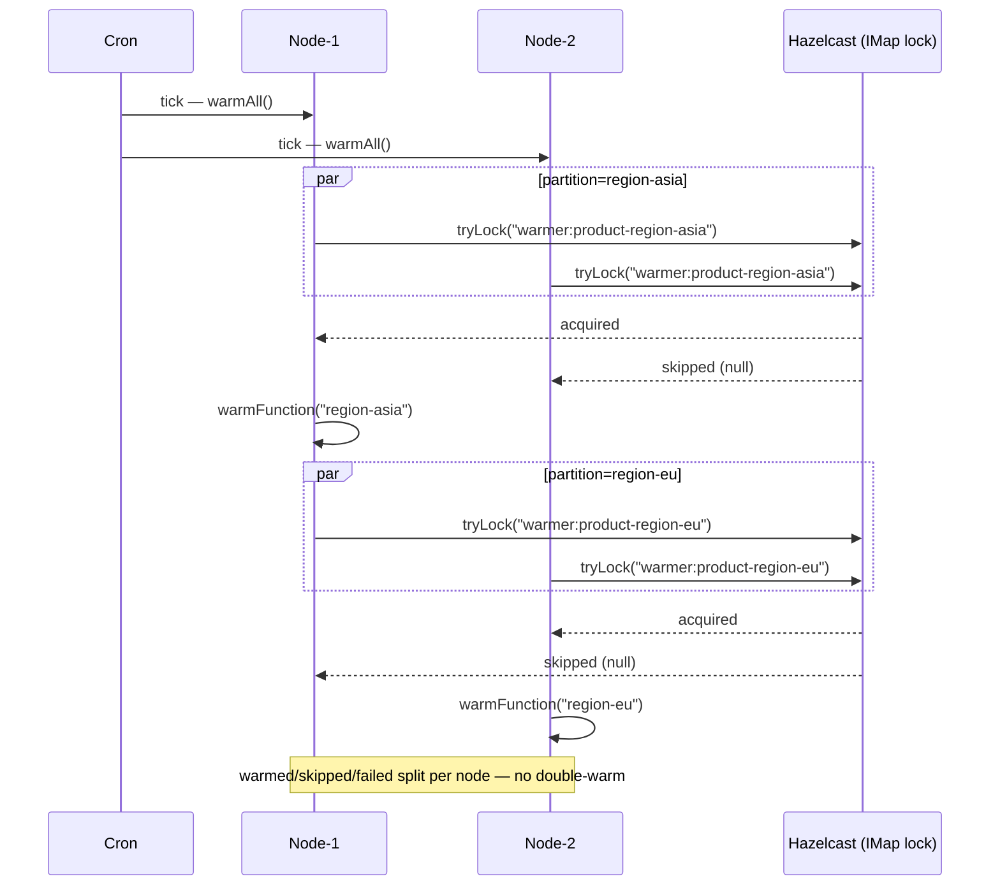

# examples-cache-warmer

[한국어](./README.ko.md) | English

Per-partition cache warmer using Hazelcast as the leader-election backend.
Demonstrates **per-partition independent leader election** so that exactly one
instance warms each partition, even when several instances run the warmer
concurrently.

## Architecture

`CachePartitionWarmer` builds one independent lock per partition
(`"${lockNamePrefix}-${partitionId}"`) instead of using `LeaderGroupElector`.
A group election shares slots inside a single lockName, so the caller cannot
guarantee a slot ↔ partition mapping. Per-partition lockNames express the
contract directly: **"for partition P, exactly one instance warms"**.



## Core Features

- Per-partition independent leader election (no shared semaphore slots)
- ShedLock-compatible skip semantics — non-leader returns `null`, no exception
- Action exception isolation — one partition failure does not stop the rest;
  recorded into `WarmResult.failed`
- `CancellationException` is always rethrown to preserve coroutine cancellation
  integrity
- Pluggable `electorFactory` — Hazelcast / Redis / Mongo backends or test fakes
  can be substituted without code change

## Usage Example

```kotlin
val hazelcast: HazelcastInstance = Hazelcast.newHazelcastInstance()

val warmer = CachePartitionWarmer(
    electorFactory = { _, options -> HazelcastLeaderElector(hazelcast, options) },
    options = CachePartitionWarmerOptions(
        nodeId = System.getenv("HOSTNAME") ?: "node-local",
        lockNamePrefix = "warmer:product-cache",
        partitions = listOf("region-asia", "region-eu", "region-us"),
        waitTime = 2.seconds,
        leaseTime = 30.seconds,
    ),
    warmFunction = { partitionId -> productCache.preload(partitionId) },
)

val result: WarmResult = warmer.warmAll()
log.info { "warmed=${result.warmed} skipped=${result.skipped} failed=${result.failed}" }
```

## Demo

```bash
./gradlew :examples:cache-warmer:run
```

Or run `CachePartitionWarmerDemo.main()` from your IDE. The demo spawns
multiple simulated instances against an embedded Hazelcast cluster and shows
that each partition is warmed exactly once across the cluster.

## Configuration Options

| Parameter | Default | Description |
|-----------|---------|-------------|
| `nodeId` | required | Unique identifier per warmer instance — exposed in logs and `WarmResult.nodeId` |
| `partitions` | required | Partition identifiers; each runs an independent leader election |
| `lockNamePrefix` | `"warmer"` | Distributed lock name prefix; full name = `"${lockNamePrefix}-${partitionId}"` |
| `waitTime` | `5.seconds` | Per-partition lock acquisition wait — short values let non-leaders skip quickly |
| `leaseTime` | `1.minutes` | Per-partition lease — should exceed expected handler duration with margin |

## Dependency

```kotlin
dependencies {
    implementation(project(":leader-hazelcast"))
    implementation(project(":examples:cache-warmer"))
}
```

## Testing

```bash
./gradlew :examples:cache-warmer:test
```

Tests use the bluetape4k Testcontainers Hazelcast singleton — Docker daemon
required.
