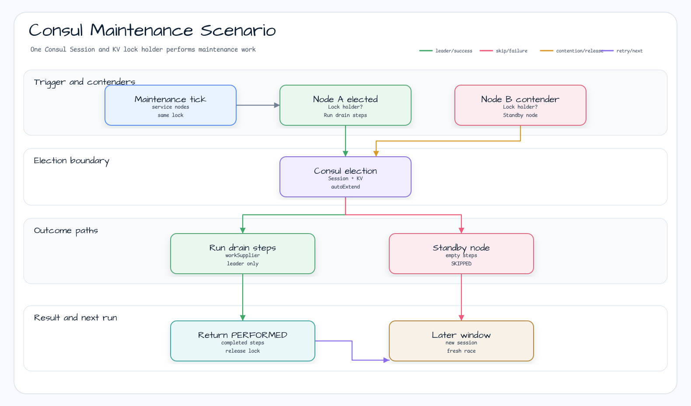
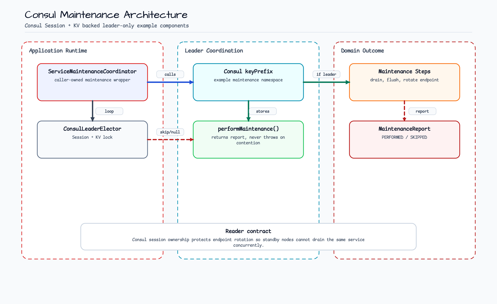
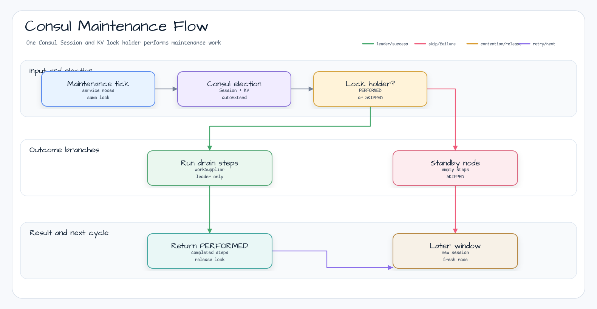
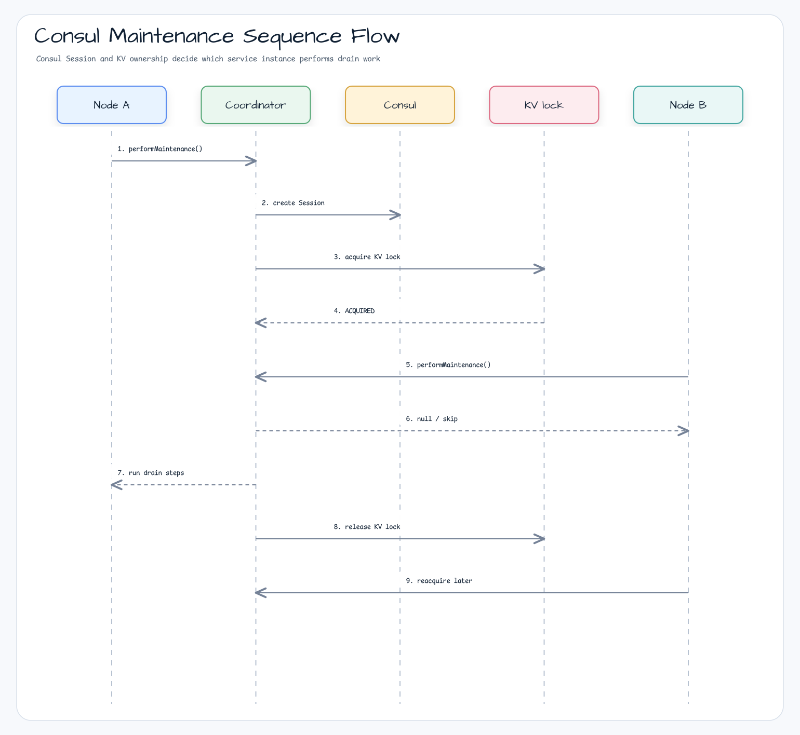

# Consul Maintenance Example

English | [한국어](README.ko.md)

Runnable Consul example where one service instance owns a maintenance or drain operation through
`ConsulLeaderElector`.

## Scenario

Multiple service instances share one Consul Session + KV lock. The elected instance runs the maintenance steps,
contending instances skip the cycle without throwing, and another instance can acquire the same lock after the
current leader releases it.

## Example Scenario



## Architecture Diagram



## Flow Diagram



## Sequence Diagram



## What It Shows

- Acquire a Consul Session + KV leader lease for a service-maintenance lock.
- Run leader-only maintenance work such as draining and endpoint rotation.
- Skip non-leader maintenance attempts without throwing on contention.
- Release leadership after the body completes.
- Reacquire the lock from another service instance.

## Run

The example starts a real Consul container through `ConsulServer.Launcher.consul`, so Docker is required.

```bash
./gradlew :examples:consul-maintenance:run
```

## Test

```bash
./gradlew :examples:consul-maintenance:test
```

The test starts two coordinators against the same lock, verifies that only one node performs maintenance while the
first lease is active, then verifies that the second node can reacquire the lock after release.

## Design

```kotlin
val endpoint = ConsulEndpoint(ConsulServer.Launcher.consul.url)
val coordinator = ServiceMaintenanceCoordinator(
    config = ServiceMaintenanceConfig(
        nodeId = MaintenanceNodeId("checkout-a"),
        lockName = MaintenanceLockName("service-maintenance:checkout"),
    ),
    endpoint = endpoint,
)

coordinator.performMaintenance {
    listOf("mark-instance-draining", "flush-inflight-requests", "rotate-service-endpoint")
}
```

Production applications should create `ConsulEndpoint` from the Consul HTTP API endpoint, datacenter, ACL token,
timeout, and network policy. Consul agent lifecycle remains caller-owned.
