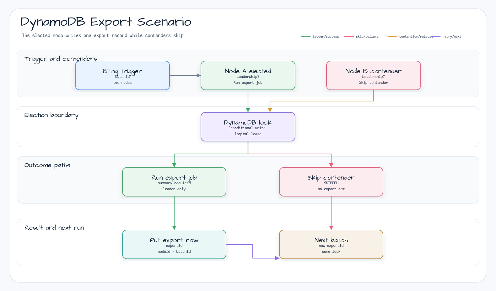
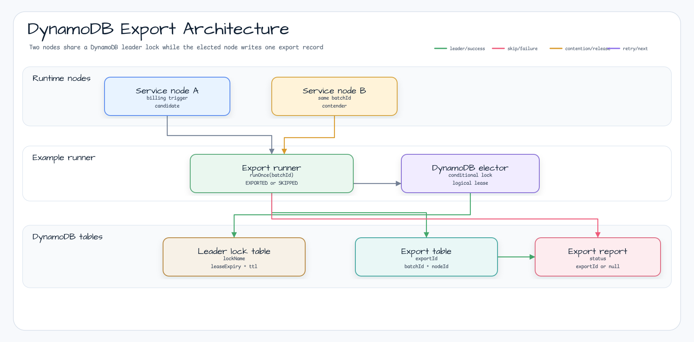
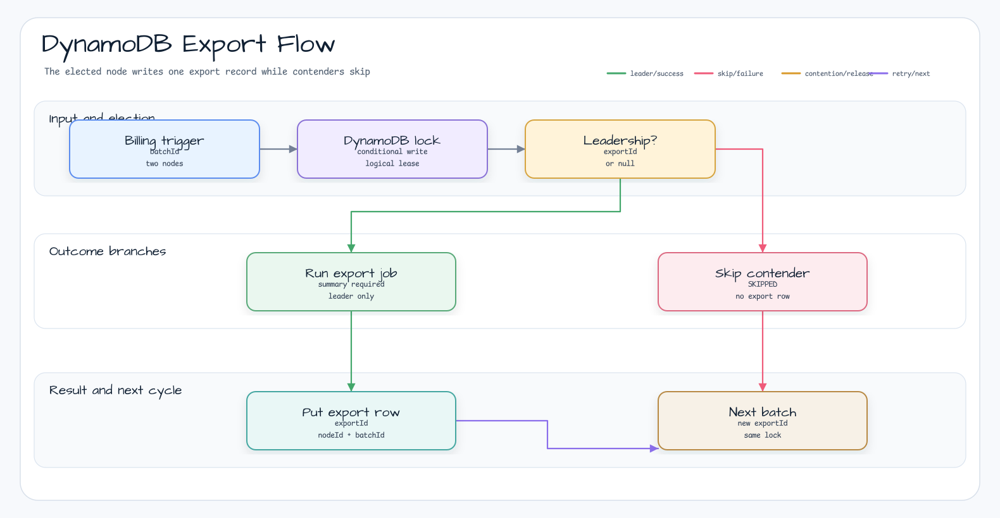
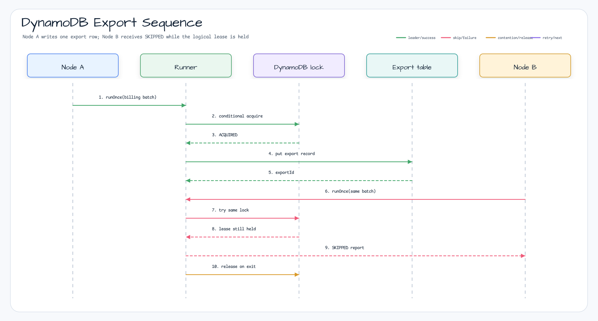

# examples-dynamodb-export

English | [한국어](README.ko.md)

DynamoDB-backed scheduled export example. Demonstrates how AWS-only services can use
`leader-dynamodb` so only one application replica writes an export record for a shared schedule.

## Scenario

Two service instances receive the same billing export trigger. Each instance uses the same
`billing-export` leader lock. The elected node generates the export and writes one row to the export
table. Contending nodes return `SKIPPED` without throwing.

## Example Scenario



## Architecture Diagram



## Flow Diagram



## Sequence Diagram



## Core Features

- Single scheduled export execution across N replicas
- DynamoDB conditional-write leadership through `DynamoDbSuspendLeaderElector`
- Separate lock and export tables so leadership metadata stays isolated from application data
- DynamoDB Local/Testcontainers setup for local and CI verification
- Logical lease behavior documented separately from DynamoDB TTL cleanup

## Table Shape

Leader lock table:

| Attribute | Type | Purpose |
|---|---|---|
| `lockName` | String hash key | Logical leader lock key |
| `leaseExpiry` | Number | Logical lease deadline used for correctness |
| `ttl` | Number | DynamoDB TTL cleanup metadata |

Export table:

| Attribute | Type | Purpose |
|---|---|---|
| `exportId` | String hash key | Unique export record id |
| `batchId` | String | Scheduled batch or billing period |
| `nodeId` | String | Elected node that wrote the export |
| `createdAt` | String | ISO-8601 creation timestamp |
| `summary` | String | Demo export summary |

## Usage Example

```kotlin
val runner = DynamoDbScheduledExportRunner(
    options = DynamoDbExportRunnerOptions(
        nodeId = "node-a",
        lockName = "billing-export",
    ),
    elector = DynamoDbSuspendLeaderElector(asyncClient, electionOptions),
    exportTable = DynamoDbExportTable(syncClient, "billing_exports"),
)

val report = runner.runOnce("billing-2026-06-05") {
    billingExporter.writeDailyExport()
}

if (report.status == DynamoDbExportStatus.SKIPPED) {
    log.info { "Another node already owns the scheduled export" }
}
```

## Demo

```bash
./gradlew :examples:dynamodb-export:run
```

The demo starts DynamoDB Local through Testcontainers, creates a lock table and export table, and
simulates two nodes competing for the same scheduled export lock.

## Configuration Options

| Parameter | Default | Description |
|---|---|---|
| `nodeId` | required | Instance identifier used in reports and export records |
| `lockName` | required | Shared leader lock name for the scheduled export |
| `waitTime` | `150.milliseconds` | Time to wait before skipping on contention |
| `leaseTime` | `5.seconds` | Logical lease duration; should exceed the export's expected critical section |

## Dependency

```kotlin
dependencies {
    implementation(project(":bluetape4k-leader-dynamodb"))
    implementation(project(":examples:dynamodb-export"))
}
```

## Testing

```bash
./gradlew :examples:dynamodb-export:test
```

Tests use DynamoDB Local through Testcontainers, so Docker must be available.
