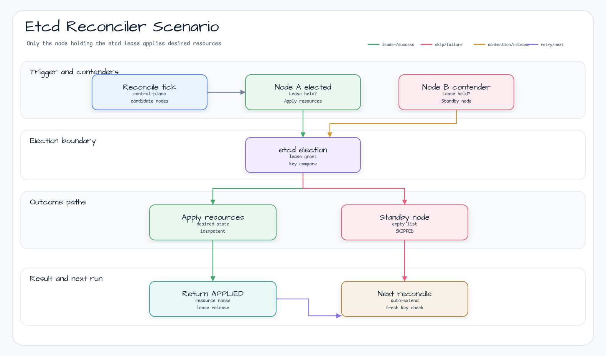
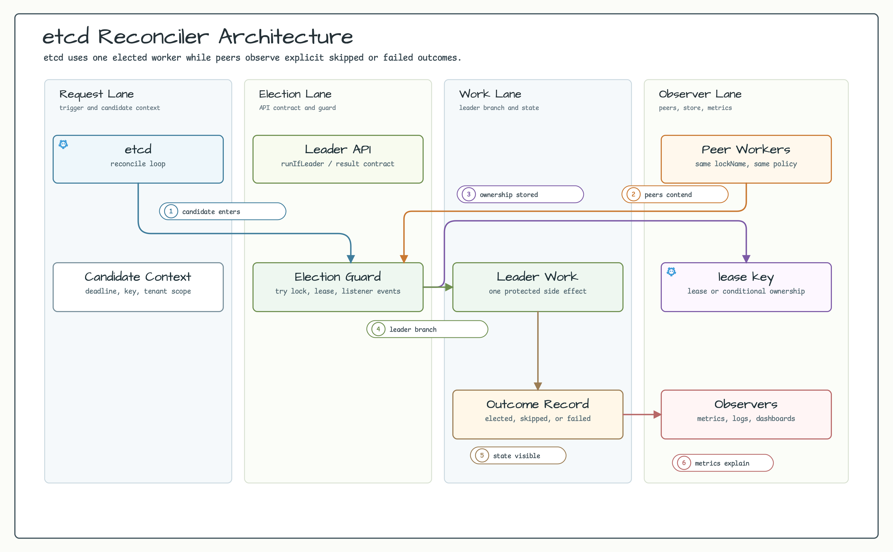
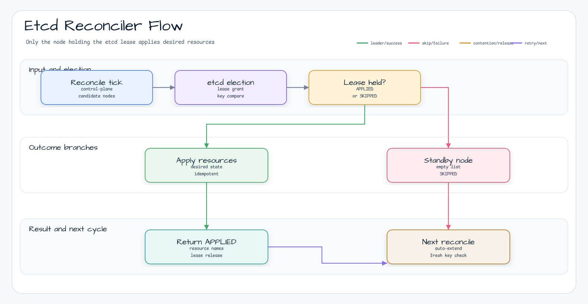
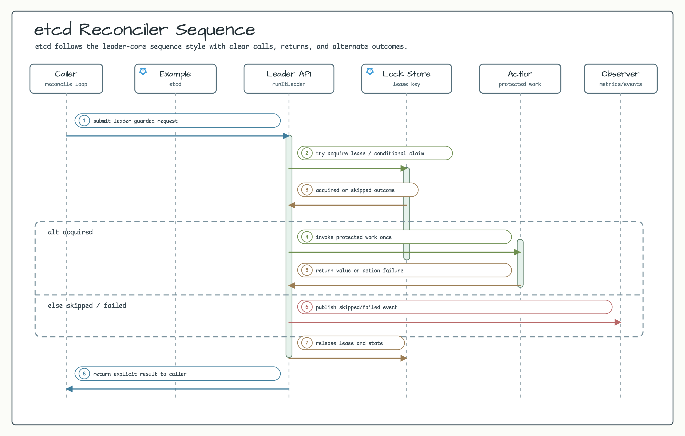

# etcd Reconciler Example

English | [한국어](README.ko.md)

Runnable etcd v3 example where one control-plane node owns a reconcile loop through `EtcdLeaderElector`.

## Scenario

Several control-plane nodes receive the same reconcile trigger. Each node tries to own the same etcd-backed lock, but
only the elected node applies the desired resource list. Other nodes skip the cycle, and leadership can move after the
lease is released.

## Example Scenario



## Architecture Diagram



## Flow Diagram



## Sequence Diagram



## What It Shows

- Acquire an etcd-backed leader lease for a reconciler lock.
- Run leader-only control-plane work.
- Skip non-leader reconcile attempts without throwing on contention.
- Apply desired resources idempotently while the lease is held.
- Reacquire leadership from another node after release.

## Run

The example starts an etcd container through `EtcdServer.Launcher.etcd`, so Docker is required.

```bash
./gradlew :examples:etcd-reconciler:run
```

## Test

```bash
./gradlew :examples:etcd-reconciler:test
```

## Design

```kotlin
val reconciler = ControlPlaneReconciler(
    nodeId = "control-plane-a",
    client = client,
    lockName = "control-plane-reconcile",
)

val report = reconciler.reconcile {
    listOf("deployment/api", "configmap/routing", "service/api")
}
```

Production applications should create the jetcd `Client` from their etcd endpoints, credentials, timeout, and network
policy. etcd lifecycle remains caller-owned.
