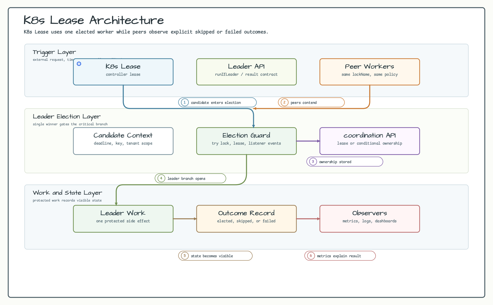
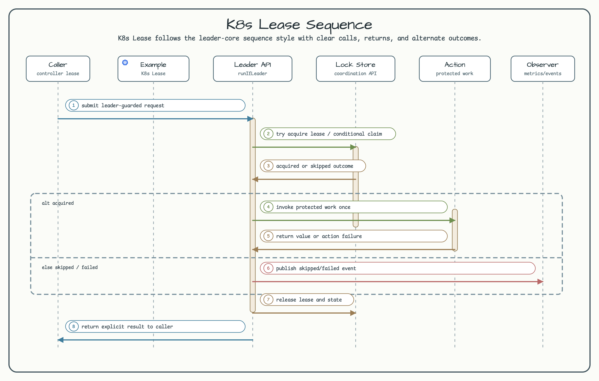

# K3s Lease 리더 선출 예제

[English](README.md) | 한국어

이 예제는 `K3sServer.Launcher.k3s`로 실제 K3s API 서버를 시작한 뒤
Kubernetes `coordination.k8s.io/v1` Lease API로 리더 선출 흐름을 검증합니다.

## 시나리오

두 holder identity가 같은 Kubernetes Lease를 두고 경쟁합니다. 첫 holder는 Lease를
생성하거나 갱신하고, Lease가 아직 유효할 때 경쟁 holder는 `CONFLICT`를 받습니다.
현재 holder가 Lease를 해제하면 이후 다른 holder가 같은 Lease를 획득할 수 있습니다.

## 아키텍처 다이어그램



## 시퀀스 다이어그램



## 확인하는 동작

- holder가 없을 때 Lease를 획득합니다.
- Lease가 유효한 동안 다른 holder의 획득을 거부합니다.
- 현재 holder만 Lease를 해제합니다.
- 해제 후 다른 holder가 다시 Lease를 획득합니다.

## 실행

K3s는 Docker privileged mode가 필요합니다. 테스트는 `k8s` 태그가 붙어 있고
일반 `test` 태스크에서는 제외됩니다.

```bash
./gradlew :examples:k8s-lease:k8sTest
```

privileged container를 지원하는 로컬 Docker daemon 또는 CI runner에서만
실행하세요.

## 설계

예제는 fabric8의 typed Lease model을 사용합니다.

```kotlin
val k3s = K3sServer.Launcher.k3s
k3s.kubernetesClient().use { client ->
    val election = K8sLeaseLeaderElectionExample(client)
    val acquired = election.tryAcquire("api-controller", "node-a")
}
```

이 모듈은 예제 수준의 Lease 흐름이며, publishable `leader-k8s` backend를
추가하지 않습니다.
