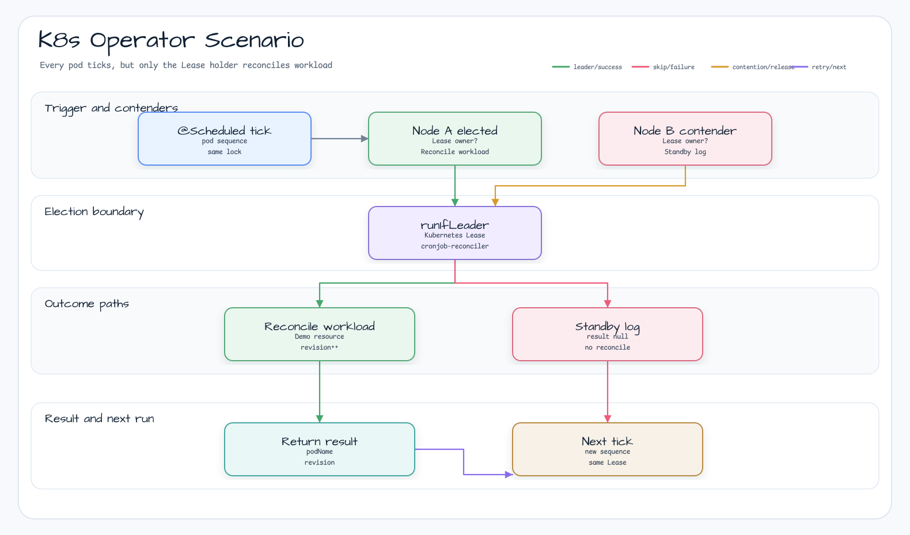
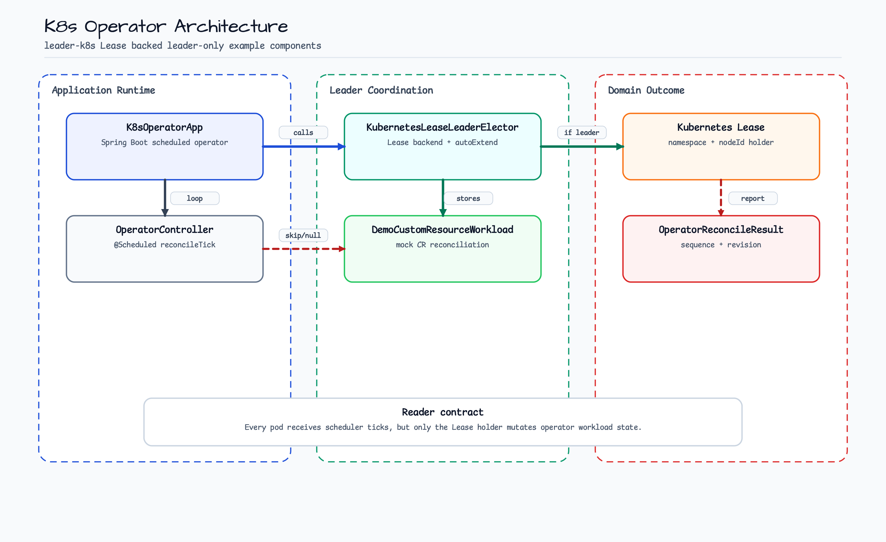
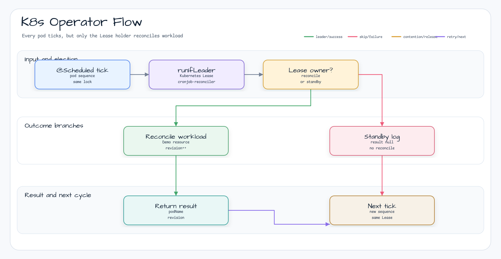
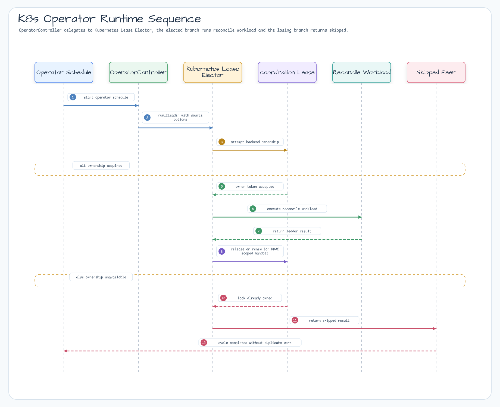

# Kubernetes Operator Leader Election Example

English | [한국어](README.ko.md)

This example shows the single-active-controller pattern used by Kubernetes
operators. Three pods can run the same Spring Boot application, but only the pod
that owns the Kubernetes `coordination.k8s.io/v1` Lease runs the mock custom
resource reconcile loop.

## Scenario

Three replicas run the same Spring Boot operator controller. Every replica keeps
its scheduled tick, but `KubernetesLeaseLeaderElector.runIfLeader` lets only the
pod that owns the `cronjob-reconciler` Lease call the reconcile workload. When
the leader stops renewing the Lease, another pod can take over on a later tick.

## Example Scenario



## Architecture Diagram



## Flow Diagram



## Sequence Diagram



## What It Shows

- `leader-k8s` as the election backend for an operator-style controller.
- A scheduled reconcile loop guarded by `KubernetesLeaseLeaderElector.runIfLeader`.
- Standby pods that keep ticking but skip the reconcile workload.
- RBAC and Deployment manifests for a 3-replica operator.
- A K3s integration test that proves contention and failover behavior.

## Run Locally

The normal unit test does not require Docker:

```bash
./gradlew :examples:k8s-operator:test
```

The K3s-backed test requires Docker privileged mode:

```bash
./gradlew :examples:k8s-operator:k8sTest
```

## Operator Shape

```kotlin
@Scheduled(fixedDelayString = "\${demo.operator.fixed-delay-ms:5000}")
fun reconcileTick() {
    leaderElector.runIfLeader("cronjob-reconciler") {
        workload.reconcile(request)
    }
}
```

When the current leader pod exits or stops renewing the Lease, another pod can
acquire the same lock on the next tick and continue reconciling.

## Kubernetes Manifests

Apply the manifests after replacing the image with one built from this module:

```bash
kubectl apply -f k8s/rbac.yaml
kubectl apply -f k8s/deployment.yaml
kubectl logs deploy/bluetape4k-k8s-operator -f
```

The service account needs `get`, `create`, `update`, `patch`, and `delete` on
`coordination.k8s.io/leases` in the target namespace.
