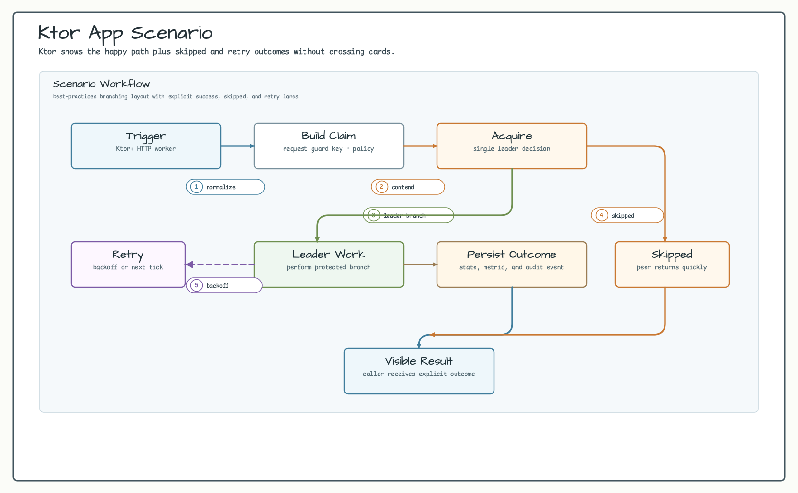
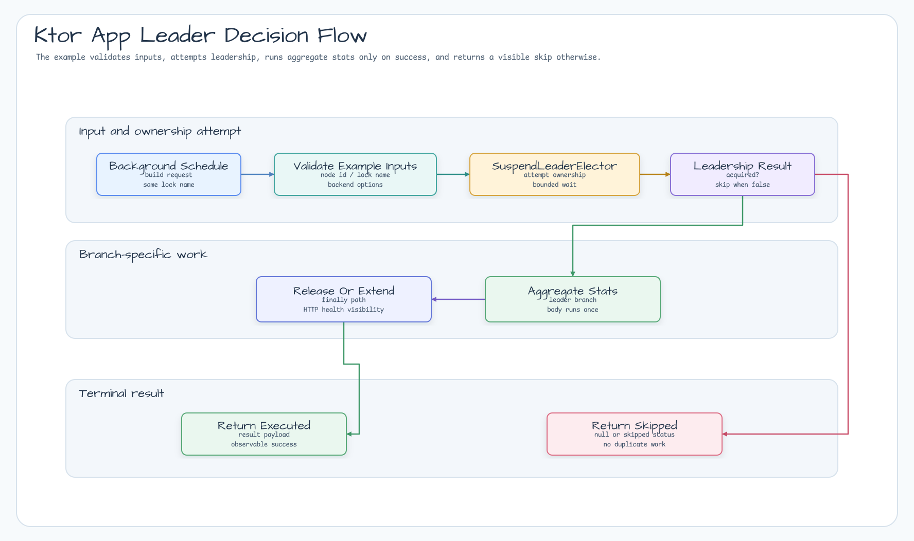

# examples-ktor-app

[English](README.md) | 한국어

Ktor 3.x REST API 서버 + 리더 선출로 보호되는 주기 백그라운드 작업 예제. 동일 Kotlin/Ktor 서비스를 다중 인스턴스로 배포하면서, 시간별 통계 집계 작업은 클러스터 전체에서 단 1개 인스턴스만 실행하는 일반적인 패턴을 시연한다.

## 시나리오

여러 Ktor replica가 같은 `/stats`, `/health`, `/readyz` 라우트를 노출합니다. 백그라운드
`leaderScheduled` 작업은 공유 Redis lock `hourly-stats-aggregation`을 사용하므로
cycle마다 1개 replica만 `StatsAggregator.aggregate()`를 호출하고, 나머지 replica는
HTTP 트래픽을 계속 처리합니다.

## 예제 시나리오



## 아키텍처 다이어그램


## 플로우 다이어그램



## 시퀀스 다이어그램


## 핵심 기능

- Ktor 3.x CIO 서버 + `ContentNegotiation` + Jackson JSON 직렬화
- shared `bluetape4k-ktor-core` installer 로 health/readiness route 등록
- `LeaderElectionPlugin` install — Lettuce 백엔드 `SuspendLeaderElector` 주입
- `Application.leaderScheduled(...)` — 리더 전용 주기 작업, `ApplicationStopped` 시 자동 취소
- `GET /stats` — `StatsAggregator` 의 in-memory 상태 노출
- `GET /health` — liveness probe, `GET /readyz` — readiness probe
- 다중 인스턴스 환경에서 집계 작업의 단일 실행 보장 (Redis lock)
- poison-pill 방지 — 한 cycle 의 예외는 로깅만 하고 다음 cycle 계속 진행

## 사용 예시

```kotlin
fun Application.module(
    connection: StatefulRedisConnection<String, String>,
    aggregationPeriod: Duration = 1.hours,
) {
    install(ContentNegotiation) { jackson() }

    // leaseTime = period * 2 (안전 마진), minLeaseTime = period
    // → 다음 cycle 까지 lock 보유 → 다른 replica 가 같은 작업을 중복 실행하지 않음.
    val electorOptions = LeaderElectionOptions(
        waitTime = aggregationPeriod,
        leaseTime = aggregationPeriod * 2,
        minLeaseTime = aggregationPeriod,
    )
    install(LeaderElectionPlugin) {
        leaderElection = LettuceSuspendLeaderElector(connection, electorOptions)
    }

    val aggregator = StatsAggregator()
    leaderScheduled("hourly-stats-aggregation", period = aggregationPeriod) {
        // (issue #79) leader-only block 안에서 lock 보유 단언 + 필요 시 lease 연장
        LockAssert.assertLockedSuspend()
        if (aggregator.estimatedDuration() > aggregationPeriod) {
            LockExtender.extendActiveLockSuspend(aggregationPeriod * 3)
        }
        aggregator.aggregate()
    }

    installBluetape4kKtorCore(
        Bluetape4kKtorCoreConfig(
            installContentNegotiation = false,
            installStatusPages = false,
            healthPath = "/health",
        )
    )

    routing {
        statsRoutes(aggregator)
    }
}

fun main() {
    val redisUrl = System.getenv("REDIS_URL") ?: "redis://localhost:6379"
    val port = System.getenv("PORT")?.toIntOrNull() ?: 8080
    val client = RedisClient.create(redisUrl)
    val connection = client.connect(StringCodec.UTF8)
    embeddedServer(CIO, port = port) { module(connection) }.start(wait = true)
}
```

## 데모

```bash
# 로컬 Redis 컨테이너 기동 (또는 REDIS_URL 환경 변수 설정)
docker run -p 6379:6379 -d --name leader-demo-redis redis:8

REDIS_URL=redis://localhost:6379 ./gradlew :examples:ktor-app:run
```

다른 터미널에서:

```bash
curl http://localhost:8080/health
# {"status":"UP","details":{}}

curl http://localhost:8080/readyz
# {"status":"UP","details":{}}

curl http://localhost:8080/stats
# {"runCount":1,"lastRunAt":"2026-05-10T..."}
```

다른 `PORT` 환경 변수로 두 번째 인스턴스를 동일 `REDIS_URL` 로 기동해 보면 — 매 cycle 마다 단 한쪽만 `aggregate()` 를 실행한다:

```bash
PORT=8081 REDIS_URL=redis://localhost:6379 ./gradlew :examples:ktor-app:run
```

## 설정 옵션

| 출처                | 키 / 필드                       | 기본값                            | 설명                                                       |
|---------------------|---------------------------------|----------------------------------|------------------------------------------------------------|
| 환경 변수           | `REDIS_URL`                     | `redis://localhost:6379`         | Redis 접속 URL                                              |
| 환경 변수           | `PORT`                          | `8080`                           | HTTP listen 포트 (replica 별로 다른 값 지정)               |
| `KtorAppMain`       | `DEFAULT_PORT`                  | `8080`                           | `PORT` 미지정 시 기본 listen 포트                          |
| `KtorAppMain`       | `DEFAULT_AGGREGATION_LOCK`      | `hourly-stats-aggregation`       | 분산 락 이름 (모든 노드 공유)                              |
| `KtorAppMain`       | `DEFAULT_AGGREGATION_PERIOD`    | `60.minutes`                     | cycle 주기                                                  |
| `LeaderElectionOptions` | `waitTime`                  | `aggregationPeriod`              | cycle 당 lock 획득 대기 시간                                |
| `LeaderElectionOptions` | `leaseTime`                 | `aggregationPeriod * 2`          | auto-extend 미사용 — cycle 당 안전 lease 시간              |
| `LeaderElectionOptions` | `minLeaseTime`              | `aggregationPeriod`              | 최소 한 cycle 동안 lock 보유 → 중복 실행 차단              |

## 마이그레이션 가이드 — Spring `@Scheduled` 에서 Ktor `leaderScheduled` 로

| 관심사               | Spring                                     | Ktor (본 예제)                                             |
|----------------------|--------------------------------------------|------------------------------------------------------------|
| 주기 dispatch        | `@Scheduled(fixedRate = ...)`              | `leaderScheduled(lockName, period) { ... }`                |
| 다중 인스턴스 단일 실행 | ShedLock annotation                     | `LeaderElectionPlugin` — 동일 시맨틱 (skip 시 `null`)      |
| 백엔드 교체          | Config property                            | `LettuceSuspendLeaderElector` 를 다른 구현체로 대체        |
| Graceful shutdown    | Spring lifecycle                           | `ApplicationStopped` 가 launched 코루틴을 자동 취소         |

## 의존성

```kotlin
dependencies {
    implementation("io.github.bluetape4k.leader:bluetape4k-leader-ktor:${bluetape4kVersion}")
    implementation("io.github.bluetape4k.leader:bluetape4k-leader-redis-lettuce:${bluetape4kVersion}")

    implementation("io.github.bluetape4k:bluetape4k-ktor-core")
    implementation("io.lettuce:lettuce-core")

    implementation("io.ktor:ktor-server-core")
    implementation("io.ktor:ktor-server-cio")
    implementation("io.ktor:ktor-server-content-negotiation")
    implementation("io.ktor:ktor-serialization-jackson")

    testImplementation("io.github.bluetape4k:bluetape4k-ktor-testing")
}

dependencyManagement {
    imports {
        mavenBom("io.github.bluetape4k:bluetape4k-bom:1.10.0")
        mavenBom("io.ktor:ktor-bom:3.5.0")
    }
}
```

## 테스트

```bash
./gradlew :examples:ktor-app:test
```

테스트는 Testcontainers Redis singleton 사용 — Docker 데몬 필요. Redis 컨테이너 재시작 후에는 `--no-build-cache` 플래그 권장 (`docs/lessons/2026-05-10-ktor-app-example.md` L3).
