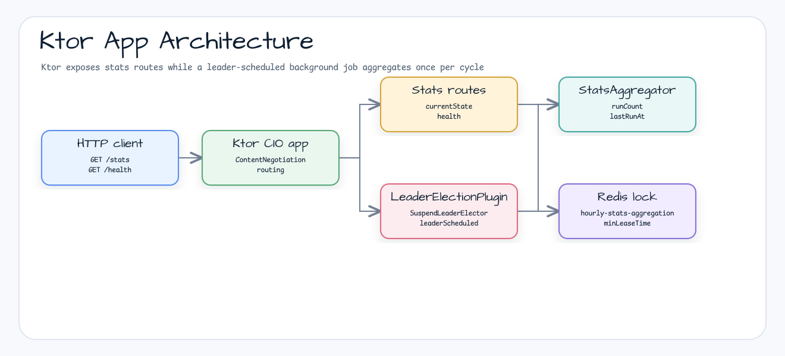
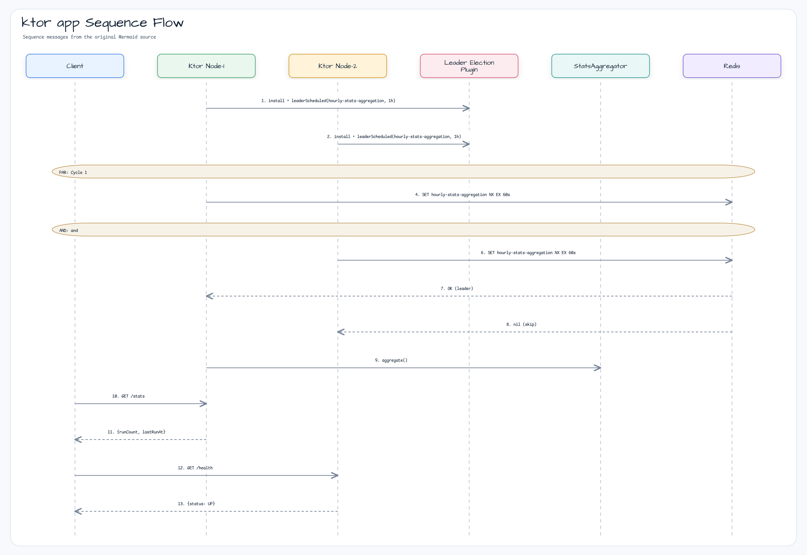

# examples-ktor-app

[한국어](./README.ko.md) | English

Ktor 3.x REST API server with a leader-election-protected periodic background job. Demonstrates the typical pattern of running the same Kotlin/Ktor service across multiple replicas while ensuring a single periodic stats-aggregation job runs cluster-wide.

## Scenario

Several Ktor replicas expose the same `/stats`, `/health`, and `/readyz` routes. A
background `leaderScheduled` job uses the shared Redis lock
`hourly-stats-aggregation`, so only one replica calls `StatsAggregator.aggregate()`
per cycle while the other replicas keep serving HTTP traffic.

## Architecture Diagram



## Sequence Diagram



## Core Features

- Ktor 3.x CIO server with `ContentNegotiation` + Jackson JSON
- Shared `bluetape4k-ktor-core` installer for health/readiness routes
- `LeaderElectionPlugin` install — Lettuce-backed `SuspendLeaderElector`
- `Application.leaderScheduled(...)` — leader-only periodic job, auto-cancelled on `ApplicationStopped`
- `GET /stats` exposes the in-memory `StatsAggregator` snapshot
- `GET /health` liveness probe and `GET /readyz` readiness probe
- Single-execution guarantee for the aggregation job across N replicas (Redis lock)
- Poison-pill protection — exception in one cycle is logged, next cycle keeps running

## Usage Example

```kotlin
fun Application.module(
    connection: StatefulRedisConnection<String, String>,
    aggregationPeriod: Duration = 1.hours,
) {
    install(ContentNegotiation) { jackson() }

    // leaseTime = period * 2 (safety margin), minLeaseTime = period
    // → ensures lock is held until the next cycle so other replicas don't run the same job.
    val electorOptions = LeaderElectionOptions(
        waitTime = aggregationPeriod,
        leaseTime = aggregationPeriod * 2,
        minLeaseTime = aggregationPeriod,
    )
    install(LeaderElectionPlugin) {
        leaderElection = LettuceSuspendLeaderElector(connection, electorOptions)
    }

    val aggregator = StatsAggregator()
    leaderScheduled("hourly-stats-aggregation", period = aggregationPeriod) {
        // (issue #79) inside leader-only block — assert lock + extend if needed
        LockAssert.assertLockedSuspend()
        if (aggregator.estimatedDuration() > aggregationPeriod) {
            LockExtender.extendActiveLockSuspend(aggregationPeriod * 3)
        }
        aggregator.aggregate()
    }

    installBluetape4kKtorCore(
        Bluetape4kKtorCoreConfig(
            installContentNegotiation = false,
            installStatusPages = false,
            healthPath = "/health",
        )
    )

    routing {
        statsRoutes(aggregator)
    }
}

fun main() {
    val redisUrl = System.getenv("REDIS_URL") ?: "redis://localhost:6379"
    val port = System.getenv("PORT")?.toIntOrNull() ?: 8080
    val client = RedisClient.create(redisUrl)
    val connection = client.connect(StringCodec.UTF8)
    embeddedServer(CIO, port = port) { module(connection) }.start(wait = true)
}
```

## Demo

```bash
# Boot a Redis container locally first (or set REDIS_URL)
docker run -p 6379:6379 -d --name leader-demo-redis redis:8

REDIS_URL=redis://localhost:6379 ./gradlew :examples:ktor-app:run
```

In a second terminal:

```bash
curl http://localhost:8080/health
# {"status":"UP","details":{}}

curl http://localhost:8080/readyz
# {"status":"UP","details":{}}

curl http://localhost:8080/stats
# {"runCount":1,"lastRunAt":"2026-05-10T..."}
```

Run a second instance on a different `PORT` with the **same** `REDIS_URL` and watch — only one node executes `aggregate()` per cycle:

```bash
PORT=8081 REDIS_URL=redis://localhost:6379 ./gradlew :examples:ktor-app:run
```

## Configuration Options

| Source              | Key / Field                     | Default                          | Description                                            |
|---------------------|---------------------------------|----------------------------------|--------------------------------------------------------|
| Env var             | `REDIS_URL`                     | `redis://localhost:6379`         | Redis connection URL                                   |
| Env var             | `PORT`                          | `8080`                           | HTTP listen port (set differently per replica)         |
| `KtorAppMain`       | `DEFAULT_PORT`                  | `8080`                           | Default fallback when `PORT` is not set                |
| `KtorAppMain`       | `DEFAULT_AGGREGATION_LOCK`      | `hourly-stats-aggregation`       | Distributed lock name (shared across nodes)            |
| `KtorAppMain`       | `DEFAULT_AGGREGATION_PERIOD`    | `60.minutes`                     | Cycle interval                                         |
| `LeaderElectionOptions` | `waitTime`                  | `aggregationPeriod`              | Wait budget for lock acquisition each cycle            |
| `LeaderElectionOptions` | `leaseTime`                 | `aggregationPeriod * 2`          | Auto-extend disabled — safe lease span per cycle       |
| `LeaderElectionOptions` | `minLeaseTime`              | `aggregationPeriod`              | Hold lock at least one period — blocks dup execution   |

## Migration Guide — From `@Scheduled` (Spring) to `leaderScheduled` (Ktor)

| Concern              | Spring                                     | Ktor (this example)                                        |
|----------------------|--------------------------------------------|------------------------------------------------------------|
| Periodic dispatch    | `@Scheduled(fixedRate = ...)`              | `leaderScheduled(lockName, period) { ... }`                |
| Single-runner across replicas | ShedLock annotation               | `LeaderElectionPlugin` — same semantic (`null` on skip)    |
| Backend swap         | Config property                            | Replace `LettuceSuspendLeaderElector` with another impl    |
| Graceful shutdown    | Spring lifecycle                           | `ApplicationStopped` cancels the launched coroutine        |

## Dependency

```kotlin
dependencies {
    implementation(project(":leader-ktor"))
    implementation(project(":leader-redis-lettuce"))

    implementation("io.github.bluetape4k:bluetape4k-ktor-core")
    implementation("io.lettuce:lettuce-core")

    implementation("io.ktor:ktor-server-core")
    implementation("io.ktor:ktor-server-cio")
    implementation("io.ktor:ktor-server-content-negotiation")
    implementation("io.ktor:ktor-serialization-jackson")

    testImplementation("io.github.bluetape4k:bluetape4k-ktor-testing")
}

dependencyManagement {
    imports {
        mavenBom("io.github.bluetape4k:bluetape4k-bom:1.10.0")
        mavenBom("io.ktor:ktor-bom:3.5.0")
    }
}
```

## Testing

```bash
./gradlew :examples:ktor-app:test
```

Tests use Testcontainers Redis singleton — Docker daemon required. `--no-build-cache` is recommended after Redis container restarts (see lessons L3 in `docs/lessons/2026-05-10-leader-ktor.md`).
