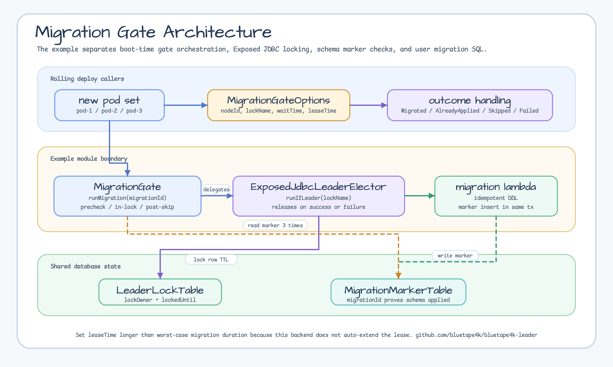
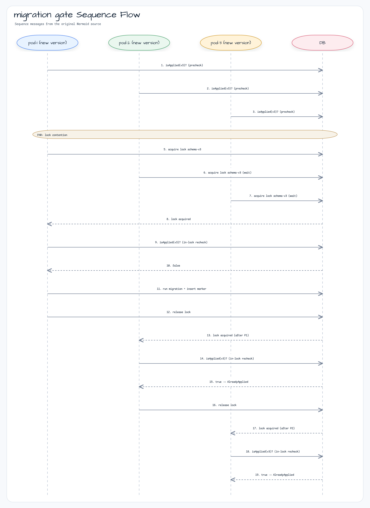

# examples-migration-gate

[English](README.md) | 한국어

Exposed-JDBC 백엔드 기반 분산 스키마 마이그레이션 게이트. K8s 롤링 배포 중 N개 pod 가 동시 기동될 때 마이그레이션을 단 1개만 실행하도록 보장.

## 시나리오

Kubernetes rolling deploy 중 여러 pod가 같은 schema migration 미적용 상태로
기동될 수 있습니다. `MigrationGate.runMigration(...)`은 lock 획득 전 marker를
확인하고, Exposed JDBC leader lock 내부에서 다시 확인한 뒤 migration을 한 번만
실행합니다. 비리더 pod는 이후 marker를 다시 확인하고 serving 진입 여부를 결정합니다.

## 아키텍처 다이어그램



## 시퀀스 다이어그램



## Core Features

- 롤링 배포 중 N개 pod 환경에서 마이그레이션의 **단일 실행 보장**
- 3단계 `isApplied` 검증: precheck → in-lock recheck → post-skip recheck
- 정상/실패/예외 모든 경로에서 락 자동 해제
- 리더 실패 시 차순위 pod 가 자동 인계 (락 해제됨)
- `ExposedJdbcLeaderElector` 사용 — H2/PostgreSQL/MySQL 지원

## Usage Example

```kotlin
val gate = MigrationGate(db, MigrationGateOptions(
    nodeId = System.getenv("HOSTNAME"),
    lockName = "prod-app-schema-v3",
    waitTime = 30.seconds,
    leaseTime = 5.minutes,           // ⚠️ 마이그레이션 최악 실행 시간보다 길게
))

val outcome = gate.runMigration(
    migrationId = "schema-v3",
    isApplied = { schemaVersionExists(db, "v3") },
    migration = {
        transaction(db) {
            SchemaUtils.createMissingTablesAndColumns(UsersTable, OrdersTable)
            SchemaVersionTable.insert { it[version] = "v3" }   // 같은 tx 에 마커 기록
        }
    },
)

when (outcome) {
    is Outcome.Migrated      -> log.info { "리더가 ${outcome.durationMs}ms 에 마이그레이션 완료" }
    is Outcome.AlreadyApplied -> log.info { "이미 적용됨 — skip" }
    is Outcome.Skipped        -> log.warn { "skipped: ${outcome.reason} — 진입 전 확인 필요" }
    is Outcome.Failed         -> error("마이그레이션 실패: ${outcome.cause.message}")
}
```

## Demo

```bash
./gradlew :examples:migration-gate:run
```

H2 in-memory DB + 3 pod 시뮬레이션. 1 Migrated + 2 AlreadyApplied 출력.

## Configuration Options

| 파라미터 | 기본값 | 설명 |
|---------|-------|------|
| `nodeId` | 필수 | pod 식별자 — 락 row 의 `lockOwner` 에 기록되어 추적 가능 |
| `lockName` | 필수 | 분산 락 키 — `<env>-<app>-<schemaVersion>` 권장 |
| `waitTime` | `30.seconds` | 락 획득 최대 대기 시간 |
| `leaseTime` | `5.minutes` | 락 TTL — **마이그레이션 최악 실행 시간보다 길게** (auto-extend 미지원) |

## Migration 작성 가이드

- **idempotent 하게**: 재실행 안전하게 (예: `CREATE TABLE IF NOT EXISTS`)
- **마커와 원자적으로**: 스키마 변경과 마커 insert 를 같은 transaction 에서 수행
- **하위 호환**: 롤링 배포 중 구버전 pod 와 신버전 pod 가 공존 → expand-contract 패턴 권장
  (컬럼 추가 → 백필 → 읽기 전환 → 구컬럼 제거)

## Dependency

```kotlin
dependencies {
    implementation(project(":leader-exposed-jdbc"))
    implementation(project(":examples:migration-gate"))
}
```

## Testing

```bash
./gradlew :examples:migration-gate:test                       # H2 + PostgreSQL
LEADER_TEST_DB=H2 ./gradlew :examples:migration-gate:test     # H2 만
LEADER_TEST_DB=POSTGRESQL ./gradlew :examples:migration-gate:test
```

PostgreSQL 테스트는 Testcontainers — Docker daemon 필요.
