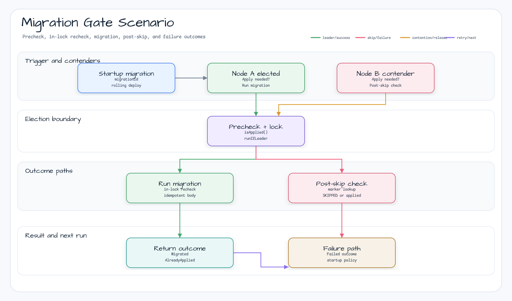
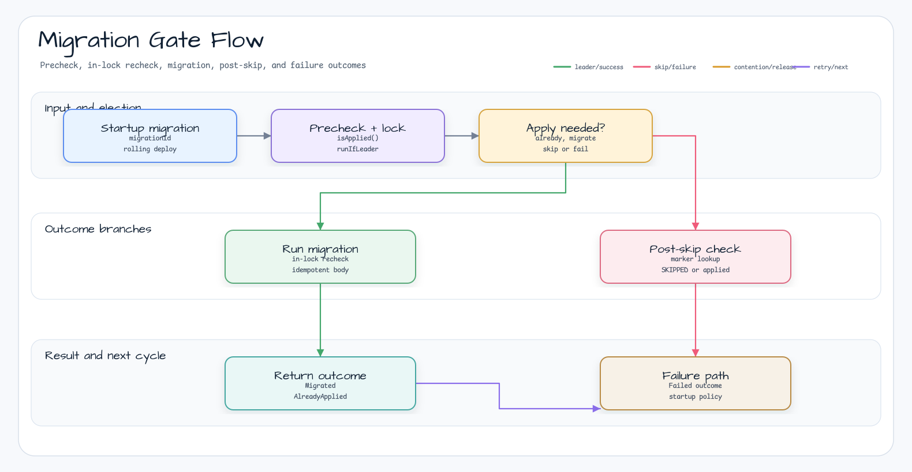

# examples-migration-gate

English | [한국어](README.ko.md)

Distributed schema migration gate using Exposed JDBC backend. Demonstrates safe single-execution of DB migrations across N pods during Kubernetes rolling deploy.

## Scenario

During a Kubernetes rolling deploy, multiple pods may start with the same schema
migration pending. `MigrationGate.runMigration(...)` checks the marker before
locking, rechecks inside the Exposed JDBC leader lock, runs the migration once,
and lets non-leaders confirm the marker afterward before serving.

## Example Scenario



## Architecture Diagram


## Flow Diagram



## Sequence Diagram


## Core Features

- Single migration execution across N pods during rolling deploy
- 3-phase `isApplied` check: precheck → in-lock recheck → post-skip recheck
- Lock automatically released on success, failure, or exception
- Failed leader's lock release allows next pod to take over
- Backed by `ExposedJdbcLeaderElector` — works on H2/PostgreSQL/MySQL

## Usage Example

```kotlin
val gate = MigrationGate(db, MigrationGateOptions(
    nodeId = System.getenv("HOSTNAME"),
    lockName = "prod-app-schema-v3",
    waitTime = 30.seconds,
    leaseTime = 5.minutes,           // ⚠️ Must exceed expected migration duration
))

val outcome = gate.runMigration(
    migrationId = "schema-v3",
    isApplied = { schemaVersionExists(db, "v3") },
    migration = {
        transaction(db) {
            SchemaUtils.createMissingTablesAndColumns(UsersTable, OrdersTable)
            SchemaVersionTable.insert { it[version] = "v3" }   // marker in same tx
        }
    },
)

when (outcome) {
    is Outcome.Migrated      -> log.info { "Leader migrated in ${outcome.durationMs}ms" }
    is Outcome.AlreadyApplied -> log.info { "Already applied — skipping" }
    is Outcome.Skipped        -> log.warn { "Skipped: ${outcome.reason} — verify before serving" }
    is Outcome.Failed         -> error("Migration failed: ${outcome.cause.message}")
}
```

## Demo

```bash
./gradlew :examples:migration-gate:run
```

H2 in-memory DB + 3 pod simulation. Outputs 1 Migrated + 2 AlreadyApplied.

## Configuration Options

| Parameter | Default | Description |
|-----------|---------|-------------|
| `nodeId` | required | Pod identifier — written to lock row's `lockOwner` for tracing |
| `lockName` | required | Distributed lock key — recommend `<env>-<app>-<schemaVersion>` |
| `waitTime` | `30.seconds` | Max time to wait for lock before giving up |
| `leaseTime` | `5.minutes` | Lock TTL — **must exceed worst-case migration duration** (no auto-extend) |

## Migration Authoring Guidelines

- **Idempotent**: Migration must be safe to retry (e.g., `CREATE TABLE IF NOT EXISTS`)
- **Atomic with marker**: Insert marker in same transaction as schema change
- **Backward-compatible**: During rolling deploy, old pods coexist with migrated schema
  → use expand-contract migration pattern (add column → backfill → switch reads → drop)

## Dependency

```kotlin
dependencies {
    implementation(project(":leader-exposed-jdbc"))
    implementation(project(":examples:migration-gate"))
}
```

## Testing

```bash
./gradlew :examples:migration-gate:test                       # H2 + PostgreSQL
LEADER_TEST_DB=H2 ./gradlew :examples:migration-gate:test     # H2 only
LEADER_TEST_DB=POSTGRESQL ./gradlew :examples:migration-gate:test
```

PostgreSQL tests use Testcontainers — Docker daemon required.
