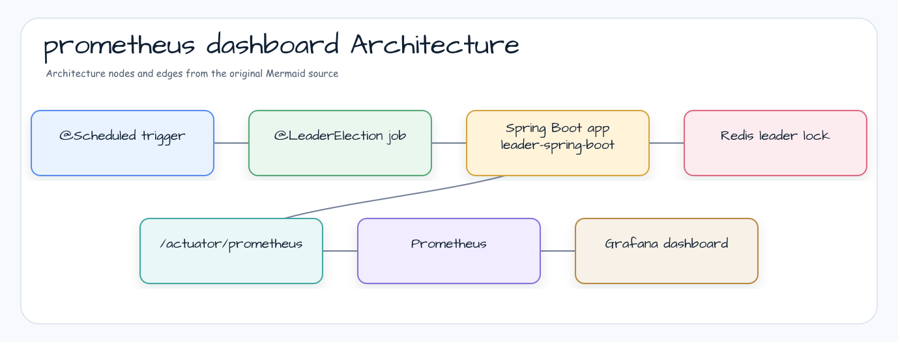

# examples-prometheus-dashboard

한국어 | [English](./README.md)

Spring Boot 4 애플리케이션이 bluetape4k leader election 메트릭을
`/actuator/prometheus`로 노출하고, Prometheus와 Grafana에서 시각화하는 실행 가능한 예제입니다.

## 아키텍처



## 핵심 기능

- `@Scheduled` trigger가 `dashboard-job` 이름의 proxied `@LeaderElection` 작업을 호출
- Lettuce Redis backend, `bootRun` 시 Testcontainers Redis 자동 fallback
- Spring Boot Actuator를 통한 Micrometer leader AOP 메트릭 노출
- Prometheus scrape 설정과 직접 작성한 Grafana dashboard
- 첫 실행 전에도 dashboard series가 보이도록 정적 lock 메트릭 사전 등록
- 애플리케이션과 Spring test context의 Spring Boot AOT 처리

## 로컬 실행

```bash
./gradlew :examples:prometheus-dashboard:bootRun
curl http://localhost:8080/actuator/prometheus | grep leader_aop
```

`DEMO_REDIS_URL`이 없으면 `bootRun`은 Testcontainers Redis를 사용합니다.

## Prometheus/Grafana 실행

```bash
cd examples/prometheus-dashboard
cp .env.example .env
docker compose up --build
```

| 서비스 | URL |
|---|---|
| Spring Boot app | <http://127.0.0.1:8080> |
| Prometheus | <http://127.0.0.1:9090> |
| Grafana | <http://127.0.0.1:3000> |

Compose는 host port를 `127.0.0.1`에만 바인딩하고 Redis를 host에 노출하지 않습니다.
Actuator endpoint도 `prometheus,health,info`만 노출합니다. 로컬 워크스테이션
밖에서 stack을 공유하려면 `.env`의 Grafana password를 먼저 바꾸세요.

## Prometheus Query

```promql
sum by (lock_name) (rate(leader_aop_attempts_total[1m]))
sum by (lock_name) (rate(leader_aop_acquired_total[1m]))
sum by (lock_name, reason) (rate(leader_aop_lock_not_acquired_total[5m]))
rate(leader_aop_execution_duration_seconds_sum[1m])
  / rate(leader_aop_execution_duration_seconds_count[1m])
max by (lock_name) (leader_aop_active)
```

`leader_aop_active`는 JVM-local gauge이므로 멀티 인스턴스에서는 `sum` 대신
`max by (lock_name) (leader_aop_active)`를 사용하세요.

## 설정

| Property / Env | 기본값 | 설명 |
|---|---:|---|
| `DEMO_REDIS_URL` / `demo.redis.url` | Testcontainers Redis | Lettuce가 사용할 Redis URI |
| `DEMO_JOB_FIXED_DELAY_MS` / `demo.job.fixed-delay-ms` | `5000` | Scheduler fixed delay |
| `DEMO_JOB_INITIAL_DELAY_MS` / `demo.job.initial-delay-ms` | `1000` | Scheduler initial delay |
| `SERVER_PORT` | `8080` | HTTP port |

## 의존성

```kotlin
dependencies {
    implementation(project(":leader-spring-boot"))
    implementation(project(":leader-micrometer"))
    implementation(project(":leader-redis-lettuce"))
    implementation("org.springframework.boot:spring-boot-starter-actuator")
    implementation("io.micrometer:micrometer-registry-prometheus")
}
```

이 예제 모듈은 `@EnableAspectJAutoProxy(proxyTargetClass = true)`를 사용해
애플리케이션 모듈에서 compile-time weaving 없이 `@LeaderElection`을
보여줍니다. Spring scheduling에서 advice 경계가 명확하도록 scheduled
trigger가 별도의 proxied job bean을 호출합니다.

모듈에는 Spring Boot AOT 플러그인도 적용되어 있습니다. 기본 CI 검증은
통합 테스트 전에 `processAot`와 `processTestAot`를 실행합니다. native image
생성은 GraalVM/native-image toolchain이 필요하므로 기본 경로에서는 제외합니다.
AOT 태스크도 `bootRun`과 같은 Testcontainers Redis fallback을 사용하므로
`DEMO_REDIS_URL`을 지정하지 않으면 Docker가 필요합니다.

## 테스트

```bash
./gradlew :examples:prometheus-dashboard:processAot \
  :examples:prometheus-dashboard:processTestAot \
  :examples:prometheus-dashboard:test
```

테스트는 Spring Boot를 random port로 시작하고, `RedisServer.Launcher.redis`
Testcontainers singleton을 사용해 `/actuator/prometheus`에 `dashboard-job`의
`leader_aop_*` 메트릭이 노출되는지 검증합니다.
