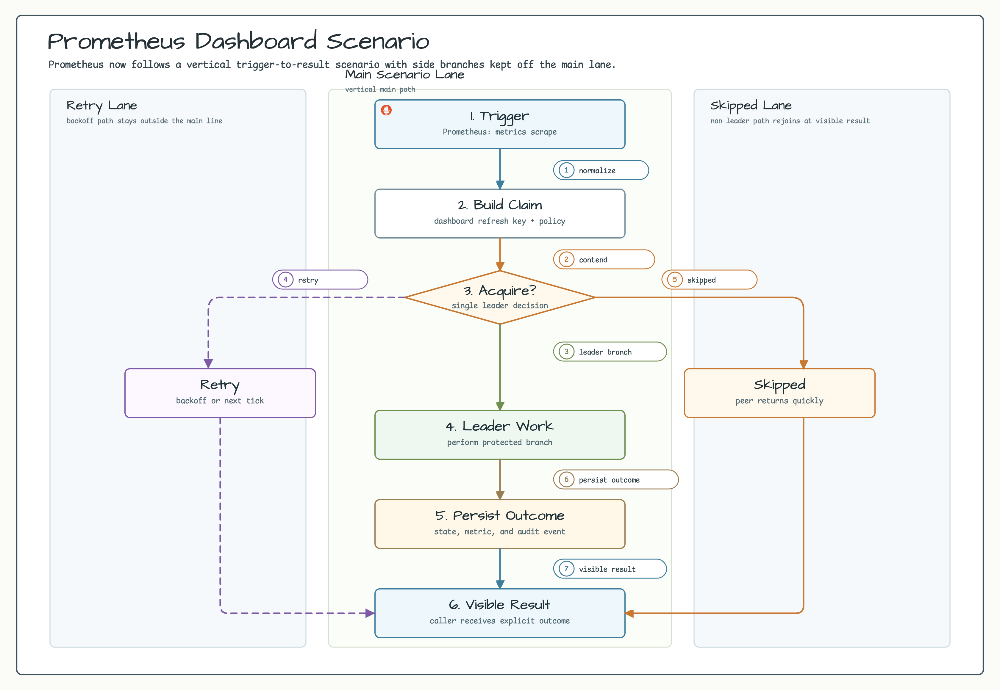
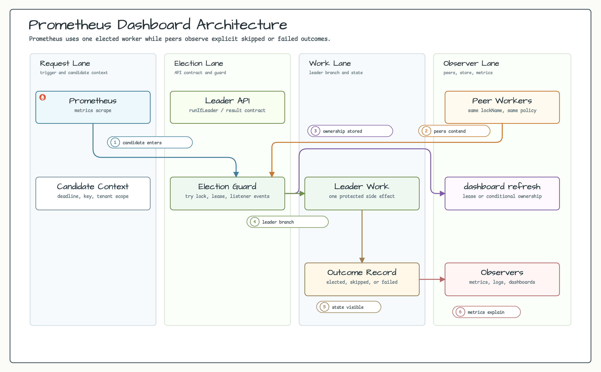
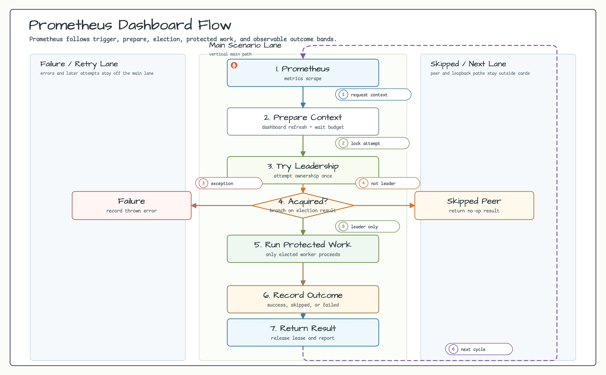
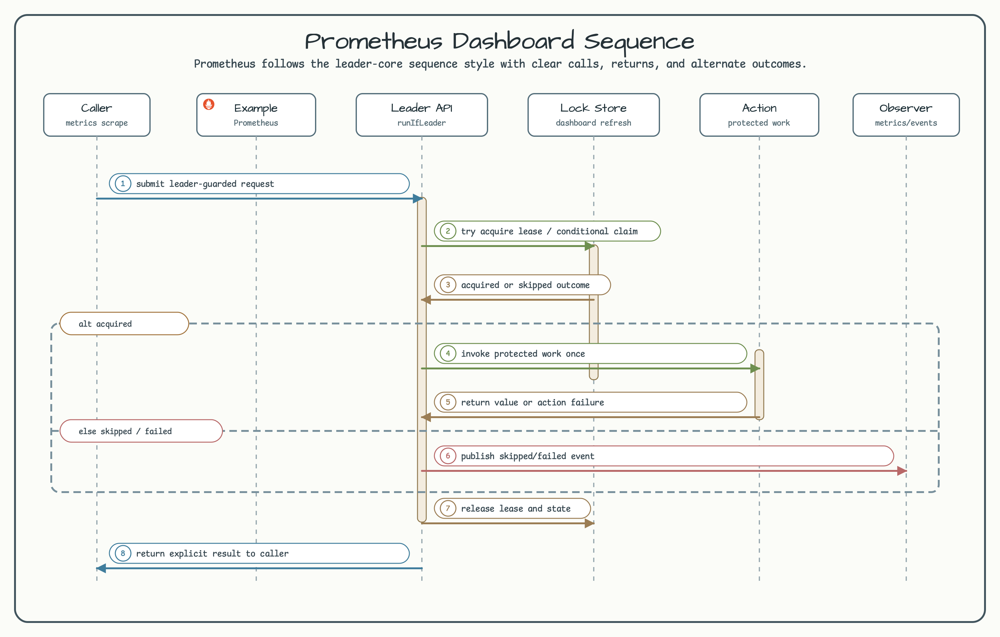

# examples-prometheus-dashboard

[English](README.md) | 한국어

Spring Boot 4 애플리케이션이 bluetape4k leader election 메트릭을
`/actuator/prometheus`로 노출하고, Prometheus와 Grafana에서 시각화하는 실행 가능한 예제입니다.

## 시나리오

Spring Boot 앱은 `dashboard-job` 이름의 proxied `@LeaderElection` 작업을
스케줄링합니다. 작업은 Micrometer를 통해 leader AOP 메트릭을 기록하고
`/actuator/prometheus`에서 노출합니다. compose stack에서는 Prometheus가 앱을
scrape하고 Grafana가 사전 provision된 dashboard를 렌더링합니다.

## 예제 시나리오



## 아키텍처 다이어그램



## 플로우 다이어그램



## 시퀀스 다이어그램



## 핵심 기능

- `@Scheduled` trigger가 `dashboard-job` 이름의 proxied `@LeaderElection` 작업을 호출
- Lettuce Redis backend, `bootRun` 시 Testcontainers Redis 자동 fallback
- Spring Boot Actuator를 통한 Micrometer leader AOP 메트릭 노출
- leader Micrometer Observation을 확인하는 로컬 demo `ObservationHandler`
- Prometheus scrape 설정과 직접 작성한 Grafana dashboard
- 첫 실행 전에도 dashboard series가 보이도록 정적 lock 메트릭 사전 등록
- 애플리케이션과 Spring test context의 Spring Boot AOT 처리

## 로컬 실행

```bash
./gradlew :examples:prometheus-dashboard:bootRun
curl http://localhost:8080/actuator/prometheus | grep leader_aop
```

`DEMO_REDIS_URL`이 없으면 `bootRun`은 Testcontainers Redis를 사용합니다.
demo는 로컬 `ObservationHandler`로 leader observation도 로그에 남깁니다. 끄려면 `DEMO_OBSERVATION_LOGGING_HANDLER_ENABLED=false`를 지정하세요.

이 예제는 하나의 정적 job 이름만 사용하므로 raw metric lock label을 명시적으로 켭니다.

```yaml
bluetape4k:
  leader:
    aop:
      metrics:
        tags:
          lock-name:
            mode: RAW
```

실제 서비스에서 lock name에 tenant, user, request, 무제한 job identifier가 들어간다면 기본 `REDACT` 모드를 유지하세요. raw label 없이 제한된 상관관계만 필요하면 `HASH`를 사용합니다.

## Observation Tracing Demo

`application.yml`은 안전한 기본값으로 leader Observation bridge를 켭니다.


```yaml
bluetape4k:
  leader:
    observability:
      tracing:
        enabled: true
        include-lock-name: false
        include-leader-id: false
        include-exception-details: false
```

`PrometheusDashboardApp`은 `LeaderObservationLoggingHandler`를 로컬 demo hook으로 등록합니다. 이 handler는 `leader.aop.acquire`, `leader.aop.execution`, listener event observation의 이름과 low-cardinality key를 로그로 보여줍니다. production export 설정은 아닙니다.

이 예제는 OpenTelemetry SDK, Micrometer tracing bridge, exporter, collector를 의도적으로 추가하지 않습니다. exported trace가 필요하면 애플리케이션에서 해당 의존성과 설정을 직접 추가하세요. Observation `lock.name`, `leader.id`, exception detail은 tenant, user, job, URL, credential과 비슷한 값을 포함할 수 있어 기본 비활성입니다. 현재 Spring AOP는 `leader.id`를 합성하지 않습니다. direct 호출 또는 future identity-aware 경로가 `LeaderAopMetricsContext.Identified`를 넘길 때만 값이 나타납니다.

`LockExtender`가 core observation/event hook을 제공하기 전까지 lease-extension observation도 이 예제의 범위 밖입니다. 후속 작업은 issue #559에서 추적합니다.

## Prometheus/Grafana 실행

```bash
cd examples/prometheus-dashboard
cp .env.example .env
docker compose up --build
```

| 서비스 | URL |
|---|---|
| Spring Boot app | <http://127.0.0.1:8080> |
| Prometheus | <http://127.0.0.1:9090> |
| Grafana | <http://127.0.0.1:3000> |

Compose는 host port를 `127.0.0.1`에만 바인딩하고 Redis를 host에 노출하지 않습니다.
Actuator endpoint도 `prometheus,health,info`만 노출합니다. 로컬 워크스테이션
밖에서 stack을 공유하려면 `.env`의 Grafana password를 먼저 바꾸세요.

## Prometheus Query

```promql
sum by (lock_name) (rate(leader_aop_attempts_total[1m]))
sum by (lock_name) (rate(leader_aop_acquired_total[1m]))
sum by (lock_name, reason) (rate(leader_aop_lock_not_acquired_total[5m]))
sum by (lock_name) (rate(leader_aop_execution_duration_seconds_sum[1m]))
  / sum by (lock_name) (rate(leader_aop_execution_duration_seconds_count[1m]))
max by (lock_name) (leader_aop_active)
```

`leader_aop_active`는 JVM-local gauge이므로 멀티 인스턴스에서는 `sum` 대신
`max by (lock_name) (leader_aop_active)`를 사용하세요.

## 설정

| Property / Env | 기본값 | 설명 |
|---|---:|---|
| `DEMO_REDIS_URL` / `demo.redis.url` | Testcontainers Redis | Lettuce가 사용할 Redis URI |
| `DEMO_JOB_FIXED_DELAY_MS` / `demo.job.fixed-delay-ms` | `5000` | Scheduler fixed delay |
| `DEMO_JOB_INITIAL_DELAY_MS` / `demo.job.initial-delay-ms` | `1000` | Scheduler initial delay |
| `DEMO_OBSERVATION_LOGGING_HANDLER_ENABLED` / `demo.observation.logging-handler-enabled` | `true` | 로컬 demo Observation handler 활성화 |
| `bluetape4k.leader.aop.metrics.tags.lock-name.mode` | `RAW` | 정적 `dashboard-job` label을 Prometheus에서 보여주기 위한 demo 전용 opt-in |
| `SERVER_PORT` | `8080` | HTTP port |

## 의존성

```kotlin
dependencies {
    implementation("io.github.bluetape4k.leader:bluetape4k-leader-spring-boot:${bluetape4kVersion}")
    implementation("io.github.bluetape4k.leader:bluetape4k-leader-micrometer:${bluetape4kVersion}")
    implementation("io.github.bluetape4k.leader:bluetape4k-leader-redis-lettuce:${bluetape4kVersion}")
    implementation("org.springframework.boot:spring-boot-starter-actuator")
    implementation("io.micrometer:micrometer-registry-prometheus")
    // Observation을 trace로 export하려면 애플리케이션에서
    // Micrometer tracing / OpenTelemetry exporter 의존성을 추가하세요.
}
```

이 예제 모듈은 `@EnableAspectJAutoProxy(proxyTargetClass = true)`를 사용해
애플리케이션 모듈에서 compile-time weaving 없이 `@LeaderElection`을
보여줍니다. Spring scheduling에서 advice 경계가 명확하도록 scheduled
trigger가 별도의 proxied job bean을 호출합니다.

모듈에는 Spring Boot AOT 플러그인도 적용되어 있습니다. 기본 CI 검증은
통합 테스트 전에 `processAot`와 `processTestAot`를 실행합니다. native image
생성은 GraalVM/native-image toolchain이 필요하므로 기본 경로에서는 제외합니다.
AOT 태스크도 `bootRun`과 같은 Testcontainers Redis fallback을 사용하므로
`DEMO_REDIS_URL`을 지정하지 않으면 Docker가 필요합니다.

## 테스트

```bash
./gradlew :examples:prometheus-dashboard:processAot \
  :examples:prometheus-dashboard:processTestAot \
  :examples:prometheus-dashboard:test
```

테스트는 Spring Boot를 random port로 시작하고, `RedisServer.Launcher.redis`
Testcontainers singleton을 사용해 `/actuator/prometheus`에 `dashboard-job`의
`leader_aop_*` 메트릭이 노출되는지 검증합니다.
