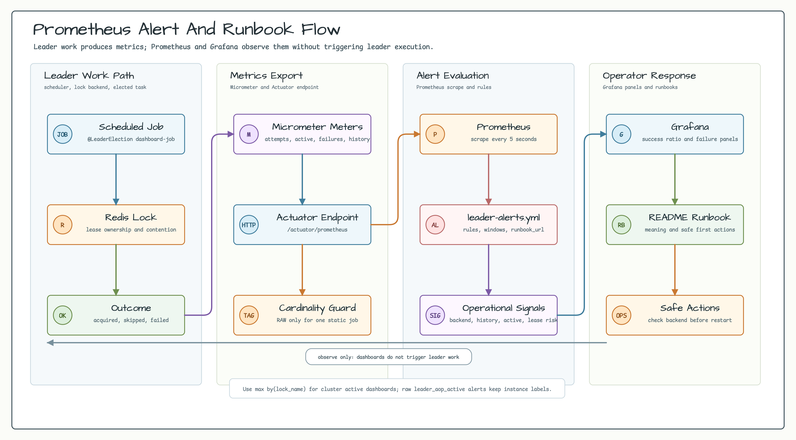

# examples-prometheus-dashboard

[English](README.md) | 한국어

Spring Boot 4 애플리케이션이 bluetape4k leader election 메트릭을
`/actuator/prometheus`로 노출하고, Prometheus와 Grafana에서 시각화하는 실행 가능한 예제입니다.

## 시나리오

Spring Boot 앱은 `dashboard-job` 이름의 proxied `@LeaderElection` 작업을
스케줄링합니다. 작업은 Micrometer를 통해 leader AOP 메트릭을 기록하고
`/actuator/prometheus`에서 노출합니다. compose stack에서는 Prometheus가 앱을
scrape하고 Grafana가 사전 provision된 dashboard를 렌더링합니다.

## 예제 시나리오


## 아키텍처 다이어그램


## 플로우 다이어그램


## 시퀀스 다이어그램


## Alert 및 Runbook 다이어그램



## 핵심 기능

- `@Scheduled` trigger가 `dashboard-job` 이름의 proxied `@LeaderElection` 작업을 호출
- Lettuce Redis backend, `bootRun` 시 Testcontainers Redis 자동 fallback
- Spring Boot Actuator를 통한 Micrometer leader AOP 메트릭 노출
- leader Micrometer Observation을 확인하는 로컬 demo `ObservationHandler`
- Prometheus scrape 설정과 직접 작성한 Grafana dashboard
- 예제 범위의 Prometheus alert rule과 runbook 안내
- History health meter가 0으로 보이도록 no-op history recorder 등록
- 첫 실행 전에도 dashboard series가 보이도록 정적 lock 메트릭 사전 등록
- 애플리케이션과 Spring test context의 Spring Boot AOT 처리

## 로컬 실행

```bash
./gradlew :examples:prometheus-dashboard:bootRun
curl http://localhost:8080/actuator/prometheus | grep leader_aop
```

`DEMO_REDIS_URL`이 없으면 `bootRun`은 Testcontainers Redis를 사용합니다.
demo는 로컬 `ObservationHandler`로 leader observation도 로그에 남깁니다. 끄려면 `DEMO_OBSERVATION_LOGGING_HANDLER_ENABLED=false`를 지정하세요.

이 예제는 metric lock label을 기본적으로 `REDACT`로 둡니다. raw label 없이 제한된 상관관계만
필요하면 `HASH`를 사용하고, `RAW`는 정적 job 이름만 쓰는 로컬 데모 profile에서만 켜세요.

```yaml
bluetape4k:
  leader:
    aop:
      metrics:
        tags:
          lock-name:
            mode: REDACT
            redacted-value: redacted-lock
```

실제 서비스에서 lock name에 tenant, user, request, 무제한 job identifier가 들어간다면 `REDACT`를 유지하세요.

## Observation Tracing Demo

`application.yml`은 안전한 기본값으로 leader Observation bridge를 켭니다.


```yaml
bluetape4k:
  leader:
    observability:
      tracing:
        enabled: true
        include-lock-name: false
        include-leader-id: false
        include-exception-details: false
```

`PrometheusDashboardApp`은 `LeaderObservationLoggingHandler`를 로컬 demo hook으로 등록합니다. 이 handler는 `leader.aop.acquire`, `leader.aop.execution`, listener event observation의 이름과 low-cardinality key를 로그로 보여줍니다. production export 설정은 아닙니다.

이 예제는 OpenTelemetry SDK, Micrometer tracing bridge, exporter, collector를 의도적으로 추가하지 않습니다. exported trace가 필요하면 애플리케이션에서 해당 의존성과 설정을 직접 추가하세요. Observation `lock.name`, `leader.id`, exception detail은 tenant, user, job, URL, credential과 비슷한 값을 포함할 수 있어 기본 비활성입니다. 현재 Spring AOP는 `leader.id`를 합성하지 않습니다. direct 호출 또는 future identity-aware 경로가 `LeaderAopMetricsContext.Identified`를 넘길 때만 값이 나타납니다.

이 예제의 기본 handler는 lease-extension observation을 로그로 남기지 않습니다. Handler가 `leader.`로 시작하는
observation name만 받는데 core lease-extension observation의 이름은
`bluetape4k.leader.lease.extension`이기 때문입니다. Handler를 소유한 애플리케이션은 bounded tag와 privacy
옵션을 검토한 뒤 정확한 이름을 opt-in할 수 있습니다. 자세한 내용은
[미배포 lease-extension 관찰 초안](../../docs/manual/drafts/2026-08-27-issue-559-lease-extension-observation.ko.md)을 참고하세요.

## Prometheus/Grafana 실행

```bash
cd examples/prometheus-dashboard
cp .env.example .env
docker compose up --build
```

| 서비스 | URL |
|---|---|
| Spring Boot app | <http://127.0.0.1:8080> |
| Prometheus | <http://127.0.0.1:9090> |
| Grafana | <http://127.0.0.1:3000> |

Compose는 host port를 `127.0.0.1`에만 바인딩하고 Redis를 host에 노출하지 않습니다.
Actuator endpoint도 `prometheus,health,info`만 노출합니다. 로컬 워크스테이션
밖에서 stack을 노출하려면 `.env`의 Grafana password를 바꾸는 것만으로는
부족합니다. 필요 없으면 Prometheus `--web.enable-lifecycle`을 제거하고, app,
Prometheus, Grafana 앞에 명시적인 auth, TLS, reverse proxy 제어를 두세요.

Prometheus는 compose에서 `/etc/prometheus/rules`로 마운트한
`provisioning/prometheus/rules/leader-alerts.yml`을 읽습니다. 이 rule은
예제용 출발점입니다. production monitoring stack에서는 window, severity,
notification route를 서비스 상황에 맞게 조정하세요.

## Alert Runbooks

| Alert | 의미 | 안전한 첫 조치 |
|---|---|---|
| `LeaderElectionNoAcquisitions` | 작업은 계속 시도하지만 어느 instance도 `leader_aop_acquired_total` 증가를 보고하지 않습니다. | Redis 접근성, lock key contention, scheduler 주기, 모든 instance가 같은 backend를 쓰는지 확인합니다. |
| `LeaderElectionBackendErrors` | AOP 경로가 lock 획득에서 `reason="BACKEND_ERROR"`를 보고합니다. | worker 재시작 전에 `leader backend error` 주변 로그, Redis 상태, network 오류, failure-mode 설정을 확인합니다. |
| `LeaderBackendConnectivityDown` | active backend probe가 5분 동안 `status="DOWN",reason="DISCONNECTED"`를 보고합니다. 예제 rule은 warning 전용이고 `notification: no-page`입니다. | 기존 client, backend 접근성, provider timeout을 확인합니다. 이 결과를 orphan lock의 증거나 강제 lease 해제 근거로 사용하지 마세요. |
| `LeaderBackendConnectivityUnknown` | active probe가 10분 동안 `CLIENT_STATE_UNCONFIRMED` 또는 `PROVIDER_UNSUPPORTED` reason의 `UNKNOWN`을 보고합니다. info/no-page 신호이며 `DOWN`이 아닙니다. | Provider capability와 native timeout 설정을 확인하세요. Passive diagnostics는 counter를 만들지 않으므로 `NOT_CHECKED`를 이 alert에 포함하지 않습니다. |
| `LeaderBackendConnectivityProbeExceptions` | 일반 provider 예외가 `PROVIDER_EXCEPTION` reason의 `UNKNOWN`으로 정규화된 상태가 10분 지속됩니다. 예제 rule은 warning 전용이고 `notification: no-page`입니다. | 보호된 애플리케이션 로그와 provider-native 진단을 확인하되 예외 원문을 label에 복사하지 마세요. Probe 지연이 request budget을 넘으면 active probe를 우회합니다. |
| `LeaderElectionTaskFailures` | lock 획득 후 elected task 본문에서 예외가 발생했습니다. | `exception` label로 실패 코드 경로를 찾고, 애플리케이션 로그를 확인하며, 수정 중에도 lock backend는 유지합니다. |
| `LeaderHistorySinkFailures` | 실제 history/audit sink가 leader history 기록 중 예외를 던졌습니다. Demo는 `NoopLeaderHistorySink`를 제외합니다. | sink credential, schema/index 상태, write capacity, retention job을 확인합니다. Leader 실행은 계속될 수 있지만 audit 내구성은 낮아진 상태입니다. |
| `LeaderHistoryAcquireMissing` | 실제 history sink가 elected work에 대한 acquire key를 반환하지 않았습니다. Demo는 의도적으로 key를 반환하지 않는 `NoopLeaderHistorySink`를 제외합니다. | 중복 record, storage unavailable, sink별 conditional write conflict를 확인합니다. |
| `LeaderActiveGaugeAnomaly` | 한 JVM이 single-leader `dashboard-job` lock에 대해 `leader_aop_active > 1`을 보고합니다. | `instance` label을 기준으로 해당 JVM의 thread dump, 장시간 실행, release/finish 로그를 확인합니다. 이 rule을 복사하기 전에 group-election lock은 scope 조정 또는 제외하세요. |
| `LeaderLeaseRiskHighExecutionTime` | 완료된 실행의 평균이 24초를 넘었습니다. 이 값은 demo lease 30초의 80%입니다. | 지연된 증상으로만 다루세요. 작업을 줄이거나 lease time을 늘리고, production page로 쓰려면 직접 lease-extension instrumentation을 추가합니다. |
| `LeaderPrometheusScrapeMissing` | Prometheus가 앱의 `up` series를 만들지 못했거나 scrape target이 down입니다. | leader 로직을 보기 전에 app health, compose network, `/actuator/prometheus`, Prometheus target page를 확인합니다. |

`leader_aop_active`는 JVM-local gauge입니다. Cluster dashboard에서는
`sum` 대신 `max by (lock_name) (leader_aop_active)`를 사용하세요. Anomaly
alert는 문제가 있는 `instance` label을 보존하려고 의도적으로 raw
`leader_aop_active > 1` series를 사용합니다.

`exception`은 예외 클래스 이름 tag입니다. Exception별 alert/dashboard view는
내부용으로 유지하세요. Cardinality나 구현 상세 노출이 문제라면
`sum by (lock_name)`으로 접으세요.

Backend connectivity counter는 Prometheus 이름 변환 후
`leader_backend_connectivity_total`입니다. label은 정제된 `backend_name`,
네 가지 status, 여섯 가지 bounded reason뿐입니다. 위 rule은 `for` 지속 시간과
`notification: no-page`를 사용합니다. `UNKNOWN`을 `DOWN`으로 다시 쓰지 않으며,
passive `NOT_CHECKED` diagnostics는 series를 만들지 않습니다.

이 demo는 `MicrometerSafeLeaderHistoryRecorder`를 `NoopLeaderHistorySink`와
함께 등록해 `leader_history_*` meter가 보이게 합니다. Alert rule은 no-op sink가
의도적으로 acquire key를 반환하지 않으므로 해당 sink를 제외합니다. 실제 서비스에서는
JDBC, R2DBC, MongoDB, custom history sink를 recorder로 감싼 뒤 이 alert를 사용하세요.

이 예제의 Prometheus meter는 lease-extension 실패를 노출하지 않습니다. Core는
`LeaderLeaseExtensionEvent`를 publish하고 Micrometer adapter가
`bluetape4k.leader.lease.extension` Observation을 생성합니다. 이 demo의 local
handler는 `leader.`로 시작하는 이름만 받고 애플리케이션도 lease-extension meter를
등록하지 않습니다. 따라서 lease risk rule은 완료된 실행 시간으로 보는 보수적인
증상 rule일 뿐입니다. Demo에서 이 신호를 노출하려면
[미배포 lease-extension 관찰 초안](../../docs/manual/drafts/2026-08-27-issue-559-lease-extension-observation.ko.md)을
검토한 뒤 Micrometer observer를 명시적으로 설정하거나 애플리케이션 소유 handler를
수정하세요.

## Prometheus Queries

```promql
sum by (lock_name) (rate(leader_aop_attempts_total[1m]))
sum by (lock_name) (rate(leader_aop_acquired_total[1m]))
sum by (lock_name, reason) (rate(leader_aop_lock_not_acquired_total[5m]))
sum by (lock_name) (rate(leader_aop_lock_not_acquired_total{reason="BACKEND_ERROR"}[5m]))
sum by (lock_name, exception) (rate(leader_aop_task_failed_total[5m]))
sum by (sink) (rate(leader_history_sink_failures_total[5m]))
sum by (sink) (rate(leader_history_acquire_missing_total[5m]))
sum by (lock_name) (rate(leader_aop_execution_duration_seconds_sum[1m]))
  / sum by (lock_name) (rate(leader_aop_execution_duration_seconds_count[1m]))
max by (lock_name) (leader_aop_active)
sum by (backend_name, status, reason) (rate(leader_backend_connectivity_total[5m]))
sum by (backend_name) (rate(leader_backend_connectivity_total{status="DOWN",reason="DISCONNECTED"}[5m]))
sum by (backend_name, reason) (rate(leader_backend_connectivity_total{status="UNKNOWN"}[5m]))
```

`leader_aop_active`는 JVM-local gauge이므로 멀티 인스턴스에서는 `sum` 대신
`max by (lock_name) (leader_aop_active)`를 사용하세요.

## 설정

| Property / Env | 기본값 | 설명 |
|---|---:|---|
| `DEMO_REDIS_URL` / `demo.redis.url` | Testcontainers Redis | Lettuce가 사용할 Redis URI |
| `DEMO_JOB_FIXED_DELAY_MS` / `demo.job.fixed-delay-ms` | `5000` | Scheduler fixed delay |
| `DEMO_JOB_INITIAL_DELAY_MS` / `demo.job.initial-delay-ms` | `1000` | Scheduler initial delay |
| `DEMO_OBSERVATION_LOGGING_HANDLER_ENABLED` / `demo.observation.logging-handler-enabled` | `true` | 로컬 demo Observation handler 활성화 |
| `bluetape4k.leader.aop.metrics.tags.lock-name.mode` | `RAW` | 정적 `dashboard-job` label을 Prometheus에서 보여주기 위한 demo 전용 opt-in |
| `SERVER_PORT` | `8080` | HTTP port |

## 의존성

```kotlin
dependencies {
    implementation("io.github.bluetape4k.leader:bluetape4k-leader-spring-boot:${bluetape4kVersion}")
    implementation("io.github.bluetape4k.leader:bluetape4k-leader-micrometer:${bluetape4kVersion}")
    implementation("io.github.bluetape4k.leader:bluetape4k-leader-redis-lettuce:${bluetape4kVersion}")
    implementation("org.springframework.boot:spring-boot-starter-actuator")
    implementation("io.micrometer:micrometer-registry-prometheus")
    // Observation을 trace로 export하려면 애플리케이션에서
    // Micrometer tracing / OpenTelemetry exporter 의존성을 추가하세요.
}
```

이 예제 모듈은 `@EnableAspectJAutoProxy(proxyTargetClass = true)`를 사용해
애플리케이션 모듈에서 compile-time weaving 없이 `@LeaderElection`을
보여줍니다. Spring scheduling에서 advice 경계가 명확하도록 scheduled
trigger가 별도의 proxied job bean을 호출합니다.

모듈에는 Spring Boot AOT 플러그인도 적용되어 있습니다. 기본 CI 검증은
통합 테스트 전에 `processAot`와 `processTestAot`를 실행합니다. native image
생성은 GraalVM/native-image toolchain이 필요하므로 기본 경로에서는 제외합니다.
AOT 태스크도 `bootRun`과 같은 Testcontainers Redis fallback을 사용하므로
`DEMO_REDIS_URL`을 지정하지 않으면 Docker가 필요합니다.

## 테스트

```bash
./gradlew :examples:prometheus-dashboard:processAot \
  :examples:prometheus-dashboard:processTestAot \
  :examples:prometheus-dashboard:test
```

테스트는 Spring Boot를 random port로 시작하고, `RedisServer.Launcher.redis`
Testcontainers singleton을 사용해 `/actuator/prometheus`에 `dashboard-job`의
`leader_aop_*` 메트릭이 노출되는지 검증합니다.
