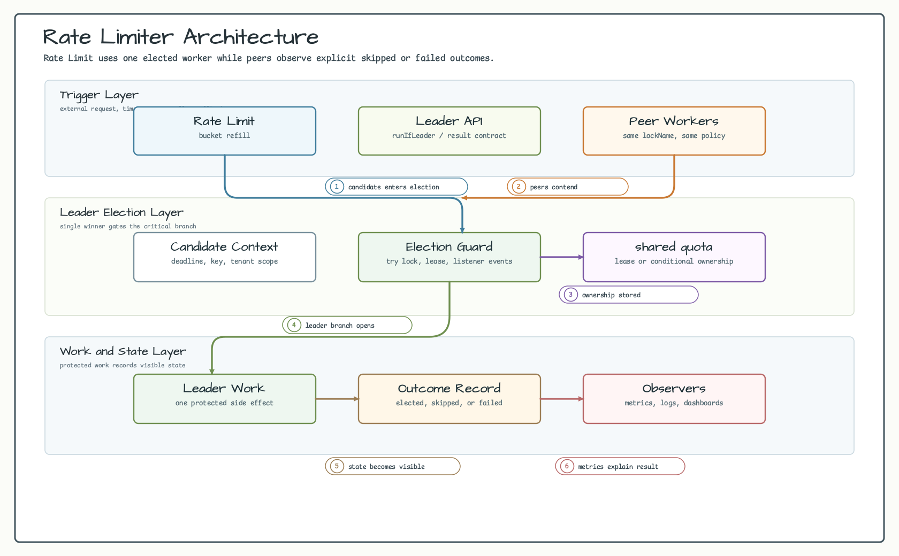
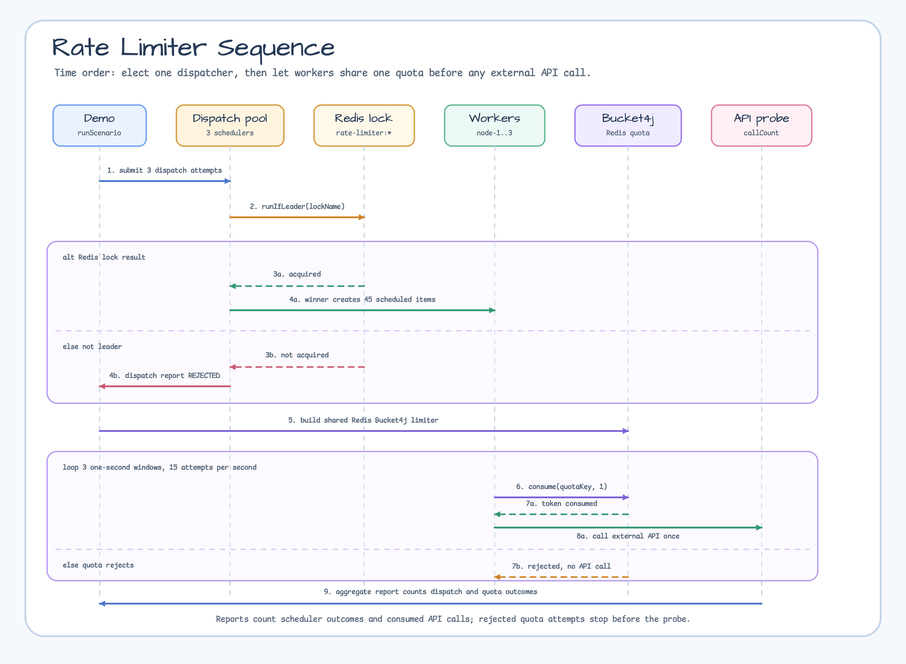

# examples-rate-limiter

[한국어](README.ko.md) | English

This example combines Redis leader election with a distributed Bucket4j rate
limiter.

## Scenario

Three application nodes try to dispatch the same outbound API workload. Redis
leader election allows only one node to schedule the work. The scheduled work is
then consumed by all nodes through one Redis-backed Bucket4j quota:

- `SCHEDULED`: the node won leader election and created work items.
- `CONSUMED`: the worker consumed one distributed token and called the external
  API probe.
- `REJECTED`: the node was not the scheduler or the distributed quota rejected
  the worker call.

The test uses a 10 calls/second quota over a 3 second window and asserts that
total external API calls stay at or below `30`.

## Architecture Diagram



## Sequence Diagram



## Run

```bash
./gradlew :examples:rate-limiter:run
```

The demo starts `RedisServer.Launcher.redis` from `bluetape4k-testcontainers`.
Docker must be available.

## Test

```bash
./gradlew :examples:rate-limiter:test
```

The test verifies:

- exactly one of three nodes dispatches the workload;
- distributed worker calls share one Redis Bucket4j quota;
- total external API calls remain within the expected 3 second limit.
