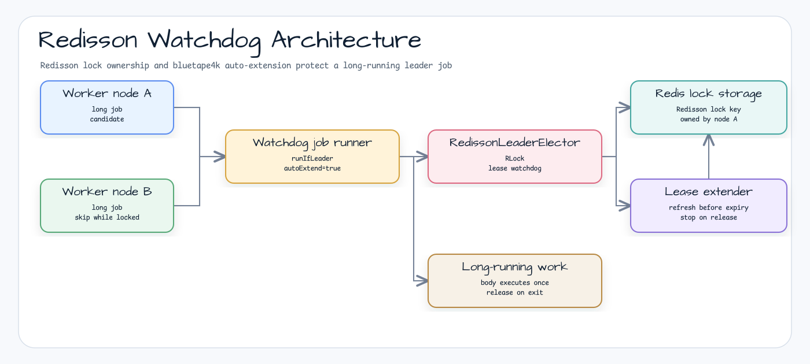
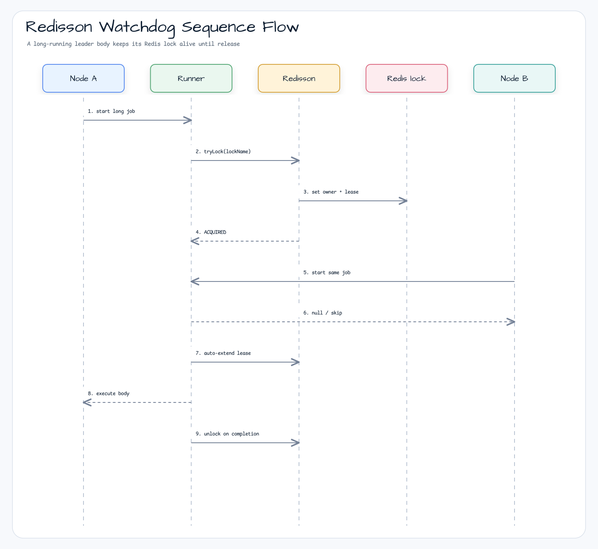

# Redisson Watchdog Example

[한국어](README.ko.md) | English

Redisson-backed long-running leader job protected by bluetape4k lease auto-extension.

## Scenario

Two nodes compete for the same Redis-backed lock. The elected node runs a job that can outlive the initial lease time,
so `LeaderElectionOptions(autoExtend = true)` keeps renewing the lock while the body is active. The contending node
skips while the lock is held and can acquire it after the leader releases.

## Architecture Diagram



## Sequence Diagram



## What It Shows

- Configure `LeaderElectionOptions(autoExtend = true)` for a Redisson-backed leader job.
- Keep `waitTime` short so non-leaders skip quickly.
- Size `leaseTime` for the renewal cadence, not for maximum job runtime.
- Release the Redisson lock when the leader body exits.
- Bound the leader body with shutdown or timeout policy.

## Run

The example uses the Redis Testcontainers launcher unless an external Redis URL is provided by the module code path.
Docker is required for the default run.

```bash
./gradlew :examples:redisson-watchdog:run
```

## Test

```bash
./gradlew :examples:redisson-watchdog:test
```

## Design

```kotlin
val options = LeaderElectionOptions(
    waitTime = 200.milliseconds,
    leaseTime = 2.seconds,
    autoExtend = true,
)

val runner = RedissonWatchdogJobRunner("node-a", redissonClient, "nightly-export", options)

val report = runner.runJob {
    exportService.rollup()
}
```

Use this pattern when the job has a bounded but variable duration and losing contenders should skip instead of waiting.
