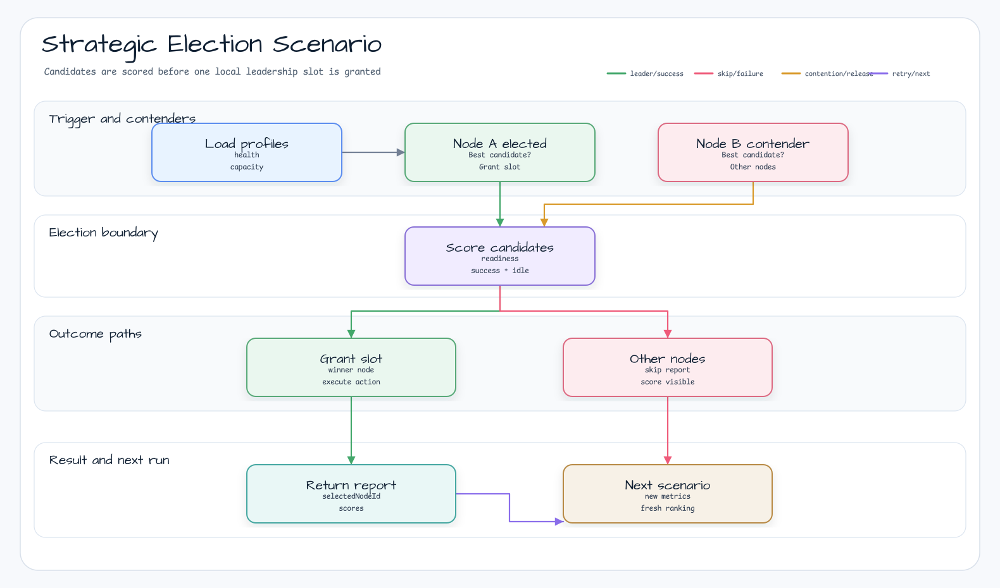
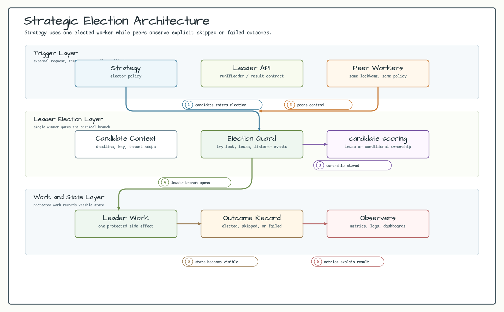
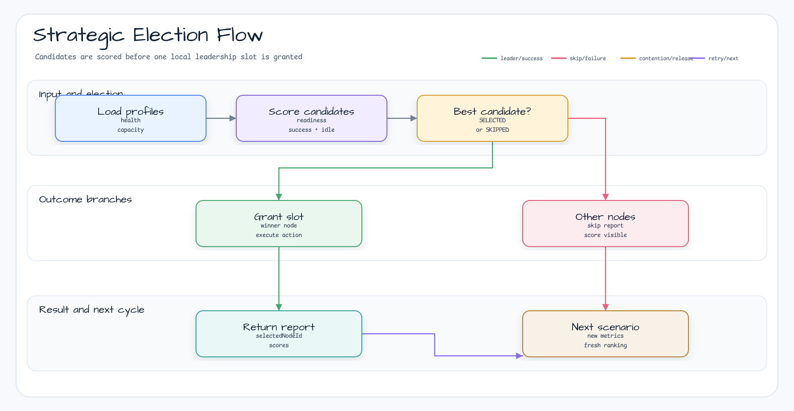
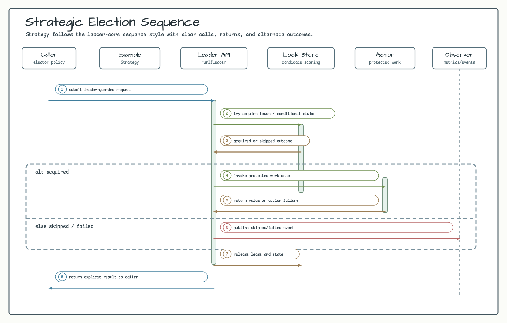

# Strategic Election Example

English | [한국어](README.ko.md)

Backend-neutral strategic leader-election example. It chooses the best service node before running the leader-only body.

## Scenario

Three service nodes compete to run a maintenance task. The winner is selected by weighted scoring across readiness,
historical success rate, and idle time. Non-winner nodes skip the action without throwing.

## Example Scenario



## Architecture Diagram



## Flow Diagram



## Sequence Diagram



## What It Shows

- Combine candidate readiness, reliability, and fairness inputs.
- Use `CandidateScorer` and `WeightedScorer` to calculate normalized scores.
- Select the winner through `ScoredElectionStrategy`.
- Run work through `LocalStrategicLeaderElector` without an external backend.
- Return skip results for non-winner nodes.

## Run

```bash
./gradlew :examples:strategic-election:run
```

## Test

```bash
./gradlew :examples:strategic-election:test
```

## Design

```kotlin
val scorer = WeightedScorer(
    ServiceReadinessScorer to 0.50,
    SuccessRateScorer to 0.35,
    IdleTimeScorer to 0.15,
)

val strategy = ScoredElectionStrategy(scorer)
val elector = LocalStrategicLeaderElector("node-a")
```

Use this example when leadership should prefer the healthiest or most appropriate candidate instead of the first lock
holder.
