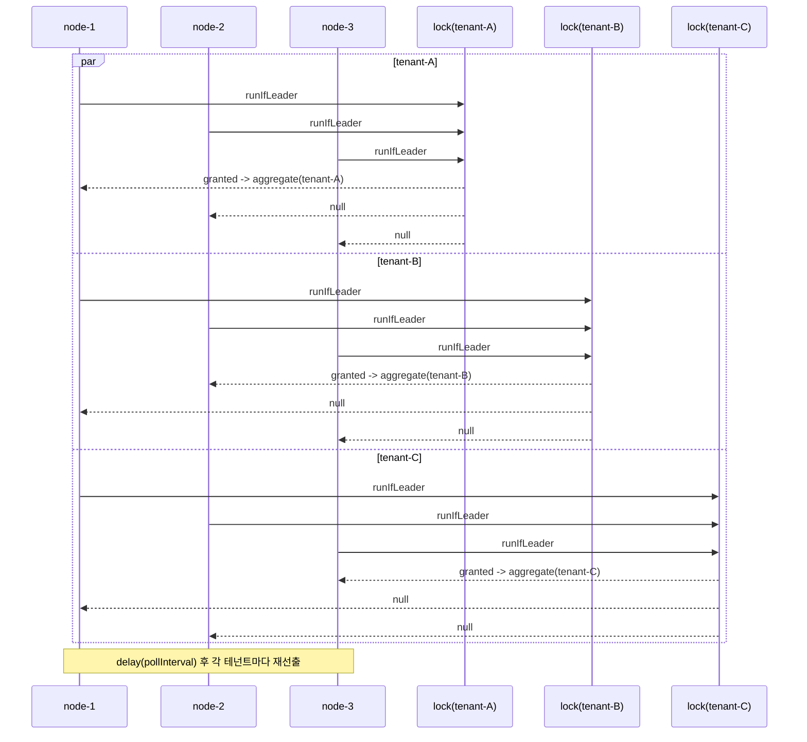

# examples-tenant-aggregator

한국어 | [English](./README.md)

Exposed R2DBC 리더 선출 기반 멀티테넌트 집계기. N개 인스턴스 환경에서 **테넌트별 독립 lockName** 으로 각 테넌트는 정확히 1 인스턴스만 polling 한다. long-running coroutine 워커, graceful stop, 테넌트별 예외 격리를 시연.

## Architecture



## Core Features

- 테넌트별 독립 leader-election — `lockName = "${lockNamePrefix}-${tenantId}"`
- Long-running coroutine 워커 — 테넌트마다 supervised child coroutine 1개
- Aggregate 예외 격리 — `aggregateFunction` 예외는 다음 사이클에 영향 없음 (poison 방지)
- Graceful stop — `stopGracefully(timeout)` 가 모든 테넌트 코루틴 협력적 cancel
- 모든 catch 에서 `CancellationException` 재throw — coroutine cancellation 무결성 유지
- `ExposedR2DbcSuspendLeaderElector` (PostgreSQL / H2 / MySQL R2DBC) 백엔드

## LeaderGroup 미사용 이유

`LeaderGroupElector` 는 단일 lockName 의 `maxLeaders` 슬롯을 공유하는데 "테넌트 T -> 슬롯 k" 매핑을 호출자가 강제할 수 없다. 테넌트별 독립 lockName 으로 leader-election 하면 "테넌트 T 에 대해서는 정확히 1 인스턴스" 계약을 직접 표현 가능 (E4 cache-warmer 와 동일 결정).

## Usage Example

```kotlin
val aggregator = TenantAggregator(
    electorFactory = { _, options ->
        ExposedR2DbcSuspendLeaderElector(
            db,
            ExposedR2dbcLeaderElectionOptions(leaderOptions = options),
        )
    },
    options = TenantAggregatorOptions(
        nodeId = System.getenv("HOSTNAME") ?: "node-local",
        lockNamePrefix = "tenant-aggregator:metrics",
        tenants = listOf("tenant-A", "tenant-B", "tenant-C"),
        pollInterval = 5.seconds,
        waitTime = 1.seconds,
        leaseTime = 60.seconds,
    ),
    aggregateFunction = { tenantId -> metricsService.aggregate(tenantId) },
)

val job = aggregator.start(applicationScope)
// ... shutdown ...
aggregator.stopGracefully(timeout = 30.seconds)
```

## Demo

```bash
./gradlew :examples:tenant-aggregator:run
```

H2 R2DBC in-memory DB 를 공유하는 3개 in-process 집계기를 6초간 polling 후, 테넌트별 집계 호출 횟수 + 동시 실행 위반 0 을 출력.

## Configuration Options

| 파라미터 | 기본값 | 설명 |
|---------|--------|------|
| `nodeId` | required | Pod 식별자 — 로그/lock owner 노출 |
| `tenants` | required | 독립 polling 할 테넌트 식별자 — 빈 목록·blank 항목 금지 |
| `lockNamePrefix` | `"tenant-aggregator"` | 락 prefix — 최종 이름은 `"${prefix}-${tenantId}"` |
| `pollInterval` | `5.seconds` | 테넌트별 사이클 간 휴지 |
| `waitTime` | `1.seconds` | 락 획득 대기 (짧게 = 빠른 skip) |
| `leaseTime` | `60.seconds` | 락 TTL — 최대 aggregate 실행 시간보다 길게 |

## Failure Semantics

- `aggregateFunction` throw -> log warn + 격리, 다음 사이클 계속 (poison 방지)
- 리더 pod crash -> elector lease 만료 -> 차순위 인스턴스가 락 획득 -> aggregation 인계 (at-least-once)
- `electorFactory` 가 테넌트 초기화에서 throw -> 해당 테넌트 루프 종료 (다른 테넌트는 `supervisorScope` 덕에 계속)
- `start(scope)` 두 번 호출 -> `IllegalStateException`

## Dependency

```kotlin
dependencies {
    implementation(project(":leader-exposed-r2dbc"))
    implementation(project(":examples:tenant-aggregator"))

    // R2DBC 드라이버 (택일)
    runtimeOnly(libs.r2dbc.h2)         // demo / tests
    runtimeOnly(libs.r2dbc.postgresql) // production
}
```

## Testing

```bash
LEADER_TEST_DB=H2 ./gradlew :examples:tenant-aggregator:test
LEADER_TEST_DB=POSTGRESQL ./gradlew :examples:tenant-aggregator:test  # Testcontainers PostgreSQL
./gradlew :examples:tenant-aggregator:test                            # 둘 다
```

`@ParameterizedTest @MethodSource("enableDialects")` 로 H2 in-memory + PostgreSQL Testcontainers 모두 지원.
