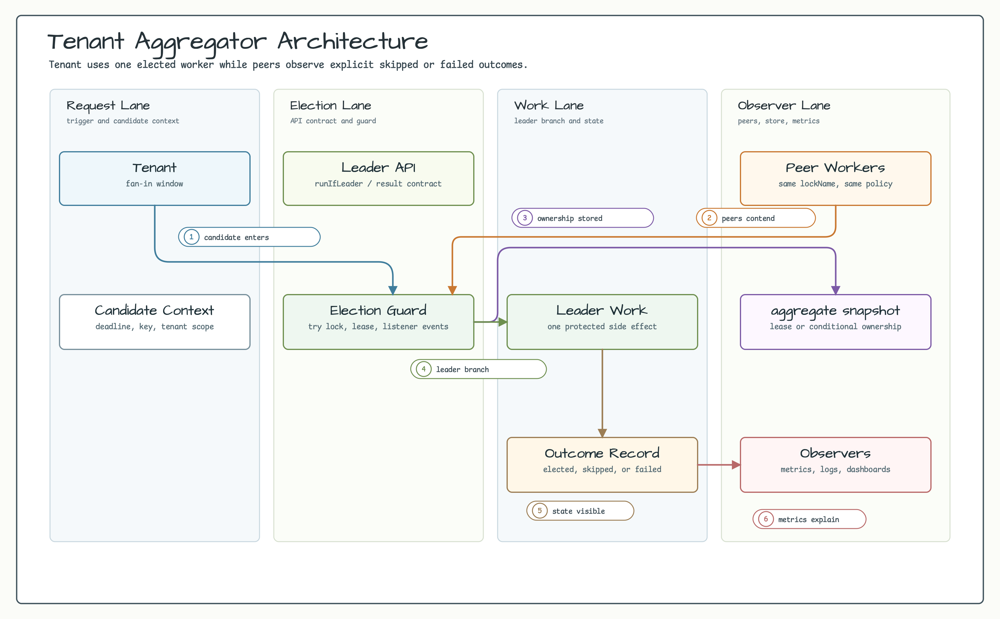
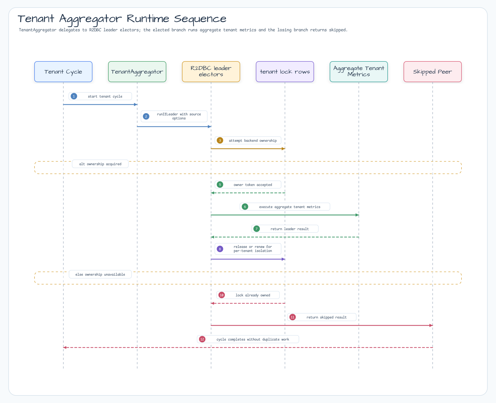

# examples-tenant-aggregator

English | [한국어](README.ko.md)

Multi-tenant aggregator backed by Exposed R2DBC leader election. Each tenant is polled by exactly one instance across N pods using independent per-tenant lock names. Demonstrates long-running coroutine workers with graceful stop and per-tenant exception isolation.

## Scenario

Each application instance starts one coroutine loop per tenant. Every loop uses
the tenant-specific lock name (`"${lockNamePrefix}-${tenantId}"`) before calling
the aggregation function, so tenant A and tenant B can have different leaders
while each tenant still has exactly one active aggregator.

## Architecture Diagram



## Sequence Diagram



## Core Features

- Per-tenant independent leader election — `lockName = "${lockNamePrefix}-${tenantId}"`
- Long-running coroutine workers — one supervised child coroutine per tenant
- Aggregate exception isolation — a throwing aggregate function does NOT poison the loop, next cycle continues
- Graceful stop — `stopGracefully(timeout)` cancels all tenant loops cooperatively
- `CancellationException` rethrown in every catch — coroutine cancellation integrity preserved
- Backed by `ExposedR2DbcSuspendLeaderElector` (PostgreSQL / H2 / MySQL R2DBC)

## Why per-tenant locks (not LeaderGroup)

`LeaderGroupElector` holds a single lockName with `maxLeaders` slots — but the caller cannot pin "tenant T -> slot k". A per-tenant lockName directly expresses "exactly one instance polls tenant T", which is the contract this example needs (same decision as E4 cache-warmer).

## Usage Example

```kotlin
val aggregator = TenantAggregator(
    electorFactory = { _, options ->
        ExposedR2DbcSuspendLeaderElector(
            db,
            ExposedR2dbcLeaderElectionOptions(leaderOptions = options),
        )
    },
    options = TenantAggregatorOptions(
        nodeId = System.getenv("HOSTNAME") ?: "node-local",
        lockNamePrefix = "tenant-aggregator:metrics",
        tenants = listOf("tenant-A", "tenant-B", "tenant-C"),
        pollInterval = 5.seconds,
        waitTime = 1.seconds,
        leaseTime = 60.seconds,
    ),
    aggregateFunction = { tenantId -> metricsService.aggregate(tenantId) },
)

val job = aggregator.start(applicationScope)
// ... shutdown ...
aggregator.stopGracefully(timeout = 30.seconds)
```

## Demo

```bash
./gradlew :examples:tenant-aggregator:run
```

Spins up 3 in-process aggregator instances against a shared H2 R2DBC database, polls 3 tenants for 6 seconds, then prints per-tenant aggregation counts and confirms zero concurrent-execution violations.

## Configuration Options

| Parameter | Default | Description |
|-----------|---------|-------------|
| `nodeId` | required | Pod identifier — surfaces in logs and lock owner |
| `tenants` | required | Tenant ids to poll independently — non-empty, no blanks |
| `lockNamePrefix` | `"tenant-aggregator"` | Lock name prefix — final name is `"${prefix}-${tenantId}"` |
| `pollInterval` | `5.seconds` | Sleep between cycles per tenant |
| `waitTime` | `1.seconds` | Leader-lock acquisition timeout (short = fast skip) |
| `leaseTime` | `60.seconds` | Leader-lock TTL — should exceed worst-case aggregate runtime |

## Failure Semantics

- `aggregateFunction` throws -> log warn, isolate, next cycle continues (no poison loop)
- Leader pod crashes mid-aggregate -> elector lease expires -> next instance acquires lock -> aggregation resumes (at-least-once)
- `electorFactory` throws on tenant init -> that tenant loop terminates (others continue thanks to `supervisorScope`)
- Calling `start(scope)` twice -> `IllegalStateException`

## Dependency

```kotlin
dependencies {
    implementation(project(":leader-exposed-r2dbc"))
    implementation(project(":examples:tenant-aggregator"))

    // R2DBC driver (pick one)
    runtimeOnly(libs.r2dbc.h2)         // demo / tests
    runtimeOnly(libs.r2dbc.postgresql) // production
}
```

## Testing

```bash
LEADER_TEST_DB=H2 ./gradlew :examples:tenant-aggregator:test
LEADER_TEST_DB=POSTGRESQL ./gradlew :examples:tenant-aggregator:test  # Testcontainers PostgreSQL
./gradlew :examples:tenant-aggregator:test                            # both
```

Both H2 in-memory and PostgreSQL Testcontainers are supported via `@ParameterizedTest @MethodSource("enableDialects")`.
