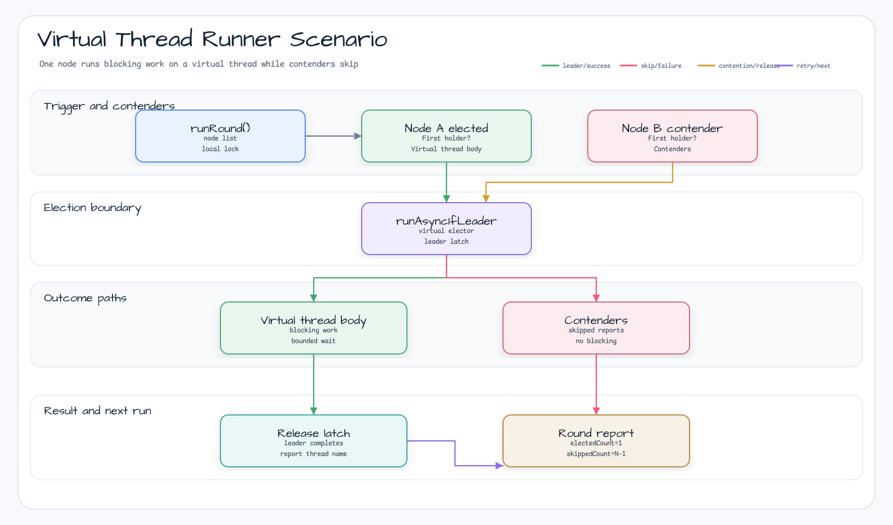
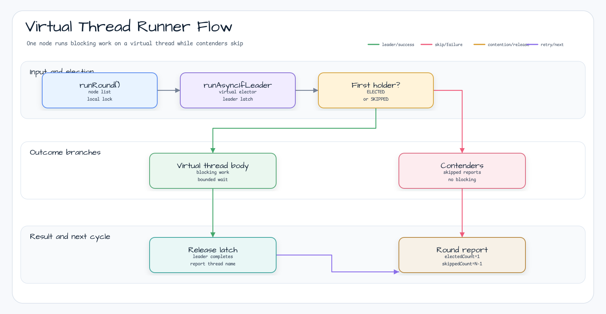

# Virtual Thread Runner 예제

[English](README.md) | 한국어

Java virtual thread를 사용하는 고동시성 leader-only runner 예제입니다.

## 시나리오

여러 service node가 하나의 local leader lock을 경쟁합니다. 한 node만 Java virtual thread에서 bounded maintenance 작업을
실행하고 나머지는 예외 없이 skip합니다. Blocking body를 platform thread에 오래 묶어 두지 않는 형태를 보여줍니다.

## 예제 시나리오



## 아키텍처 다이어그램


## 플로우 다이어그램



## 시퀀스 다이어그램


## 보여주는 내용

- `VirtualThreadLeaderElector`로 leader work를 제출합니다.
- 선출된 body를 Java virtual thread에서 실행합니다.
- Non-leader는 blocking하지 않고 skipped report를 반환합니다.
- Leader action은 timeout 또는 shutdown policy로 bounded 상태를 유지합니다.
- 외부 인프라가 필요 없는 demo에는 local backend를 사용합니다.

## 실행

```bash
./gradlew :examples:virtual-thread-runner:run
```

## 테스트

```bash
./gradlew :examples:virtual-thread-runner:test
```

## 설계

```kotlin
val runner = VirtualThreadLeaderRunner("maintenance:daily")

val report = runner.runRound(
    nodeIds = listOf("node-a", "node-b", "node-c"),
)
```

Blocking task가 많은 service에서 cycle마다 하나의 leader-only action만 실행해야 할 때 이 패턴을 사용합니다.
