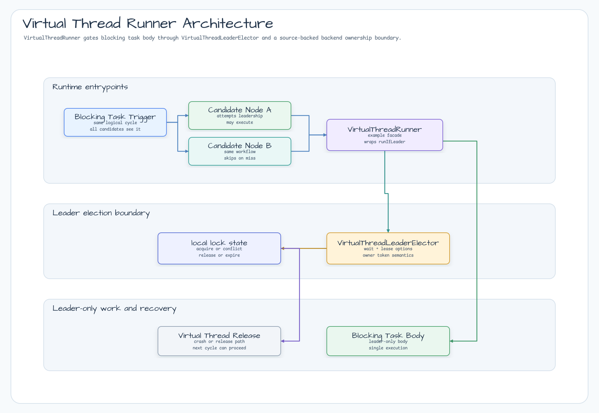
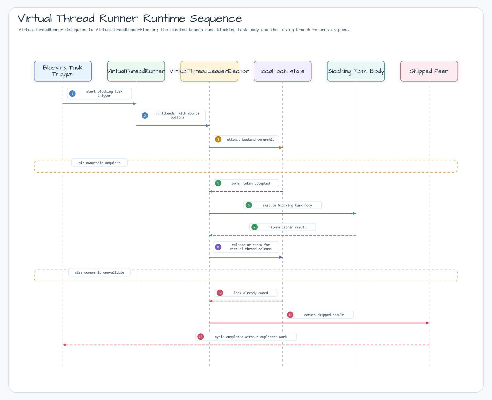

# Virtual Thread Runner Example

English | [한국어](README.ko.md)

High-concurrency leader-only runner using Java virtual threads.

## Scenario

Several service nodes race for one local leader lock. One node executes bounded maintenance work on a Java virtual
thread while the rest skip without throwing. The example keeps the body blocking-friendly without tying up platform
threads.

## Architecture Diagram



## Sequence Diagram



## What It Shows

- Submit leader work through `VirtualThreadLeaderElector`.
- Run the elected body on a Java virtual thread.
- Return skipped reports for non-leaders instead of blocking.
- Bound the leader action with timeout or shutdown policy.
- Use a local backend when no external infrastructure is needed for the demo.

## Run

```bash
./gradlew :examples:virtual-thread-runner:run
```

## Test

```bash
./gradlew :examples:virtual-thread-runner:test
```

## Design

```kotlin
val runner = VirtualThreadLeaderRunner("maintenance:daily")

val report = runner.runRound(
    nodeIds = listOf("node-a", "node-b", "node-c"),
)
```

Use this pattern when a service has many blocking tasks but still needs one leader-only action per cycle.
