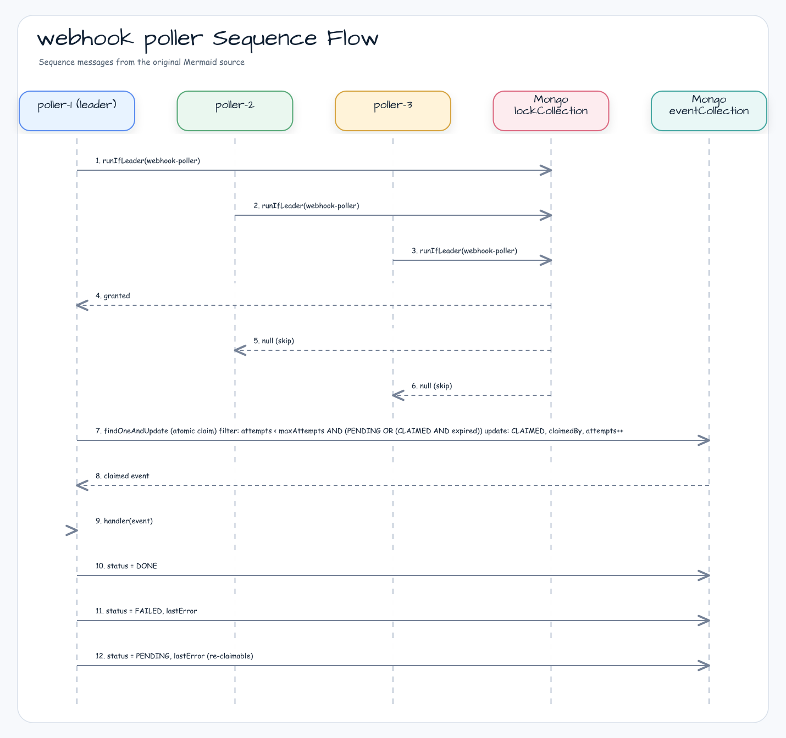

# examples-webhook-poller

한국어 | [English](./README.md)

MongoDB 리더 선출을 이용한 분산 webhook event 폴러. N 개 pod 환경에서 단일 리더만 webhook event 를 점유·처리하며, at-least-once 전달, 재시도, `FAILED` 종결 상태(DLQ 대체)를 제공한다.

## Architecture



## Core Features

- N 개 폴러 인스턴스 중 **단 1개만 polling** (리더 선출)
- `findOneAndUpdate` atomic claim — 동시 처리 충돌 시에도 중복 처리 없음
- Lease 기반 reclaim — 리더 사망 시 만료된 CLAIMED event 를 차순위가 인계
- `maxAttempts` 도달 시 `FAILED` 로 종결 (DLQ 대체)
- `attempts` 는 **claim 시점에만 증가** — 단일 진실 원천(single source of truth)
- `MongoSuspendLeaderElector` (TTL + token 기반 lock) 사용 — 코루틴 안전

## Usage Example

```kotlin
val elector = MongoSuspendLeaderElector(lockCollection)
val poller = WebhookPoller(
    elector = elector,
    eventCollection = eventCollection,
    options = WebhookPollerOptions(
        nodeId = System.getenv("HOSTNAME"),
        lockName = "webhook-poller:prod",
        pollInterval = 1.seconds,
        batchSize = 10,
        maxAttempts = 5,
        claimDuration = 30.seconds,    // handler 최악 실행 시간보다 길게
        leaseTime = 60.seconds,         // leader-lock TTL
        waitTime = 1.seconds,
    ),
) { event ->
    httpClient.post(event.payload)     // webhook 전달
}

val job = poller.start(applicationScope)
// ... shutdown ...
poller.stopGracefully(timeout = 30.seconds)
```

## Demo

```bash
MONGO_URL=mongodb://localhost:27017 ./gradlew :examples:webhook-poller:run
```

가짜 이벤트 10건을 collection 에 insert 후 폴러 3개를 동시 실행. 각 이벤트가 정확히 1번만 처리됨을 검증.

## Configuration Options

| 파라미터 | 기본값 | 설명 |
|---------|--------|-----|
| `nodeId` | 필수 | pod 식별자 — 점유 시 `claimedBy` 에 기록 |
| `lockName` | 필수 | leader-lock 키 — collection 단위로 다르게 권장 |
| `pollInterval` | `1.seconds` | 리더 batch 처리 후 다음 사이클까지 휴지 |
| `batchSize` | `10` | 한 사이클당 최대 claim 수 |
| `maxAttempts` | `5` | 시도 상한 — 도달 시 `FAILED` |
| `claimDuration` | `30.seconds` | claim lease — handler 최악 실행 시간 + 여유 |
| `leaseTime` | `60.seconds` | leader-lock TTL |
| `waitTime` | `1.seconds` | leader-lock 획득 대기 시간 |

## Failure Semantics

- handler 예외 → `attempts` 는 claim 시점에 이미 증가됨 → 상태 전이:
  - `attempts >= maxAttempts` → `FAILED`, `lastError` 기록 (재처리 안 됨)
  - 그 외 → `PENDING`, `claimedBy=null`, `claimExpiresAt=null` (다음 사이클에 재점유)
- 리더 pod 가 handle 도중 사망 → `claimExpiresAt` 경과 → 차순위 리더가 reclaim (at-least-once)
- 환경별 `lockName` 충돌 시 silent skip — 환경별 네임스페이스 권장

## Migration 가이드

- **cron 기반 폴러에서**: `@Scheduled` + `synchronized` 를 `WebhookPoller.start(scope)` 로 교체. 폴러 자체가 리더 선출로 직렬화 보장.
- **SQS/Kafka 에서**: `eventId` 를 dedup key 로 사용. unique index 자동 생성됨.
- **DLQ 대체**: `status = "FAILED"` + `lastError` 조회로 postmortem. 수동 재시도는 `PENDING` 으로 reset.

## Dependency

```kotlin
dependencies {
    implementation(project(":leader-mongodb"))
    implementation(project(":examples:webhook-poller"))
}
```

## Testing

```bash
./gradlew :examples:webhook-poller:test
```

Testcontainers MongoDB 사용 — Docker daemon 필요.
