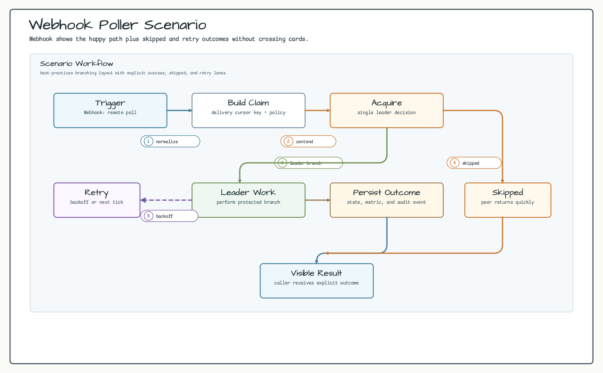
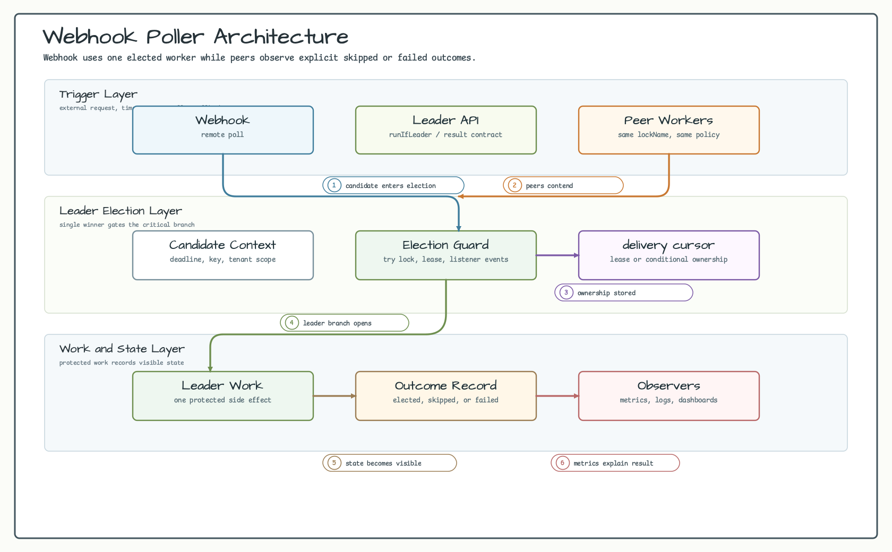
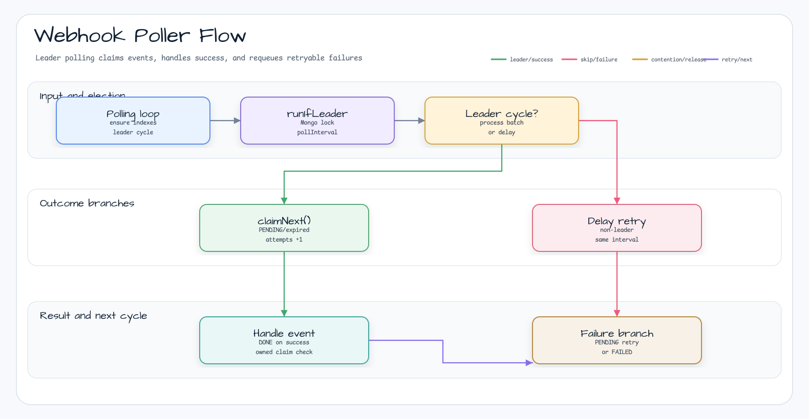

# examples-webhook-poller

English | [한국어](README.ko.md)

Distributed webhook event poller using MongoDB leader election. Demonstrates safe single-leader claim of webhook events across N pods, with at-least-once delivery, retry, and a `FAILED` terminal state as DLQ substitute.

## Scenario

Several poller instances run the same polling loop, but only the elected leader
claims MongoDB events. The leader atomically claims each event with
`findOneAndUpdate`, runs the handler, marks success as `DONE`, and requeues or
marks `FAILED` when the handler throws.

## Example Scenario



## Architecture Diagram



## Flow Diagram



## Sequence Diagram


## Core Features

- Single-leader polling across N pollers — only the leader claims and processes
- Atomic claim via `findOneAndUpdate` — no double-processing under contention
- Lease-based reclaim — if a leader dies, expired CLAIMED events are picked up by the next leader
- Retry with `maxAttempts` cap — on exceeding the cap, event transitions to `FAILED` (DLQ substitute)
- `attempts` counter increments on claim only — single source of truth, no double-counting
- Backed by `MongoSuspendLeaderElector` (TTL + token-based lock) — coroutine-safe

## Usage Example

```kotlin
val elector = MongoSuspendLeaderElector(lockCollection)
val poller = WebhookPoller(
    elector = elector,
    eventCollection = eventCollection,
    options = WebhookPollerOptions(
        nodeId = System.getenv("HOSTNAME"),
        lockName = "webhook-poller:prod",
        pollInterval = 1.seconds,
        batchSize = 10,
        maxAttempts = 5,
        claimDuration = 30.seconds,    // must exceed worst-case handler runtime
    ),
) { event ->
    httpClient.post(event.payload)     // forward webhook
}

val job = poller.start(applicationScope)
// ... shutdown ...
poller.stopGracefully(timeout = 30.seconds)
```

## Demo

```bash
MONGO_URL=mongodb://localhost:27017 ./gradlew :examples:webhook-poller:run
```

Inserts 10 fake events into a fresh collection, then runs 3 pollers concurrently. Expected: each event handled exactly once, no duplicates.

## Configuration Options

| Parameter | Default | Description |
|-----------|---------|-------------|
| `nodeId` | required | Pod identifier — written to `claimedBy` for tracing |
| `lockName` | required | Distributed leader-lock key — recommend per-collection |
| `pollInterval` | `1.seconds` | Sleep between batch cycles when leader |
| `batchSize` | `10` | Max events claimed per cycle |
| `maxAttempts` | `5` | Retry cap — on exceeding, event → `FAILED` |
| `claimDuration` | `30.seconds` | Lease for an in-flight claim — must exceed handler runtime |

## Failure Semantics

- Handler throws → `attempts` already incremented at claim time → status transitions:
  - `attempts >= maxAttempts` → `FAILED`, `lastError` recorded (no further claims)
  - else → `PENDING`, `claimedBy=null`, `claimExpiresAt=null` (re-claimable next batch)
- Leader pod dies mid-handle → `claimExpiresAt` passes → next leader reclaims (at-least-once)
- `lockName` collisions across environments cause silent skip — namespace appropriately

## Migration Tips

- **From cron-based pollers**: replace `@Scheduled` + `synchronized` with `WebhookPoller.start(scope)`. The poller already serializes via leader election.
- **From SQS/Kafka**: model the `eventId` as the dedup key. Use a unique index on `eventId` (auto-created by `WebhookPoller`).
- **DLQ replacement**: query `status = "FAILED"` + `lastError` for postmortem. Reset to `PENDING` to retry manually.

## Dependency

```kotlin
dependencies {
    implementation("io.github.bluetape4k.leader:bluetape4k-leader-mongodb:${bluetape4kVersion}")
}
```

## Testing

```bash
./gradlew :examples:webhook-poller:test
```

Uses Testcontainers MongoDB — Docker daemon required.
