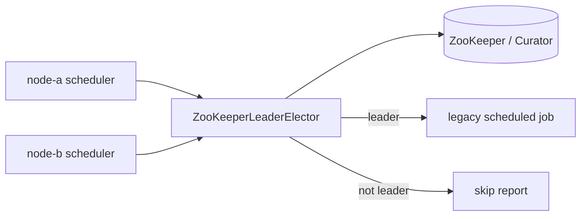

# ZooKeeper scheduler example

[English](README.md) | 한국어

이 예제는 안정 상태의 `leader-zookeeper` 백엔드로 legacy scheduled job을 보호해서 여러 service instance 중 정확히 하나만 작업을 실행하고 나머지는 skip하는 흐름을 보여줍니다.

## 보여주는 내용

- `ZooKeeperLeaderElector`를 coordination boundary로 사용합니다.
- Apache Curator client lifecycle은 caller가 소유합니다.
- ZooKeeper는 TTL이 아니라 session 기반 lock을 사용합니다.
- 로컬 ZooKeeper는 bluetape4k Testcontainers launcher로 시작합니다.
- `runIfLeader`의 skip-on-contention 동작을 확인합니다.

## 구조



## 실행

데모는 Testcontainers로 ZooKeeper를 시작하므로 Docker가 필요합니다.

```bash
./gradlew :examples:zookeeper-scheduler:run
```

기대 동작:

1. `node-a`가 ZooKeeper lock을 획득하고 첫 scheduled job을 실행합니다.
2. `node-b`는 `node-a`가 leadership을 보유한 동안 같은 schedule을 시도하고 `SKIPPED`를 받습니다.
3. `node-a`가 lock을 반환한 뒤 `node-b`가 다음 scheduled job을 실행합니다.

## 테스트

```bash
./gradlew :examples:zookeeper-scheduler:test
```

테스트 검증 항목:

- 단일 scheduler가 job을 정상 실행합니다.
- 다른 node가 ZooKeeper lock을 보유하는 동안 경쟁 scheduler는 skip합니다.
- lock 반환 후 다른 node가 다시 획득할 수 있습니다.
- 빈 node id, lock name, schedule id, base path, completed step name은 거부됩니다.

## 핵심 코드

```kotlin
val scheduler = ZooKeeperLegacyScheduler(
    config = ZooKeeperSchedulerConfig(
        nodeId = SchedulerNodeId("node-a"),
        lockName = SchedulerLockName("legacy-nightly-job"),
    ),
    curator = curator,
)

val report = scheduler.runOnce(SchedulerRunId("daily-ledger")) {
    listOf("read-ledger", "write-summary")
}
```

ZooKeeper lock은 session 기반입니다. Curator client를 정상 유지하고 service shutdown 시 close하세요. 이 backend에서 TTL-style lease extension에 의존하지 마세요.
