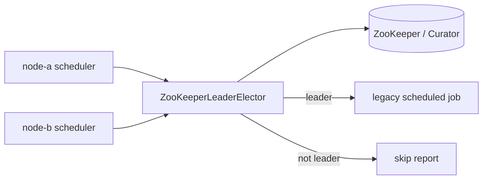

# ZooKeeper scheduler example

English | [한국어](README.ko.md)

This example shows how to guard a legacy scheduled job with the stable `leader-zookeeper` backend so exactly one service instance executes the job while competing instances skip.

## What It Demonstrates

- `ZooKeeperLeaderElector` as the coordination boundary.
- Apache Curator client lifecycle owned by the caller.
- ZooKeeper session-based lock behavior; no TTL renewal is required.
- bluetape4k Testcontainers launcher for local ZooKeeper.
- Skip-on-contention behavior through `runIfLeader`.

## Architecture



## Run

Docker must be available because the demo starts ZooKeeper with Testcontainers.

```bash
./gradlew :examples:zookeeper-scheduler:run
```

Expected behavior:

1. `node-a` acquires the ZooKeeper lock and runs the first scheduled job.
2. `node-b` tries the same schedule while `node-a` still holds leadership and receives `SKIPPED`.
3. After `node-a` releases the lock, `node-b` runs the next scheduled job.

## Test

```bash
./gradlew :examples:zookeeper-scheduler:test
```

The tests verify:

- one scheduler executes a job successfully;
- a competing scheduler skips while another node holds the ZooKeeper lock;
- the lock can be reacquired after release;
- blank node ids, lock names, schedule ids, base paths, and completed step names are rejected.

## Key Code

```kotlin
val scheduler = ZooKeeperLegacyScheduler(
    config = ZooKeeperSchedulerConfig(
        nodeId = SchedulerNodeId("node-a"),
        lockName = SchedulerLockName("legacy-nightly-job"),
    ),
    curator = curator,
)

val report = scheduler.runOnce(SchedulerRunId("daily-ledger")) {
    listOf("read-ledger", "write-summary")
}
```

ZooKeeper locks are session-based. Keep the Curator client healthy and close it during service shutdown; do not rely on TTL-style lease extension for this backend.
