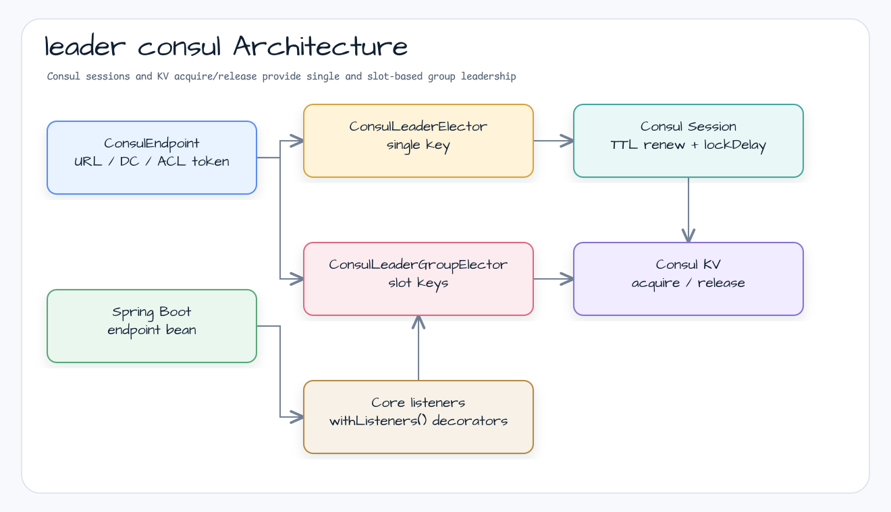

# bluetape4k-leader-consul

한국어 | [English](./README.md)

`bluetape4k-leader` 의 프리뷰 Consul 백엔드입니다.

이 모듈은 Consul session 과 KV `acquire`/`release` 기반의 프리뷰 단일 리더 및
복수 리더 group elector 를 제공합니다. Blocking, `CompletableFuture`, coroutine,
Spring Boot auto-configuration surface 를 사용할 수 있습니다.

## Architecture



## Behavior / Contract

- Public API 는 `ConsulEndpoint` 같은 bluetape4k 소유 DTO 를 사용하며, 오래된
  third-party Consul client 타입을 노출하지 않습니다.
- Consul Session TTL 은 10초 이상 86,400초 이하여야 합니다.
- 단일 리더 key 는 `keyPrefix/single/{encodedLockName}` 를 사용합니다.
- Group key 는 고정 slot 형식인 `keyPrefix/group/{encodedLockName}/slot-{index}` 를 사용합니다.
- `lockDelay` 기본값은 scheduler-style 재획득을 예측 가능하게 하기 위해 0입니다.
- `lockDelay` 가 0이면 TTL 만료 뒤 이전 holder 가 아직 실행 중일 때 새 holder 와
  겹칠 수 있습니다. 중복 실행이 안전하지 않은 작업은 idempotent 하게 만들거나
  외부 fencing token 을 사용해야 합니다.
- Consul endpoint, ACL token, datacenter, agent lifecycle 은 caller-owned 입니다.
- `withListeners()` 같은 core event decorator 는 Consul elector 와 함께 사용할 수 있습니다.
  Consul blocking-query 기반 watch publisher 는 watch 수명, backoff, ACL 범위가
  애플리케이션 운영 정책이므로 auto-configuration 에서 자동 생성하지 않습니다.

## Usage

```kotlin
val elector = ConsulLeaderElector(
    endpoint = ConsulEndpoint("http://localhost:8500"),
    options = ConsulLeaderElectionOptions(
        leaderOptions = LeaderElectionOptions(leaseTime = 10.seconds),
    ),
)

val result = elector.runIfLeader("daily-report") {
    "executed"
}
```

```kotlin
val suspendElector = ConsulSuspendLeaderElector(
    endpoint = ConsulEndpoint("http://localhost:8500"),
    options = ConsulLeaderElectionOptions(
        leaderOptions = LeaderElectionOptions(leaseTime = 10.seconds),
    ),
)

val suspendResult = suspendElector.runIfLeader("daily-report") {
    "executed"
}
```

```kotlin
val groupElector = ConsulLeaderGroupElector(
    endpoint = ConsulEndpoint("http://localhost:8500"),
    options = ConsulLeaderGroupElectionOptions(
        leaderGroupOptions = LeaderGroupElectionOptions(
            maxLeaders = 3,
            leaseTime = 10.seconds,
        ),
    ),
)

val groupResult = groupElector.runIfLeader("partition-workers") {
    "executed"
}
```

## Spring Boot

Caller-owned `ConsulEndpoint` bean 을 등록하면 auto-configuration 이
`ConsulLeaderElector`, `ConsulSuspendLeaderElector`, `ConsulLeaderGroupElector`,
`ConsulSuspendLeaderGroupElector` bean 을 생성합니다.

```yaml
bluetape4k:
  leader:
    lease-time: 10s
    group:
      max-leaders: 3
      lease-time: 10s
    consul:
      key-prefix: apps/orders/leader
      session-name-prefix: orders-leader
      lock-delay: 0s
```

## Configuration

### `ConsulEndpoint`

| Property | Type | Default | Description |
| --- | --- | --- | --- |
| `baseUrl` | `URI` | — | Consul HTTP API base URL, 예: `http://localhost:8500` |
| `datacenter` | `String?` | `null` | 선택적 target datacenter |
| `aclToken` | `String?` | `null` | 모든 요청에 전송되는 선택적 ACL token |
| `requestTimeout` | `Duration` | `5.seconds` | 요청당 HTTP 타임아웃. lock acquire, 상태 읽기, session 갱신, lock 해제, session 삭제 등 모든 blocking wait 을 제어합니다. |

### `ConsulLeaderElectionOptions`

| Option | Type | Default | Description |
| --- | --- | --- | --- |
| `leaderOptions.waitTime` | `Duration` | `5.seconds` | lock 획득 최대 시간 예산 |
| `leaderOptions.leaseTime` | `Duration` | `60.seconds` | Consul Session TTL. `[10.seconds, 86_400.seconds]` 범위 필수. |
| `leaderOptions.nodeId` | `String` | 프로세스 기본값 | core 계약과 공유되는 감사 노드 ID |
| `leaderOptions.minLeaseTime` | `Duration` | `0.seconds` | 빠른 action 이후 최소 리더십 유지 시간 |
| `leaderOptions.autoExtend` | `Boolean` | `false` | action 실행 중 Consul session 자동 갱신 여부 |
| `keyPrefix` | `String` | `bluetape4k/leader` | Consul KV key prefix |
| `sessionNamePrefix` | `String` | `bluetape4k-leader` | 생성되는 Consul session 이름 prefix |
| `lockDelay` | `Duration` | `0.seconds` | Consul session lock delay. 0이면 TTL 만료 후 즉시 재획득 가능. 중복 실행이 안전하지 않은 경우 idempotent action 또는 외부 fencing token 을 사용하세요. |

### `ConsulLeaderGroupElectionOptions`

| Option | Type | Default | Description |
| --- | --- | --- | --- |
| `leaderGroupOptions.maxLeaders` | `Int` | `2` | 동시 group leader 최대 수 |
| `leaderGroupOptions.waitTime` | `Duration` | `5.seconds` | group slot 획득 최대 시간 예산 |
| `leaderGroupOptions.leaseTime` | `Duration` | `60.seconds` | group slot 용 Consul Session TTL. `[10.seconds, 86_400.seconds]` 범위 필수. |
| `leaderGroupOptions.minLeaseTime` | `Duration` | `0.seconds` | 빠른 action 이후 최소 group-slot 유지 시간 |
| `keyPrefix` | `String` | `bluetape4k/leader` | group lock key 용 Consul KV key prefix |
| `sessionNamePrefix` | `String` | `bluetape4k-leader` | 생성되는 Consul session 이름 prefix |
| `lockDelay` | `Duration` | `0.seconds` | `ConsulLeaderElectionOptions.lockDelay` 참조 |

## Dependency

```kotlin
dependencies {
    implementation("io.github.bluetape4k.leader:bluetape4k-leader-consul:$bluetape4kLeaderVersion")
}
```
