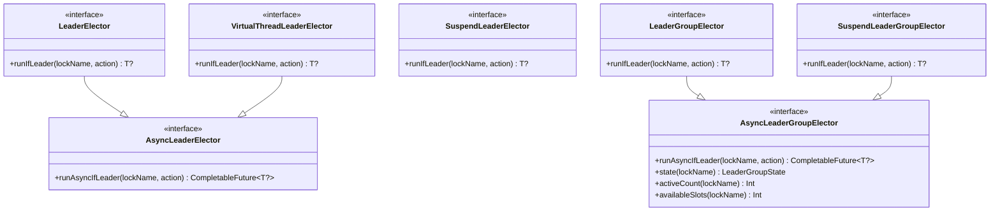
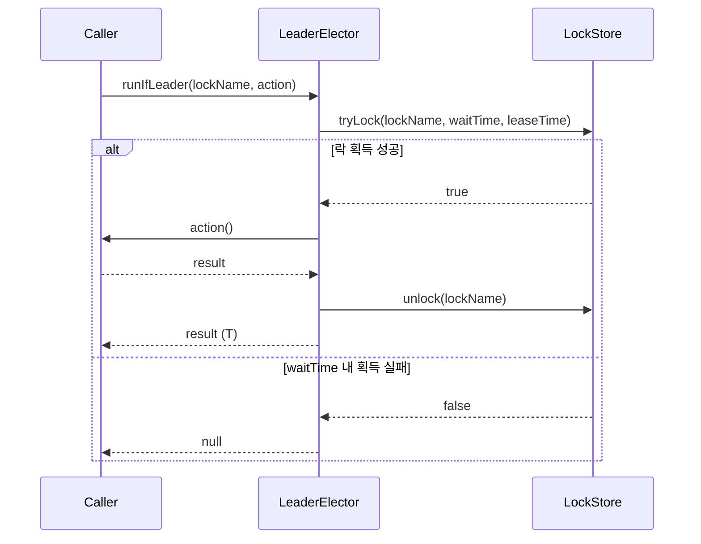
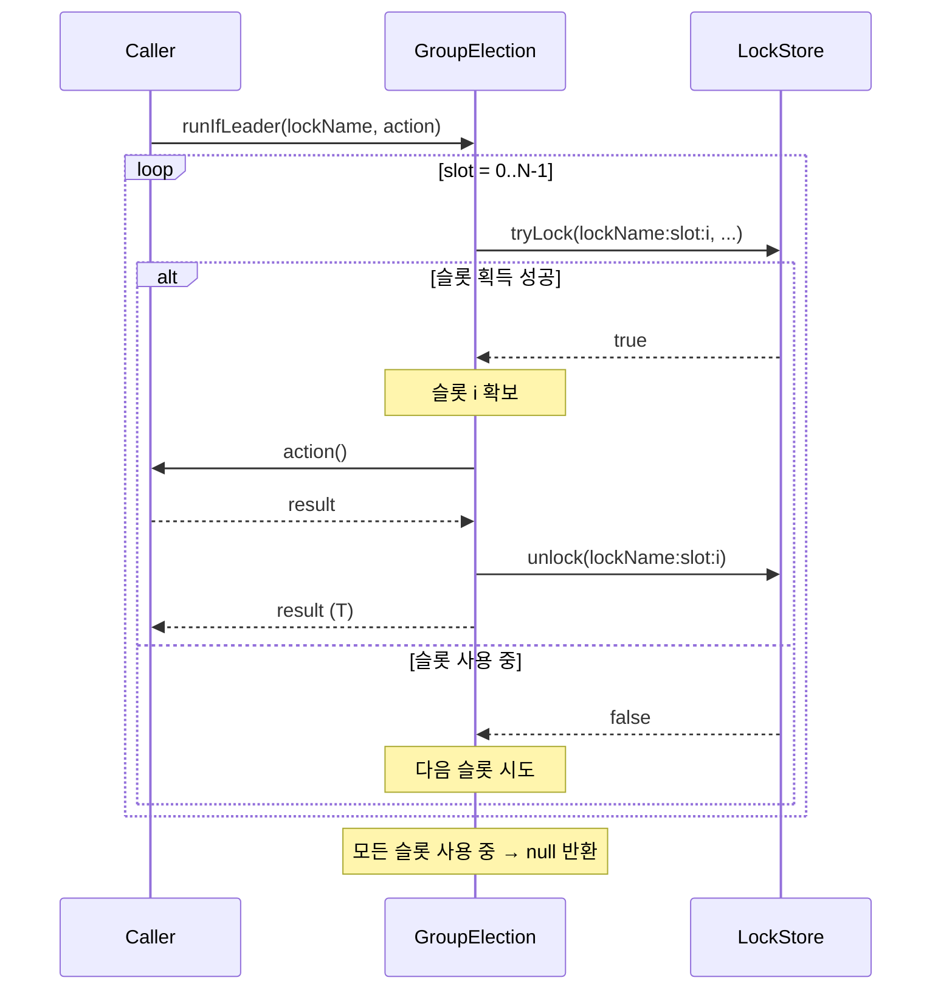

# leader-core

[English](README.md)

`bluetape4k-leader`의 핵심 인터페이스와 로컬 인메모리 구현체를 제공합니다.

---

## 개요

`leader-core`는 모든 리더 선출 백엔드의 계약(인터페이스)을 정의하고, 외부 인프라 없이 동작하는 로컬(인메모리) 구현체를 포함합니다. 단일 인스턴스 환경이나 테스트에서 로컬 구현체를 사용하세요.

## 아키텍처



## API 계약

### `runIfLeader(lockName, action): T?`

- 지정한 이름의 락(또는 그룹 선출의 경우 세마포어 슬롯)을 획득 시도합니다
- 획득 성공: `action`을 실행하고 결과를 반환합니다
- `waitTime` 내 획득 실패: **`null`** 반환 (경쟁 상황에서 예외를 던지지 않음)
- `action` 내부에서 발생한 예외는 호출자에게 전파됩니다
- `action` 완료 후 (또는 예외 발생 시) 락이 해제됩니다

### 선출 생명주기 listener

`LeaderElectionListenerRegistry` 구현체는 `addListener`, `removeListener`로 생명주기 callback을 등록할 수 있습니다.

- `onElected(lockName)`: 보호된 작업이 시작되기 직전
- `onRevoked(lockName)`: 현재 호출이 보유하던 락 또는 슬롯을 반납한 직후
- `onSkipped(lockName)`: 리더십을 획득하지 못해 작업을 실행하지 않을 때

suspend elector는 같은 생명주기를 `LeaderElectionEventPublisher.events`의 hot `Flow<LeaderElectionEvent>` stream으로도 제공합니다.

```kotlin
val election = LocalLeaderElector()
val handle = election.addListener(object : LeaderElectionListener {
    override fun onElected(lockName: String) {
        println("elected: $lockName")
    }
})

try {
    election.runIfLeader("daily-job") { processData() }
} finally {
    handle.close()
}
```

```kotlin
val election = LocalSuspendLeaderElector()

launch {
    election.events.collect { event ->
        println(event)
    }
}

election.runIfLeader("nightly-sync") { syncToRemote() }
```

### 옵션 클래스

```kotlin
LeaderElectionOptions(
    waitTime: Duration = 5.seconds,   // 락 획득 최대 대기 시간
    leaseTime: Duration = 60.seconds, // 락 보유(임대) 최대 시간
    minLeaseTime: Duration = Duration.ZERO // 로컬 최소 보유 시간
)

LeaderGroupElectionOptions(
    maxLeaders: Int = 2,                          // 최대 동시 리더 수
    waitTime: Duration = 5.seconds,
    leaseTime: Duration = 60.seconds,
    minLeaseTime: Duration = Duration.ZERO
)
```

`minLeaseTime`은 lockAtLeastFor 대응 옵션입니다. 로컬 elector는 최소 보유 시간이 지날 때까지 락 또는 슬롯을 유지합니다. 지원되는 분산 backend는 release 시 남은 최소 lease를 storage TTL에 위임합니다.

## 시퀀스 다이어그램

### 단일 리더: 락 획득/해제



### 복수 리더 그룹: 슬롯 기반 세마포어 (maxLeaders = N)



## 로컬 구현체 목록

모든 로컬 구현체는 JVM 기본 동기화 프리미티브(`ReentrantLock`, `Semaphore`)를 사용합니다. 외부 의존 없음.

| 클래스 | 구현 인터페이스 | 설명 |
|-------|--------------|------|
| `LocalLeaderElector` | `LeaderElector` | 블로킹, `ReentrantLock` 기반 |
| `LocalAsyncLeaderElector` | `AsyncLeaderElector` | 스레드풀 기반 `CompletableFuture` |
| `LocalVirtualThreadLeaderElector` | `VirtualThreadLeaderElector` | 가상 스레드 1개/선출 |
| `LocalSuspendLeaderElector` | `SuspendLeaderElector` | 코루틴 `Mutex` 기반 |
| `LocalLeaderGroupElector` | `LeaderGroupElector` | `Semaphore` 기반 복수 리더 |
| `LocalSuspendLeaderGroupElector` | `SuspendLeaderGroupElector` | 코루틴 `Semaphore` 기반 |
| `LocalStrategicLeaderElector` | `StrategicLeaderElector` | 전략 기반 블로킹 선출 |
| `LocalStrategicSuspendLeaderElector` | `StrategicSuspendLeaderElector` | 전략 기반 코루틴 선출 |

## 전략 기반 선출 (Strategic Election)

### 개요

전략 기반 선출은 **후보 등록 단계**와 **전략 적용 단계**를 분리하여 유연한 리더 선출 정책을 가능하게 합니다.

```
registerCandidate() → elect(strategy) → 1명 선출, 나머지 skip
```

### 내장 전략

| 전략 | 설명 |
|------|------|
| `FifoElectionStrategy` | 등록 시각이 가장 이른 후보 선출 |
| `RandomElectionStrategy(seed)` | seed 기반 결정론적 무작위 선출 (분산 환경: 공유 seed 필수) |
| `ScoredElectionStrategy(scorer)` | 점수 최고 후보 선출 |

### 내장 Scorer (0–100 정규화)

| Scorer | 설명 |
|--------|------|
| `IdleTimeScorer` | 마지막 완료 후 가장 오래 쉰 노드 우선 |
| `SuccessRateScorer` | 성공률 높은 노드 우선 |
| `RecentSuccessScorer` | 가장 최근에 성공 완료한 노드 우선 |
| `WeightedScorer` | 복수 Scorer 가중 합산 |

### 핵심 인터페이스

```kotlin
interface StrategicLeaderElector {
    val nodeId: String
    fun registerCandidate(lockName: String, info: CandidateInfo, ttl: Duration = Duration.ZERO)
    fun unregisterCandidate(lockName: String, nodeId: String)
    fun listCandidates(lockName: String): List<CandidateInfo>
    fun <T> runIfLeader(lockName: String, strategy: ElectionStrategy, options: LeaderElectionOptions, action: () -> T): T?
}
```

## 사용 예시

### 전략 기반 선출 — IdleTime Scorer

```kotlin
val election = LocalStrategicLeaderElector("node-1")

election.registerCandidate("batch-job", CandidateInfo("node-1"))
election.registerCandidate("batch-job", CandidateInfo("node-2"))

val result = election.runIfLeader("batch-job", ScoredElectionStrategy(IdleTimeScorer)) {
    processBatch()
}
// 가장 오래 쉰 노드만 processBatch() 실행, 나머지는 null 반환
```

### 전략 기반 선출 — 가중 Scorer

```kotlin
val scorer = WeightedScorer(IdleTimeScorer to 0.4, SuccessRateScorer to 0.6)
val strategy = ScoredElectionStrategy(scorer)

val result = election.runIfLeader("weighted-job", strategy) { work() }
```

### 블로킹 단일 리더

```kotlin
val election = LocalLeaderElector()

val result = election.runIfLeader("daily-job") {
    processData()
}
// result: 선출 성공이면 processData() 결과, 실패이면 null
```

### 코루틴 suspend 단일 리더

```kotlin
val election = LocalSuspendLeaderElector()

val result = election.runIfLeader("nightly-sync") {
    syncToRemote()
}
```

### 복수 리더 그룹 (세마포어)

```kotlin
val options = LeaderGroupElectionOptions(maxLeaders = 3)
val election = LocalLeaderGroupElector(options)

// 최대 3개의 동시 호출이 action을 실행 가능
val result = election.runIfLeader("parallel-batch") {
    processChunk()
}

println(election.activeCount("parallel-batch"))    // 현재 활성 리더 수 (0~3)
println(election.availableSlots("parallel-batch")) // 잔여 슬롯 수
```

### 상태 조회

```kotlin
val single: LeaderState = LocalLeaderElector(
    LeaderElectionOptions(nodeId = "node-a")
).state("daily-job")
println(single.status)        // Empty 또는 Occupied
println(single.leader?.leaderId)

val group: LeaderGroupState = election.state("parallel-batch")
println(group.activeCount)    // 현재 리더 수
println(group.maxLeaders)     // 옵션의 maxLeaders 값
println(group.leaders.map { it.leaderId })
```

상태 조회는 진단과 메트릭을 위한 best-effort 스냅샷입니다. 락 획득을 대체하는 API가 아닙니다.

## 의존성 추가

```kotlin
// build.gradle.kts
implementation("io.github.bluetape4k.leader:leader-core:0.1.0-SNAPSHOT")
```
