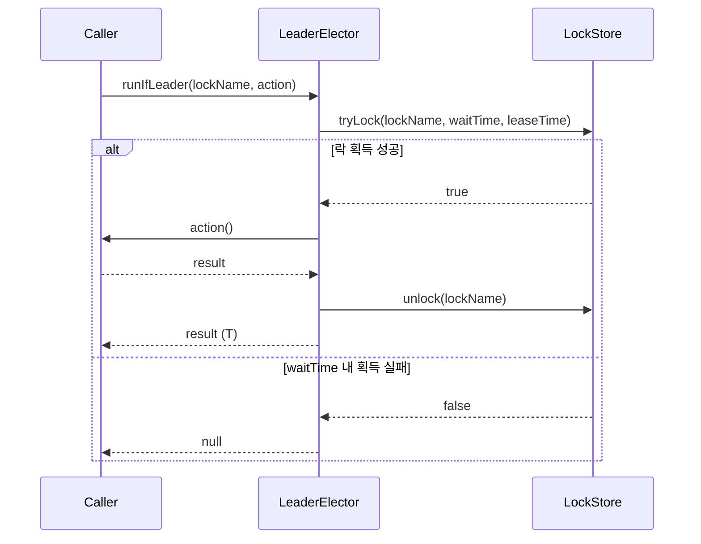
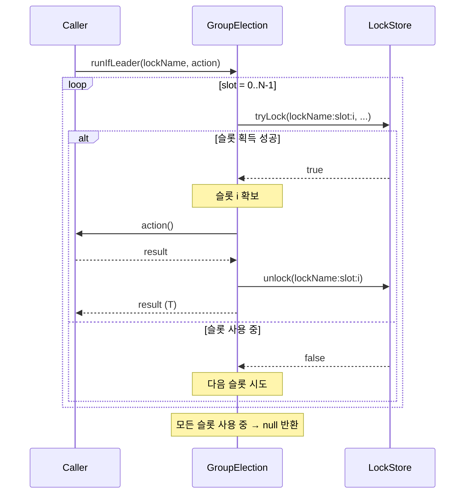

# leader-core

[English](README.md)

`bluetape4k-leader`의 핵심 인터페이스와 로컬 인메모리 구현체를 제공합니다.

---

## 개요

`leader-core`는 모든 리더 선출 백엔드의 계약(인터페이스)을 정의하고, 외부 인프라 없이 동작하는 로컬(인메모리) 구현체를 포함합니다. 단일 인스턴스 환경이나 테스트에서 로컬 구현체를 사용하세요.

## 아키텍처



## API 계약

### `runIfLeader(lockName, action): T?`

- 지정한 이름의 락(또는 그룹 선출의 경우 세마포어 슬롯)을 획득 시도합니다
- 획득 성공: `action`을 실행하고 결과를 반환합니다
- `waitTime` 내 획득 실패: **`null`** 반환 (경쟁 상황에서 예외를 던지지 않음)
- `action` 내부에서 발생한 예외는 호출자에게 전파됩니다
- `action` 완료 후 (또는 예외 발생 시) 락이 해제됩니다

### `runIfLeaderResult*`: 명시적 실행 결과

`null`이 정상 action 결과일 수 있거나, 경쟁으로 실행되지 않은 경우와 action 실패를 구분해야 하면 result API를 사용하세요.

```kotlin
when (val result = election.runIfLeaderResult("daily-job") { computeOrNull() }) {
    is LeaderRunResult.Elected -> use(result.value)       // action 실행됨, value 는 null 가능
    LeaderRunResult.Skipped -> recordContention()         // action 실행 안 됨
    is LeaderRunResult.ActionFailed -> report(result.cause)
}
```

`LeaderRunResult`는 세 상태를 가집니다.

- `Elected(value, leaderId?)`: 락 또는 슬롯을 획득했고 action이 완료됨.
- `Skipped`: 락 또는 슬롯을 획득하지 못해 action이 실행되지 않음.
- `ActionFailed(cause)`: 락 또는 슬롯을 획득하고 action이 시작됐지만 실행 중 실패함.

Result API는 `CancellationException`을 `ActionFailed`로 변환하지 않습니다. 동기/코루틴 API는 재전파하고,
async/가상 스레드 API는 예외 완료됩니다(`join()`에서는 cancellation을 감싼 `CompletionException`을
기대하세요. `isCancelled()` 보장은 아닙니다). 동기 API는 `InterruptedException`도 interrupt flag를 복원한 뒤 재전파합니다.

### 선출 생명주기 listener

`LeaderElectionListenerRegistry` 구현체는 `addListener`, `removeListener`로 생명주기 callback을 등록할 수 있습니다.

- `onElected(lockName)`: 보호된 작업이 시작되기 직전
- `onRevoked(lockName)`: 현재 호출이 보유하던 락 또는 슬롯을 반납한 직후
- `onSkipped(lockName)`: 리더십을 획득하지 못해 작업을 실행하지 않을 때

suspend elector는 같은 생명주기를 `LeaderElectionEventPublisher.events`의 hot `Flow<LeaderElectionEvent>` stream으로도 제공합니다.

```kotlin
val election = LocalLeaderElector()
val handle = election.addListener(object : LeaderElectionListener {
    override fun onElected(lockName: String) {
        println("elected: $lockName")
    }
})

try {
    election.runIfLeader("daily-job") { processData() }
} finally {
    handle.close()
}
```

```kotlin
val election = LocalSuspendLeaderElector()

launch {
    election.events.collect { event ->
        println(event)
    }
}

election.runIfLeader("nightly-sync") { syncToRemote() }
```

### 옵션 클래스

```kotlin
LeaderElectionOptions(
    waitTime: Duration = 5.seconds,   // 락 획득 최대 대기 시간
    leaseTime: Duration = 60.seconds, // 락 보유(임대) 최대 시간
    minLeaseTime: Duration = Duration.ZERO, // 로컬 최소 보유 시간
    autoExtend: Boolean = false // action 실행 중 단일 리더 lease 갱신
)

LeaderGroupElectionOptions(
    maxLeaders: Int = 2,                          // 최대 동시 리더 수
    waitTime: Duration = 5.seconds,
    leaseTime: Duration = 60.seconds,
    minLeaseTime: Duration = Duration.ZERO
)
```

`minLeaseTime`은 lockAtLeastFor 대응 옵션입니다. 로컬 elector는 최소 보유 시간이 지날 때까지 락 또는 슬롯을 유지합니다. 지원되는 분산 backend는 release 시 남은 최소 lease를 storage TTL에 위임합니다.

`autoExtend`는 단일 리더 옵션입니다. 로컬 elector는 JVM lock으로 상호 배제를 유지하고 상태 스냅샷을 갱신하며, 분산 backend는 owner 조건부 lease 갱신을 구현합니다.

## 시퀀스 다이어그램

### 단일 리더: 락 획득/해제



### 복수 리더 그룹: 슬롯 기반 세마포어 (maxLeaders = N)



## 로컬 구현체 목록

모든 로컬 구현체는 JVM 기본 동기화 프리미티브(`ReentrantLock`, `Semaphore`)를 사용합니다. 외부 의존 없음.

| 클래스 | 구현 인터페이스 | 설명 |
|-------|--------------|------|
| `LocalLeaderElector` | `LeaderElector` | 블로킹, `ReentrantLock` 기반 |
| `LocalAsyncLeaderElector` | `AsyncLeaderElector` | 스레드풀 기반 `CompletableFuture` |
| `LocalVirtualThreadLeaderElector` | `VirtualThreadLeaderElector` | 가상 스레드 1개/선출 |
| `LocalSuspendLeaderElector` | `SuspendLeaderElector` | 코루틴 `Mutex` 기반 |
| `LocalLeaderGroupElector` | `LeaderGroupElector` | `Semaphore` 기반 복수 리더 |
| `LocalSuspendLeaderGroupElector` | `SuspendLeaderGroupElector` | 코루틴 `Semaphore` 기반 |
| `LocalStrategicLeaderElector` | `StrategicLeaderElector` | 전략 기반 블로킹 선출 |
| `LocalStrategicSuspendLeaderElector` | `StrategicSuspendLeaderElector` | 전략 기반 코루틴 선출 |

## 전략 기반 선출 (Strategic Election)

### 개요

전략 기반 선출은 **후보 등록 단계**와 **전략 적용 단계**를 분리하여 유연한 리더 선출 정책을 가능하게 합니다.

```
registerCandidate() → elect(strategy) → 1명 선출, 나머지 skip
```

### 내장 전략

| 전략 | 설명 |
|------|------|
| `FifoElectionStrategy` | 등록 시각이 가장 이른 후보 선출 |
| `RandomElectionStrategy(seed)` | seed 기반 결정론적 무작위 선출 (분산 환경: 공유 seed 필수) |
| `ScoredElectionStrategy(scorer)` | 점수 최고 후보 선출 |

### 내장 Scorer (0–100 정규화)

| Scorer | 설명 |
|--------|------|
| `IdleTimeScorer` | 마지막 완료 후 가장 오래 쉰 노드 우선 |
| `SuccessRateScorer` | 성공률 높은 노드 우선 |
| `RecentSuccessScorer` | 가장 최근에 성공 완료한 노드 우선 |
| `WeightedScorer` | 복수 Scorer 가중 합산 |

### 핵심 인터페이스

```kotlin
interface StrategicLeaderElector {
    val nodeId: String
    fun registerCandidate(lockName: String, info: CandidateInfo, ttl: Duration = Duration.ZERO)
    fun unregisterCandidate(lockName: String, nodeId: String)
    fun listCandidates(lockName: String): List<CandidateInfo>
    fun <T> runIfLeader(lockName: String, strategy: ElectionStrategy, options: LeaderElectionOptions, action: () -> T): T?
}
```

## 사용 예시

### 전략 기반 선출 — IdleTime Scorer

```kotlin
val election = LocalStrategicLeaderElector("node-1")

election.registerCandidate("batch-job", CandidateInfo("node-1"))
election.registerCandidate("batch-job", CandidateInfo("node-2"))

val result = election.runIfLeader("batch-job", ScoredElectionStrategy(IdleTimeScorer)) {
    processBatch()
}
// 가장 오래 쉰 노드만 processBatch() 실행, 나머지는 null 반환
```

### 전략 기반 선출 — 가중 Scorer

```kotlin
val scorer = WeightedScorer(IdleTimeScorer to 0.4, SuccessRateScorer to 0.6)
val strategy = ScoredElectionStrategy(scorer)

val result = election.runIfLeader("weighted-job", strategy) { work() }
```

### 블로킹 단일 리더

```kotlin
val election = LocalLeaderElector()

val result = election.runIfLeader("daily-job") {
    processData()
}
// result: 선출 성공이면 processData() 결과, 실패이면 null
```

### 코루틴 suspend 단일 리더

```kotlin
val election = LocalSuspendLeaderElector()

val result = election.runIfLeader("nightly-sync") {
    syncToRemote()
}
```

### 복수 리더 그룹 (세마포어)

```kotlin
val options = LeaderGroupElectionOptions(maxLeaders = 3)
val election = LocalLeaderGroupElector(options)

// 최대 3개의 동시 호출이 action을 실행 가능
val result = election.runIfLeader("parallel-batch") {
    processChunk()
}

println(election.activeCount("parallel-batch"))    // 현재 활성 리더 수 (0~3)
println(election.availableSlots("parallel-batch")) // 잔여 슬롯 수
```

### 상태 조회

```kotlin
val single: LeaderState = LocalLeaderElector(
    LeaderElectionOptions(nodeId = "node-a")
).state("daily-job")
println(single.status)        // Empty 또는 Occupied
println(single.leader?.leaderId)

val group: LeaderGroupState = election.state("parallel-batch")
println(group.activeCount)    // 현재 리더 수
println(group.maxLeaders)     // 옵션의 maxLeaders 값
println(group.leaders.map { it.leaderId })
```

상태 조회는 진단과 메트릭을 위한 best-effort 스냅샷입니다. 락 획득을 대체하는 API가 아닙니다.

## Lock Assert & Extend

`LockAssert` 와 `LockExtender` 는 ShedLock 과 동일한 사용감으로 lock 보유 여부를 단언하고
`@LeaderElection` / `@LeaderGroupElection` 본문 안에서 lease 를 명시적으로 연장합니다.

### LockAssert

```kotlin
@LeaderElection(name = "report-job")
fun runReport() {
    LockAssert.assertLocked()              // 활성 scope 없으면 throw
    LockAssert.assertLocked("report-job") // 이름 불일치 시 throw

    if (!LockAssert.isLocked()) return     // throw 없는 조회
}

// suspend 컨텍스트 — coroutineContext 만 검사 (ThreadLocal fallback 없음, R7)
@LeaderElection(name = "async-job")
suspend fun runAsync() {
    LockAssert.assertLockedSuspend()
    LockAssert.assertLockedSuspend("async-job")

    val held: Boolean = LockAssert.isLockedSuspend()
}
```

- `assertLocked()` / `assertLocked(lockName)` — 활성 scope 없거나 fail-open sentinel 이면 `IllegalStateException` throw.
- `isLocked()` / `isLocked(lockName)` — throw 없이 `Boolean` 반환.
- `assertLockedSuspend()` / `isLockedSuspend()` — suspend 변형; `coroutineContext[LockHandleElement]` 만 검사 (ThreadLocal fallback 없음 R7).

### LockExtender

```kotlin
@LeaderElection(name = "long-job", leaseTime = 30.seconds)
fun runJob() {
    // ... 25초 작업 ...
    LockExtender.extendActiveLock(60.seconds)  // TTL = now + 60s 로 갱신
    // ... 추가 50초 작업 ...
}

// 상세 sealed result
when (val outcome = LockExtender.extendActiveLockDetailed(60.seconds)) {
    is ExtendOutcome.Extended    -> log.info { "만료 시각 ${outcome.observedExpireAt}" }
    is ExtendOutcome.NotHeld     -> rollback()
    is ExtendOutcome.WrongThread -> log.warn { "Redisson thread-bound 위반" }
    is ExtendOutcome.BackendError -> retry(outcome.cause)
}

// Java 호환 java.time.Duration overload
LockExtender.extendActiveLock(Duration.ofSeconds(60))

// suspend 변형
suspend fun runSuspend() {
    LockExtender.extendActiveLockSuspend(60.seconds)
}
```

- 성공 시 `true`, 실패 시 `false` 반환 (활성 scope 없음, fail-open, token mismatch, backend 오류).
- `lastExtendDeadline` 을 갱신해 watchdog 가 user 가 연장한 lease 를 silently 축소하지 않도록 차단 (R2 mitigation).

### ⚠️ Reactor non-suspend operator 미지원 (R5)

`LockAssert.assertLocked()` / `LockExtender.extendActiveLock()` 를 non-suspend Reactor operator (`.map {}`, `.filter {}`) 안에서 호출하면 실패합니다.
ThreadLocal 도 `CoroutineContext` 도 전파되지 않기 때문입니다.

suspend 변형을 `mono {}` builder 안에서 사용하세요:

```kotlin
// 비권장 — 비동기/cross-thread Reactor operator 에서 실패
mono.map { LockAssert.assertLocked() }

// 권장 — 올바른 패턴
mono.flatMap { value ->
    mono {
        withContext(LockHandleElement(handle)) {
            LockAssert.assertLockedSuspend()
            value
        }
    }
}
```

## 리더 Identity

선출된 리더는 `leaderId` 문자열을 보유하며, 이 값은 락 레코드에 기록되고 감사(audit) 이벤트,
Redis 페이로드, 모니터링 대시보드로 전파됩니다.

### `LeaderIdProvider`

```kotlin
fun interface LeaderIdProvider {
    fun nextLeaderId(lockName: String): String
}
```

**계약**:
- 절대 예외를 던지지 않는다.
- 블로킹하지 않는다.
- Thread-safe이어야 한다.
- 빈 문자열이 아닌 값을 반환해야 한다.

### 내장 Provider

| Provider | 설명 | 기본값 |
|----------|------|--------|
| `RandomLeaderIdProvider(length)` | Base58 랜덤 문자열 (length=12일 때 ~70 bits 엔트로피) | `length = 12` |
| `HostnamePidLeaderIdProvider(suffixLength)` | `hostname:PID:base58suffix` — 사람이 읽기 쉬운 형식, 멀티테넌트 SaaS에서 PII 위험 | `suffixLength = 8` |
| `CompositeLeaderIdProvider(prefix, separator, delegate)` | 다른 Provider 출력에 고정 prefix를 붙임. 테넌트 태깅에 유용 | |

> **PII 주의**: `HostnamePidLeaderIdProvider`는 호스트명을 포함하므로 멀티테넌트 환경에서
> 내부 인프라 정보가 노출될 수 있습니다. 익명성이 필요한 경우 `RandomLeaderIdProvider`를 사용하세요.

### `LeaderIdSource` (출처 태그)

`LeaderIdSource`는 Micrometer 태그로 기록되는 유한 enum입니다:

| 값 | 의미 |
|----|------|
| `LITERAL` | `@LeaderElection(leaderId = "...")` 어노테이션에 정적으로 지정된 문자열 |
| `SPEL` | 어노테이션의 SpEL 표현식으로 해석 |
| `PROPERTY` | Spring `${...}` 플레이스홀더로 해석 |
| `AUTO` | 설정된 `LeaderIdProvider` 빈이 자동 생성 |

### `LeaderSlot` — 감사 identity 캐리어

`LeaderSlot`은 락 이름과 선출된 리더의 identity를 연결합니다:

```kotlin
val slot = LeaderSlot(lockName = "batch-job", leaderId = "node-42:aBcDeFgH")
val result = leaderElector.runIfLeader(slot) { doWork() }
```

`leaderId`는:
- 백엔드 락 레코드(Redis 키 / DB 행)에 기록되어 장애 복구 시 귀책 추적에 사용됩니다.
- `LeaderElectionEvent.Elected.leaderId`로 전파됩니다.
- `runIfLeaderResult` 사용 시 `LeaderRunResult.Elected.leaderId`로 접근 가능합니다.

### 커스텀 Provider 설정 예제

```kotlin
// 기본 랜덤 방식
val provider = RandomLeaderIdProvider()

// 호스트명 + PID (호스트명이 PII가 아닌 경우에만 사용)
val provider = HostnamePidLeaderIdProvider(suffixLength = 6)

// 테넌트 prefix 방식: "tenant-acme:aBcDeFgHiJkL"
val provider = CompositeLeaderIdProvider(
    prefix = "tenant-acme",
    separator = ":",
    delegate = RandomLeaderIdProvider.Default,
)

// LeaderSlot으로 provider와 lock name을 결합
val slot = LeaderSlot.of("daily-job", provider)

// runIfLeader에 slot 전달
val elector = LocalLeaderElector()
val result = elector.runIfLeader(slot) { doWork() }
```

### Redis 그룹 백엔드에서의 감사 Identity

Lettuce 또는 Redisson **그룹** 백엔드를 사용하면 슬롯 토큰과 함께 `leaderId`가 저장됩니다:

| 백엔드 | 저장 방식 | 키 |
|--------|----------|-----|
| `leader-redis-lettuce` (그룹) | `lg:{lockName}:meta` Hash | 슬롯 토큰별 `auditLeaderId` 필드 |
| `leader-redis-redisson` (그룹) | `lg:{lockName}:audit` RMap | 슬롯 토큰 → leaderId |

크래시 발생 시 TTL 만료로 슬롯 토큰과 identity 레코드가 함께 회수됩니다. 별도의 reaper가 필요 없습니다.

> **단일 리더 백엔드**(`LettuceLeaderElector`, `RedissonLeaderElector`)는 `auditLeaderId`를
> 메모리 내 `LeaderLockHandle`에만 저장하며 Redis에는 기록하지 않습니다.

## 의존성 추가

```kotlin
// build.gradle.kts
implementation("io.github.bluetape4k.leader:bluetape4k-leader-core:0.1.0-SNAPSHOT")
```
