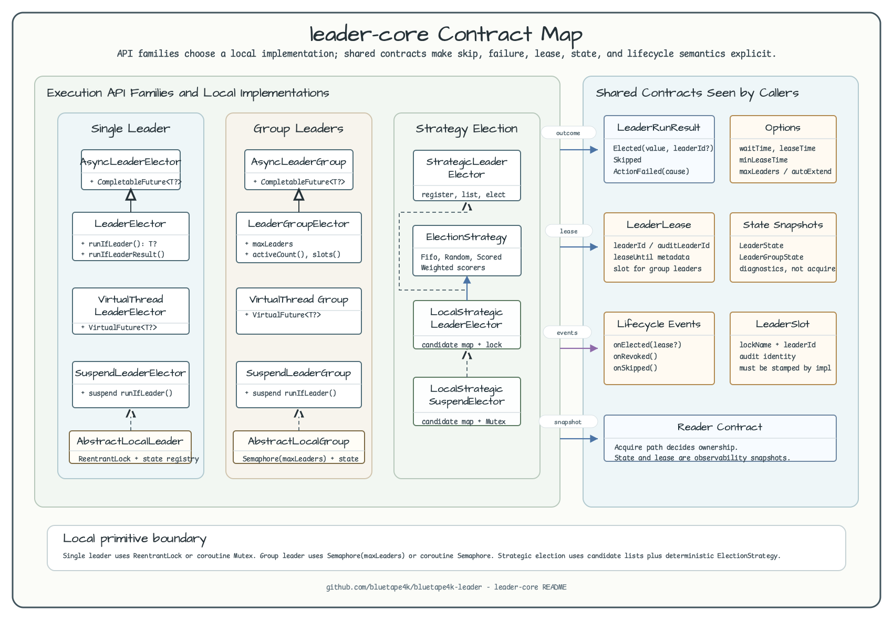
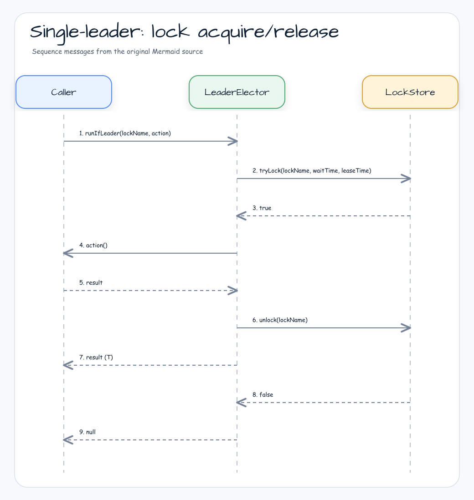
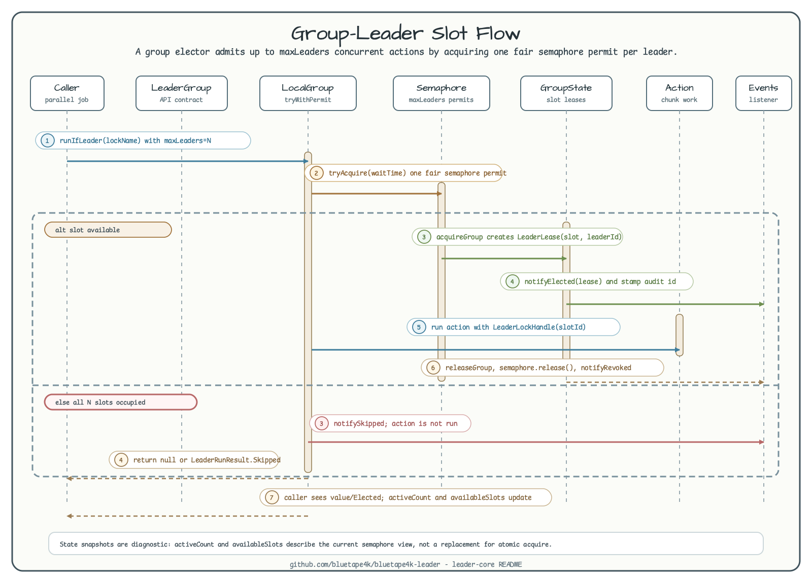

# leader-core

[English](README.md) | 한국어

`bluetape4k-leader`의 핵심 인터페이스와 로컬 인메모리 구현체를 제공합니다.

---

## 개요

`leader-core`는 모든 리더 선출 백엔드의 계약(인터페이스)을 정의하고, 외부 인프라 없이 동작하는 로컬(인메모리) 구현체를 포함합니다. 단일 인스턴스 환경이나 테스트에서 로컬 구현체를 사용하세요.

## 아키텍처



## API 계약

### `runIfLeader(lockName, action): T?`

- 지정한 이름의 락(또는 그룹 선출의 경우 세마포어 슬롯)을 획득 시도합니다
- 획득 성공: `action`을 실행하고 결과를 반환합니다
- `waitTime` 내 획득 실패: **`null`** 반환 (경쟁 상황에서 예외를 던지지 않음)
- `action` 내부에서 발생한 예외는 호출자에게 전파됩니다
- `action` 완료 후 (또는 예외 발생 시) 락이 해제됩니다

### `runIfLeaderResult*`: 명시적 실행 결과

`null`이 정상 action 결과일 수 있거나, 경쟁으로 실행되지 않은 경우와 action 실패를 구분해야 하면 result API를 사용하세요.

```kotlin
when (val result = election.runIfLeaderResult("daily-job") { computeOrNull() }) {
    is LeaderRunResult.Elected -> use(result.value)       // action 실행됨, value 는 null 가능
    LeaderRunResult.Skipped -> recordContention()         // action 실행 안 됨
    is LeaderRunResult.ActionFailed -> report(result.cause)
}
```

`LeaderRunResult`는 세 상태를 가집니다.

- `Elected(value, leaderId?)`: 락 또는 슬롯을 획득했고 action이 완료됨.
- `Skipped`: 락 또는 슬롯을 획득하지 못해 action이 실행되지 않음.
- `ActionFailed(cause)`: 락 또는 슬롯을 획득하고 action이 시작됐지만 실행 중 실패함.

Result API는 `CancellationException`을 `ActionFailed`로 변환하지 않습니다. 동기/코루틴 API는 재전파하고,
async/가상 스레드 API는 예외 완료됩니다(`join()`에서는 cancellation을 감싼 `CompletionException`을
기대하세요. `isCancelled()` 보장은 아닙니다). 동기 API는 `InterruptedException`도 interrupt flag를 복원한 뒤 재전파합니다.

async 선출이 반환한 `CompletableFuture`를 취소하면 acquisition과 실행 중인 action에 취소를 전달하고 lease 또는
slot 정리를 시작합니다. 취소는 협력적으로 동작하며 정리는 비동기로 끝날 수 있습니다.
`mayInterruptIfRunning=true`도 사용자 코드의 강제 중단을 보장하지 않습니다.

### 선출 생명주기 listener

`LeaderElectionListenerRegistry` 구현체는 `addListener`, `removeListener`로 생명주기 callback을 등록할 수 있습니다.

- `onElected(lockName)`: 보호된 작업이 시작되기 직전
- `onElected(lockName, leader)`: best-effort 소유자와 lease 만료 metadata가 필요한 구현체용 callback
- `onRevoked(lockName)`: 현재 호출이 보유하던 락 또는 슬롯을 반납한 직후
- `onSkipped(lockName)`: 리더십을 획득하지 못해 작업을 실행하지 않을 때

`LeaderElectionEventPublisher.events`는 같은 생명주기를 hot `Flow<LeaderElectionEvent>` stream으로 제공합니다.
`LeaderElectionEvent.Elected`도 같은 선택적 `LeaderLease` 기준 데이터를 포함합니다. Backend가 정확한 만료 시각을
보고할 수 없으면 `leader.leaseUntil`과 `leaseExpiry`는 `null`입니다. 이 값은 관측 metadata이며, 소유권 판단은
항상 backend의 원자적 acquire path를 사용하세요.

Framework 통합이나 Java-friendly adapter에서는 publisher에 callback을 직접 등록할 수 있습니다. 호출자가
`CoroutineScope`를 소유하며, 반환된 handle을 닫으면 해당 callback collection만 취소됩니다.

```kotlin
val election = LocalLeaderElector()
val handle = election.addListener(object : LeaderElectionListener {
    override fun onElected(lockName: String, leader: LeaderLease?) {
        println("elected: $lockName until ${leader?.leaseUntil ?: "unknown"}")
    }
})

try {
    election.runIfLeader("daily-job") { processData() }
} finally {
    handle.close()
}
```

```kotlin
val election = LocalSuspendLeaderElector()

val handle = election.onElected(applicationScope) { event ->
    println("elected: ${event.lockName} by ${event.leaderId ?: "unknown"}")
}

election.runIfLeader("nightly-sync") { syncToRemote() }
handle.close()
```

### Audit export와 HTTP/webhook 전달

`LeaderAuditExporter`는 이미 정제한 history 또는 lifecycle event를 bounded 비동기
파이프라인으로 전달합니다. `submit`은 admission 결과만 반환하므로 `ACCEPTED`는
수신 서버가 요청을 받았다는 뜻이 아닙니다. `LeaderAuditExportOptions`에 넘긴 executor와
scheduler를 종료하기 전에 exporter를 먼저 닫으세요.

JDK adapter는 직렬화를 애플리케이션에 맡기고 명시적으로 신뢰한 HTTPS endpoint만
받습니다. Redirect는 끄고 응답 body는 폐기하며, 요청 header는 `Content-Type`과
`Authorization`만 허용합니다. Endpoint wrapper는 URI 문법과 책임 경계를 확인할 뿐이므로
DNS, SSRF, private-network, DNS rebinding 정책은 호출자나 egress proxy가 소유합니다.

```kotlin
val scheduler = Executors.newSingleThreadScheduledExecutor()
val executor = Executors.newVirtualThreadPerTaskExecutor()
val endpoint = LeaderAuditTrustedHttpsEndpoint.trusted(
    URI("https://audit.example.test/v1/leader-events"),
)
val client = HttpClient.newBuilder()
    .followRedirects(HttpClient.Redirect.NEVER)
    .build()
val exporter = HttpLeaderAuditExporter(
    client = client,
    endpoint = endpoint,
    headers = mapOf("Authorization" to "Bearer ${System.getenv("AUDIT_WEBHOOK_TOKEN")}"),
    encoder = LeaderAuditPayloadEncoder { event ->
        LeaderAuditHttpPayload.of(
            contentType = "text/plain; charset=utf-8",
            body = event.toString().toByteArray(),
        )
    },
    exportOptions = LeaderAuditExportOptions(
        queueCapacity = 256,
        maxInFlight = 8,
        maxAttempts = 3,
        attemptTimeout = Duration.ofSeconds(5),
        initialBackoff = Duration.ofMillis(100),
        maxBackoff = Duration.ofSeconds(5),
        executor = executor,
        scheduler = scheduler,
    ),
    httpOptions = LeaderAuditHttpOptions.defaults(),
)

try {
    exporter.submit(event)
} finally {
    exporter.close()
    executor.close()
    scheduler.shutdown()
}
```

수신 서버가 JSON을 요구하면 주입한 `LeaderAuditPayloadEncoder`에서 애플리케이션의
직렬화기를 사용하세요. JSONL 파일과 OpenTelemetry exporter는 별도 transport이며
`leader-core`가 의존성을 추가하지 않습니다. 재시도는 at-least-once 전달이므로
수신 서버도 idempotency를 제공해야 합니다.

### 옵션 클래스

```kotlin
LeaderElectionOptions(
    waitTime: Duration = 5.seconds,   // 락 획득 최대 대기 시간
    leaseTime: Duration = 60.seconds, // 락 보유(임대) 최대 시간
    minLeaseTime: Duration = Duration.ZERO, // 로컬 최소 보유 시간
    autoExtend: Boolean = false // action 실행 중 단일 리더 lease 갱신
)

LeaderGroupElectionOptions(
    maxLeaders: Int = 2,                          // 최대 동시 리더 수
    waitTime: Duration = 5.seconds,
    leaseTime: Duration = 60.seconds,
    minLeaseTime: Duration = Duration.ZERO,
    useDbTime: Boolean = false                    // Exposed JDBC/R2DBC 그룹 소유권에만 적용
)
```

`useDbTime`은 Exposed JDBC/R2DBC 그룹 elector가 사용합니다. 다른 backend는
기존 clock 동작을 유지합니다.

`minLeaseTime`은 lockAtLeastFor 대응 옵션입니다. 로컬 elector는 최소 보유 시간이 지날 때까지 락 또는 슬롯을 유지합니다. 지원되는 분산 backend는 release 시 남은 최소 lease를 storage TTL에 위임합니다.

`autoExtend`는 단일 리더 옵션입니다. 로컬 elector는 JVM lock으로 상호 배제를 유지하고 상태 기준 데이터를 갱신하며, 분산 backend는 owner 조건부 lease 갱신을 구현합니다.

## 시퀀스 다이어그램

### 단일 리더: 락 획득/해제



### 복수 리더 그룹: 슬롯 기반 세마포어 (maxLeaders = N)



## 로컬 구현체 목록

모든 로컬 구현체는 JVM 기본 동기화 프리미티브(`ReentrantLock`, `Semaphore`)를 사용합니다. 외부 의존 없음.

| 클래스 | 구현 인터페이스 | 설명 |
|-------|--------------|------|
| `LocalLeaderElector` | `LeaderElector` | 블로킹, `ReentrantLock` 기반 |
| `LocalAsyncLeaderElector` | `AsyncLeaderElector` | 스레드풀 기반 `CompletableFuture` |
| `LocalVirtualThreadLeaderElector` | `VirtualThreadLeaderElector` | 가상 스레드 1개/선출 |
| `LocalSuspendLeaderElector` | `SuspendLeaderElector` | 코루틴 `Mutex` 기반 |
| `LocalLeaderGroupElector` | `LeaderGroupElector` | `Semaphore` 기반 복수 리더 |
| `LocalSuspendLeaderGroupElector` | `SuspendLeaderGroupElector` | 코루틴 `Semaphore` 기반 |
| `LocalStrategicLeaderElector` | `StrategicLeaderElector` | 전략 기반 블로킹 선출 |
| `LocalStrategicSuspendLeaderElector` | `StrategicSuspendLeaderElector` | 전략 기반 코루틴 선출 |

## 전략 기반 선출 (Strategic Election)

### 개요

전략 기반 선출은 **후보 등록 단계**와 **전략 적용 단계**를 분리하여 유연한 리더 선출 정책을 가능하게 합니다.

```
registerCandidate() → elect(strategy) → 1명 선출, 나머지 skip
```

### 내장 전략

| 전략 | 설명 |
|------|------|
| `FifoElectionStrategy` | 등록 시각이 가장 이른 후보 선출 |
| `RandomElectionStrategy(seed)` | seed 기반 결정론적 무작위 선출 (분산 환경: 공유 seed 필수) |
| `ScoredElectionStrategy(scorer)` | 점수 최고 후보 선출 |

### 내장 Scorer (0–100 정규화)

| Scorer | 설명 |
|--------|------|
| `IdleTimeScorer` | 마지막 완료 후 가장 오래 쉰 노드 우선 |
| `SuccessRateScorer` | 성공률 높은 노드 우선 |
| `RecentSuccessScorer` | 가장 최근에 성공 완료한 노드 우선 |
| `WeightedScorer` | 복수 Scorer 가중 합산 |

### 핵심 인터페이스

```kotlin
interface StrategicLeaderElector {
    val nodeId: String
    fun registerCandidate(lockName: String, info: CandidateInfo, ttl: Duration = Duration.ZERO)
    fun unregisterCandidate(lockName: String, nodeId: String)
    fun listCandidates(lockName: String): List<CandidateInfo>
    fun <T> runIfLeader(lockName: String, strategy: ElectionStrategy, options: LeaderElectionOptions, action: () -> T): T?
}
```

## 사용 예시

### 전략 기반 선출 — IdleTime Scorer

```kotlin
val election = LocalStrategicLeaderElector("node-1")

election.registerCandidate("batch-job", CandidateInfo("node-1"))
election.registerCandidate("batch-job", CandidateInfo("node-2"))

val result = election.runIfLeader("batch-job", ScoredElectionStrategy(IdleTimeScorer)) {
    processBatch()
}
// 가장 오래 쉰 노드만 processBatch() 실행, 나머지는 null 반환
```

### 전략 기반 선출 — 가중 Scorer

```kotlin
val scorer = WeightedScorer(IdleTimeScorer to 0.4, SuccessRateScorer to 0.6)
val strategy = ScoredElectionStrategy(scorer)

val result = election.runIfLeader("weighted-job", strategy) { work() }
```

### 블로킹 단일 리더

```kotlin
val election = LocalLeaderElector()

val result = election.runIfLeader("daily-job") {
    processData()
}
// result: 선출 성공이면 processData() 결과, 실패이면 null
```

### 코루틴 suspend 단일 리더

```kotlin
val election = LocalSuspendLeaderElector()

val result = election.runIfLeader("nightly-sync") {
    syncToRemote()
}
```

### 복수 리더 그룹 (세마포어)

```kotlin
val options = LeaderGroupElectionOptions(maxLeaders = 3)
val election = LocalLeaderGroupElector(options)

// 최대 3개의 동시 호출이 action을 실행 가능
val result = election.runIfLeader("parallel-batch") {
    processChunk()
}

println(election.activeCount("parallel-batch"))    // 현재 활성 리더 수 (0~3)
println(election.availableSlots("parallel-batch")) // 잔여 슬롯 수
```

### 상태 조회

```kotlin
val single: LeaderState = LocalLeaderElector(
    LeaderElectionOptions(nodeId = "node-a")
).state("daily-job")
println(single.status)        // Empty 또는 Occupied
println(single.leader?.leaderId)

val group: LeaderGroupState = election.state("parallel-batch")
println(group.activeCount)    // 현재 리더 수
println(group.maxLeaders)     // 옵션의 maxLeaders 값
println(group.leaders.map { it.leaderId })
```

상태 조회는 진단과 메트릭을 위한 best-effort 기준 데이터입니다. 락 획득을 대체하는 API가 아닙니다.

## Management Action (Issue #532, unreleased)

`LeaderManagementActionRegistry`는 등록된 single-leader lease를 운영자가 명시적으로
해제하기 위한 process-local surface입니다. 소유권 pre-check, 조건부 release 한 번,
post-check 순서로 동작하며 결과는 정제된 `LeaderManagementActionResult`로 반환합니다.
Backend token, credential, lock identity, exception 원문은 result와 observation에
포함되지 않습니다.

Lease-acquirer가 반환한 정확한 `LeaderLeaseHandle`만 등록하고, 해당 handle이 더 이상
관리 대상이 아니면 registration token만 닫으세요:

```kotlin
val registry = LeaderManagementActionRegistry()
val handle = elector.tryAcquire("daily-job")
val registration = handle?.let(registry::register)

try {
    val result = registry.release("daily-job")
    println("${result.outcome}, mutation=${result.mutationAttempted}")
} finally {
    registration?.close() // idempotent; lease 자체는 해제하지 않음
    registry.closeAndDrain()
}
```

등록은 identity 기준이며 cap이 있습니다. 같은 handle을 다시 등록하면 reference가
늘고, 같은 lock에 다른 handle이 있으면 `AMBIGUOUS`가 됩니다. `close()`는 backend I/O를
수행하지 않습니다. `closeAndDrain()`은 새 action을 거부하고 이미 admission된 worker만
bounded하게 기다리며, 애플리케이션 lease를 임의로 해제하지 않습니다.

Action registry는 `runIfLeader`, group/semaphore election, strategic election,
`LeaderRouteLeaseRuntime`, scheduled job에 자동 연결되지 않습니다. 애플리케이션이
소유한 lease 경계에서만 handle을 등록하세요. Release 전 timeout은
`ACTION_TIMED_OUT`과 `mutationAttempted=false`를 반환하고, release 시작 후 timeout은
같은 outcome에 `mutationAttempted=true`를 반환하므로 자동 재시도하면 안 됩니다.
`RELEASE_UNCONFIRMED`와 `RELEASE_FAILED`를 성공으로 승격하지 마세요.

Spring 및 Ktor 모듈의 HTTP adapter는 다음 공통 mapping을 사용합니다.

| Outcome | HTTP | Retry |
|---|---:|---|
| `RELEASED` | 200 | No |
| `INVALID_LOCK_NAME` | 400 | No |
| `NOT_REGISTERED` | 404 | No |
| `AMBIGUOUS`, `NOT_HELD`, `ACTION_IN_PROGRESS` | 409 | No |
| `ACTION_ADMISSION_REJECTED` | 429 | No |
| ownership/release/registry failure | 503 | No |
| `ACTION_TIMED_OUT` | 504 | No |

### Framework-neutral backend probe

`LeaderBackendDiagnosticsProbe.check(timeout, clock, probe)`는 내장 backend connectivity 검사를 위한 공통 동기 경계입니다. 양수이면서 유한한 provider-native timeout만 받고 callback 전에 전달된 clock을 한 번 읽으며, I/O, lock, client, retry, thread, executor, wall-clock deadline을 만들거나 관리하지 않습니다. callback의 일반 `Exception`은 `UNKNOWN`이 되고, `CancellationException`, interrupt flag를 복원하는 `InterruptedException`, 치명적인 `Error`는 동일 인스턴스로 재전파됩니다. callback이 `NOT_CHECKED`를 반환하면 잘못된 결과로 거부합니다. 기존 custom `checkConnectivity` 또는 `diagnostics` override는 source 호환성을 위해 유지되며 의도적으로 이 정규화를 우회합니다.

`LeaderBackendConnectivityReason` field는 예외 원문, credential, endpoint,
lock name을 저장하지 않고 제한된 원인을 설명합니다.

| 상태 | Reason | 해석 |
|---|---|---|
| `UP` | `CONNECTED` | probe 시점에 client가 연결 가능 상태를 확인했습니다. |
| `DOWN` | `DISCONNECTED` | client가 backend를 사용할 수 없는 상태를 확인했습니다. |
| `UNKNOWN` | `CLIENT_STATE_UNCONFIRMED` | bounded 검사만으로 client 상태를 확정하지 못했습니다. |
| `UNKNOWN` | `PROVIDER_UNSUPPORTED` | provider가 의도적으로 active probe를 제공하지 않습니다. |
| `UNKNOWN` | `PROVIDER_EXCEPTION` | callback의 일반 예외를 정규화했습니다. |
| `NOT_CHECKED` | `NOT_CHECKED` | probe를 실행하지 않았으며 health나 소유권의 증거가 아닙니다. |

기본 provider는 active probe를 제공할 수 없을 때 `PROVIDER_UNSUPPORTED`를
사용합니다. Helper-backed provider가 client 상태를 읽었지만 backend 연결을
증명하지 못하면 `CLIENT_STATE_UNCONFIRMED`를 사용합니다. Reason은 설명용
metadata이며 소유권 판단은 계속 `runIfLeader`의 원자적 lease 획득이 맡고,
readiness 정책은 애플리케이션이 소유합니다.

## 테넌트 네임스페이스

같은 논리 작업을 테넌트별 독립 락으로 실행해야 한다면 backend 설정을 바꾸지
않고 `TenantLockNamespace`와 `forTenant()`를 사용할 수 있습니다. wrapper는
backend lock name을 `prefix:tenantId:lockName` 형식으로 만들며, 기본 prefix는
`tenant`입니다.

```kotlin
import io.bluetape4k.leader.TenantLockNamespace
import io.bluetape4k.leader.forTenant

val election = LocalLeaderElector()
val tenantElection = election.forTenant("tenant-a")

tenantElection.runIfLeader("daily-report-job") {
    generateTenantReport("tenant-a")
}
// backend lockName: tenant:tenant-a:daily-report-job

val namespace = TenantLockNamespace(tenantId = "tenant-a", prefix = "app")
val tenantGroup = LocalLeaderGroupElector().forTenant(namespace)

tenantGroup.runIfLeader("aggregation") {
    aggregateTenant("tenant-a")
}
// backend lockName: app:tenant-a:aggregation
```

`forTenant()`는 blocking, coroutine, group, virtual-thread elector에서 사용할 수
있습니다. 네임스페이스 구분자 `:`는 예약되어 있으므로
`TenantLockNamespace`는 prefix, tenant id, tenant-local lock name 안의 `:`를
거부합니다. 기존 caller-facing lock name이 `batch:daily`처럼 `:`를 포함한다면
tenant scope로 감싸기 전에 이름을 바꾸세요.

최종 생성된 backend lock name은 공통 255자 lock-name 제한으로 다시 검증됩니다.
따라서 tenant-local lock name의 길이 예산은 `255 - prefix.length -
tenantId.length - 2`입니다. 생성된 이름에 구분자 2개가 포함되기 때문입니다.

## Lock Assert & Extend

`LockAssert` 와 `LockExtender` 는 ShedLock 과 동일한 사용감으로 lock 보유 여부를 단언하고
`@LeaderElection` / `@LeaderGroupElection` 본문 안에서 lease 를 명시적으로 연장합니다.

### LockAssert

```kotlin
@LeaderElection(name = "report-job")
fun runReport() {
    LockAssert.assertLocked()              // 활성 scope 없으면 throw
    LockAssert.assertLocked("report-job") // 이름 불일치 시 throw

    if (!LockAssert.isLocked()) return     // throw 없는 조회
}

// suspend 컨텍스트 — coroutineContext 만 검사 (ThreadLocal fallback 없음, R7)
@LeaderElection(name = "async-job")
suspend fun runAsync() {
    LockAssert.assertLockedSuspend()
    LockAssert.assertLockedSuspend("async-job")

    val held: Boolean = LockAssert.isLockedSuspend()
}
```

- `assertLocked()` / `assertLocked(lockName)` — 활성 scope 없거나 fail-open sentinel 이면 `IllegalStateException` throw.
- `isLocked()` / `isLocked(lockName)` — throw 없이 `Boolean` 반환.
- `assertLockedSuspend()` / `isLockedSuspend()` — suspend 변형; `coroutineContext[LockHandleElement]` 만 검사 (ThreadLocal fallback 없음 R7).

### LockExtender

```kotlin
@LeaderElection(name = "long-job", leaseTime = 30.seconds)
fun runJob() {
    // ... 25초 작업 ...
    LockExtender.extendActiveLock(60.seconds)  // TTL = now + 60s 로 갱신
    // ... 추가 50초 작업 ...
}

// 상세 sealed result
when (val outcome = LockExtender.extendActiveLockDetailed(60.seconds)) {
    is ExtendOutcome.Extended    -> log.info { "만료 시각 ${outcome.observedExpireAt}" }
    is ExtendOutcome.NotHeld     -> rollback()
    is ExtendOutcome.WrongThread -> log.warn { "Redisson thread-bound 위반" }
    is ExtendOutcome.BackendError -> retry(outcome.cause)
}

// Java 호환 java.time.Duration overload
LockExtender.extendActiveLock(Duration.ofSeconds(60))

// suspend 변형
suspend fun runSuspend() {
    LockExtender.extendActiveLockSuspend(60.seconds)
}
```

- 성공 시 `true`, 실패 시 `false` 반환 (활성 scope 없음, fail-open, token mismatch, backend 오류).
- `lastExtendDeadline` 을 갱신해 watchdog 가 user 가 연장한 lease 를 silently 축소하지 않도록 차단 (R2 mitigation).

### Lease-extension observer

> **미배포 API:** 이 절은 현재 `develop` 구현을 설명합니다. 이 README의 의존성 예제는 배포된 `0.4.0`을 대상으로
> 하며, 고정한 `0.5.0` 매뉴얼에는 이 hook이 없습니다. 초안의 promotion gate가 끝날 때까지는 일치하는
> `develop` 브랜치 또는 일치하는 미배포 빌드에서만 이 연동을 사용하세요.

`LeaderLeaseExtensionObservers`는 terminal lease-extension 시도를 관찰하는 framework-neutral hook입니다. 명시적인
`LockExtender` 호출과 `LeaderLeaseAutoExtender` watchdog tick에서 같은 event 계약을 전달합니다.

```kotlin
val registration = LeaderLeaseExtensionObservers.addObserver { event ->
    logger.info {
        "lease extension source=${event.source} execution=${event.execution} " +
            "outcome=${event.outcome::class.simpleName}"
    }
}

// 이 blocking 예제는 일치하는 활성 @LeaderElection 또는 @LeaderGroupElection scope 안에서 호출하세요. 그렇지 않으면
// context = null인 NotHeld를 반환합니다. 직접 elector의 active lease body 안에서도 같은 규칙이 적용됩니다. Suspend
// scope에서는 suspend 함수 안에서 extendActiveLockDetailedSuspend(60.seconds)를 사용하세요.
try {
    when (LockExtender.extendActiveLockDetailed(60.seconds)) {
        is ExtendOutcome.Extended -> processExtended()
        ExtendOutcome.NotHeld -> rollback()
        ExtendOutcome.WrongThread -> reportThreadBinding()
        is ExtendOutcome.BackendError -> retry()
        ExtendOutcome.Rejected -> recordRejectedExtension()
    }
} finally {
    registration.close()
}
```

`LeaderLeaseExtensionEvent.source`는 `LockExtender`의 `USER` 호출과 자동 갱신의 `WATCHDOG` 호출을 구분합니다.
`execution` 값은 `BLOCKING` 또는 `SUSPEND`입니다. `outcome`은 기존 `ExtendOutcome`을 그대로 사용합니다.
`Extended`는 관측한 만료 시각을 담고, `Rejected`는 watchdog reservation 실패, user bounded operation queue
포화, 또는 명령이 완료되기 전에 user 작업이 timeout된 경우를 뜻합니다. Timeout된 명령은 이후 실행될 수
있으므로 backend 작업이 전혀 없었다는 뜻은 아닙니다. `NotHeld`는 ownership이 없거나 만료된 경우( fail-open 포함),
`WrongThread`는 thread-bound backend 위반, `BackendError`는 backend 예외를 나타냅니다. `elapsedNanos`는 caller
측 delegate 호출 시간이며 scope 밖 lookup이나 즉시 queue admission 거부처럼 delegate가 실행되지 않고 호출이
끝난 경우에만 0입니다.

Registry는 process-local입니다. Delivery는 bounded non-blocking in-flight admission(전체 1024 permit,
registration별 256 permit)을 사용하며 포화되면 permit이나 callback을 기다리지 않고
`LeaderLeaseExtensionObservers.droppedCount()`를 증가시킵니다. 이 registry의 registration 수와 callback
fan-out에는 고정 상한이 없으므로 애플리케이션 등록 수를 작게 유지하고 callback을 짧게 작성하세요.
`droppedCount()`는 `ExtendOutcome.Rejected`와 별도로 observer delivery admission에서 거부된 누적 횟수입니다.
`close()`는 idempotent하게 자신의 registration만 제거합니다. 이미 admission된 callback은 `close()` 뒤에도 끝까지
실행될 수 있고 순서나 drain 완료는 보장하지 않습니다. Callback의 `Exception`은 격리하고 extension 경로의
`CancellationException`과 `Error`는 `ExtendOutcome`으로 변환하거나 event로 publish하지 않습니다.
`BackendError.cause`는 원본 backend `Exception`으로 남으며 core는 이를 redaction하지 않습니다. Custom observer는
로그나 export 전에 cause를 별도로 sanitise해야 합니다.

선택적인 `LeaderLeaseExtensionContext`는 일치하는 user 소유 active scope에서만 전달되고 watchdog event나
scope 밖·이름 불일치 호출에서는 없습니다.
`toString()`은 redaction하지만 애플리케이션도 raw `lockName`과 `auditLeaderId`를 로그에 남기지 않아야 합니다.
Fail-open `NotHeld` event에는 `context`의 lock name이 남고 `auditLeaderId = null`입니다. 위 snippet은 하나의
명시적 `USER` 시도 뒤에 registration을 닫습니다. `WATCHDOG` tick이 필요하면 `autoExtend = true`인 단일 리더
action 또는 component 전체 수명 동안 handle을 유지하고 종료 시 닫으세요. Group election slot은 active body
안의 명시적 `LockExtender` 호출은 지원하지만 group auto-extension이 꺼져 있으므로 `WATCHDOG` event를 만들지
않습니다. Scope 밖이나 named mismatch event의 `context`는 `null`입니다. Adapter와 lifecycle 지침은
[미배포 lease-extension 관찰 초안](https://github.com/bluetape4k/bluetape4k.github.io/blob/develop/docs/manual/bluetape4k-leader/drafts/2026-08-27-issue-559-lease-extension-observation.ko.md)을 참고하세요.

### ⚠️ Reactor non-suspend operator 미지원 (R5)

`LockAssert.assertLocked()` / `LockExtender.extendActiveLock()` 를 non-suspend Reactor operator (`.map {}`, `.filter {}`) 안에서 호출하면 실패합니다.
ThreadLocal 도 `CoroutineContext` 도 전파되지 않기 때문입니다.

suspend 변형을 `mono {}` builder 안에서 사용하세요:

```kotlin
// 비권장 — 비동기/cross-thread Reactor operator 에서 실패
mono.map { LockAssert.assertLocked() }

// 권장 — 올바른 패턴
mono.flatMap { value ->
    mono {
        withContext(LockHandleElement(handle)) {
            LockAssert.assertLockedSuspend()
            value
        }
    }
}
```

## 리더 Identity

선출된 리더는 `leaderId` 문자열을 보유하며, 이 값은 락 레코드에 기록되고 감사(audit) 이벤트,
Redis 페이로드, 모니터링 대시보드로 전파됩니다.

### `LeaderIdProvider`

```kotlin
fun interface LeaderIdProvider {
    fun nextLeaderId(lockName: String): String
}
```

**계약**:
- 절대 예외를 던지지 않는다.
- 블로킹하지 않는다.
- Thread-safe이어야 한다.
- 빈 문자열이 아닌 값을 반환해야 한다.

### 내장 Provider

| Provider | 설명 | 기본값 |
|----------|------|--------|
| `RandomLeaderIdProvider(length)` | Base58 랜덤 문자열 (length=12일 때 ~70 bits 엔트로피) | `length = 12` |
| `HostnamePidLeaderIdProvider(suffixLength)` | `hostname:PID:base58suffix` — 사람이 읽기 쉬운 형식, 멀티테넌트 SaaS에서 PII 위험 | `suffixLength = 8` |
| `CompositeLeaderIdProvider(prefix, separator, delegate)` | 다른 Provider 출력에 고정 prefix를 붙임. 테넌트 태깅에 유용 | |

> **PII 주의**: `HostnamePidLeaderIdProvider`는 호스트명을 포함하므로 멀티테넌트 환경에서
> 내부 인프라 정보가 노출될 수 있습니다. 익명성이 필요한 경우 `RandomLeaderIdProvider`를 사용하세요.

### `LeaderIdSource` (출처 태그)

`LeaderIdSource`는 Micrometer 태그로 기록되는 유한 enum입니다:

| 값 | 의미 |
|----|------|
| `LITERAL` | `@LeaderElection(leaderId = "...")` 어노테이션에 정적으로 지정된 문자열 |
| `SPEL` | 어노테이션의 SpEL 표현식으로 해석 |
| `PROPERTY` | Spring `${...}` 플레이스홀더로 해석 |
| `AUTO` | 설정된 `LeaderIdProvider` 빈이 자동 생성 |

### `LeaderSlot` — 감사 identity 캐리어

`LeaderSlot`은 락 이름과 선출된 리더의 identity를 연결합니다:

```kotlin
val slot = LeaderSlot(lockName = "batch-job", leaderId = "node-42:aBcDeFgH")
val result = leaderElector.runIfLeader(slot) { doWork() }
```

`leaderId`는:
- 백엔드 락 레코드(Redis 키 / DB 행)에 기록되어 장애 복구 시 귀책 추적에 사용됩니다.
- `LeaderElectionEvent.Elected.leaderId`로 전파됩니다.
- `runIfLeaderResult` 사용 시 `LeaderRunResult.Elected.leaderId`로 접근 가능합니다.

### 커스텀 Provider 설정 예제

```kotlin
// 기본 랜덤 방식
val provider = RandomLeaderIdProvider()

// 호스트명 + PID (호스트명이 PII가 아닌 경우에만 사용)
val provider = HostnamePidLeaderIdProvider(suffixLength = 6)

// 테넌트 prefix 방식: "tenant-acme:aBcDeFgHiJkL"
val provider = CompositeLeaderIdProvider(
    prefix = "tenant-acme",
    separator = ":",
    delegate = RandomLeaderIdProvider.Default,
)

// LeaderSlot으로 provider와 lock name을 결합
val slot = LeaderSlot.of("daily-job", provider)

// runIfLeader에 slot 전달
val elector = LocalLeaderElector()
val result = elector.runIfLeader(slot) { doWork() }
```

### Redis 그룹 백엔드에서의 감사 Identity

Lettuce 또는 Redisson **그룹** 백엔드를 사용하면 슬롯 토큰과 함께 `leaderId`가 저장됩니다:

| 백엔드 | 저장 방식 | 키 |
|--------|----------|-----|
| `leader-redis-lettuce` (그룹) | `lg:{lockName}:meta` Hash | 슬롯 토큰별 `auditLeaderId` 필드 |
| `leader-redis-redisson` (그룹) | `lg:{lockName}:audit` RMap | 슬롯 토큰 → leaderId |

크래시 발생 시 TTL 만료로 슬롯 토큰과 identity 레코드가 함께 회수됩니다. 별도의 reaper가 필요 없습니다.

> **단일 리더 백엔드**(`LettuceLeaderElector`, `RedissonLeaderElector`)는 `auditLeaderId`를
> 메모리 내 `LeaderLockHandle`에만 저장하며 Redis에는 기록하지 않습니다.

## 의존성 추가

```kotlin
// build.gradle.kts
implementation("io.github.bluetape4k.leader:bluetape4k-leader-core:0.4.0")
```
