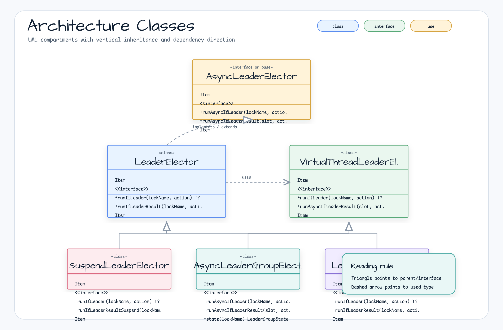
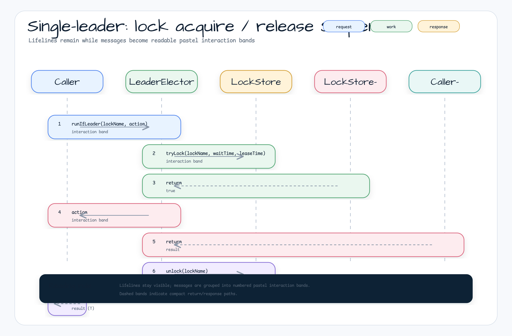
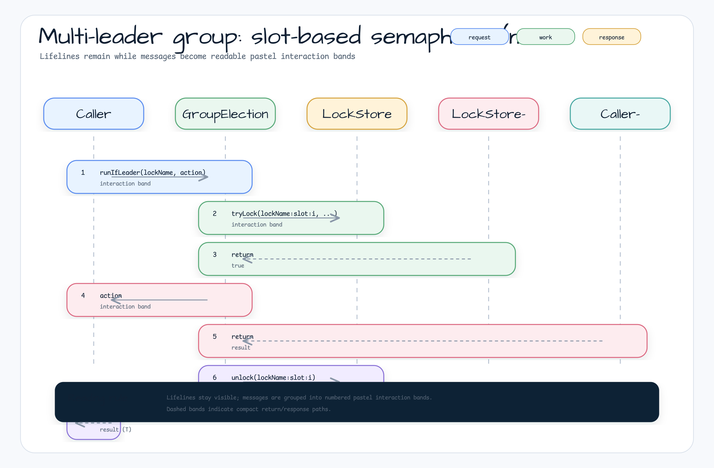

# leader-core

[한국어](README.ko.md)

Core interfaces and local in-process implementations for `bluetape4k-leader`.

---

## Overview

`leader-core` defines the contracts for all leader election backends and provides local (in-process) implementations that need no external infrastructure. Use local implementations in single-instance deployments or tests.

## Architecture



## API Contract

### `runIfLeader(lockName, action): T?`

- Acquires the named lock (or semaphore slot for group elections)
- If acquired: executes `action` and returns its result
- If not acquired within `waitTime`: returns **`null`** (never throws on contention)
- Exceptions from `action` are propagated to the caller
- Lock is released after `action` completes (or on exception)

### `runIfLeaderResult*`: explicit execution outcome

Use result APIs when `null` is a valid action value or when callers need to distinguish contention from
action failure:

```kotlin
when (val result = election.runIfLeaderResult("daily-job") { computeOrNull() }) {
    is LeaderRunResult.Elected -> use(result.value)       // action ran; value may be null
    LeaderRunResult.Skipped -> recordContention()         // action did not run
    is LeaderRunResult.ActionFailed -> report(result.cause)
}
```

`LeaderRunResult` has three states:

- `Elected(value, leaderId?)`: lock or slot was acquired and the action completed.
- `Skipped`: lock or slot was not acquired, so the action was not executed.
- `ActionFailed(cause)`: lock or slot was acquired and the action started, but it failed.

Result APIs never convert `CancellationException` into `ActionFailed`. Blocking and coroutine APIs rethrow it;
async and virtual-thread APIs complete exceptionally instead (for `join()`, expect `CompletionException`
wrapping the cancellation; `isCancelled()` is not guaranteed). Blocking APIs also rethrow
`InterruptedException` after restoring the interrupt flag.

### Election lifecycle listeners

`LeaderElectionListenerRegistry` implementations support `addListener` and `removeListener` for lifecycle callbacks:

- `onElected(lockName)` before the guarded action starts
- `onRevoked(lockName)` after the held lock or slot is released by the current call
- `onSkipped(lockName)` when the action is not run because leadership was not acquired

For suspend electors, `LeaderElectionEventPublisher.events` exposes the same lifecycle as a hot `Flow<LeaderElectionEvent>`.

```kotlin
val election = LocalLeaderElector()
val handle = election.addListener(object : LeaderElectionListener {
    override fun onElected(lockName: String) {
        println("elected: $lockName")
    }
})

try {
    election.runIfLeader("daily-job") { processData() }
} finally {
    handle.close()
}
```

```kotlin
val election = LocalSuspendLeaderElector()

launch {
    election.events.collect { event ->
        println(event)
    }
}

election.runIfLeader("nightly-sync") { syncToRemote() }
```

### Options

```kotlin
LeaderElectionOptions(
    waitTime: Duration = 5.seconds,   // max wait for lock acquisition
    leaseTime: Duration = 60.seconds, // max lock hold time
    minLeaseTime: Duration = Duration.ZERO, // minimum local hold time
    autoExtend: Boolean = false // renew a single-leader lease while action runs
)

LeaderGroupElectionOptions(
    maxLeaders: Int = 2,                          // max concurrent leaders
    waitTime: Duration = 5.seconds,
    leaseTime: Duration = 60.seconds,
    minLeaseTime: Duration = Duration.ZERO
)
```

`minLeaseTime` is the lockAtLeastFor equivalent. Local electors keep the lock or slot until the minimum hold time has elapsed. Supported distributed backends delegate the remaining minimum lease to their storage TTL on release.

`autoExtend` is a single-leader option. Local electors keep mutual exclusion with the JVM lock and refresh state snapshots while distributed backends implement owner-conditional lease renewal.

## Sequence Diagrams

### Single-leader: lock acquire/release



### Multi-leader group: slot-based semaphore (maxLeaders = N)



## Local Implementations

All local implementations use JVM primitives (`ReentrantLock`, `Semaphore`) — no external dependencies.

| Class | Interface | Description |
|-------|-----------|-------------|
| `LocalLeaderElector` | `LeaderElector` | Blocking, `ReentrantLock`-based |
| `LocalAsyncLeaderElector` | `AsyncLeaderElector` | `CompletableFuture` on thread pool |
| `LocalVirtualThreadLeaderElector` | `VirtualThreadLeaderElector` | Virtual thread per election |
| `LocalSuspendLeaderElector` | `SuspendLeaderElector` | Coroutine with `Mutex` |
| `LocalLeaderGroupElector` | `LeaderGroupElector` | `Semaphore`-based multi-leader |
| `LocalSuspendLeaderGroupElector` | `SuspendLeaderGroupElector` | Coroutine `Semaphore` |
| `LocalStrategicLeaderElector` | `StrategicLeaderElector` | Strategy-based blocking election |
| `LocalStrategicSuspendLeaderElector` | `StrategicSuspendLeaderElector` | Strategy-based coroutine election |

## Strategic Election

### Overview

Strategic election separates the **nomination phase** (candidate registration) from the **decision phase** (strategy application), enabling flexible leader selection policies.

```
registerCandidate() → elect(strategy) → 1 winner, rest skipped
```

### Built-in Strategies

| Strategy | Description |
|----------|-------------|
| `FifoElectionStrategy` | Earliest registered candidate wins |
| `RandomElectionStrategy(seed)` | Deterministic random selection (seed required for distributed use) |
| `ScoredElectionStrategy(scorer)` | Highest-scoring candidate wins |

### Built-in Scorers (0–100 normalized)

| Scorer | Description |
|--------|-------------|
| `IdleTimeScorer` | Node idle longest since last completion |
| `SuccessRateScorer` | Highest success-rate node |
| `RecentSuccessScorer` | Most recently succeeded node |
| `WeightedScorer` | Weighted sum of multiple scorers |

### Key Interfaces

```kotlin
interface StrategicLeaderElector {
    val nodeId: String
    fun registerCandidate(lockName: String, info: CandidateInfo, ttl: Duration = Duration.ZERO)
    fun unregisterCandidate(lockName: String, nodeId: String)
    fun listCandidates(lockName: String): List<CandidateInfo>
    fun <T> runIfLeader(lockName: String, strategy: ElectionStrategy, options: LeaderElectionOptions, action: () -> T): T?
}
```

## Usage Examples

### Strategic election — scored idle-time

```kotlin
val election = LocalStrategicLeaderElector("node-1")

election.registerCandidate("batch-job", CandidateInfo("node-1"))
election.registerCandidate("batch-job", CandidateInfo("node-2"))

val result = election.runIfLeader("batch-job", ScoredElectionStrategy(IdleTimeScorer)) {
    processBatch()
}
// Only the node idle longest runs processBatch(); others return null
```

### Strategic election — weighted scorer

```kotlin
val scorer = WeightedScorer(IdleTimeScorer to 0.4, SuccessRateScorer to 0.6)
val strategy = ScoredElectionStrategy(scorer)

val result = election.runIfLeader("weighted-job", strategy) { work() }
```

### Blocking single-leader

```kotlin
val election = LocalLeaderElector()

val result = election.runIfLeader("daily-job") {
    processData()
}
// result == processData() on success, null if lock not acquired
```

### Coroutine suspend single-leader

```kotlin
val election = LocalSuspendLeaderElector()

val result = election.runIfLeader("nightly-sync") {
    syncToRemote()
}
```

### Multi-leader group (semaphore)

```kotlin
val options = LeaderGroupElectionOptions(maxLeaders = 3)
val election = LocalLeaderGroupElector(options)

// Up to 3 concurrent calls can run this action at once
val result = election.runIfLeader("parallel-batch") {
    processChunk()
}

println(election.activeCount("parallel-batch"))   // 0–3
println(election.availableSlots("parallel-batch")) // 3 - activeCount
```

### State inspection

```kotlin
val single: LeaderState = LocalLeaderElector(
    LeaderElectionOptions(nodeId = "node-a")
).state("daily-job")
println(single.status)        // Empty or Occupied
println(single.leader?.leaderId)

val group: LeaderGroupState = election.state("parallel-batch")
println(group.activeCount)    // current leader count
println(group.maxLeaders)     // maxLeaders from options
println(group.leaders.map { it.leaderId })
```

State inspection is a best-effort snapshot for diagnostics and metrics. It is not a lock acquisition primitive.

## Lock Assert & Extend

`LockAssert` and `LockExtender` provide ShedLock-equivalent ergonomic APIs for asserting lock ownership and extending lease durations from within an active `@LeaderElection` / `@LeaderGroupElection` body.

### LockAssert

```kotlin
@LeaderElection(name = "report-job")
fun runReport() {
    LockAssert.assertLocked()           // throws if no active lock scope
    LockAssert.assertLocked("report-job") // throws if named lock not held

    if (!LockAssert.isLocked()) return  // query without throw
}

// In a suspend context — uses coroutineContext only (no ThreadLocal fallback)
@LeaderElection(name = "async-job")
suspend fun runAsync() {
    LockAssert.assertLockedSuspend()
    LockAssert.assertLockedSuspend("async-job")

    val held: Boolean = LockAssert.isLockedSuspend()
}
```

- `assertLocked()` / `assertLocked(lockName)` — throws `IllegalStateException` when called outside an active scope or inside a fail-open sentinel scope.
- `isLocked()` / `isLocked(lockName)` — returns `Boolean` without throwing.
- `assertLockedSuspend()` / `isLockedSuspend()` — suspend variants; inspect `coroutineContext[LockHandleElement]` only (no ThreadLocal fallback per R7).

### LockExtender

```kotlin
@LeaderElection(name = "long-job", leaseTime = 30.seconds)
fun runJob() {
    // ... 25 seconds of work ...
    LockExtender.extendActiveLock(60.seconds)  // renew TTL to now + 60s
    // ... 50 more seconds of work ...
}

// Detailed sealed result
when (val outcome = LockExtender.extendActiveLockDetailed(60.seconds)) {
    is ExtendOutcome.Extended    -> log.info { "expires at ${outcome.observedExpireAt}" }
    is ExtendOutcome.NotHeld     -> rollback()
    is ExtendOutcome.WrongThread -> log.warn { "Redisson thread-bound violation" }
    is ExtendOutcome.BackendError -> retry(outcome.cause)
}

// Java-friendly java.time.Duration overload
LockExtender.extendActiveLock(Duration.ofSeconds(60))

// Suspend variant
suspend fun runSuspend() {
    LockExtender.extendActiveLockSuspend(60.seconds)
}
```

- Returns `true` on success, `false` on failure (no active scope, fail-open, token mismatch, backend error).
- Updates `lastExtendDeadline` on the watchdog delegate to prevent watchdog from silently shrinking the extended lease (R2 mitigation).

### ⚠️ Reactor non-suspend operator limitation (R5)

Calling `LockAssert.assertLocked()` or `LockExtender.extendActiveLock()` inside non-suspend Reactor operators (`.map {}`, `.filter {}`) will fail — neither ThreadLocal nor `CoroutineContext` is available there.

Use the suspend variants inside `mono {}` builder instead:

```kotlin
// NOT recommended — fails in async/cross-thread Reactor operators
mono.map { LockAssert.assertLocked() }

// Recommended — works correctly
mono.flatMap { value ->
    mono {
        withContext(LockHandleElement(handle)) {
            LockAssert.assertLockedSuspend()
            value
        }
    }
}
```

## Leader Identity

Every elected leader carries a string identity (`leaderId`) that is stamped on the lock record and
propagated to audit events, Redis payloads, and monitoring dashboards.

### `LeaderIdProvider`

```kotlin
fun interface LeaderIdProvider {
    fun nextLeaderId(lockName: String): String
}
```

**Contract**:
- Must never throw.
- Must never block.
- Must be thread-safe.
- Must return a non-blank string.

### Built-in providers

| Provider | Description | Default |
|----------|-------------|---------|
| `RandomLeaderIdProvider(length)` | Base58 random string (~70 bits of entropy at length 12) | `length = 12` |
| `HostnamePidLeaderIdProvider(suffixLength)` | `hostname:PID:base58suffix` — human-readable, PII-risk in multi-tenant SaaS | `suffixLength = 8` |
| `CompositeLeaderIdProvider(prefix, separator, delegate)` | Prepends a fixed prefix to another provider's output; useful for tenant tagging | |

> **PII warning**: `HostnamePidLeaderIdProvider` includes the hostname, which may identify internal
> infrastructure in multi-tenant environments. Use `RandomLeaderIdProvider` when anonymity is required.

### `LeaderIdSource` (provenance tag)

`LeaderIdSource` is a bounded enum recorded as a Micrometer tag:

| Value | Meaning |
|-------|---------|
| `LITERAL` | Static string from the `@LeaderElection(leaderId = "...")` annotation field |
| `SPEL` | Resolved from a SpEL expression in the annotation |
| `PROPERTY` | Resolved from a Spring `${...}` placeholder |
| `AUTO` | Generated by the configured `LeaderIdProvider` bean |

### `LeaderSlot` — audit identity carrier

`LeaderSlot` couples a lock name with the elected leader's identity:

```kotlin
val slot = LeaderSlot(lockName = "batch-job", leaderId = "node-42:aBcDeFgH")
val result = leaderElector.runIfLeader(slot) { doWork() }
```

The `leaderId` is:
- Stamped on the backend lock record (Redis key / DB row) for crash-recovery attribution.
- Propagated to `LeaderElectionEvent.Elected.leaderId`.
- Available via `LeaderRunResult.Elected.leaderId` when using `runIfLeaderResult`.

### Configuring a custom provider

```kotlin
// Simple random (default)
val provider = RandomLeaderIdProvider()

// Hostname + PID (human-readable, use only where hostnames are not PII)
val provider = HostnamePidLeaderIdProvider(suffixLength = 6)

// Tenant-prefixed: "tenant-acme:aBcDeFgHiJkL"
val provider = CompositeLeaderIdProvider(
    prefix = "tenant-acme",
    separator = ":",
    delegate = RandomLeaderIdProvider.Default,
)

// Couple the provider with a lock name using LeaderSlot
val slot = LeaderSlot.of("daily-job", provider)

// Then pass the slot to runIfLeader
val elector = LocalLeaderElector()
val result = elector.runIfLeader(slot) { doWork() }
```

### Audit identity in Redis group backends

When using the Lettuce or Redisson **group** backends, the `leaderId` is persisted alongside the
slot token for crash-recovery attribution:

| Backend | Storage | Key |
|---------|---------|-----|
| `leader-redis-lettuce` (group) | `lg:{lockName}:meta` Hash | `auditLeaderId` field per slot token |
| `leader-redis-redisson` (group) | `lg:{lockName}:audit` RMap | slot token → leaderId |

On crash, TTL expiry reclaims both the slot token and the identity record. No external reaper is
required.

> **Single-leader backends** (`LettuceLeaderElector`, `RedissonLeaderElector`) store the
> `auditLeaderId` in-memory on the `LeaderLockHandle`; it is not persisted to Redis.

## Dependency

```kotlin
// build.gradle.kts
implementation("io.github.bluetape4k.leader:bluetape4k-leader-core:0.1.0-SNAPSHOT")
```
