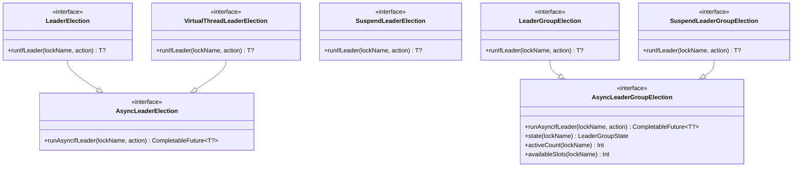

# leader-core

[한국어](README.ko.md)

Core interfaces and local in-process implementations for `bluetape4k-leader`.

---

## Overview

`leader-core` defines the contracts for all leader election backends and provides local (in-process) implementations that need no external infrastructure. Use local implementations in single-instance deployments or tests.

## Architecture



## API Contract

### `runIfLeader(lockName, action): T?`

- Acquires the named lock (or semaphore slot for group elections)
- If acquired: executes `action` and returns its result
- If not acquired within `waitTime`: returns **`null`** (never throws on contention)
- Exceptions from `action` are propagated to the caller
- Lock is released after `action` completes (or on exception)

### Options

```kotlin
LeaderElectionOptions(
    waitTime: Duration = Duration.ofSeconds(5),   // max wait for lock acquisition
    leaseTime: Duration = Duration.ofSeconds(60)  // max lock hold time
)

LeaderGroupElectionOptions(
    maxLeaders: Int = 2,                          // max concurrent leaders
    waitTime: Duration = Duration.ofSeconds(5),
    leaseTime: Duration = Duration.ofSeconds(60)
)
```

## Local Implementations

All local implementations use JVM primitives (`ReentrantLock`, `Semaphore`) — no external dependencies.

| Class | Interface | Description |
|-------|-----------|-------------|
| `LocalLeaderElection` | `LeaderElection` | Blocking, `ReentrantLock`-based |
| `LocalAsyncLeaderElection` | `AsyncLeaderElection` | `CompletableFuture` on thread pool |
| `LocalVirtualThreadLeaderElection` | `VirtualThreadLeaderElection` | Virtual thread per election |
| `LocalSuspendLeaderElection` | `SuspendLeaderElection` | Coroutine with `Mutex` |
| `LocalLeaderGroupElection` | `LeaderGroupElection` | `Semaphore`-based multi-leader |
| `LocalSuspendLeaderGroupElection` | `SuspendLeaderGroupElection` | Coroutine `Semaphore` |

## Usage Examples

### Blocking single-leader

```kotlin
val election = LocalLeaderElection()

val result = election.runIfLeader("daily-job") {
    processData()
}
// result == processData() on success, null if lock not acquired
```

### Coroutine suspend single-leader

```kotlin
val election = LocalSuspendLeaderElection()

val result = election.runIfLeader("nightly-sync") {
    syncToRemote()
}
```

### Multi-leader group (semaphore)

```kotlin
val options = LeaderGroupElectionOptions(maxLeaders = 3)
val election = LocalLeaderGroupElection(options)

// Up to 3 concurrent calls can run this action at once
val result = election.runIfLeader("parallel-batch") {
    processChunk()
}

println(election.activeCount("parallel-batch"))   // 0–3
println(election.availableSlots("parallel-batch")) // 3 - activeCount
```

### State inspection

```kotlin
val state: LeaderGroupState = election.state("parallel-batch")
println(state.activeCount)    // current leader count
println(state.maxLeaders)     // maxLeaders from options
```

## Dependency

```kotlin
// build.gradle.kts
implementation("io.github.bluetape4k.leader:leader-core:0.1.0-SNAPSHOT")
```
